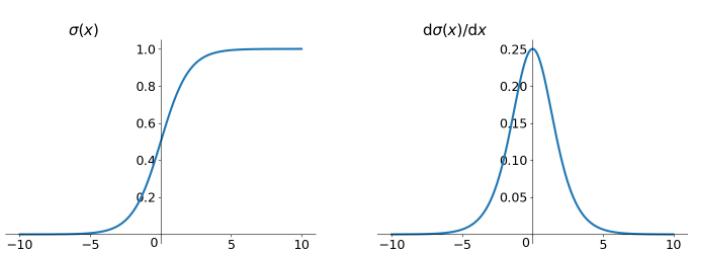
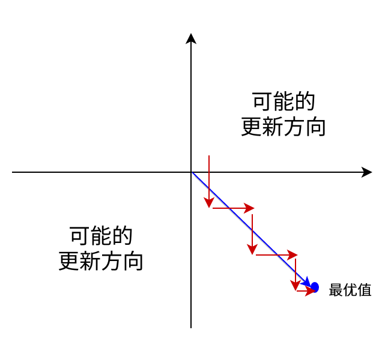
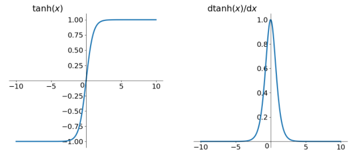
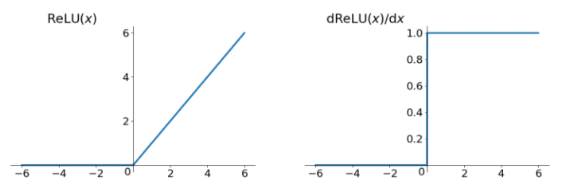
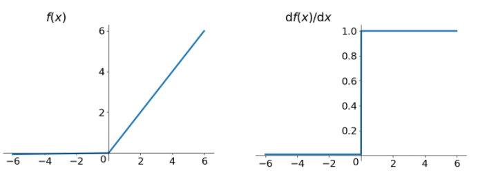
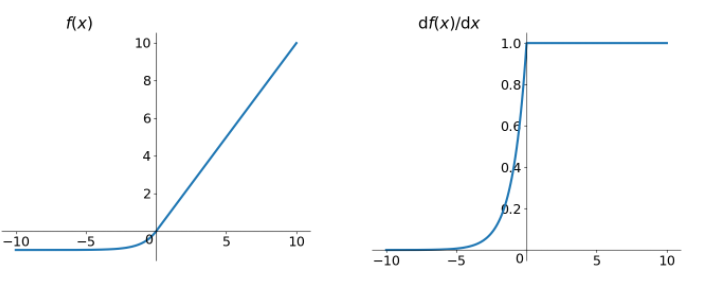
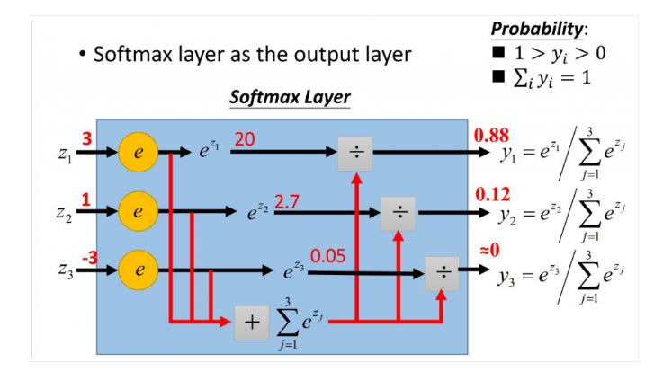

# activation function

## Sigmoid

$$
\sigma(x) = \frac{1}{1+e^{-x}}
$$

优点：

* 便于求导的平滑函数，其导数为$\sigma(x)(1-\sigma(x))$

缺点：

* 容易出现gradient vanishing

  > 1. 优化神经网络的算法是BP，即导数的后向传递：先计算输出层对应的loss，然后将loss以导数的形式不断向上一层网络传递，修正相应的参数，达到降低loss的目的。
  > 2. sigmoid函数在深度网络中常常会导致导数逐渐变为0，使得参数无法被更新，神经网络无法被优化。
  >    * $\sigma(x)$中$x$较大或较小时，导数接近0，而后向传递的数学依据是微积分求导的链式法则，当前层的导数需要之前各层导数的乘积，几个小数相乘，结果会接近0
  >    * Sigmoid导数的最大值0.25，意味着在每一层至少会被压缩为原来的1/4

* 函数输出不是zero-centered

  > sigmoid函数的输出值恒大于0，会导致模型训练的收敛速度变慢。
  >
  > * 举例：
  >
  >   $\sigma(\sum_{i}w_ix_i +b)$，如果所有的$x_i$均为正数或者负数，那么其对$w_i$的导数总是正数或负数。会导致如下图所示的阶梯式更新。
  >
  >   
  >
  >   训练：用zero-centered数据(数据预处理实现)和zero-centered输出

* 幂运算比较耗时

## tanh函数

$$
\tanh x = \frac{e^x-e^{-x}}{e^x+e^{-x}}
$$

* 解决了zero-centered的输出问题
* 但gradient vanishing问题、幂运算问题依然存在

## ReLU函数

$$
ReLU=max(0,x)
$$

优点：

* 解决了gradient vanishing问题（在正区间）
* 计算速度快，只需要判断输入是否大于0
* 收敛速度远快于sigmoid和tanh

缺点：

* ReLU的输出不是zero-centered
* Dead ReLU Problem，指的是某些神经元可能永远不会被激活，导致相应的参数永远不能被更新。

## Leaky ReLU函数

$$
f(x)=max(0.01x,x)
$$

优点：同ReLU，外加不会有Dead ReLU问题

缺点：输出不是zero-centered

## ELU(Exponential Linear Units)函数

$$
f(x) = \begin{cases}
x, & \text{if } x > 0 \\
\alpha(e^x-1), & \text{otherwise}
\end{cases}
$$

解决ReLU存在的问题，具备ReLU的基本所有优点，以及：

1. 不会有Dead ReLU问题
2. 输出均值接近0，zero-centered

缺点：计算量大

## Maxout

可以看作是在深度学习网络中加入一层激活函数层，包含一个参数k。这一层相比ReLU,sigmoid等，其特殊之处在于增加了k个神经元，然后输出激活值最大的值。

常见隐含层节点输出：
$$
h_i(x)=sigmoid(x^TW_{...i}+b_i)
$$
而在Maxout网络中，其隐含层节点的输出表达式为：
$$
h_i(x)=\max_{j \in [1,k]} z_{ij} \\
z_{ij}=x^TW_{...ij}+b_{ij},W \in R^{d \times m \times k}
$$

特点：

1. 与常规激活函数不同的是，它是一个可学习的分段线性函数。
2. Maxout的拟合能力非常强，它可以拟合任意的凸函数

优点：

1. 拟合能力非常强，可以拟合任意的凸函数
2. 具有ReLU的所有优点，线性、不饱和性
3. 没有ReLU的一些缺点，如：神经元的死亡

缺点：

1. 每个神经元有多组$(w,b)$参数，参数量增加了$k$倍，导致整体参数的数量激增。

## Softmax

Sigmoid函数用于分类只能进行二分类

softmax函数可以看作sigmoid函数的一般化，可以进行多分类

$V_i$表示$V$中的第$i$个元素，那么这个元素的softmax值就是：
$$
S_i = \frac{e^i}{\sum_j e^j}
$$

本质：

> softmax将原来输出为3,1,-3通过softmax函数作用，就映射成为(0,1)的值，而这些值的累计和为1（满足概率的性质）
>
> 我们可将它理解成概率，在最后选取输出结点的时候，我们就可以选取概率最大的结点，作为我们的预测目标。

# reference

[知乎：聊一聊深度学习的activation function](https://zhuanlan.zhihu.com/p/25110450)

[知乎：常见的激活函数及其特点](https://zhuanlan.zhihu.com/p/85971385)

