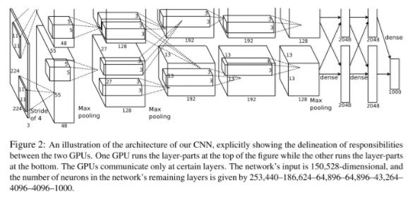
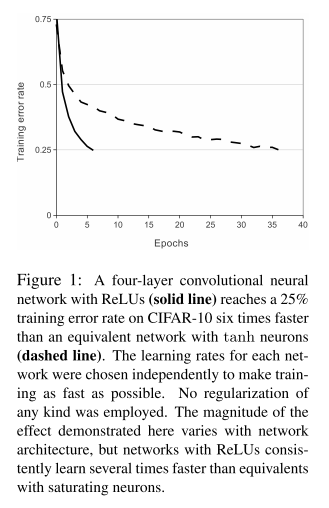

# AlexNet

论文原文：[ImageNet Classification with Deep Convolutional Neural Networks](https://proceedings.neurips.cc/paper/2012/file/c399862d3b9d6b76c8436e924a68c45b-Paper.pdf)

AlexNet，CNN的大火之作。

ILSVR2012冠军，自此掀起CNN研究热潮。

论文主要思想为三、四章，主要挑选此部分进行翻译+理解。

## 3 The Architecture 网络结构

AlexNet的网络结构如图2所示。它总共包含八层可学习的层——五层卷积层和三层全连接层。接下来，我们将介绍我们的网络结构中全新的以及未曾使用过的点子。3.1-3.4章节的内容按它们的重要性进行前后排序讲解。

### 3.1 ReLU Nonlinearity ReLU非线性激活函数

对模型神经元输出的标准激活函数为$f(x)=\tanh{(x)}$或者$f(x)=(1+e^{-x})^{-1}$。在训练阶段使用梯度下降算法，在训练期间，这种饱和非线性函数的速度显著慢于非饱和非线性函数$f(x)=\max{(0,x)}$。站在Nair和Hinton的肩膀上，我们将这种非线性的神经元命名为整流线性单元(ReLUs)。用ReLUs训练的卷积神经网络比用tanh训练的网络快几倍。这种优势可以由图1所体现，在该图中，可明显显示出在CIFAR-10数据集上达到同样的25%错误率的四层卷积网络，ReLUs具有明显的优势。这张图还显示出在与传统饱和神经元模型做对比时，我们不需要用大型神经网络来做该实验。

我们不是第一个考虑替换CNN中的传统神经元模型。比如说，Jarrett等人所声明的$f(x)=|\tanh{(x)}|$比其他同种类型函数在Caltech-101数据集上的局部平均池化部分表现更好。可是，在该数据集上，前者主要考虑的避免过拟合，所以与我们的ReLUs用于加速训练的出发点不同。快速训练对在大型数据集上训练的大模型具有显著的影响。

### 3.2 Training on Multiple GPUs 多张GPU训练

单张GTX580 GPU只有3GB内存，它限制了网络训练的最大尺寸。这将导致充分的120万样例的数据集无法在单张GPU上进行有效工作。因此，我们将网络分布在两张GPU上。当前的GPUs能够有效的跨GPU并行，并且它们能够互相直接读取彼此的内存，还不用增加即时内存。这种并行的机制可以帮助我们将神经元在每张GPU上放一半，同时有一个限制：GPUs的通信只限于特定的层。这意味着，举个例子，第三层可以得到第二层的所有神经元输出。可是第四层就只能得到位于同一GPU的第三层的输出。跨GPU交互模式是一个难点，但这种方式能够帮助我们精确的控制交互的数量从而达到可接收的总计算量。

合成架构与Ciresan等人所提出的"柱状"的CNN具有相似性，特别是我们的柱子不是独立的（详见图2）。与一半的网络在单张GPU上训练做对比的话，这种机制分别降低了top-1错误率1.7%以及top-5错误率1.2%。两张GPU的训练时间明显低于单张GPU。

### 3.3 Local Response Normalization 局部响应归一化

ReLUs具有一个明显的属性优势在于它们不需要输入的归一化来避免饱和。如果一些训练样本给予ReLU正向刺激输入，在该神经元就能进行有效学习。可是，我们同时发现局部响应机制能够避免泛化。定义$a_{x,y}^i$为核i在位置(x,y)的神经元，然后使用ReLU非线性激活函数，对应的局部响应归一值$b_{x,y}^i$的表达式展示如下：

$$
b_{x,y}^i = a_{x,y}^i / (k + \alpha \sum_{j=\max{(0, i-n/2)}}^{\min{(N-1, i+n/2)}} (a_{x,y}^j)^2)^{\beta}
$$

其中总和是围绕同一空间位置n个相邻内核映射，N指的是该层的内核总数。内核映射的排序当然是任意的，并且在训练开始之前就已经确定好了。这种响应归一化的形式实现了一种受真实神经元类型启发的侧向抑制作用，在使用不同内核计算的神经元输出之间创建大型活动的竞争。常量$k,n,\alpha,\beta$作为超参数，我们设置为$k=2,n=5,\alpha=10^{-4}, \beta=0.75$。我们将这种正则机制放在特定层的ReLU之后。（见3.5节）

### 3.4 Overlapping Pooling 重叠池化

CNN中的池化层只是将同一内核映射层的相邻单元进行了池化。按传统方式，相邻的池化单元是不重叠的。为了叙述更准确，池化层被视为由步长s像素，与邻域大小$z \times z$组成的。如果我们设置$s=z$，我们可以获得形如CNN中的传统池化层。如果我们设置$s<z$，我们获得重叠池化层。这就是我们网络中所使用的池化层，其中$s=2, z=3$。与$s=2, z=2$的设置相比，这种机制分别降低了错误率top-1 0.4个点以及错误率top-5 0.3个点。我们同样发现用重叠池化训练的模型能够有效缓解过拟合。

### 3.5 Overall Architecture 整体架构

现在我们来讨论该CNN网络的整体架构。就像图2所展示出的那样，网络总共包含8层及其权重，刚开始五层是卷积层，后三层是全连接层。最后一个全连接层的输出为1000大小的softmax，包含1000种类的分布。我们的网络最大化多项逻辑回归目标，这相当于最大化基于训练样例的预测分布下正确标签的对数概率的平均值。

第2，4，5卷积层只与同一GPU的前一层输出相关。第三层卷积层与第二层的所有输出相关。全连接层中的神经元与前一层的所有神经元相连。局部响应归一化层在第一、二层卷积层。第五层卷积层包括3.4节中所讨论的最大池化层以及局部响应归一化层。ReLU非线性激活函数用于每一层卷积层和全连接层。

第一层卷积层输入为224x224x3的输入图像，卷积核为96张11x11x3大小，步长为4。第二层卷积层将第一层卷积层的输出（局部响应归一化和池化后的）作为输入，卷积核为256张5x5x48大小。第三、四、五层卷积层不包括池化层或归一化层。第三层卷积层的卷积核为384张3x3x256大小。第四层为384张3x3x192大小，第五层为256张3x3x192大小。全连接层每层包括4096个神经元。

## 4 Reducing Overfitting 降低过拟合

我们的神经网络架构包含6000万参数。虽然ILSVRC的1000类别使得每一个训练样本包含10bits的常数（从图像到标签的映射），而导致如此大量的参数在不考虑过拟合的情况下不充分训练。接下来，我们讨论我们所使用的两种避免过拟合的方式。

### 4.1 Data Augmentation 数据增强

用于图像数据集降低过拟合的最简单以及最常用的方式是用标签保留转换(label-preserving transformations)来增强数据集。我们使用两种直接的数据增强方式，只需要很少的计算量就可以从原数据集中产生新的转换图像，因此这种增强后的图像不需要保存在磁盘。在我们的实现中，我们的图像是经过CPU运行的Python代码产生，同时GPU使用先前的批图像训练。因此这种数据增强模式实际上是计算自由的。

数据增强的首要方式包含产生平移、水平翻转的图像。我们通过从原始256x256图像中任意提取224x224大小的图像（及其水平翻转），然后用提取的图像训练我们的网络。这种方式增加了我们训练数据集的大小，虽然训练样本是高度独立的。如果没有该机制，我们的网络面临严重的过拟合，这使得我们去使用更小的网络。在测试阶段，网络从提取五张224x224大小的图像（4张corner patches和一张center patch）以及它们的水平翻转（总共10 patchs）进行预测，然后在基于10 patches的softmax层之后的结果取平均。

第二种方式是改变训练图像中的RGB通道的强度。特别是，我们在ImageNet训练集的RGB值上使用PCA。对每一张训练图像，我们添加找到的主成分倍数，幅度与相应的特征值乘以从均值为0、标准差为0.1的高斯分布的随机变量的值成正比。因此对每张RGB图像像素$I_{xy}=[I_{xy}^R, I_{xy}^G, I_{xy}^B]^T$，我们添加系数增强：
$$
[p_1, p_2, p_3][\alpha_1 \lambda_1, \alpha_2 \lambda_2, \alpha_3 \lambda_3]^T
$$

其中$p_i$和$\lambda_i$分别是RGB像素值的3x3协方差矩阵的第i个特征向量和特征值，$\alpha_i$是上述随机变量。对于特定训练图像的所有像素，每个$\alpha_i$只使用一次，直到再次使用该图像进行训练，然后重新计算。该方案大概捕获了自然图像的重要特征，换言之，对象的身份是不因照明强度和颜色的变化而改变的。该方案将top-1错误率降低了1%。

### 4.2 Dropout 

联合不同模型的预测是降低测试误差的有效方式，但它对于需要几天训练的大型模型而言过于耗时了。然而，有一个非常有效的模型组合版本，在训练期间只需要大约两倍的成本。最近提出的一种方法是"dropout"，以0.5的概率将隐藏神经元的输出设置为0。以这种方式"退出"的神经元不参与前向传播，也不参与反向传播。因此，每次呈现输入时，神经元都会得到不一样的架构，但所有这些架构都是权值共享的。这种技术减少了神经元复杂的协同适应，因为神经元不能依赖于特定其他神经元的存在。因此，这种方式能够使得神经元从不同随机子集合中学到更鲁棒的特征。在测试阶段，我们将所有神经元的输出乘以系数0.5，这是对指数多dropout网络产生的预测分布的几何平均值的合理近似。

在图2的前两层全连接层中使用dropout。没有dropout的加持，我们的网络面临着严重的过拟合问题。Droput使得需要两倍的迭代周期实现收敛。

# 理解点

1. ReLU激活函数
2. 多GPU运行（分组卷积前身）
3. LRN（正则化的思想发展）
4. 重叠池化
5. 数据增强、Dropout