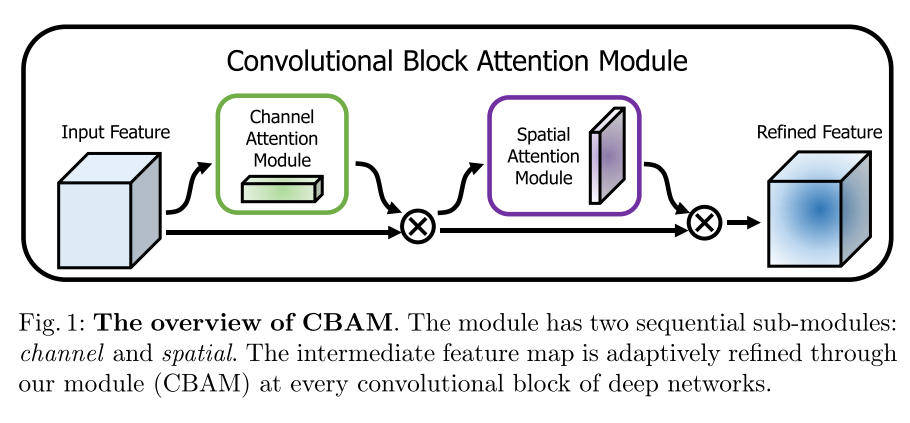

# CBAM

原论文：[CBAM: Convolutional Block Attention Module](https://arxiv.org/abs/1807.06521)

通道注意力和空间注意力相结合。

主要翻译第3节。

## 3 Convolutional Block Attention Module

​		给定中间特征图$F \in R^{C \times H \times W}$作为输入，CBAM顺序推导一个1D的通道注意力图$M_c \in R^{C \times 1 \times 1}$和一个2D的空间注意力图$M_s \in R^{1 \times H \times W}$，如图1所示。整体的注意力处理可总结为如下：
$$
F' = M_c(F) \otimes F \\
F'' = M_s(F') \otimes F'  \tag{1}
$$

其中$\otimes$代表逐元素乘法。在惩罚中，注意力值被广播（通过复制）：通道注意力值沿着空间维度广播，反之亦然。$F''$是最终的精炼输出。图2展示了每张注意力图的计算流程。下面详细展示了每个注意力模块的细节。

### Channel attention module

​		我们通过利用特征的通道间关系来生成通道注意力图。由于特征图的每个通道被视为一个特征检测器，通道注意力集中在给定输入图像的"what"是有意义的。为了有效地计算通道注意力，我们压缩了输入特征图的空间维度。为了聚合空间信息，目前普遍采用平均池化。Zhou等人建议使用它来有效地学习目标对象的范围，Hu等人在他们的注意力模块中采用它来计算空间统计。除了之前的工作，我们认为最大池化收集了关于独特对象的另一个重要线索，以推断更精细的通道注意力。因此，我们同时使用平均池化和最大池化特征。我们根据经验证实，利用这两个特征大大提高了网络的表示能力，而不是单独使用每个特征（参见第4.1节），显示了我们设计选择的有效性。我们在下面描述详细的操作。

​		我们首先通过使用平均池化和空间池化来聚合特征图的空间信息，产生两个不同的空间上下文信息：$F_{avg}^c, F_{max}^c$，分别定义平均池化特征和最大池化特征。然后将两者转发到共享网络中以生成我们的通道注意力图$M_c \in R^{C \times 1 \times 1}$。共享网络通过一个隐层的MLP实现。为了减少参数开销，隐藏激活大小设置为$R^{C/r \times 1 \times 1}$，其中$r$代表下降因子。在将共享网络应用于每个特征后，我们使用逐元素求和合并输出特征向量。简而言之，通道注意力通过以下式子计算：
$$
M_c(F) = \sigma(MLP(AvgPool(F)) + MLP(MaxPool(F))) = \sigma(W_1(W_0(F_{avg}^c)) + W_1(W_0(F_{max}^c))) \tag{2}
$$
其中$\sigma$代表sigmoid函数，$W_0 \in R^{C/r \times C}, W_1 \in R^{C \times C/r}$。值得注意的是MLP的权重$W_0,w_1$由输入共享，在$W_0$后接了ReLU激活函数。

### Spatial attention module

​		我们利用特征的空间内联相关性来生成空间注意力图。与通道注意力不同，空间注意力集中在"where"，它是通道注意力的补充。为了计算空间注意力，我们首先沿通道轴应用平均池化和最大池化操作并将它们连接起来以生成有效的特征描述符。沿通道轴应用池化操作被证明在突出信息区域方面是有效的。在连接的特征描述符上，我们应用卷积层来生成空间注意力图$M_s(F) \in R^{H \times W}$，该特征图对强调或抑制的位置进行编码。我们在下面描述详细操作。

​		我们通过两个池化操作来聚合一张特征图的通道信息，产生两个2D特征图：$F_{avg}^s \in R^{1 \times H \times W}, F_{max}^s \in R^{1 \times H \times W}$。分别表示整个通道的平均池化特征和最大池化特征。然后通过标准卷积层来将这些连接和卷积，生成我们的2D空间注意力图。简而言之，空间注意力计算如下：
$$
M_s(F) = \sigma (f^{7 \times 7}([AvgPool(F); MaxPool(F)])) = \sigma(f^{7 \times 7}([F_{avg}^s; F_{max}^s])) \tag{3}
$$
其中$\sigma$为sigmoid函数，$f^{7 \times 7}$代表卷积核的尺寸大小为$7 \times 7$。

### Arrangement of attention modules

​		给定一张输入图像，两个注意力模块：通道、空间，计算补充注意力，分别注重"what"和"where"。考虑到这一点，两个模块可以并行或顺序放置。我们发现顺序排列比平行排列给出了更好的结果。对于顺序过程的安排，我们的试验结果表明，通道优先顺序略好于空间优先顺序。

# 理解点

1. 空间注意力和通道注意力机制的结合

