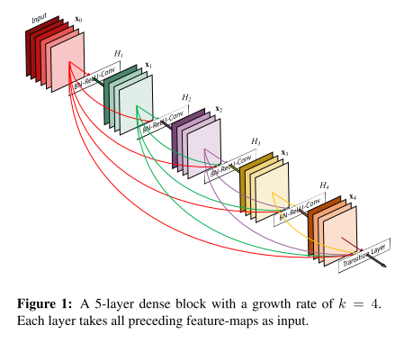
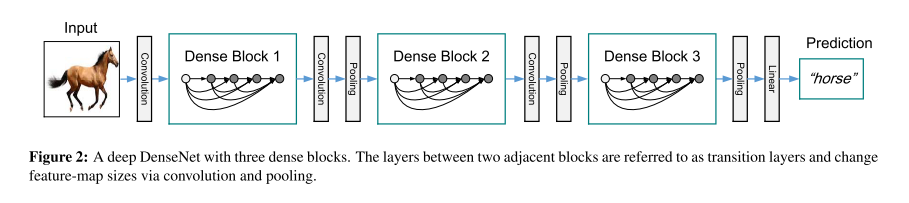
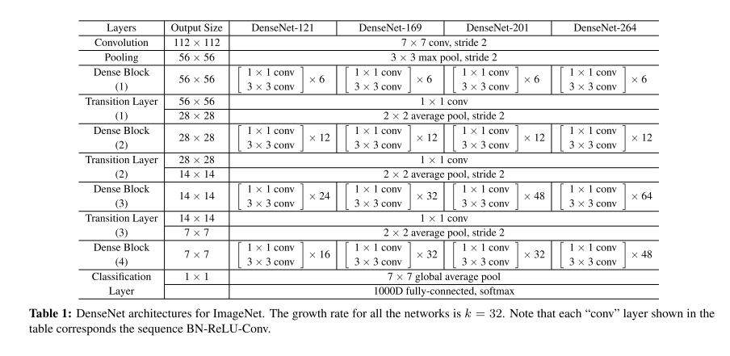

# DenseNet

原论文：[Densely Connected Convolutional Networks](https://arxiv.org/abs/1608.06993)

通过特征复用，实质上减少参数量。

论文结构：

1. 引文（卷积神经网络发展进程、提出DenseNet）
2. 相关工作（ResNet、DFN等，卷积神经网络的详细介绍）
3. DenseNets网络
4. 实验
5. 讨论
6. 结论

以第3节翻译为主。

## 3 DenseNets

​		给定通过卷积网络的单个图像$x_0$。该网络包括L层，每层实现了一个非线性转换$H_l(\cdot)$，其中$l$代表层数。$H_l(\cdot)$可以代表一系列函数操作的聚合体（例如BN、ReLU、Pooling、Conv）。定义第$l$层的输出结果为$x_l$。

**ResNets.**

​		传统卷积前馈网络第$l$的输出是第$(l+1)$层的输出，等式表示如下：$x_l = H_l(x_{l-1})$。ResNets通过添加一个残差连接和非线性转换来实现恒等映射：
$$
x_l = H_l(x_{l-1})+x_{l-1} \tag{1}
$$
ResNets的一个好处是梯度可以通过恒等映射函数从后面的层流向前面的层。然而，恒等函数和$H_l$的输出通过求和组合在一起，这可能会阻碍网络中的信息流。

**Dense connectivity.**

​		为了更好的提高层与层之间的信息流动，我们提出了一种不同的连接模式：我们引入了从任意层到后续层的直接连接。图1展示了DenseNet的架构原理。同样的，第$l$层接收所有前序层特征图作为输入，$x_0, \cdots, x_{l-1}$作为输入：
$$
x_l = H_l([x_0, x_1, \cdots, x_{l-1}]) \tag{2}
$$
其中$[x_0, x_1, \cdots, x_{l-1}]$代表第$0, \cdots, l-1$层的输出特征图。由于它的密集连接性，我们将该网络结构称之为Dense Convolutional Network(DenseNet)。为了实现简单，我们通过等式(2)将多个输入连接成单个张量。

**Composite function.**

​		受ResNet v2启发，我们定义$H_l(\cdot)$为三个连续操作的复合函数：BN、ReLU和一个$3 \times 3$卷积。

**Pooling layers.**

​		当特征图的大小改变时，等式(2)中的连接操作是不可行的。然而，卷积网络的一个重要部分是改变特征图大小的下采样层。为了在我们的架构中进行下采样，我们将网络划分为多个密集连接的dense blocks。详见图2。我们将块之间的层称为过渡层，它们进行卷积和池化。实验中所使用的过渡层由一个BN层和一个$1 \times 1$卷积层和一个$2 \times 2$平均池化层组成。

**Growth rate.**

​		如果每个函数$H_l$产生k个特征图，第$l$层拥有$k_0+k \times (l-1)$通道的输入特征图，其中$k_0$代表输入层的通道数。DenseNet和现有网络架构之间的一个重要区别是DenseNet可以具有非常窄的层，例如，$k=12$。我们定义$k$为现有网络的growth rate。在第4节中我们展示了一个较小的增长率是无法充分获得SOTA结果的。对此现象的一种解释是，每一层都可以访问其块中的所有先前特征图，因此可以访问网络的“集体知识”(collective knowledge)。将特征图视为网络的全局状态。每层将自己的$k$个特征图添加到这个状态。增长率能够调节每层对全局状态贡献多少新信息。全局状态一旦写入，就可以从网络内的任何地方访问，并且与传统网络架构不同，不需要在层与层之间复制它。

**Bottleneck layers.**

​		虽然每层只产生$k$个输出特征图，但需要更多的输入。$1 \times 1$卷积可引入用来降低输入特征图的维度，从而提高计算效率。我们发现这种设计对DenseNet特别有效，我们引入了这样的bottleneck层（$H_l$版本为：BN-ReLU-Conv($1 \times 1$)-BN-ReLU-Conv($3 \times 3$)），作为DenseNet-B。在我们的实验中，每个$1 \times 1$卷积产生$4k$个特征图。

**Compression.**

​		为了进一步提高模型的紧凑性，我们可以减少过渡层的特征图数量。如果一个dense block包含m个特征图，我们让下面的过渡层产生$\lfloor \theta m \rfloor$输出特征图，其中$0 < \theta \le 1$。当$\theta=1$时，跨过渡层的特征图数量保持不变。我们将$\theta <1$的DenseNet称为DenseNet-C，在我们的实验中$\theta=0.5$。当同时使用$\theta<1$的bottleneck和过渡层时，我们将我们的模型称为DenseNet-BC。

**Implementation Details.**

​		在除ImageNet以外的数据集上，我们实验中使用的DenseNet具有三个dense blocks，每个块具有相同的层数。在进入第一个dense block之前，对输入图像执行具有16（或DenseNet-BC增长率的两倍）输出通道的卷积。对于内核大小为$3 \times 3$的卷积层，输入的每一侧都填充了一个像素用以保持特征图大小固定。我们使用$1 \times 1$卷积，然后是$2 \times 2$平均池化作为两个连续dense blocks之间的过渡层。在最后一个dense block的末尾，执行全局平均池化，然后附加一个softmax分类器。三个dense blocks中的特征图大小分别为$32 \times 32, 16 \times 16, 8 \times 8$。我们用配置$\{L=40,k=12\},\{L=100,k=12\},\{L=100, k=24\}$对基本的DenseNet结构进行实验。对于DenseNet-BC，评估配置为$\{L=100, k=12\},\{L=250,k=24\},\{L=190,k=40\}$的网络。

​		在ImageNet上的实验中，我们使用具有4个dense blocks的DenseNet-BC在$224 \times 224$的输入图像上实验。初始卷积层包含2k个大小为$7 \times 7$，步长为2的卷积；所有其他层中的特征图数量也来自设置k。我们在ImageNet上使用的确切网络配置如表1所示。

# 理解点

1. 特征复用的概念
2. 模块化的更改和特征图增长率的实现。

