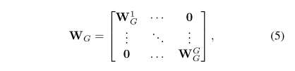

# ECANet

原论文：[ECA-Net: Efficient Channel Attention for Deep Convolutional Neural Networks](https://arxiv.org/abs/1910.03151)

基于SENet的修改，增强效果。

主要翻译第3节。

## 3 Proposed Method

​		在该节中，我们首先回顾了SENet中的通道注意力模块。然后，通过分析维度下降和跨通道交互的作用来对SE block做一个经验性的分析。这促使我们提出了我们的ECA模块。此外，我们实现了一种方法来自适应的决定ECA参数，最终展示如何将它应用到深度CNN中去。

### 3.1 Revisiting Channel Attention in SE Block

​		设定我们的卷积模块的输出为$\chi \in \mathbb{R}^{W \times H \times C}$，其中$W,H,C$分别代表width、height、channel维度(即卷积核数量)。据此，SE模块的通道权重计算如下：
$$
w = \sigma(f_{\{W_1,W_2\}}(g(\chi))) \tag{1}
$$
其中$g(\chi) = \frac{1}{WH} \sum_{i=1,j=1}^{W,H} \chi_{ij}$是逐通道的全局平均池化，$\sigma$指代的是Sigmoid函数。设定$y=g(\chi),f_{\{W_1,W_2\}}$表示公式如下：
$$
f_{\{W_1,W_2\}}(y) = W_2 \text{ReLU}(W_1y) \tag{2}
$$
其中$\text{ReLU}$表示Rectified Linear Unit算法。为了避免高模型复杂度，$W_1,W_2$的尺寸设定为$C \times (\frac{C}{r}), (\frac{C}{r}) \times C$。$f_{\{W_1,W_2\}}$表示包含通道注意力所有参数的模块。公式(2)中的维度下降可以降低模型复杂度，它去除了通道与权重的直接相关。例如，一个单独FC层通过使用所有通道的线性聚合来预测每个通道的权重。但是公式(2)第一次将通道特征映射到低维特征空间，然后再映射回原高维空间，使得通道与权重的对应是非直接的。

### 3.2 Efficient Channel Attention(ECA) Module

​		回顾SE模块后，通过分析通道注意力机制的通道维度下降和跨通道交互的能力来做经验性的对比。通过以上分析，我们提出了我们的ECA模块。

#### 3.2.1 Avoiding Dimensionality Reduction

​		如上所讨论的，公式(2)中的维度下降使得通道和权重非直接对应。为了验证它的有效性，我们对比了原始SE模块和它的变种（SE-Var1，SE-Var2，SE-Var3），所有这些都没进行降维。如表2所展示的一样，没有参数的SE-Var1仍然优于原始网络，表明通道注意力具有提高深度CNN性能的能力。与此同时，SE-Var2独立的分析了每个通道的权重，在包含较少参数的前提下略微优于原SE模块。这可得出通道注意力需在避免维度下降的前提下进行权重直接对应的方式，这比非线性通道独立映射更重要。此外，SE-Var3通过单FC层的表现比SE模块中拥有维度下降的双FC层表现更好。所有上述结论都说明了避免维度下降对学习有效的通道注意力更有效。因此，我们提出了没有通道维度下降的ECA模块。

#### 3.2.2 Local Cross-Channel Interaction

​		给定没有维度下降的聚合特征$y \in \mathbb{R}^C$，通道注意力可通过下式学习：
$$
w = \sigma (Wy) \tag{3}
$$
其中$W$是$C \times C$的参数矩阵。实际上，对于SE-Var2和SE-Var3，我们有：

其中$W_{var2}$为SE-Var2中的对角矩阵，包含$C$个参数；$W_{var3}$为SE-Var3的全参数矩阵，包含$C \times C$个参数。正如式(4)所展示的那样，核心的不同点在于SE-Var3考虑跨通道交互，而SE-Var2不考虑，并且SE-Var3得出了更好的结论。该结论可得出跨通道交互是学习通道注意力的有效方式。然而，SE-Var3需要大量的参数，导致了高模型复杂度，特别是对于大通道数量的时候。

​		一个有效的综合SE-Var2和SE-Var3的方式是扩展$W_{var2}$的对角标量为子对角矩阵：

其中等式(5)将通道分为$G$个组，每个组包含$C/G$个通道，然后每个组独立的学习通道注意力，从而以局部的方式捕获跨通道交互能力。从卷积的角度考虑，SE-Var2，SE-Var3和等式(5)可被视为深度可分离卷积，分别为一个FC层和组卷积。在此，包含组卷积的SE block(SE-GC)可指定为$\sigma(GC_G(y)) = \sigma(W_Gy)$。然而，过多的组卷积会提高内存访问成本，从而降低计算有效性。更甚，如表2所展示的那样，包含不同组的SE-GC没有给SE-Var2带来什么提升，表明它不是一个提取局部跨通道交互信息的有效机制。原因可能是SE-GC完全丢弃了不同组之间的依赖关系。

​		在本文中，我们探索了另外一种方式来获取局部跨通道交互信息，致力于保证有效和效率的平衡。特别是，我们采用了band matrix $W_k$来 学习通道注意力，$W_k$表示为：

更直观点，等式(6)中的$W_k$包含$k \times C$个参数，比等式(5)中的参数量少。此外，等式(6)避免了不同组之间的完全独立性。如表2中对比的那样，等式(6)中的ECA-NS方法比SE-GC表现更好。对于等式(6)，参数$y_i$的计算只考虑$y_i$和它的$k$个邻域：
$$
w_i = \sigma (\sum_{j=1}^k w_i^j y_i^j), y_i^j \in \Omega_i^k \tag{7}
$$
其中$\Omega_i^k$表示$y_i$的$k$个相邻通道集合。

​		一个更有效的方式是让所有通道共享同样的学习参数：
$$
w_i = \sigma(\sum_{j=1}^k w^j y_i^j), y_i^j \in \Omega_i^k \tag{8}
$$
值得注意的是，这种策略可通过卷积核大小为$k$的1D卷积实现：
$$
w= \sigma(C1D_k(y)) \tag{9}
$$
其中$C1D$表示1D卷积。至此，公式(9)中的方法可被视为ECA模块，只包含$k$个参数。如表2所展示的那样，我们的$k=3$的ECA模块在较低的模型复杂度的前提下达到了和SE-var3等同的效果，通过近似捕获局部跨通道交互信息保证了效率和速度的平衡性。

### 3.2.3 Coverage of Local Cross-Channel Interaction

​		我们的ECA模块用于近似捕获局部跨通道交互后，它的收敛性也应当纳入考虑。可以针对各种CNN架构中具有不同通道数的卷积块手动调整优化交互覆盖范围。通过手动调整会消耗很多计算资源。组卷积通过在给定固定组大小的高位通道中包含长距离卷积用于提升CNN架构性能。与该原理相似，交互的覆盖范围$k$与通道维度$C$成正比是合理的。换句话说，在$k$与$C$之间存在一种映射关系$\phi$：
$$
C= \phi(k) \tag{10}
$$
这种简单的映射是线性的函数$\phi(k) = \gamma *k -b$。然而，通过线性函数来联系具有限制性。换句话说，通道维度$C$通常是2的倍数。因此，我们引入一种有效的解决方案来将线性函数$\phi(k)= \gamma * k - b$扩展成非线性的：
$$
C=\phi(k)=2^{(\gamma * k - b)} \tag{11}
$$
然后，给定通道维度$C$，内核尺寸$k$可通过以下公式自适应决定：
$$
k = \psi(C) = |\frac{\log_2(C)}{\gamma} + \frac{b}{\gamma}|_{odd} \tag{12}
$$
其中$|t|_{odd}$表示$t$附近的偶数。在本文中，我们所有实验设定$\gamma=2,b=1$。通过映射$\psi$，高维通道拥有长距离交互，而低维通道通过非线性映射拥有短距离交互。

### 3.3 ECA Module for Deep CNNs

​		图2揭示了ECA模块的整体结构。通过使用不包含维度下降的GAP实现聚合卷积特征，ECA首先适应性的决定内核大小$k$，然后使用1D卷积，后接一个sigmoid函数来学习通道特征。为了将我们的ECA用于深度CNN中，可直接用ECA模块替换SE模块。最终的网络称之为ECA-Net。图3给出了我们的ECA模块的Pytorch代码。

# 理解点

1. 通过一维卷积简化SE模块，大大降低参数量，还提升性能。

