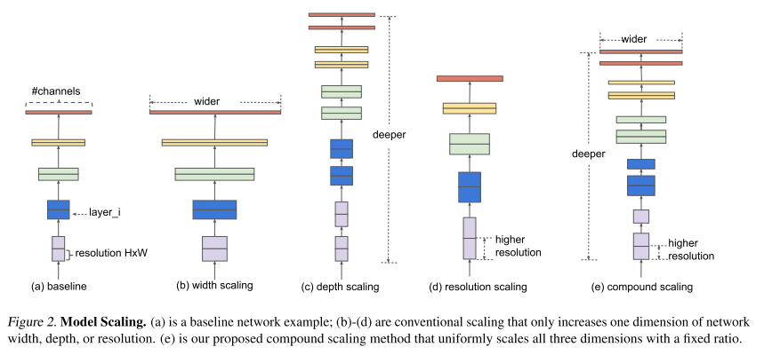

# EfficientNet

原论文：[EfficientNet: Rethinking Model Scaling for Convolutional Neural Networks](https://arxiv.org/abs/1905.11946)

通过网络尺度缩放的方法用于最优结果的搜索。

主要翻译第3、4节。

## 3 Compound Model Scaling

​		在该节中，我们会定义尺度缩放的问题，研究不同的方法，提出我们新的尺度缩放方法。

### 3.1 Problem Formulation

​		一个卷积层$i$可被定义为函数：$Y_i = F_i(X_i)$，其中$F_i$是算子，$Y_i$是输出张量，$X_i$是输入张量，张量尺度为$\lt H_i, W_i, C_i \gt$，其中$H_i$和$W_i$为空间维度，$C_i$为通道维度。卷积网络$N$可被视为一系列层的复合：$N=F_k \odot \cdots \odot F_2 \odot F_1 (X_1) = \bigodot_{j=1,...,k} F_j(X_1)$。在实践中，ConvNet层通常分为多个阶段，每个阶段的所有层共享相同的架构：例如，ResNet有五个stage，每个stage的所有层都具有相同的卷积类型，除了第一层执行下采样。因此，我们可定义ConvNet为：
$$
N = \bigodot_{i=1,...,s} F_i^{L_i}(X_{\lt H_i, W_i, C_i \gt}) \tag{1}
$$
其中$F_i^{L_i}$定义为层$F_i$在stage $i$重复$L_i$次，$\lt H_i, W_i, C_i \gt$定义为输入张量$X$在层$i$的尺寸。图2(a)即是典型的ConvNet，其中空间维度缩小了，但通道维度在所有层扩张了，例如，从初始输入尺寸$(224,224,3)$编程输出尺寸$(7,7,512)$。

​		与标准的ConvNet专注于找到最好的层次架构不同的是，model scaling专注于扩展预定义于网络长度$(L_i)$、宽度$(C_i)$、和/或不改变$F_i$情况下的$(H_i,W_i)$。通过固定$F_i$，对于新的资源受限条件下model scaling简化了设计困难，但它仍然需要一个大的设计空间来探索每层不同的$L_i,C_i,H_i,W_i$。为了进一步降低设计空间，我们限制所有层必须以恒定比率均匀缩放。我们的目标是在给定资源限制的前提下，最大化模型准确度，可被组织成以一个优化问题：
$$
\max_{d,w,r} Accuracy(N(d,w,r)) \\
s.t. \space N(d,w,r) = \bigodot_{i=1...s} \hat{F}_i^{d \cdot \hat{L}_i} (X_{\lt r \cdot \hat{H}_i, r \cdot \hat{W}_i, w \cdot \hat{C}_i}) \\
Memory(N) \le target\_memory \\
FLOPS(N) \le target\_flops \tag{2}
$$
其中$w,d,r$是尺度网络width、depth、resolution的置信度；$\hat{F}_i, \hat{L}_i, \hat{H}_i, \hat{W}_i, \hat{C}_i$为baseline network中预定义的参数（表1为一个例子）。

### 3.2 Scaling Dimensions

​		问题2的主要难点是最优的$d,w,r$相互依赖，在不同的资源约束下，其值会发生变化。由于这个困难度，传统方法大多在这些维度中的一个维度上扩展ConvNets。

**Depth(d)**

​		Scaling network depth是被许多ConvNets使用的方式。初始动机是，深度的ConvNet能够捕获丰富且复杂的特征，同时在新的任务上泛化良好。然而，由于梯度爆炸问题，深度网络难以训练。虽然提出了几个办法，比如skip connections和BN，用来缓解训练问题，越来越深以后准确度的增长下降：例如，ResNet-1000拥有和ResNet-101同等的准确度，虽然拥有更深的层数。图3(中)显示了我们在不同深度置信度$d$的衡量baseline模型的经验性研究，进一步表明非常深的ConvNets的准确度回报是递减的。

**Width(w)**

​		Scaling network width常用于小尺寸模型。更广泛的网络往往能够捕获更细粒度的特征并且更容易训练。然而，极宽但浅的网络往往难以捕获更高层次的特征。我们在图3(左)中的实验结果表明，当网络随着w的增大而变得更宽时，准确度会迅速饱和。

**Resolution(r)**

​		在高分辨率输入图像中，ConvNets可以捕获更细粒度的模式。早期的网络使用$224 \times 224$，现代卷积使用$299 \times 299$或者$331 \times 331$获取更好的准确度。最近，GPipe用$480 \times 480$分辨率在ImageNet上达到了SOTA的结果。更高的分辨率，比如$600 \times 600$，广泛的用于目标检测网络。图3(右) 展示了scaling network resolutions的结果，显示出更高的分辨率能够达到更好的准确度，但是在更高分辨率的情况下，准确度的提升变得缓慢。($r=1.0$时为$224 \times 224$分辨率，$r=2.5$为$560 \times 560$分辨率)。

​		以上的分析得出了第一个结果：

​		Observation 1:  尺度变换网络的任意维度width、depth或resolution能够提升准确度，但是模型越大准确度的提升越缓慢。

### 3.3 Compound Scaling

​		我们经验性的观察到不同的尺度维度变换是不独立的。更直观地说，对于高分辨率图像，我们的网络深度也会相应增加，这样大感受野可以帮助捕获在更大图像中包含更多像素的类似特征。与之对应的，当分辨率更高的时候，我们也应增加网络宽度，从而在更高分辨率图像上获取更多细粒度的特征。这些动机使得我们更关注尺度维度变换的平衡性而不是针对单一维度尺度变换。

​		为了验证我们的猜想，如图4所示，我们比较了不同深度和分辨率的尺度变换的结果。如果我们只变换width $w$而不改变深度$(d=1.0)$和分辨率$(r=1.0)$，准确度提升很快饱和。当深度更深$(d=2.0)$，分辨率更高$(r=2.0)$的情况下，在相同的FLOPs情况下，width的变换能够达到更好的结果。这些结果给出了我们第二个观察结论：

Observation 2 ：为了得到更好的准确度和有效性，通过ConvNet尺度变换来平衡网络的width、depth、resolution维度是有必要的。

​		在本文中，我们提出了一种新的compound scaling method，它使用compound coefficient $\phi$通过一个基本方式来将width、depth、resolution统一起来：
$$
depth: d = \alpha^{\phi} \\
width: w = \beta^{\phi} \\
resolution: r = \gamma^{\phi} \\
s.t. \space \alpha \cdot \beta^2 \cdot \gamma^2 \approx 2 \\
\alpha \ge1, \beta \ge 1, \gamma \ge 1 \tag{3}
$$
其中$\alpha, \beta, \gamma$为常数。更直观地说，$\phi$是用户定义的coefficient，控制多种尺度的资源利用限制。

## 4 EfficientNet Architecture

​		自从model scaling不对baseline network里面的层操作$\hat{F}_i$产生影响，拥有一个更好的baseline network是可行的。我们会使用当前的ConvNets来评估我们的scaling method。为了更有效地证明我们的scaling method的有效性。

​		从EfficientNet-B0开始，我们通过两步来应用compound scaling method：

1. STEP 1：设置$\phi=1$，假设有两倍或更多的资源可用，基于公式2、3做小范围搜索。实际上，对于EfficientNet-B0，在限制$\alpha \cdot \beta^2 \cdot \gamma^2 \approx 2$的条件下$\alpha=1.2, \beta=1.1, \gamma = 1.15$。
2. STEP 2：然后我们固定$\alpha,\beta,\gamma$作为常量，然后基于公式3和coefficient $\phi$ 对baseline network进行尺度变换，从而获得EfficientNet-B1 to B7（表2详细细节）。

# 理解点

1. 尺度缩放方法，探索了depth、width、resolution对网络的影响度
2. 有效的backbone

