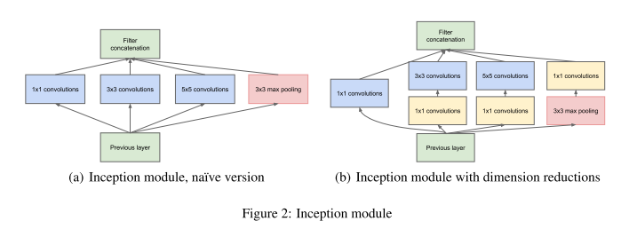
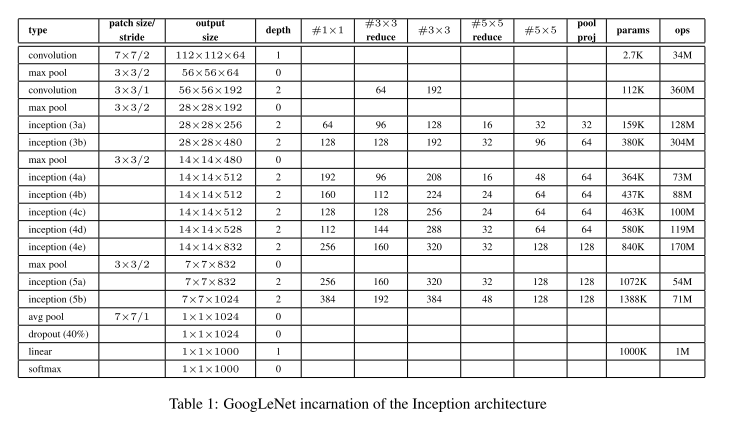
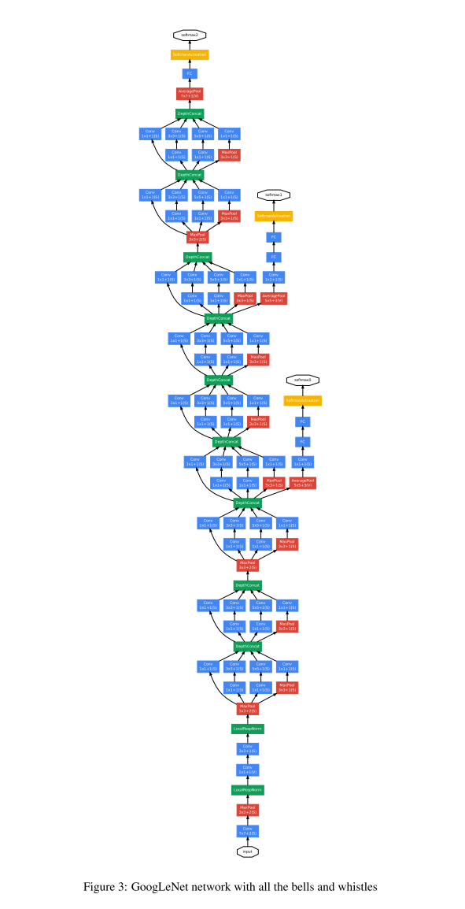

# GoogLeNet v1

原论文：[Going Deeper with Convolutions](https://arxiv.org/abs/1409.4842)

ILSVRC2014分类任务冠军。Inception块用于减少参数量。

论文结构：

1. 引文（介绍CNN发展和GoogleNet的优势）
2. 相关工作（CNN发展历史，R-CNN发展）
3. 研究动机（要解决的问题）
4. 架构细节
5. GoogLeNet(整体结构)
6. 训练细节
7. 分类任务结果
8. 目标检测结果
9. 结论

主要翻译第3、4、5、6节，包含论文主体思想

## 3 Motivation and High Level Considerations 动机和深层思考

​		深度神经网络最直接的提高表现力的方式是增加它们的大小。这包括增加网络的深度（层的数量）和它的宽度，每层处理单元的数量。这是训练更高质量模型的轻松有效的方式，特别是再给定大量标记训练数据的前提下。可是，这种简单的解决方案会带来两个主要问题。

​		更大的尺寸意味着更多的参数量，它会使得网络更容易过拟合，特别是训练集中的标记样本是有限的。这可能成为主要瓶颈，因为高质量的标记训练集的建立是耗时费力的，特别是专业的人工评估员需要分辨ImageNet数据集中的相似类别。

​		另外一个问题是统一增加的网络规模会导致计算资源使用的急剧增加。举个例子，再深度视觉网络中，如果两个卷积层是链在一起的，任意统一的增加卷积核的数量会导致计算的指数级增长。如果增长的能力是使用不充分的（例如大多数权重被置为0），那样的话很多计算就被浪费了。然而实际上计算能力终究是有限的，一个充分有效的计算资源分布格式是能够适应尺寸的随意增长的，即使主要目标是提高目标质量。

​		解决上述两个问题的基本方法是将全连接层改为稀疏连接结构，包括卷积内部。模仿生物系统，基于Arora等人的开创性工作，具有更牢固的理论基础的优势。他们的主要结果表明，如果数据集的概率分布可以用一个大的、非常稀疏的深度神经网络来表示，那么可以通过分析最后一层激活的相关统计量和具有高度相关输出的聚类神经元来逐层构建最优网络拓扑结构。尽管严格的数学证明需要非常强的条件，但这一陈述与众所周知的赫布原理（神经元一起发射、一起连接）一致表明，即使在不太严格的条件下，基本思想也适用于实践。

​		不利的一面是，在非均匀稀疏数据结构上进行数值计算时，当今的计算基础设施效率非常低。即使算术运算次数减少100倍，查找和缓存未命中的开销仍然占主导地位，以至于切换到稀疏矩阵的回报较小。通过使用稳步改进、高度调整的数值库，允许极快的密集矩阵乘法，利用低层CPU或GPU硬件的微小细节，差距进一步扩大。此外，非均匀稀疏模型需要更复杂的工程和计算基础设施。大多数目前面向视觉的机器学习系统仅通过使用卷积就在空间中利用稀疏性。然而，在较早的层次实现为与patches的密集连接。

​		这就提出了下一个中间步骤是否可改进的问题：一种利用额外的稀疏性的架构，即使在卷积核层级，就如理论所述的那样，通过利用密集矩阵上的计算来扩展当前硬件。关于稀疏矩阵计算的大量文献表明，将稀疏矩阵聚类为相对密集的子矩阵往往会为稀疏矩阵乘法提供更先进的实用性能。可试想在不久的将来类似的方法可用于非均匀深度学习架构的自动化构建。

​		Inception架构最初是作为第一作者的案例研究，用于评估复杂网络拓扑结构算法的假设输出。该算法试图模拟视觉网络中的稀疏架构来覆盖密集的、可读能力强假设结果。尽管这是一种高度推测性的工作，但仅在对拓扑结构确切选择进行两次迭代之后，我们就可以看见和NIN架构类似的益处。在进一步调整学习率、超参数和改进的训练方法之后，我们确定由此产生的Inception架构作为R-CNN的基础网络在定位和对象检测任务中有效。有趣的是，虽然大多数原始结构都经过了彻底的质疑和测试，但结果证明它们至少是当前最优的。

​		值得注意的是：虽然提出的架构已经成功应用在计算机视觉领域，它的有益结果是否归因于其提出的原则仍然值得怀疑。最终确认需要大量彻底的分析和验证：举个例子，接下来所讨论的基于原则建立的自动工具就是相似的问题，并且在视觉任务中表现更好。最有说服力的证据是，在不同的领域使用相同的算法创建非常不同的全局架构的拓扑结构能够增加网络的收益。至少，Inception架构的初步成功为这个方向的未来工作产生了坚定的动力。

## 4 Architectural Details 架构细节

​		Inception架构的主要思想是，在基于找出卷积网络中的最优局部稀疏结构的情况下，它如何被线程的密集组件逼近和覆盖。请注意，假设平移不变性意味着我们的网络将由卷积层构建。我们所应做的就是找出最优局部结构，然后在空间领域重复它。Arora等人建立了一种层层相接的架构，在其中每层都需要分析最后一层的统计相关性，将高相关性的汇聚成组。这些簇构成下一层的单元，并与上一层单元相连，我们假设上一层单元的每个神经元都响应了输入图像的一些区域，这些神经元被分组成卷积核。在低层（即靠近输入的层级）的相关神经元集中在局部区域。这意味着，我们最终在一个区域中集中大量集群，并且它们可以被下一层1x1卷积覆盖。然而，可尝试的一个点是较少数量的空间分布更广的集群，通过用更大的卷积覆盖patch；同时随着区域越来越大，patch的数量越来越少。为了避免patch对齐的问题，Inception架构的当前版本仅限于使用$1 \times 1, 3 \times 3$和$5 \times 5$​​​的卷积核，这个决定是基于便利性并非必要性。这也意味着，该架构是将所有卷积核的输出联合在一起形成下一阶段的输入。此外，自从池化操作作为每一阶段的实施核心，这意味着我们需要在每一阶段添加对应的并行池化路径得到对应的有益结果（见图2(a)）。

​		当这些”Inception modules“级联在一起时，它们的输出信号是各有不同的，随着更高层捕获更高抽象的特征，它们的空间集中度预计也会相应降低，这表明随着我们移动到更高层，$3 \times 3$和$5 \times 5$卷积的比率应该增加。

​		上述模块存在的一大问题，以最原始Inception模块来说，那就是在具有大量卷积核的卷积层中，即使是适度数量的$5 \times 5$​​​​卷积也会导致资源消耗过于昂贵。一旦将池化层添加进来后，这个问题就变得更加明显：它们的输出卷积数量等同于前一阶段(stage)的卷积数量。池化层输出和卷积层输出的联合会导致stage与stage之间输出结果数量的急剧增加。即使这种架构可能涵盖最佳稀疏结构，它也会非常低效，导致在几个stage内计算爆炸。

​		这就引申出了上述架构的第二个思路：应用降维和投影，否则计算资源会消耗太多。该想法基于embeddings的成功：即使低维的嵌入依旧能够包含大图像patch的大部分信息。可是，embeddings意味着信息处于密集、压缩的格式，压缩信息是难以建模的。我们希望在大多数地方保持我们的稀疏表示，并且仅在信号必须聚合时才压缩信号。那就是，在$3 \times 3$和$5 \times 5$卷积前使用$1 \times 1$​卷积降维。除了用作降维的作用外，它们还包括整流线性激活的作用，使得它们具有双重用途。最后结果如图2(b)所示。

​		通常而言，一个Inception网络是上述结构的堆叠组成，然后使用步长为2最大池化层来实现网格分辨率的下降。出于技术原因（训练期间的内存效率），仅在较高层使用Inception模块而在较低层保持在传统卷积方式似乎是有益的。这不是绝对必要的，只是反映了当前一些基础设施的效率低下。

​		这种架构的主要优点之一是它能够显著增加每个阶段的神经元数量而不会导致计算复杂度不受控制的膨胀。降维的普遍使用使得最后阶段的大量卷积核屏蔽到下一层。首先降低维度，然后用大卷积提取。这种设计的另一个有用的方面是它符合直觉，即视觉信息应该在不同的尺度上进行处理，然后聚合，以便在下一阶段可以同时从不同的尺度提取特征。

​		计算资源使用效率的提高，使得在提高每个stage的宽度和stage总量的时候，不会陷入计算困难。另一种使用Inception结构的方式是创建略逊色但成本更低的版本。我们发现所有包含的knobs和levers允许计算资源的受控平衡，这使得网络能够比非Inception架构的执行速度快2-3倍，但是此时需要仔细的手工设计。

## 5 GoogLeNet

​		我们选择GoogLeNet作为ILSVRC14比赛的队名，这名字源自LeCun提出的LeNet 5网络。我们还使用GoogLeNet来指代比赛中提高使用的Inception架构。我们还是用了更深更广的Inception网络，其质量略逊色，但将其添加到集成中似乎对结果略有改善。我们省略了该网络的细节，因为我们的实验表明确切架构参数的影响是相对较小的。GoogLeNet的整体架构详情如表1所示。

​		包括Inception模块中所使用的卷积都用ReLU激活。我们网络的输入大小为经过归一化$224 \times 224$​​的RGB图片。"#$3 \times 3$​reduce"和"#$5 \times 5$​​reduce"代表在该层卷积之前的$1 \times 1$​卷积数量。在池化投影列中内置最大池化后，可以看到投影层中$1 \times 1$卷积核的数量。所有这些降维层/投影层都是用ReLU激活函数。

​		该网络的设计考虑到了计算效率和实用性，因此可在单个设备上运行，甚至包括那些计算资源有限的设备，尤其是低内存占用的设备。仅计算带参数的层时，网络深度为22层（再加上池化层的话，则为27层）。该网络结构层（独立的层）总共有大约100层。然而，这个数字取决于所使用的机器学习基础设施系统。分类器前的平均池化层是基于NIN的，虽然我们的实现和它有所不同，使用了额外的线性层。这赋予了我们的网络对其它标签适应和微调更轻松的能力，但这主要是为了便利，我们预计它不会产生重大影响。可知的是用平均池化替换全连接层能够在top-1准确度上提升0.6个点，但在去除全连接层以后dropout的使用依旧很重要。

​		鉴于网络相对较大的深度，以有效方式将梯度回传所有层的能力是值得思考的问题。一个有趣的见解是，相对较浅的网络在此任务上的强大性能表明，网络中间层的特征应该具有很强的辨识力。通过添加辅助分类器到中间层，我们希望在分类器的较低stage区分，增强传播回来的梯度信号，并提供额外的正则化。这些分类器放在更小的卷积网络层级即Inception(4a)和Inception(4b)的输出之前。在训练阶段，它们的损失累加到网络的总损失之中，权重为0.3。在推理阶段，这些辅助将被舍弃。

​		包括辅助分类器在内的网络整体架构如下：

* 平均池化层（$5 \times 5$的卷积核大小，步长为3），(4a)结果为$4 \times 4 \times 512$，(4b)结果为$4 \times 4 \times 528$。

* 128通道的$1 \times 1$卷积用于降维核整流线性激活。

* 全连接层包含1024神经元和ReLU。

* dropout设置为0.7

* 一个使用softmax损失的线性层作为分类器（主要分类1000个类别，但是在推理阶段移除）。

  完整的架构如图3所示。

## 6 Training Methodology 训练方法

​		我们的网络使用DistBelief分布式学习系统，使用适量的模型并行和数据并行机制进行训练。虽然该网络可在CPU上训练，但在高水平的GPU上训练可在一周内得出结果，主要的限制在于显存大小。训练使用异步随机梯度下降算法，momentum设为0.9，固定学习率周期（每8个epoch下降4%）。Polyak平均方法在推理阶段用于创建最终模型。

​		在比赛开始的几个月里，我们的图像采样方法发生了重大变化，并且已经收敛的模型与其它方法进行联合训练，有时还结合了变化的超参数，例如dropout和学习率，因此很难给出明确的指导训练这些网络的最有效的单一方法。为了更好的弥合这些问题，一些模型主要针对相对较小的物体进行训练，其它模型则针对较大的物体进行训练。尽管如此，一个在比赛后被证明效果很好的方法是包括对图像的各种大小的patch进行采样，其大小均匀地分布在图像区域的8%到100%之间，并且纵横比在3/4和4/3之间随机选择。此外，我们发现Andrew Howard的光度失真在某种程度上有助于对抗过拟合。此外，我们使用随机插值方法（双线性、面积、最近邻重复、等概率）进行相对较晚的调整大小并结合其它超参数的变化，因此我们无法确定最终结果是否受到以上因素的正面影响。

# 理解点

1. 降低计算量的新思路（分组卷积前身）
2. 从密集矩阵、稀疏矩阵的角度理解Inception架构
3. $1 \times 1$卷积的益处（降维等）
4. 辅助分类器加速训练

