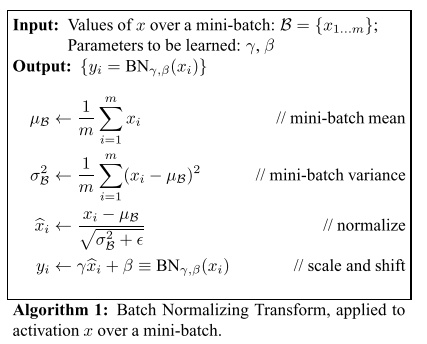
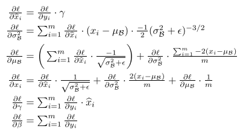
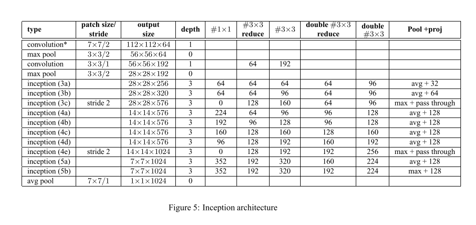

# GoogLeNet v2

原论文：[Batch Normalization: Accelerating Deep Network Training by Reducing Internal Covariate Shift](http://proceedings.mlr.press/v37/ioffe15.html)

通过BN算法解决内部协变量移位问题（Internal Covariate Shift），代入GoogLeNet v1验证，形成GoogLeNet v2。

主要思想在于第3节，结构在附录。

## 3 Normalization via Mini-Batch Statistics 通过小批量统计进行归一化

​		由于每层输入的完全白化代价高昂而且并非处处可微，因此我们进行了两处必要的简化。第一个是通过独立归一化每个标量特征，使其均值为0，方差为1，从而替换之前的联合白化输入输出的特征。对一个拥有d维的输入数据$x=(x^{(1)} \dots x^{(d)})$，我们正则化每一个维度：
$$
\hat{x}^{(k)} = \frac{x^{(k)} - E[x^{(k)}]}{\sqrt{Var[x^{(k)}]}}
$$
其中期望和方差通过计算训练数据集得来。如LeNet一样，这种正则化方法加速收敛，即使特征具有相关性。

​		值得注意的是，简单地归一化每一层的输入可能改变当前层的表征意义。例如，用sigmoid函数正则化输入，能够将它们约束到非线性的线性区域中。为了解决这个问题，我们需确保对网络数据进行的变换能够表示恒等变换。为了达到这个目的，对每个激活过的数据$x^{k}$，引入一组参数$\gamma^{(k)}, \beta^{(k)}$来对正则化值进行尺度变换和平移：
$$
y^{(k)} = \gamma^{(k)} \hat{x}^{(k)} + \beta^{(k)}
$$
这些参数与原模型参数一同学习。实际上，当设置$\gamma^{(k)}= \sqrt{Var[x^{(k)}]}, \beta^{(k)}=E[x^{(k)}]$​时，我们可将该点复原为原图像激活前数据，​如果这是最佳状态的话。

​		在批处理设置中，每个训练步骤都是基于整个训练集的，我们可以使用整个数据集来规范化激活。然而，该方法在随机优化时是不可取的。因此我们使用第二种简化方式：当我们在小批量梯度下降训练时，每个小批量提供对每次激活的均值和方差的估计。通过这种方法，用于归一化的统计量可以完全参与梯度反向传播。请注意，小批量的使用是通过计算每个维度的方差而不是联合协方差来实现的。在联合的情况下，由于小批量可能比被白化的激活数量还小，因此需要正则化，从而导致奇异的协方差矩阵。

​		假设小批量$B$参数设为$m$​。当规范化独立的应用在每层激活函数后，使得我们专注于特定的激活值$x^{(k)}$，为清晰期间省略$k$。对于小批量中每一次激活就有$m$个值：$B= \{x_1 \dots m\}$，然后规范化的值表示为$\hat{x}_{1 \dots m}$，它们的线性变换值为$y_{1 \dots m}$​，我们可以将这种变换定义为批量归一化变换(Batch Normalizing Transform)：
$$
BN_{\gamma,\beta}: x_{1 \dots m} \rightarrow y_{1 \dots m}
$$
详细算法展示：

​		BN变换可以添加到网络用以实现任意激活。在等式$y=BN_{\gamma, \beta}(x)$中，我们指出参数$\gamma$和$\beta$是可学习的，但需要注意的是，BN变换并不是独立的处理每个训练样例中的激活。而且，$BN_{\gamma, \beta}(x)$​取决于当前小批次中的所有训练样本。缩放和移位过的值$y$​被传递到其它网络层。归一化激活的值$\hat{x}$​是变换的内在因子，它们的产生方式至关重要。任意$\hat{x}$的值分布符合期望为0，方差为1的分布，只要是从同一小批次采样的话。显而易见可得$\sum_{i=1}^{m} \hat{x}_i = 0$和$\frac{1}{m}\sum_{i=1}^m \hat{x}_i^2 = 1$。每个规划后的激活值$\hat{x}^{k}$可被视为子网络$y^{(k)}= \gamma^{(k)}\hat{x}^{(k)} + \beta^{(k)}$线性变换的输入，然后再送到网络接下来的程序进行处理。这些自网络输入都含有固定的均值和方差，虽然这些联合分布的规范化值$\hat{x}^{(k)}$​随着训练过程而改变，但我们预计归一化输入的引入能够加速子网络的训练。

​		在训练期间，我们需要通过该转换层反向传播梯度损失，同样使用BN变换的参数进行梯度计算。计算过程使用如下的计算链：

​		至此，BN变换就变成了一种将归一化激活引入网络的可微变换。这可以确保模型在训练期间，每层可以继续学习表征较少内部协变量偏移的输入分布，从而加速训练。此外，应用于这些归一化激活的可学习仿射变换能够赋予BN变换恒等变换并保留网络容量的能力。

## Appendix 附录

### Variant of the Inception Model Used 所使用的Inception模块的变种

图5展示了我们所使用的架构与GoogLeNet的不同点。为了解释本表，主要不同点有以下几点：

1. $5 \times 5$卷积层由两层$3 \times 3$​卷积层替换。这在网络整体深度上增加了9层。同时它增加了25%的参数量，30%的计算成本。
2. $28 \times 28$的inception模块数量从2个增加到3个
3. 在模块中，时而平均池化，时而最大池化。具体在图中展现。
4. 任何两个Inception模块之间没有全面的池化层，但在模块3c,4e中的输出级联前采用了步长为2的卷积/池化层。

我们的模型在第一个卷积层上采用系数为8的可分离卷积。这降低了计算成本，但增加了训练时的内存消耗。

# 理解点

1. BN算法的实现（前向、反向）
2. GoogLeNet v2的变动

