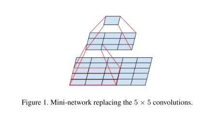
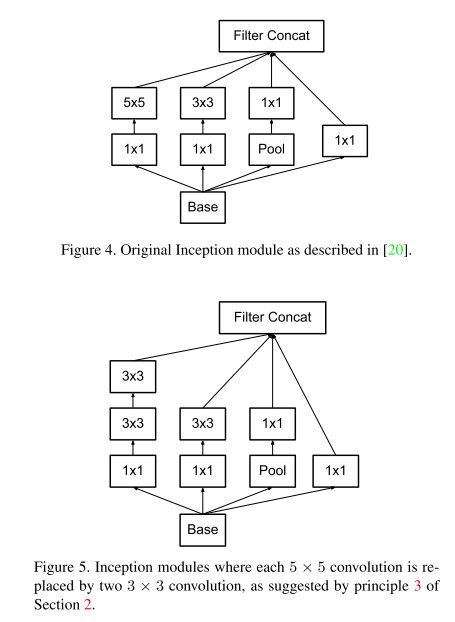
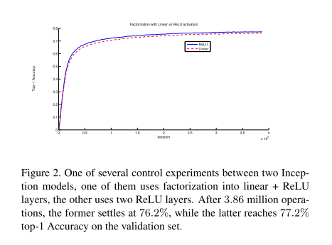
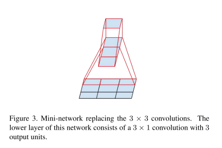
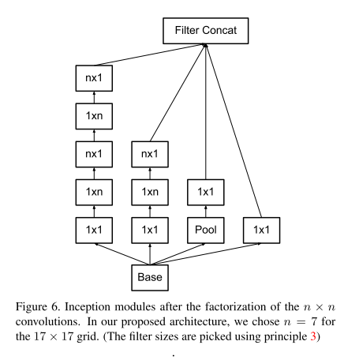
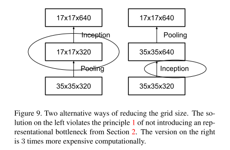
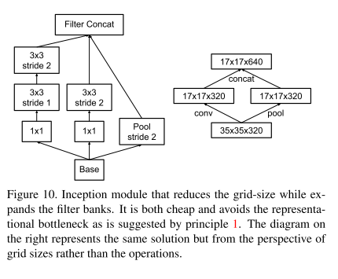
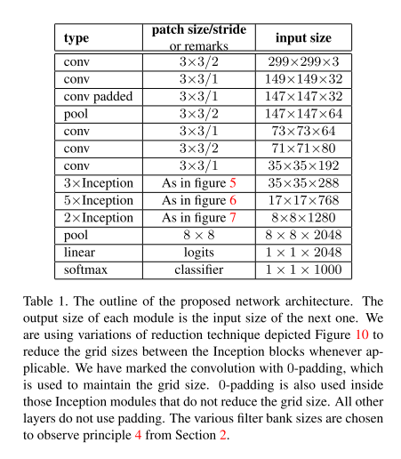

# GoogLeNet v3

原论文：[Rethinking the Inception Architecture for Computer Vision](https://arxiv.org/abs/1512.00567)

Inception结构的优化。（卷积分解、正则化等）

论文结构：

1. 引文（卷积网络发展）
2. 通用设计准则
3. 大卷积核的因式分解
4. 辅助分类器的作用
5. 网格尺寸减小的有效性
6. Inception-v3
7. 通过标签平滑(Label Smoothing)的模型正则化(Model Regularization)
8. 训练方法
9. 低分辨率输入的表现
10. 实验结果和对比试验
11. 结论

论文分节比较多，主要翻译2-6节。

## 2 General Design Principles 通用设计准则

​		在这节我们讨论一些基于大型数据集上各种卷积网络框架实验的设计准则。在这一点上，以下原则的效用是推测性的，需要额外的实验证据来评估它们的有效领性。尽管如此，严重偏离这些原则往往会导致网络质量下降，而修复这些偏离情况可实现架构效果的提升。

1. 避免表征瓶颈，特别是网络早期。前馈网络可以用从输入层到分类器或回归器的无环图来表示。这为信息流定义了明确的方向。对于将输入输出区分开来的任何切面，都可以通过切面获取大量的有效信息。应当避免的是极端压缩的瓶颈。通常而言，表征的大小在到达最终任务所用的表征前应该从输入到输出逐渐减小。理论上来说，上下文信息不能仅仅是通过表征维度来评估，因为它忽视了相关结构等重要因素。维度仅仅是提供了信息上下文的丰富性。
2. 在一个网络中，高维特征易于局部处理。每层卷积网络中使用激活函数能提供更丰富的特征表示。所需的网络可训练的更快。
3. 空间聚合可在低维嵌入上完成，并且不会损失太多或者全部表征能力。例如，在$3 \times 3$卷积前，可在空间聚合之前减少输入表示的维度，并且不会产生严重的不利影响。我们假设其原因是相邻单元之间的强相关性导致降维期间信息丢失少得多，在输出用于空间聚合上下文的情况下。鉴于这些信号很容易压缩，降维甚至可以提高学习效率。
4. 平衡网络的宽度和深度。网络的最优表现度可通过平衡每个stage的卷积核数量和网络的深度来取得。同时增加两者可提高最终结果。可同样的，常数级增长的计算量也会伴随而来。计算资源因此也应当成为平衡考量的一方面。

​		虽然这些准则具有实际意义，但这并不意味着直接使用它们就可以提高网络质量，最佳的情况是在不明晰的情况下有智慧地选择使用它们。

## 3 Factorizing Convolutions with Large Filter Size 大卷积核因式分解

​		GoogLeNet网络地大部分原始增长归功于降维的有效使用，就如NIN架构一样。这可看作为以有效的计算方法实现因式分解的特例。假设在$1 \times 1$卷积后跟$3 \times 3$卷积。在视觉网络中，预计附近激活的输出是高度相关的。因此，我们可以考虑在聚合之前减少它们的激活，这种方式应当能够表征类似的局部信息。

​		至此，我们探索因式分解卷积的各种方法，特别是增长解决方法的计算有效性。由于Inception网络是全卷积的，每个权重对应于每个激活的一次乘法。因此，任何计算成本的降低都会响应减少参数量。这意味着合适的因式分解，我们能够实现更少的参数量和更快的训练。同样，我们可以使用节约下来的计算和内存来增加滤波器组的大小，同时保持我们在单台计算机上训练每个模型副本的能力。

### 3.1 Factorization into smaller convolutions 因式分解为小卷积

​		大的空间卷积核（$5 \times 5$或$7 \times 7$）会导致不成比例的计算资源消耗问题。例如，一组n个$5 \times 5$的卷积核卷积m个特征图，比$3 \times 3$卷积核多$25/9=2.78$倍计算资源消耗。当然，$5 \times 5$的卷积能够捕获早期层中较远的单元激活之间的信号之间的依赖关系。所以减少过滤器的几何尺寸会带来很大的表现力缺失成本。可是，我们可以探索$5 \times 5$卷积是否能被多层的网络以及更少的参数量来进行替代，输入输出尺寸相同。如果我们观察$5 \times 5$卷积的计算图，我们可得知输出相当于在$5 \times 5$的格子上进行滑动全连接计算（如图1所示）。由于我们正在构建一个视觉网络，因此利用平移不变性并用两层卷积架构替换全连接组件似乎很自然：第一层是$3 \times 3$的卷积，第二层是针对$3 \times 3$输出的全连接层。 通过这样的方式就实现了两层$3 \times 3$卷积替换$5 \times 5$卷积。如图4和图5的对比。

​		这种设置显著的降低了参数量，并且实现了相邻单元的权重共享。为了分析计算成本的节约情况，我们将做一些适用于典型情况的简化假设：我们可假设$n=\alpha m$，这代表我们希望通过一个常量$\alpha$因子来改变激活单元的数量。自$5 \times 5$卷积聚合以后，$\alpha$因子是略大于1的(在GoogLeNet例子中为1.5)。通过两层卷积替换$5 \times 5$卷积层后，可推出达到这种扩张需要两步：每一步中卷积核数量增长$\sqrt{\alpha}$。为了简化评估，我们设置$\alpha=1$（不扩张）。通过因式分解这种方式，参数量降低了$\frac{9+9}{25}$倍，表现力增加了28%。参数计数的保存完全相同，因此每个参数在每个单元的激活计算中只使用一次。当然，这种设定引出了两个问题：这种替换会导致表现力的任何损失吗？如果我们的主要目标是分解计算的线性部分，是否建议在第一层保留线性激活？我们做了几次对应的控制变量实验（如图2所示的例子），在分解的所有阶段，使用线性激活总是不如使用线性整流单元。我们将这种增益归因于网络可以学习的增强变化空间，特别是如果我们对输出激活进行批量归一化。当对降维组件使用线性激活时，可以看到类似的效果。

### 3.2 Spatial Factorization into Asymmetric Convolutions 空间分解成非对称卷积

​		上述的结果表明大于$3 \times 3$的卷积核可能还没有分解成一系列由$3\times3$卷积核组成的网络有效。同样我们可以提出疑问是否还能再分解成更小的，比如$2 \times 2$的卷积。可是，结果表明非对称卷积($n \times 1$)的效果更优于$2 \times 2$卷积。例如，使用$3 \times 1$卷积和$1 \times 3$卷积等同于$3 \times 3$卷积的感受野（如图3所示）。同样该两层解决方案节约了33%的参数量。通过对比，$2 \times 2$卷积只节约了11%的参数量。

​		从理论上而言，我们从更高的角度考虑可以用$n \times 1$和$1 \times n$卷积替换$n \times n$卷积，计算量的节约与$n$的大小相关（如图6所示）。但实际上，我们发现早期的几层中，这种因式分解方式并没有什么效果，但在中层效果很好(12-20)。在这些层级中，$1 \times 7$和$7 \times 1$卷积的效果最好。

## 4 Utility of Auxiliary Classifiers 辅助分类器的使用

​		在GoogLeNet中已经介绍了辅助分类器用于提升深度网络收敛度的概念。最初的动机是将有用的梯度传导给低层，使得它们在训练期间更快收敛。同样Lee等人研究得知辅助分类器能够提供学习的稳定性和更好的收敛性。有趣的是，我们发现辅助分类器对前期的收敛度提升没什么效果：在两个模型达到高精度之前，有无它的训练进程看起来几乎相同。在训练末期，有辅助分类器的分支的准确度高于没有辅助分类器的分支，并且更加平稳。

​		同样GoogLeNet中在不同阶段使用双分支结构。去除较低的辅助分支对网络的最终质量没有任何不利影响。与上一段中的早期观察一起看，这意味着GoogLeNet中的原始假设，即这些分支有助于提升低级特征表现度，很可能是放错了位置。取而代之的是，我们认为辅助分类器的作用更像是正则化。这是由事实支撑的，如果侧分支使批量归一化的或具有dropout层的，则网络的主分类器性能更好。这也为批量归一化充当正则化器的猜想提供了微弱的支持证据。

## 5 Efficient Grid Size Reduction 降低网格尺寸有效性

​		传统上，卷积网络使用一些池化操作来实现按降低特征图的网格尺寸。为了避免表征瓶颈，在应用最大池化或平均池化之前，网络卷积通道数量应当相应扩张。例如，开始是$k$个卷积核，大小为$d \times d$，如果我们要获得$2k$个卷积核，大小为$\frac{d}{2} \times \frac{d}{2}$，我们首先计算步长为1的卷积核$2k$个，然后应用池化步骤。这意味着整体的计算成本主要由较大网格上的卷积决定，操作量为$2d^2k^2$。一种可能的方式是用卷积实现池化，将计算成本降低了4倍，至$2(\frac{d}{2})^2k^2$。可是，这增加了表征瓶颈，因为整体的表征维度降低为$(\frac{d}{2})^2k$，导致网络表现力变差（如图9所示）。与之相对的是，我们建议使用另外一种方式，既能避免表征瓶颈，又能避免计算成本的增长（如图10所示）。使用两个并行的步长为2的模组：$P$和$C$。$P$是池化层（可是平均池化也可是最大池化）。在它们之间是步长为2的卷积组，通过图10的方式级联。

## 6 Inception-v3

一图胜千言。

# 理解点

1. 卷积分解（$3 \times 3$卷积、非对称卷积）
2. 加入带BN的辅助分类器
3. 多路并行