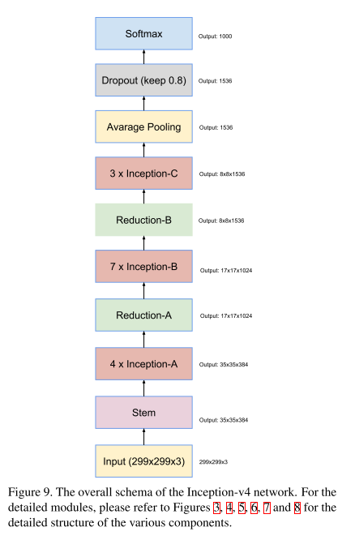
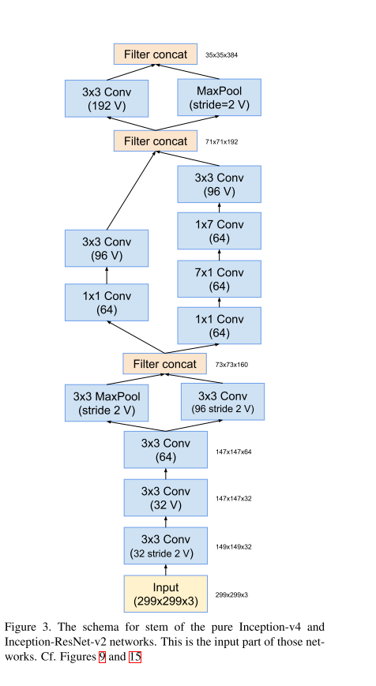
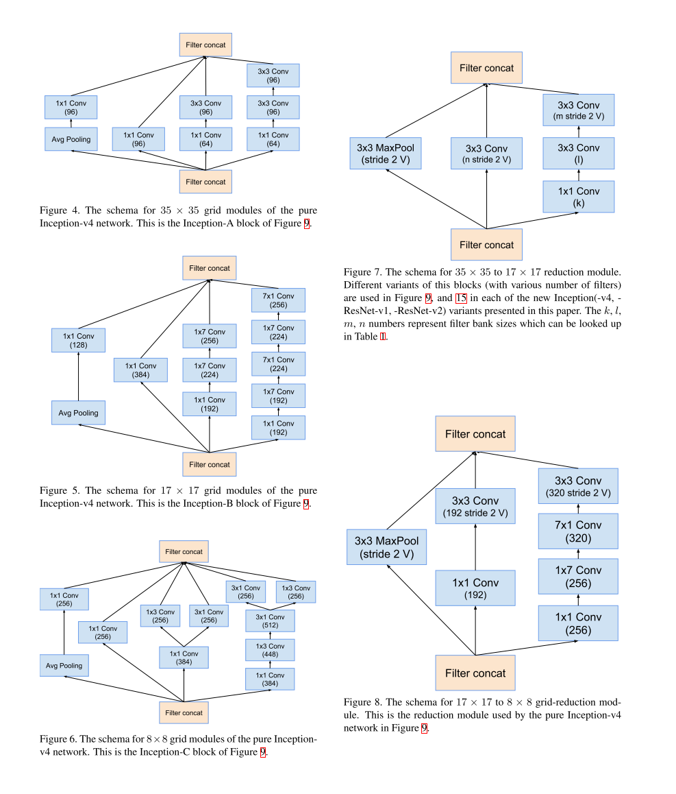
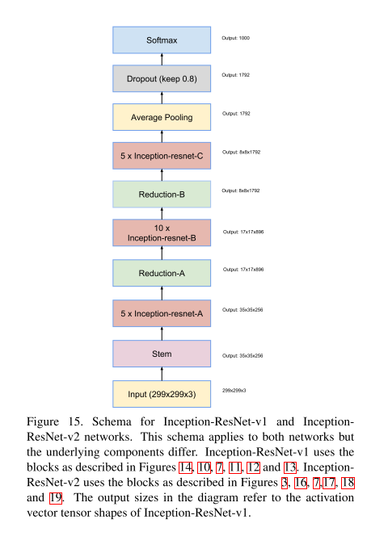
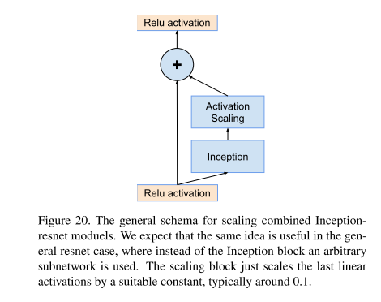

# GoogLeNet v4

原论文：[Inception-v4, Inception-ResNet and the Impact of Residual Connections on Learning](https://arxiv.org/pdf/1602.07261.pdf)

一方面引入ResNet的残差结构；一方面提出Inception v4可达到引入残差结构的效果。

论文结构：

1. 引文（介绍CNN领域的大致发展，Inception的发展，以及本文提出的Inception改进架构）
2. 相关工作（简单介绍CNN经典架构和Inception架构）
3. 架构选择（即提出的改进方法）
4. 训练技术
5. 实验结果
6. 结论

主体思想在第3节。我们翻译第3、4节，和结论。

## 3 Architectural Choices

### 3.1 Pure Inception blocks

​		我们旧的Inception模型是以分组的方式进行训练，其中每个副本被划分为多个子网络，以便能够将整个模型放入内存中。并且，Inception架构是高度可调的，这意味着调整各种层的卷积核数量可达到不影响最终完整训练网络的质量。为了优化训练速度，我们曾认真微调层的大小以达到各个模型子网络的计算平衡。与之相对的是，随着Tensorflow的引入，我们最新的模型可以在不分区副本的情况下进行训练。这部分是由于最近对反向传播使用的内存进行了优化，通过仔细考量梯度计算所需的张量并构建计算式子来减少此类张量所需的数目量，从而达到优化的目的。从历史上看，我们在改变架构选择方面一直相对保守，并将我们的实验限制在不同的独立网络组件上，同时保持网络的其余部分稳定。不简化早期的选择会导致网络看起来比它们需要的更复杂。在我们新的实验中，对于Inception-v4，我们决定摆脱这种不必要的包袱，并对每个网格大小的Inception块做出统一的选择。参考图9获取Inception-v4的整体架构，图3、4、5、6、7、8分别是部件的详细细节。图中未标注"V"的所有卷积都是同等大小填充的，意味着输入输出的尺寸大小一致。标注"V"的代表不填充，意味着输出的大小比输入的大小要小一些。

### 3.2 Residual Inception Blocks 

​		对于Inception网络的残差版本，我们使用比原Inception更节省的Inception模块。每个Inception模块后接一个扩张层(不带激活的$1 \times 1$卷积)，它用于在添加之前按比例放大滤波器组的维度以匹配输入的深度。这用于补偿Inception块引起的降维。

​		我们尝试了几个版本的Inception的残差版本。其中两种在这里详细展示。第一版"Inception-ResNet-v1"的计算成本和Inception-v3相当，第二版"Inception-ResNet-v2"与新引入的Inception-v4网络的原始成本相当。两种变体的完整架构见图15。（然而，实践证明Inception-v4的步骤时间要慢得多，这可能是由于层数较多）。

​		我们的残差和非残差Inception变体之间的另一个小的技术差异是Inception-ResNet，在传统层的顶部引入batch-normalization，但不是在summations之前。可以合理地预期，完全使用BN算法是有用的，但我们希望保持每个模型副本可在单个GPU上训练。事实证明，具有大尺寸激活层的内存占用消耗了不成比例的GPU内存。忽视以上层顶部的BN以后，我们能够能够显著增加Inception块的总数。我们希望随着计算资源的更有效利用，可以使这种trade-off方法变得没必要。

### 3.3 Scaling of the Residuals

​		同样，我们发现如果卷积核数量超过1000以后，残差变体就存在不稳定性，在训练早期就go die，意味着在平均池化前的最后层经过无数迭代后开始产生0结果。这无法避免，即使降低学习率，或是添加额外的BN层。

​		我们发现在添加它们到前期激活层之前缩小残差似乎可以稳定训练。通常，我们选择了一些介于0.1和0.3之间的缩放因子来缩放残差，然后再将其添加到累积层中进行激活。（参见图20）

## 4 Training Methodology 

​		我们使用Tensorflow分布式机器学习框架，SGD优化算法，每张NVidia Kepler GPU运行20个例子。早期例子中momentum设为0.9，我们训练的最好模型使用RMSProp算法，其中decay为0.9，$\epsilon = 1.0$。学习率设置为0.045，每训练2个epochs降低为原来的0.94。使用随时间计算的参数的运行平均值来执行模型评估。

## 6 Conclusions

​		我们详细展示了三种新的网络架构：

* Inception-ResNet-v1：计算成本与GoogLeNet v3中的Inception-v3相当。

* Inception-ResNet-v2：一个成本更高的混合Inception版本，具有显著提高的识别性能。

* Inception-v4：纯Inception变种，没使用残差连接，拥有和Inception-ResNet-v2相等的性能。

  

  我们研究了如果引入残差连接来提高Inception架构的训练速度。此外，我们最新的模型（有无残差连接）优于以前的所有版本，仅仅是提高了模型大小。

# 理解点

1. 将ResNet的残差连接引入Inception模块

