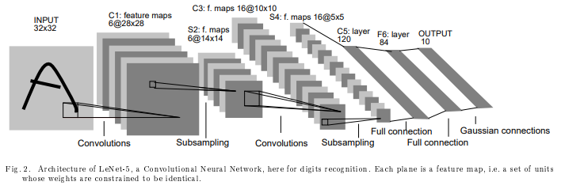
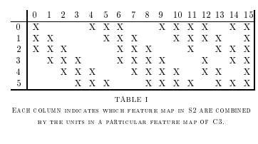
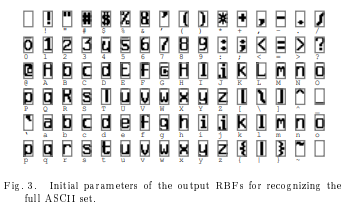

# 简介
参考论文： [《Gradient-Based Learning Applied to Document Recognition》](http://lushuangning.oss-cn-beijing.aliyuncs.com/CNN%E5%AD%A6%E4%B9%A0%E7%B3%BB%E5%88%97/Gradient-Based_Learning_Applied_to_Document_Recognition.pdf)

LeNet，CNN的开山之作。

由于论文篇幅较长，就挑选主要思想部分进行翻译、理解（第二章A、B单元）。

## 第二章：CONVOLUTIONAL NEURAL NETWORKS FOR ISOLATED CHARACTER RECOGNITION 用于单个字符识别的卷积神经网络        

使用梯度下降算法的多层网络能够从大量样本中学习到复杂、高维、非线性的映射关系，这使得它们能够用于图像识别任务。在传统的模式识别模型中，手工设计的特征提取器用于从输入数据中提取相关信息并且消除不相关的变量。然后用一个可训练的分类器将结果特征向量分类成对应类别。在该方案中，一个标准的、全连接的多层网络用于当作分类器。一个更有意思的模式是特征提取器能够进行自我学习。在该字符识别任务中，原始输入的图像即可用于特征提取及分类（标准大小的图像）。虽然可以通过普通的全连接前馈网络成功完成字符识别等任务，但在部分方面仍存在问题。  
    
第一，图像比较大，通常包含几百个像素(pixels)。第一层包含上百个隐藏神经元的全连接层，会包含成千上万的权重。如此大量的参数提高了系统的识别能力，但也导致了需要大量的训练集。并且，存储如此大量的权重超出了当前的硬件承载能力。但是，对于图像或者语音应用而言，缺乏结构性的网络最大不足在于不具备平移、形变扭曲的不变性。在输入到固定大小的网络之前，字符图像或者其他的2D、1D信号必须经过大小的标准化和数据的归一化。不幸的是，没有一种预处理是完美的：手写数字一般在字符层面进行规范化，会导致每个字符的大小，倾斜，位置发生形变，外加上书写风格的差异，会导致输入对象中特征位置的显著变化。原则上，足够大小的全连接网络能够对这些变化具有鲁棒性。可是，这样的任务训练会导致多个具有相似权重模式的神经元位于输入的不同位置，便于检测输入中出现的任何不同特征。需要大量的训练样例来学习这些权重设置从而能够覆盖可能的变量空间。在下文所讨论的卷积网络中，平移不变性能够通过跨空间的权重复制（即权重共享）自动实现。

第二，全连接架构的一个不足在于输入的拓扑结构被完全忽略。输入变量可以以任何（固定）顺序呈现，而不会影响训练结果。与之相对的是，图像（或者语音的时间序列表示）具有健壮的2D局部结构：空间相邻的像素具有高度相关性。局部相关性对于提取局部特征来说具有巨大优势，因为相邻像素的权重可以分类为几类（比如：边，角等）。卷积神经网络通过限制感受野的隐藏神经元为局部大小从而强制提取局部特征。

### A. Convolutional Networks 卷积网络        

卷积网络通过三种架构思想（局部感受野(local receptive fields)、权重共享(shared weights)、下采样(sub-sampling)）来保证平移、尺度、和形变的不变性。图2中所展示的LeNet-5就是典型的用于字符识别的卷积网络。原始的字符输入图像是经过大小规范化和数据归一化的。局部感受野的连接神经元的理念可追溯到60年代早期的感知机理论，并且几乎与Hubel和Wiesel在猫的视觉系统中发现局部敏感、定向选择性神经元同时发生。局部连接在视觉学习的神经元模型中广泛使用。通过局部感受野，神经元能够提取初级的视觉特征，比如边缘、定点、角点（或者像语音频谱图相似的其他信号特征）。这些特征在接下来的层中能够用于提取高级特征。正如之前所言，输入的平移或者形变会导致特征位置的显著变化。此外，图像的局部特征检测器还可作用于整张图像。这种技术实现可通过强制整张图像不同地方的局部感受野拥有相同的权重向量（即权值共享）。通过这些神经元进行特征提取的输出结果称为特征图（feature map）。特征图的每一神经元都是通过前一层不同位置经过相同计算得来的。一个完整的卷积层是通过几个特征图联合组成的（通过不同的权重向量），因此可以在每个局部位置形成多重特征。图2中展现一个LeNet输入的完整的样本。首层拥有6张由隐藏神经元提取的特征图。特征图的每个神经元计算来自输入中5x5大小总共25个输入计算，这称之为神经元的感受野。每个神经元通过25个输入乘以25个可训练变量加上一个偏置得来。特征图中的连续单元的感受野以前一层中相应的连续单元为中心，所以相邻单元的感受野是重叠的。举个例子，在LeNet-5中的首个隐藏层，水平连续单元的感受野重叠5行4列。正如之前所提，特征图中的每个神经元共享相同的25个权重和一个偏置，从而使得输入图像的所有相似的局部特征。在同一层中的其他特征图使用不同的权重和偏置集合，因此能够提取不同类型的局部特征。在LeNet-5中，每一个输入位置，6张特征图都由同一位置的6种神经元组合进行提取。特征图的一系列实现通过感受野大小扫描输入图片的每一个位置，然后将结果保存在特征图的相同位置。这种操作等同于卷积，外接一个额外的偏置和压缩方法，因此命名为卷积网络(convolutional network)。卷积核是特征图中神经元所使用的权重结合。卷积层的一个有趣的特征是如果输入图像发生平移，特征图也会发生同样的平移，否则特征图图保持不变。这个特性是CNN对位移和形变保持鲁棒的基础。

 
       

一旦一个特征被提取，它的其他局部就变得不重要了。相对于其他特征的相关位置才是更相关的。举个例子，我们知道左上角区域输入图像包含一个水平线段的端点，右上角区域包括一个角点，下方垂直区域包含一个端点，我们就能得出输入图像为7。这些特征位置的精确对识别没什么帮助，反而不利于不同字符的识别。在特征图中降低精确位置信息的简单方式是通过降低空间分辨率(spatial resolution)。这可通过下采样层(sub-sampling layers)来达到目标。下采样层通过局部平均来降低特征图的分辨率，并且降低输出对平移、形变的敏感度。LeNet-5的第二个隐藏层即为下采样层。这层包含6张特征图，每一张特征图都对应前一层的每张特征图。每个神经元的感受野大小为2x2，每个神经元通过4个输入取平均，然后乘以一个可训练的参数外加一个偏置，最后通过一个sigmoid函数进行激活。连续单元具有不重叠的感受野。最后，经过下采样的特征图含有前一层特征图的一半大小的行和列。一个可训练的参数和偏置影响着最后的sigmoid非线性。如果系数过小，下采样层神经元相当于对输入做了模糊处理，相当于线性。如果系数较大，根据偏置的值下采样层可看成是“或”或者“与”操作。卷积层和下采样层的交替衔接，就形成了一种“金字塔”架构：在每一层，特征图的分辨率逐渐降低，而数量逐渐增加。在图2中的第三层隐藏层的每个神经元的计算来自于上一层的多个特征图的相关神经元计算。卷积和下采样结合的灵感来源于Hubel和Wiesel的“简单”和“复杂”细胞概念，虽然那个时候没有像反向传播算法一样的全局监督学习过程。下采样层结合多个特征图的丰富表达可以大大提高网络对几何变换的不变性。 
    
自从所有权重可通过反向传播算法学习以后，卷积网络能够被视为可自我学习的特征提取器。权重共享的技术能够大大减少参数的使用量，并且该技术降低了机器的“能力”，同时该技术还减小了测试误差和训练误差之间的差距。图2中的网络包含340908个连接，但通过权值共享后，只需要60000个可训练参数。 
     
固定大小的卷积网络已经适用于各种应用，包括手写识别任务、机打字符识别、在线手写识别以及人脸识别等。在单个时间维度进行权值共享的固定大小的卷积网络称之为延时神经网络(TDNNs)，TDNNs已经用于场景识别（没有下采样），语音字符识别（有下采样），独立的手写体字符识别以及手势验证。
        
 ### B. LeNet-5        

该章节主要讲实验中所使用的卷积神经网络LeNet-5架构的更多细节。LeNet-5在不包含输入的情况下总共有7层，每一层都包含可训练的参数（权重）。输入为一张32x32像素大小的图像。这要比标准的MNIST数据库中最大的字母还大(28x28)。这样做的原因是希望潜在的明显特征比如笔画端点或角点能够出现在最高层特征检测器感受野的中心。在LeNet-5中，最后一层卷积层（C3）的感受野的中心在32x32的输入图像中形成了一个20x20的区域。输入像素的值标准化后，背景层（白色）对应值为-0.1，前景层（黑色）对应值为1.175。这使得输入平均值为0，方差为1，能够加速训练。   

在接下来的叙述中，卷积层标记为Cx，下采样层标记为Sx，全连接层标记为Fx，其中x代表第几层。  

C1层是一个拥有6张特征图的卷积层。每一张特征图的每一个神经元由输入的5x5相邻神经元计算得来。特征图的大小为28x28，这样能防止连接的信息掉到边界之外。C1层包含156（(5*5+1)*6 = 156）个可训练参数和122304（26*28*28*6）个连接。    

S2层是一个拥有6张14x14大小的特征图的下采样层。每一张特征图中的每一个神经元对应C1中特征图的2x2邻域。在S2中，四个输入取平均后，乘以一个可训练系数再加上一个偏置，通过一个sigmoid函数。2x2感受野是非重叠的，因此，S2的特征图大小是C1特征图行列的各一半。S2拥有12个可训练的参数和5880个连接。 

C3层是一个拥有16张特征图的卷积层。每张特征图的每个神经元对应于S2特征图的同一位置的5x5邻域。Table I中展现了S3的每张特征图是通过S2中哪几张特征图进行计算的。为什么不讲S2特征图和S3特征图进行一对一连接呢？原因有两个。第一，一个不完全连接的模式保证了连接的数量维持在合理的范围。更重要的是，它迫使网络的对称性中断。不同的特征图通过提取不同的输入集合的特征。在Table I中所展示的连接合理性在于以下。C3中刚开始的6张特征图分别从S2特征图的三张特征图子集提取特征，接下来的6张分别从S2特征图的四张特征图提取，接下来的3张从S2中不连续的四张特征图进行提取。最后一层从S2中所有特征图进行提取。C3层包含1516个可训练参数和151600个连接。

 

S4层是包含16张大小为5x5的特征图的下采样层。每张特征图的每个神经元与C3中的2x2邻域对应，就与C1和S2的方式相似。S4层包含32个可训练参数和2000个连接。        

C5层是一个拥有120张1x1特征图的卷积层。每一个神经元与S4的所有16张特征图的5x5邻域连接。由于S4的特征图大小为5x5，所以C5的特征图大小为1x1。C5是标记为卷积层，而不是全连接层，是因为如果LeNet-5的输入变大，而其他保持不变，那么此时特征图的维数就会比1x1大。C5层包含48120可训练的连接。      

F6层，包含84个神经元，与C5进行全连接。它拥有10164个可训练参数。

如同经典神经网络，F6层计算输入向量和权重向量之间的点积，再加上一个偏置。神经元i的加权和表示为$a_i$，然后将其传递给sigmoid函数产生单元i的一个状态，表示为$x_i$：
$$
 x_i = f(a_i)
$$
Sigmoid函数是一个双曲线正切函数：
$$
f(a)=A\tanh{(Sa)}
$$
其中A表示函数的振幅，S决定了斜率，这个函数是一个奇函数，水平渐进线为+A, -A。常量A选择为1.7159。

最后，输出层选择由欧式径向基函数(Euclidean Radial Basis Function, RBF)单元组成，每类一个单元，每个单元有84个输入，每个RBF单元$y_i$的输出按照如下方式计算：
$$
y_i = \sum{(x_j - w_{ij})^2}
$$
换句话说，每个输出的RBF单元通过计算输入向量和它的参数向量的欧氏距离。输入离参数向量越远，RBF的输出就越大。一个RBF输出可以被理解为衡量输入模式和与RBF相关联类的一个模式的匹配程度的惩罚项。用概率术语来解释，RBF输出可以被理解为F6层配置空间的高斯分布的负Log似然。给定一个输入模式，损失函数应能使得F6的配置与RBF参数向量足够接近。这些神经元的参数向量可以通过手工固定（至少初始如此）。这些参数向量的成分可被设置为-1或+1。虽然这些参数可以以-1和+1等概率的方式任选，或者构成一个纠错码，但是被设计成一个相应字符类的7\*12大小(即84)的格式化图片。这种设置对单独的数字不是很有用，但是对ASCII中的字符很有用。基本原理就是字符是相似的，容易混淆，比如大写的O，小写的o和数字0或者小写的l和数字1，方括号和大小的I，会有相似的输出编码。如果一个系统与一个能够纠正此混淆的语言处理器相结合，这个就非常有用了。由于容易混淆的类别的编码是相似的，有歧义的字符的RBF输出是相似的，这个语言处理器就能够选择出合适的解释。图3给出了ASCII的输出编码。

使用这种分布编码而非使用“1 of N"编码的另一个原因是，当类别比较大时，非分布编码的效果比较差。原因时大多数时间非分布编码的输出必须是关闭状态。这使得sigmoid单元难以实现。另一个原因时分类器不仅用于识别字母，也用于拒接非字母。使用分布编码的RBF更适合，因为与sigmoid不同，它们在输入空间的较好的限制区域内激活，而不是像非典型模式那样落在外边。

RBF的参数向量扮演着F6层的目标向量的角色。它用于指出这些目标向量为+1还是-1，这正好在F6 sigmoid的范围内，可以防止sigmoid函数饱和。事实上，+1和-1是sigmoid函数的最大曲率的点。这使得F6单元运行在最大非线性范围内。必须避免sigmoid函数的饱和，因为这将会导致损失函数的收敛速度慢和其他问题。

# 理解点
使用MNIST作为数据集。

1. 定义了CNN基本框架：卷积层、池化层、全连接层
2. 定义了卷积层（局部连接、权值共享）
3. 用Tanh作为非线性激活函数