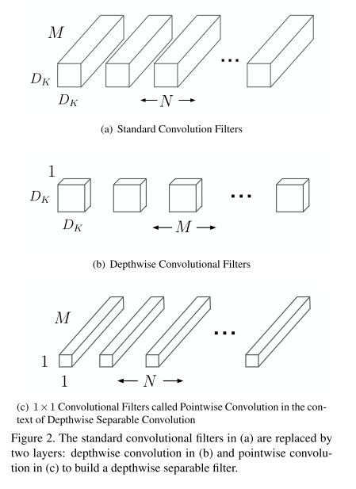
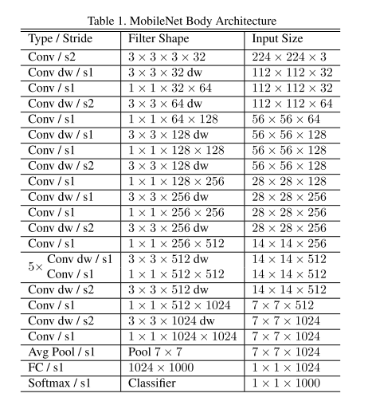
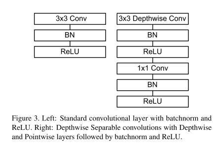
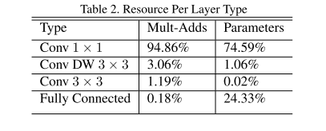
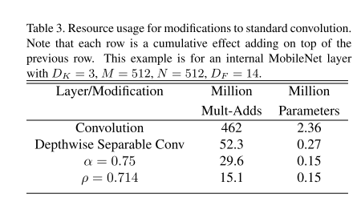

# MobileNet v1

原论文：[MobileNets: Efficient Convolutional Neural Networks for Mobile Vision Applications](https://arxiv.org/abs/1704.04861)

轻量化模型的开山之作。

论文结构：

1. 引文（简单介绍CNN）
2. 前置工作（Xception、Inception v3等等）
3. MobileNet架构
4. 实验结果
5. 结论

主要以第3节翻译为主。

## MobileNet Architecture

​		在本节中，我们首先介绍MobileNet采用的核心层为深度可分离卷积。然后介绍MobileNet结构，最后介绍了两个模型收缩超参数：宽度乘数、分辨率乘数。

### 3.1 Depthwise Separable Convolution 

​		MobileNet模型基于深度可分离卷积搭建，这是分解卷积的一种形式，它将标准卷积分解为深度卷积和以$1 \times 1$卷积构成的逐点卷积。对MobileNet而言，深度卷积针对每个输入通道应用一个卷积核。然后逐点卷积应用$1 \times 1$卷积来聚合输出。标准卷积将过滤核聚合输入形成一系列输出熔炼成一步。深度可分离卷积分解成两层，一层用于过滤，一层用于聚合。这种分解具有显著减少计算和模型大小的效果。图2展示了标准卷积如何分解成深度卷积和$1 \times 1$卷积。

​		标准卷积层的输入维度为$D_F \times D_F \times M$，输出特征图为$D_F \times D_F \times N$，其中$D_F$指的是一个正方形输入特征图的宽高，$M$指的是输入通道数，$D_G$指的是正方形输出特征图的宽高，$N$指的是输出通道数。

​		标准卷积层的卷积核$K$大小为$D_K \times D_K \times M \times N$，其中$D_K$是假设为正方形卷积核的空间维度，$M$是输入通道的数量，$N$是输出通道的数量。

​		标准卷积的输出特征图的计算为（假设步长为1，填充）：
$$
G_{k,l,n} = \sum_{i,j,m} K_{i,j,m,n} \cdot F_{k+i-1,l+j-1,m} \tag{1}
$$
​		标准卷积的计算消耗为：
$$
D_K \cdot D_K \cdot M \cdot N \cdot D_F \cdot D_F \tag{2}
$$
​		其中计算成本乘法取决于输入通道的数量$M$、输出通道的数量$N$、内核大小$D_K \times D_K$和特征图大小$D_F \times D_F$。MobileNet模型解决了这些术语中的每一个及其相互作用。首先，它使用深度可分离卷积来打破输出通道数量和内核大小之间的相互作用。

​		标准的卷积运算具有填充效果，基于卷积核的特征和组合特征以产生新的表征。过滤和组合步骤可以通过使用称为深度可分离卷积的分解卷积为2个步骤，以显著降低计算成本。

​		深度可分离卷积由两部分组成：深度卷积和逐点卷积。我们使用深度卷积来针对每个通道使用一个卷积核。逐点卷积通过使用$1 \times 1$卷积来针对深度卷积的输出实现线性变换。MobileNets在两个层中都使用了BN和ReLU。

​		单通道单卷积的深度卷积公式可列为：
$$
\hat{G}_{k,l,m} = \sum_{i,j} \hat{K}_{i,j,m} \cdot F_{k+i-1,l+j-1,m} \tag{3}
$$
其中$\hat{K}$指的是深度卷积核的尺寸大小$D_K \times D_K \times M$，其中第$m$个卷积核对应$F$中的第$m$通道特征图。

​		深度卷积的计算成本为：
$$
D_K \cdot D_K \cdot M \cdot D_F \cdot D_F \tag{4}
$$
​		相对于标准卷积，深度卷积是非常有效的。但是它只过滤输入通道，不聚合它们形成新的特征。所以提供针对深度卷积的输出实现线性变换的额外层，即$1 \times 1$卷积层用于生成新特征。

​		深度卷积和$1 \times 1$卷积（逐点卷积）的联合称为深度可分离卷积。首次出现在文章[26]。

​		深度可分离卷积的计算成本为：
$$
D_K \cdot D_K \cdot M \cdot D_F \cdot D_F + M \cdot N \cdot D_F \cdot D_F \tag{5}
$$
​		是深度卷积和逐点卷积的操作和。

​		通过将卷积表示为过滤和组合两步过程，我们可以减少计算：
$$
\frac{D_K \cdot D_K \cdot M \cdot D_F \cdot D_F + M \cdot N \cdot D_F \cdot D_F}{D_K \cdot D_K \cdot M \cdot N \cdot D_F \cdot D_F} = \frac{1}{N} + \frac{1}{D_K^2}
$$
​		MobileNet通过使用$3 \times 3$的深度可分离卷积，相对于标准卷积而言计算量减少了8-9倍，准确度却相差无几。

### 3.2 Network Structure and Training

​		MobileNet架构除了第一层使用全卷积以外，都使用深度可分离卷积。通过以如此简单的术语定义网络，我们能够轻松探索网络拓扑以找到一个好的网络。表1定义了MobileNet的架构。所有层都后接一个BN层和ReLU非线性变换，除了最后的全连接层没有非线性变换曾，而是使用softmax层用于分类。图3将标准卷积和深度可分离卷积做了对比。下采样在深度卷积和第一层中使用跨步卷积处理。在全连接层之前，最终的平均池化将空间分辨率降为1。将深度和逐点卷积计算为单独的层，MobileNet有28层。

​		仅仅根据Mult-Adds定义网络是不够的。确保这些操作可以有效实施也很重要。例如，非结构化稀疏矩阵通常不会比密集矩阵运算快，直到非常高的稀疏度。我们的模型结构将几乎所有的计算都放入密集的$1 \times 1$卷积中。这可以通过高度优化的通用矩阵乘法(GEMM)函数来实现。卷积通常由GEMM实现，但需要在内存中进行初始重新排序，称为im2col，以便将其映射到GEMM。$1 \times 1$卷积不需要再内存中重新排序，可以直接使用GEMM实现，GEMM是最优化的数值线性代数算法之一。MobileNet将95%的计算时间花费在$1 \times 1$卷积中，其中还有75%的参数，如表2所示。几乎所有的附加参数都在全连接层中。

​		MobileNet模型是在Tensorflow中训练的，使用类似于Inception V3的异步梯度下降的RMSprop。然而，与训练大模型相反，我们使用较少的正则化和数据增强基数，因为小模型过拟合的问题较少。在训练MobileNet时，我们不是用侧头或标签平滑，并通过限制大型Inception训练中使用的小作物的大小来额外减少图像失真量。此外，我们发现再深度过滤器上放置很少或没有权重衰减（L2正则化）很重要，因为它们的参数很少。对于下一节中的ImageNet基准测试，无论模型大小如何，所有模型都使用相同的训练参数进行训练。

### 3.3 Width Multiplier: Thinner Models

​		尽管基本的MobileNet架构已经很小且低延迟，很多时候特定用例或应用程序可能需要模型更小更快。为了构建这些更小、计算成本更低的模型，我们引入了一个非常简单的参数$\alpha$，称为宽度乘数。宽度乘数$\alpha$的作用是在每一层均匀地减小网络宽度。对于一层给定宽度乘数$\alpha$，输入通道数$M$变成$\alpha M$，输出通道$N$变成$\alpha N$。

​		拥有宽度乘数$\alpha$的深度可分离卷积的计算成本为：
$$
D_K \cdot D_K \cdot \alpha M \cdot D_F \cdot D_F + \alpha M \cdot \alpha N \cdot D_F \cdot D_F \tag{6}
$$
其中$\alpha \in (0,1]$，典型的设置为1、0.75、0.5和0.25。$\alpha=1$为MobileNet的基准，$\alpha < 1$减小MobileNet。宽度乘数具有将计算成本和参数数量平方减少大约$\alpha^2$的效果。宽度乘数可以应用于任何模型结构，以定义具有合理精度、延迟和大小权衡的新的较小模型。它用于定义需要从头开始训练的新简化结构。

### 3.4 Resolution Multiplier: Reduced Representation

​		第二个超参数用于减少一个神经网络的计算成本的为分辨率乘数$\rho$。将该系数应用于输入图像和每层的中间特征表示，通过一样的分辨率乘数减少。在实际中，仅将$\rho$用于输入分辨率设置。

​		我们现在的深度可分离卷积的式子可表示为：
$$
D_K \cdot D_K \cdot \alpha M \cdot \rho D_F \cdot \rho D_F + \alpha M \cdot \alpha N \cdot \rho D_F \cdot \rho D_F \tag{7} 
$$
​		其中$\rho \in (0,1]$，典型的设置网络输入分辨率为：224、192、160、128。$\rho =1$为基准线，$\rho < 1$为降低计算量。分辨率乘数$\rho$将计算成本和参数量成本降低$\rho^2$。

​		表3显示了例子。

# 理解点

1. 如何实现轻量化
2. 深度可分离卷积的计算成本的降低

