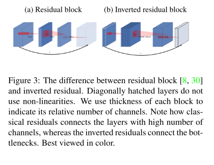
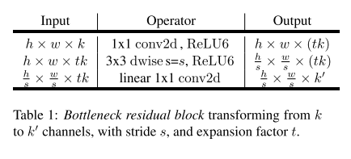
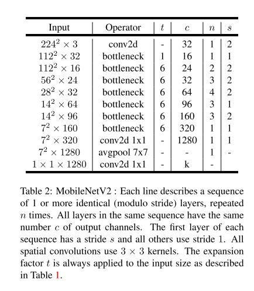
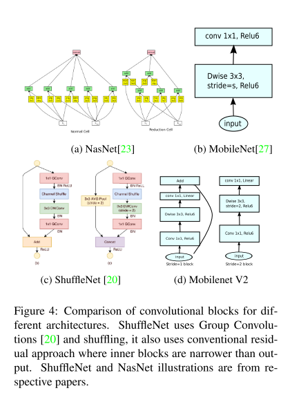

# MobileNet v2

原论文：[MobileNetV2: Inverted Residuals and Linear Bottlenecks](https://arxiv.org/abs/1801.04381)

改进MobileNet v1中的residual block，用Linear激活函数防止ReLU对特征的破坏。

主要翻译第3、4节。

## 3 Preliminaries, discussion and intuition

### 3.1 Depthwise Separable Convolutions

​		深度可分离卷积是许多效率神经网络架构的关键构建块，在该工作中我们也使用它。基本思想是用一个分解的版本替换一个完整的卷积运算符，将卷积分成两个单独的层。第一层称之为深度卷积，它表现得非常轻量，逐通道卷积。第二层为$1 \times 1$卷积，称之为逐点卷积，可理解为输入通道信息的线性融合。

​		标准卷积输入向量$L_i$为$h_i \times w_i \times d_i$，应用卷积核$K \in R^{k \times k \times d_i \times d_i}$来生成$h_i \times w_i \times d_j$的输出向量$L_j$。标准卷积的计算成本为$h_i \cdot w_i \cdot d_i \cdot d_j \cdot k \cdot k$。

​		深度可分离卷积可直接替换标准卷积层。从经验上它们效果和正常卷积相似，但计算成本只有：
$$
h_i \cdot w_i \cdot d_i (k^2 + d_j) \tag{1}
$$
它是深度卷积和逐点卷积的操作总和，与标准卷积相比，深度可分类卷积的操作总数下降了$k^2$。MobileNet V2使用$k=3$（即$3 \times 3$可分离卷积），在准确度略有下降的前提下，计算成本降低了8-9倍。

### 3.2 Linear Bottlenecks

​		给定一个深度神经网络由$n$层组成，用$L_i$表示每一层，其中每层激活后的张量维度为$h_i \times w_i \times d_i$。整节我们将讨论这些激活张量的基本属性，可视为$d_i$维度的$h_i \times w_i$"像素"。非正式的，对于真实给定的输入图像，我们说这组激活层（对于任意层$L_i$）形成了一个"manifold of interest"。长期以来，人们一直认为神经网络中的manifold of interest可以嵌入到低维的子空间中。换句话说，当我们查看深度卷积层的所有单个d维通道像素时，这些值中编码的信息实际上位于某个流形中，而流形又可以嵌入到低维子空间中。

​		乍一看，可以捕捉到这样的事实，可通过降低操作空间的维数来降低层的维数。这在MobileNet V1中通过宽度超参数来实现计算和准确度的平衡。跟随这样的动机，宽度乘数方法允许减少激活空间的维数，直到manifold of interest跨越整个空间。然而，当我们召回深度卷积神经网络实际上具有非线性的每个坐标变换时，这种动机就没用了，例如ReLU。例如，将ReLU应用于一维空间中的一条线会产生一条"射线"，而在$R^n$空间中，它通常会产生具有n个关节的分段线性曲线。

​		显而易见的是，通常意义上，如果层变换的结果ReLU(Bx)具有非零的向量$S$，则通过输入的线性变换B得到映射到内部S的点，从而表明输入空间对应于仅限于线性变换的全维输出。换句话说，深度网络仅对输出领域的非零部分具有线性分类能力。参考补充资料以获得更严谨的证明。

​		在另一方面，当ReLU激活通道时，它不可避免地会丢失该通道的信息。然而当我们有大量的通道时，并且激活流形有一个结构，信息可能仍然保留在其它通道。在补充材料中，我么表明，如果输入流行可以嵌入到激活空间的一个显著较低维度的子空间中，那么ReLU变换会保留信息，同时将所需的复杂性引入到可表达的函数集中。

​		总而言之，我们强调了两个属性，这表明manifold of interest应该位于高维激活空间的低维子空间中：

1. 如果manifold of interest在ReLU变换后保持非零向量，它相当于一次线性变换。
2. ReLU能够保留有关输入流形的完整信息，但前提是输入流形位于输入空间的低维子空间中。

​		这两个见解为我们提供了经验性的提示用于优化现有的神经架构：假设manifold of interest是低维的，我们可以通过将linear bottleneck层插入卷积块来捕获它。试验结果表明，使用线性层至关重要，因为它可以防止非线性破坏太多信息。在第6节中，我们凭经验表明，在瓶颈中使用非线性层确实会损害性能几个百分点，进一步验证了我们的假设。我们注意到，在[29]中报告了类似的非线性的报告，其中从传统残差块的输入中去除了非线性，从而提高了CIFAR数据集的性能。

​		在本文的其余部分，我们将使用bottleneck convolutions。我们将输入bottleneck的大小与内部大小之间的比率称为expansion ratio。

### 3.3 Inverted residuals

​		bottleneck blocks看起来类似于residual block，residual block其中每个块包含一个输入，然后是几个bottlenecks，然后是expansion。然而，受到bottlenecks实际上包含所有必要信息的直觉的启发，而扩展层仅作为伴随张量非线性变换的实现细节，我们直接在瓶颈之间使用shortcuts。

​		图3提供了设计不同的机制可视化。插入shortcuts的动机和传统的残差连接类似：提高梯度在多层里面的传播能力。然而，这种反转的设计对内存使用更高效（详见第5节），以及在我们的实验中稍微好一点。

**Running time and parameter count for bottleneck convolution**

​		表1展示了基本实现结构。对于大小为$h \times w$的块，扩张因子$t$，内核大小$k$，输入维度$d'$，输出维度$d''$，总共需要的计算为$h \cdot w \cdot d' \cdot t(d'+k^2+d'')$。与(1)相比，这个表达式有一个额外的项，因为我们确实有一个额外的$1 \times 1$卷积，但是我们网络的性质允许我们使用更小的输入和输出维度。在表3中，我们比较了MobileNet V1、MobileNetV2、ShuffleNet之间每种分辨率所需的大小。

### 3.4 Information flow interpretation

​		我们的架构的一个有趣特性是它在构建块（瓶颈层）的输入/输出域和层转换之间提供自然分离——这是一个将输入转换为输出的非线性函数。前者可以看作是网络在每一层的容量，而后者可以看作是表现力。这与常规和可分离的传统卷积块形成对比，在传统卷积块中，表现力和容量都交叉在一起，并且是输出层深度的函数。

​		特别是，在我们的例子中，当内层深度为0，由于shortcut，低层卷积是恒等映射。当扩展比小于1时，这是一个经典的残差卷积块。然而，为了达到我们的目的，实验表明大于1的膨胀比是最有用的。

​		这种解释使我们能够分别研究网络的容量和表达能力，我们认为有必要进一步探索这种分离，以更好地了解网络特性。

## 4 Model Architecture

​		现在我么你详细介绍我们架构的细节。如上节所述，基本的构建块是带有残差的深度可分离卷积。表1详细介绍了该块的结构。MobileNetV2初始包含32卷积核的全卷积层，后接19层residual bottleneck，如表2所示。我们使用ReLU6作为非线性层。并且使用$3 \times 3$的卷积核。在训练期间使用dropout和BN层。

​		除了第一层，整个网络使用常量扩张因子。在我们的实验中，我们发现5-10之间的扩展率导致几乎相同的性能曲线，较小的网络在扩展率稍小的情况下效果更好，而较大的网络在扩展率较大时性能稍好。

​		对于我们的主要实验，我们使用扩张因子6。例如，对于一个bottleneck层，输入为64通道，输出为128通道，中间通道则为$64 \cdot 6=384$层。

**Trade-off hyper parameters**

​		正如在[27]中一样，我们通过使用输入图像分辨率和宽度乘数作为可调超参数来针对不同的性能点定制我们的架构，可以根据需要的精度/性能权衡进行调整。我们的主网络（宽度乘数1，$224 \times 224$）的计算成本为3亿次操作，并使用了340万个参数。

​		我们探讨了性能权衡，输入分辨率为96-224，宽度乘数为0.35-1.4。网络的计算成本范围从7个乘法增加到585MMAdds，而模型大小在1.7M-6.9M参数之间变化。

​		一个小的实现差异，与[27]中小于1的乘数，将宽度乘数应用于除最后一个卷积层之外的所有层。这提高了较小模型的性能。

# 理解点

1. 结构的改进
2. 刚好和residual block相反的inverted residual

