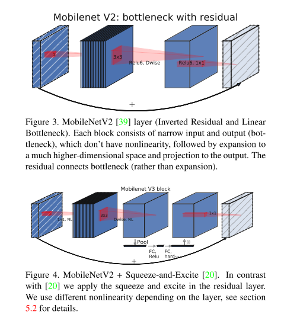
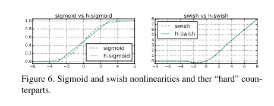
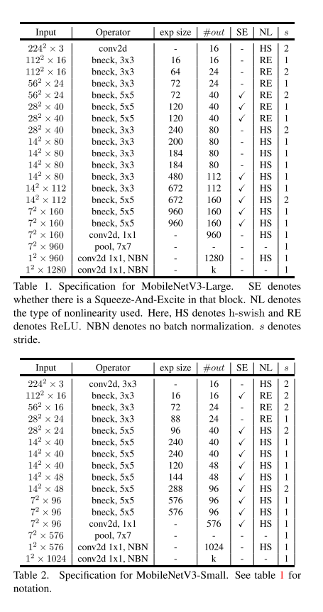

# MobileNet v3

原论文：[Searching for MobileNetV3](https://arxiv.org/abs/1905.02244)

互补搜索技术组合用于MobileNetV2，实现网络结构改进。引入h-swish激活函数。

主要翻译3、4、5节。

## 3 Efficient Mobile Building Blocks

​		Mobile模型建立在越来越高效的building blocks上。MobileNetV1引入深度可分离卷积作为传统卷积层的有效替代方案。深度可分离卷积通过将spatial filtering和feature generation mechanism分离，有效地分解了传统卷积。深度可分离卷积由两个单独层定义：用于spatial filtering的轻量级depthwise convolution，和用于feature generation的$1 \times 1$ pointwise convolutions。

​		MobileNetV2引入了linear bottleneck和inverted residual structures，以便通过利用低秩性质来制造更有效的层结构。该结构如图3所示，由$1 \times 1$扩展卷积定义，然后是深度卷积和$1 \times 1$投影层。当且仅当输入和输出具有相同数量的通道时，它们才通过残差连接进行连接。这种结构在输入和输出保持紧凑的表征，同时在内部扩展到更高维的特征空间以增加非线性每通道变换的表达能力。

​		MnasNet建立在MobileNetV2结构的基础上，将基于squeeze and excitation的轻量级注意力模块引入到瓶颈结构中。请注意，squeeze and excitation module被集成到域SENet中提出的基于ResNet的模块不同的位置。该模块放置在扩展中的深度过滤器之后，以便将注意力集中在最大的表征上，如图4所示。

​		对于MobileNetV3，我们使用这些层的组合作为构建块以构建最有效的模型。层之间也通过引入修改后的swish非线性函数来进行升级。SE模块和swish非线性函数均使用sigmoid，它的计算效率较低，并且难以保持定点算法的准确性。因此我们将其替换为hard sigmoid，如第5.2节所述。

## 4 Network Search

​		Network search已经展示了它是发现和优化网络结构的有效工具。对于MobileNetV3，我们使用platform-aware NAS技术来优化每个网络块从而搜索全局网络结构。然后使用NetAdapt算法搜索每层的卷积核数量。这些技术是互补的，可以结合起来为给定的硬件平台有效地找到优化的模型。

### 4.1 Platform-Aware NAS for Block-wise Search

​		与MnasNet类似，我们使用platform-aware神经架构方法来寻找全局网络结构。由于我们使用相同的基于RNN的controller和相同的分解层次搜索空间，对于目标延迟约为80ms的大型移动模型，我们发现与MnasNet类似的结果。因此，我们简单地重用与初始大型移动模型相同的MnasNet-A1，然后在其之上引用NetAdapt和其他优化。

​		但是，我们观察到原始的reward design并未针对小型移动模型进行优化。具体来说，它使用多目标奖励$ACC(m) \times [LAT(m)/TAR]^m$来近似帕累托最优解，通过平衡每个基于目标延迟$TAR$策略的模型$m$的模型精度$ACC(m)$和延迟$LAT(m)$。我们观察到，随着小模型的延迟动态变化，准确度也跟着动态变化。因此，我们需要一个较小的权重因子$w=-0.15$（相对于MnasNet中的原始$w=-0.07$）来补偿不同延迟的较大精度变化。使用这个新的权重因子$w$增强，我们从头开始新的架构搜索以找到初始种子模型，然后应用NetAdapt和其它优化来获得最终的MobileNetV3-Small模型。

### 4.2 NetAdapt for Layer-wise Search

​		用于我们架构搜索的第二个技术是NetAdapt。这种方法是对platform-aware NAS的补充：它允许以顺序方式对各个层进行微调，而不是试图推断但全局的架构。我们参考原始论文的全部细节。简而言之，该技术的进行过程如下：

1. 从platform-aware NAS发现的种子网络架构开始。

2. 对每一步：

   (a) 产生一系列新的proposals。每个proposal代表网络的一次改进， 与上一步相比，延迟至少减少了$\delta$。

   (b) 对于每个proposal，我们使用上一步产生的预训练模型并填充新提出的架构，适当地截断和随机初始化缺失的权重。微调T步的每个proposal以获取准确度的粗略估计。

   (c) 根据某些指标选择最佳proposal。

3. 迭代上一步，直到达到目标延迟。

在NetAdapt中，指标是最小化精度变化。我们修改了算法并最小化了延迟变化和准确度变化之间的比率。也就是说，对于在每个NetAdapt步骤中生成的所有proposals，我们选择一个最大化：$\frac{\Delta Acc}{|\Delta latency|}$，其中$\Delta latency$满足等式2(a)。直觉是，因为我们的proposals是离散的，我们更喜欢最大化权衡曲线斜率的proposals。

​		重复该过程，直到延迟达到其目标，然后我们从头开始重新训练新架构。我们使用NetAdapt中用于MobileNetV2相同的proposal generator。具体来说，我们允许以下两种类型的proposals：

1. 减小任意扩展层的大小；
2. 减少共享相同瓶颈大小的所有块中的瓶颈 - 以保持剩余的residual connections。

对于我们的实验，我们使用$T=10000$，发现虽然它提高了proposals初始微调的准确性，但它并没有改变从头开始训练时的最终准确性。我们设置$\delta = 0.01|L|$，其中$L$是种子模型的延迟。

## 5 Network Improvement

​		在network search之外，我们引入几个新的模块来进一步提升最终的模型效果。在网络的开头和结尾重设了计算量复杂的层。同时，我们引入了一种新的非线性函数，h-swish，一个swish非线性函数的改进版本，计算速度更快，量化更友好。

### 5.1 Redesigning Expensive Layers

​		一旦通过架构搜索找到模型，我们观察到一些最后的层以及一些较早的层比其它层更昂贵。我们建议对架构进行一些修改，以在保持准确性的同时减少这些慢层的延迟。这些修改超出了当前搜索空间的范围。

​		第一个修改重新设计了网络最后几层的交互方式，以便更有效地生成最终特征。当前基于MobileNetV2的inverted bottleneck结构和变体的模型使用$1 \times 1$卷积作为最后一层，以扩展到更高维的特征空间。这一层对于具有丰富的预测特征至关重要。然而，这是以额外的延迟为代价的。

​		为了减少延迟并保留高维特征，我们将此层移动到最终平均池化之后。这最后一组特征现在以$1 \times 1$ spatial resolution替换$7 \times 7$ spatial resolution计算。这种设计选择的结果是特征的计算在计算和延迟方面变得几乎免费。

​		一旦这个特征生成层的成本被减轻了，不再需要之前的bottleneck projection layer来减少计算。这一观察是我们能够去除前一个瓶颈层中的投影和过滤层，进一步降低计算复杂度。原始和优化的最后阶段可以在图5中看到。高效的最后阶段将延迟减少了7毫秒，即运行时间的11%，并且在几乎没有精度损失的情况下减少了3000万MAdds的操作数量。第6节包含详细的结果。

​		另一个计算成本高的层是初始的卷积核集合。当前移动模型倾向于在完整的$3\times3$卷积中使用32个卷积核来构建用于边缘检测的初始过滤器组。通常这些卷积核是彼此的镜像。我们尝试减少卷积核数量并使用不同的非线性来尝试减少冗余。我们决定对这一层使用hard swish非线性函数，因为它的表现和其他非线性测试效果一样。我们能够将卷积核的数量减少到16个，同时使用ReLU或swish保持与32个卷积核相同的精度。这额外节省了2毫秒和1000万个MAdds。

### 5.2 Nonlinearities

​		swish是替换ReLU的一个有效方式，对于神经网络准确度的提升十分重要。该函数定义为：
$$
swish(x) = x \cdot \sigma(x)
$$
虽然这种非线性提高了准确性，但它在嵌入式环境中带来了非零成本，因为在移动设备上计算sigmoid函数的成本要高得多。我们使用以下两种方式来解决该问题。

1. 用$\frac{ReLU6(x+3)}{6}$来替换sigmoid函数，从而激活函数hard版本为：
   $$
   h-swish[x] = x \frac{ReLU6(x+3)}{6}
   $$
   

2. 随着我们深入网络，应用非线性的成本会降低，因为每次分辨率下降时，每层激活内存通常会减半。顺便说一下，我们发现swish的大部分好处是通过仅在更深层中使用它们来实现的。因此，在我们的架构中，我们只在模型的后半部分使用h-swish。参考表1、表2了解精确布局。

​		即使进行了这些优化，h-swish仍然引入了一些延迟成本。然而，正如我们在第6节中所展示的，当使用基于分段函数的优化实现时，在没有优化的情况下，对准确性和延迟的净影响是积极的。

### 5.3 Large squeeze-and-excite

​		在MnasNet中，SE模块的大小是相对于卷积模块的大小。相反，我们将它们全部替换为固定为扩展层中通道数的1/4。我们发现这样做可以提高准确性，参数数量适度增加，并且没有明显的延迟成本。

### 5.4 MobileNetV3 Definitions

​		MobileNetV3定义了两种模型：MobileNetV3-Large和MobileNetV3-Small。这些模型分别针对高资源和低资源用例。这些模型是通过platform-aware NAS和NetAdapt进行网络搜索并结合本节中定义的网络改进来创建的。有关我们网络的完整规格，请参考表1、表2。

# 理解点

1. NAS用于网络结构搜索
2. h-swish
3. SE模块的应用

