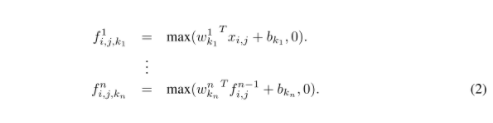
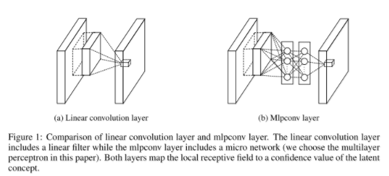
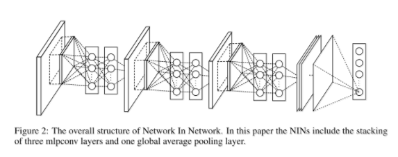

# NIN

原论文：[Network In Network](https://arxiv.org/abs/1312.4400)

对传统卷积的特征提取方式进行了改进，提供了网络改进的新思路。

论文的总结架构分为：
1. 引文（介绍CNN的发展，以及MLP应用进行特征提取）
2. 卷积神经网络（卷积层、池化层交替进行特征提取的劣势）
3. NiN整体架构以及新方法
4. 实验验证（CIFAR-10、CIFAR-100、SVHN、MNIST数据集）
5. 结论

主要思想为第三章的方法介绍，本篇文章以第3节翻译+理解为主。

## Network In Network 网中网

该章节我们主要介绍NIN结构的核心部件：3.1节为MLP卷积层，3.2节为全局平均池化层，3.3节为NIN整体架构细节。

### 3.1 MLP Convolution Layers MLP卷积层

鉴于没有关于潜在分布的先验概念，使用通用的函数逼近器来提取局部的特征成了非常可行的方案，因为它能逼近潜在知识的更抽象表示。径向基网络（Radial basis network）和多层感知机（multilayer perceptron）是众所周知的通用函数逼近器。我们的模型选择多层感知机应用的理由有以下两点。第一，多层感知机和卷积神经网络的架构是可兼容的，通常使用BP算法训练。第二，多层感知机自己也能成为一个深度模型，这符合特征重用的精神。在本论文中，这种新类型的特征提取层称之为mlpconv，用MLP来替换通用线性模型（即Conv）来对输入进行特征提取。图1显示了线性卷积层和mlpconv层的区别。mlpconv层的计算公式如下：

其中$n$代表多层感知机的层数。ReLU作为多层感知机使用的激活函数。

从跨通道（跨特征图）池的角度来看，等式(2)等效于普通卷积层上的级联跨通道参数池化。每个池化层对输入的特征图执行加权线性重组，然后通过一个整流线性单元。跨通道池化的特征图再下一层中再进行同样的操作。这种级联跨通道参数池化的结构能够获得复杂的和可学习的跨通道交互信息。

跨通道参数池化层等同于卷积层后接$1 \times 1$的卷积核。这种解释能更直观的理解NIN结构。

与maxout layers对比：maxout网络中的maxout层跨多个仿射特征图来执行最大池化。计算公式如下：
$$
f_{i,j,k} = \max_m (w_{k_m}^T x_{i,j})
$$
基于线性函数上的maxout能够形成一个分段线性函数，它能够对任何凸函数进行建模。对于凸函数，函数值低于特定阈值的样本形成凸集。因此，通过逼近局部区域的凸函数，maxout能够为样本在凸集内形成分离超平面。mlpconv层与maxout层的不同之处在于，凸函数逼近器被通用函数逼近器取代，后者在不同分布下潜在信息的建模具有更大的能力。

### 3.2 Global Average Pooling 全局平均池化

传统的卷积神经网络在网络的低层实现卷积。在分类任务中，最后卷积层的输出特征图通过向量化然后输送到全连接网络中，然后经过softmax逻辑回归层。该结构在传统神经网络分类器和卷积结构中搭建起了桥梁。它将卷积层视为特征提取器，最终结果的分类还是用传统的方式。

可是，全连接层很容易过拟合，损害整个网络的泛化能力。Dropout通过设定随机值来激活神经元来避免全连接层的过拟合。

在该论文中，我们提出了一种全局平均池化的方式来替换CNN中的传统全连接层。思想的实现在于在最后的mlpconv层为分类任务的每个对应类别生成一个特征图。与全连接层直接作用顶部特征图不同的是，我们计算每张特征图的平均值，然后将输出的向量输送到softmax层。一个好处是全局平均池化相对于全连接层能够强制实现特征图和类别之间的对应关系，使得它更适合卷积结构。至此，特征图能够被轻松的转换成类别置信度。另一个好处是，在全局平均池化层中没有要优化的参数，因此在这一层避免了过拟合。此外，全局平均池化能够汇总空间信息，因此对输入的空间平移更加鲁棒。

我们可以将全局平均池化视为一种结构正则化器，它明确地将特征图强制转换成类别的置信度图。这是通过mlpconv层实现的，因为它们比通用线性模型更接近置信度图。

### 3.3 Network In Network Structure NIN结构

NIN的整体结构就是mlpconv层的级联，在其之后就是全局平均池化层和目标损失计算层。下采样层能够添加到CNN中的mlpconv层和maxout之间。图2展示了三层mlpconv的NIN架构。在每一层mlpconv中，都含有一个三层感知机。在NIN和微型网络之间的网络层数是可变的，能够灵活的应用到其他任务中去。

# 理解点

1. MLP替换传统卷积（更换卷积核，增强表达性）
2. 全局平均池化层