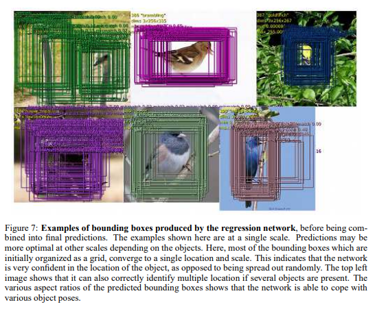

# OverFeat

原论文：[OverFeat: Integrated Recognition, Localization and Detection using Convolutional Networks](https://arxiv.org/abs/1312.6229)

ILSVR2013定位任务的冠军。用CNN集成了分类、定位、检测任务。

主要思想在于3、4、5章，分别叙述分类、定位、检测任务的思想实现。

## 3 Classification 分类任务

我们的分类模型结构和Krizhevsky等人所提出的在ILSVRC12上使用的AlexNet类似。并且，我们在网络设计和推理步骤上进行了提升。由于时间限制，Krizhevsky模型的一些训练特征就没有展开探索，希望我们的结论能为之后的发展进行启发。

### 3.1 Model Design and Training 模型设计和训练

我们的网络模型在ImageNet2012的训练集上进行训练（120万张图片，1000种类别）。我们的模型在训练期间使用和AlexNet一致的固定输入尺寸方法，在下一章节讲述如何实现用于分类的多尺度方法。每张图像下采样到256像素，然后我们提取5种随机裁剪（以及它们的水平旋转）至221x221大小，mini-batches设为128。网络权重随机初始化为$(\mu, \sigma, 1 \times 10^{-2})$。用SGD算法优化，momentum设为0.6，L2权重衰减设为$1 \times 10^{-5}$。初始学习率设为$5 \times 10^{-2}$，然后在$(30,50,60,70,80)$epoch的时候衰减0.5倍。设定随机因子为0.5的Dropout应用于分类器的全连接层（6、7层）。

我们在table 1和3种展示架构的详细资料。注意，在训练周期中，我们训练我们的架构产生的是非空间输出的（输出特征图大小为1x1），与产生空间输出的推理步骤正好相反。1-5层与AlexNet类似，使用ReLU激活函数和最大池化，但有以下几点不同：(i) 不适用对比度归一化；(ii) 池化区域是非重叠的；(iii) 将stride从2设为4，我们的模型在1、2层获得更大的特征图。大的stride有益于加快推理速度而损失精确度。

在图2中，我们展示了前两层卷积层的卷积核系数。第一层卷积核提取定向边缘、图案和斑点。在第二层中，卷积核有各种各样的模式，一些弥漫式的，其它则是强烈的线性结构或者定向边缘。

### 3.2 Feature Extractor 特征提取器

在这篇论文中，我们将该特征提取器命名为"OverFeat"，它将为计算机视觉研究提供强有力的特征表达。我们提供了两种模型，一种快速模型和一种准确模型。这两种模型在Table 1和3分别给出了。我们在表格4中展现了它们在参数量和连接总量上的不同。准确模型在准确度上比快速模型高（14.18%的分类错误率显著低于16.39%，如表格2所示），然而它需要接近两倍的连接总量。使用7个准确模型的平均值能达到13.6%的分类错误，如图4所示。

### 3.3 Multi-Scale Classification 多尺度分类

在AlexNet中，多视角投票（就是 数据增强那一套）能够增强表现力：拥有10个视角（4个角点，一个中心点，以及它们的水平翻转）的固定的数据集。可是，这种方法忽视了图像里面的许多区域，在重叠的区域计算冗余。并且，它仅仅用于一个单一尺度，这可能不是卷积神经网络响应的最佳置信度规模。

相反，我们通过在每个位置和多种视角来密集运行网络来探索整个图像。虽然滑动窗口方法对于某些模型而言可能在计算上比较复杂，但它在卷积模型中是本质上有效的（看3.5节）。这种方式能够产生多种特征的提取，增强鲁棒性的同时还保持高效。在任意大小的图像上卷积的最终结果是每个尺度的C维向量的空间图。

网络的整体下采样速率是2x3x2x3，或者说是36。至此，当密集应用时，该结构能够在输入的每一个维度每36像素产生一个分类向量。与10种视角的方案做对比，这种粗略的输出的分布会降低性能，因为网络窗口没有与图像中的目标很好的对齐。网络窗口与目标对得越齐，网络就会产生更好的置信度。为了解决这个问题，我们采用与Giusti等人相似的方法，在每一个偏移处，最后都应用一个下采样操作。这避免了该层的分辨率损失，同时用x12的总下采样速率替代了x36。

我们现在详细介绍分辨率增强的细节。我们使用6种尺度的输入产生不同的输出分辨率（详见表格5）。然后使用下列程序处理并呈给分类器。具体步骤如图3所示：
(a) 对一给定尺度的单一图像，我们首先从非池化层第5层的特征图开始；
(b) 每张非池化特征经过3x3最大池化操作（非重叠区域）时，用$\{\Delta_x, \Delta_y\}$附加偏移量$\{0,1,2\}$重复$3\times3$次。
(c) 自此产生一系列的池化特征图，对不同$\{\Delta_x, \Delta_y\}$复制$3\times3$次。
(d) (6、7、8层)的分类器含有固定输入大小$5\times5$，在每个池化特征图的每个位置产生C维输出向量。
(e) 不同偏移联合的输出特征，重塑成单一的3D输出特征图(two spatial dimensions x C classes)。

这些操作可以看作是通过池化层将分类器的视角窗口移动1个像素而不进行下采样并在下一层使用内核跨越（其中邻域不相邻）。或同等可以认为是，将最后一层池化层和每一种可能的偏移的全连接堆叠，通过交叉输出结果。

对每个图像的水平翻转版本也重复上述过程。然后通过以下几点产生最后的分类：(i) 在每种尺度和翻转中，提取每种类别的空间最大值；(ii) 平均不同尺度和翻转的最终C维结果向量；(iii) 从类别平均结果中获取top-1或者top-5结果。

从直觉而言，网络可以分为两部分：1-5层位特征提取层，6层及以后就是分类层。在特征提取部分，卷积核在整个图像中进行一次卷积。从计算角度而言，这比滑动一个固定大小特征提取器更高效，然后将不同位置的结果融合起来。然而，在分类器部分，这些原则正好相反。在这里，我们想在不同位置和尺度的第5层特征图中寻找固定大小的表示。然后分类器用于固定的5x5大小的输入，然后将其用于第5层的特征图。详细的池化机制（拥有单一像素偏移$\{\Delta_x, \Delta_y\}$）确保我们能够获得分类器和特征图中的目标表示的最佳对齐。

### 3.4 Results 结论

这部分直接看原论文图标即可

### 3.5 ConvNets and Sliding Window Efficiency 卷积网络和滑动窗口效率

与许多为每个窗口计算整个管道的滑动窗口方法不同的是，当以滑动窗口方式应用时，ConvNets本质上时高效的，因为它们自然的共享重叠区域的计算。当将我们的网络用于测试阶段的大量图像时，我们只是在整个图像的范围内应用每个卷积。这扩展了每层的输出去覆盖新的图像尺寸，特别是产生类别预测的输出特征图，包含每张输入”窗口“的空间位置。这在图5中展示出来。卷积自下而上应用，因此邻域窗口的计算只需要进行一次。

注意我们的架构的最后几层是全连接线性层。在测试阶段，这些层通过1x1大小的卷积核进行有效替换。整个卷积网络变成了一系列的卷积、最大池化和阈值操作。

## 4 Localization 定位

从我们训练好的分类网络出发，我们将分类层用回归网络替换，并且训练它去预测在每一个空间位置和尺度预测目标的边界框。然后我们将回归预测和同一位置的分类结果联合在一起，正如下所讨论的。

### 4.1 Generating Predictions 预测生成

为了生成目标的边界框预测，我们在所有位置和尺度同时训练分类和回归网络。自从它们共享相同的特征提取层后，继分类网络计算完成后，只有最终的回归预测层需要重新计算。最终softmax层的输出是每个位置的类别置信度预测值以及对应的窗口位置。自此我们能够给每个边界框分配一个置信度。

### 4.2 Regressor Training 回归器训练

回归网络将第5层的池化特征图作为输入。它含有2层全连接隐藏层，大小分别为4096，通道数量为1024。最终的输出有4个单元，分别代表回归边界框的坐标。对应的分类，包含(3x3)的类别向量输出，来自于不同的$\{\Delta_x, \Delta_y\}$。结构如图8展示的那样。

固定经过分类训练的1-5层特征提取层，然后用L2 Loss计算每个例子期望值和事实值之间的差别，训练回归网络。最终的回归器层是类别分置的，包含1000种类别，对应每一种类别。使用和第3节相同的数据集和尺度进行训练。回归器的预测值和真实边界框值在每个空间位置进行比较。可是，我们不训练边界框重叠率低于50%的区域：可以表明物体已经在位置之外了，它能够通过回归框解决而不是将它包含进来。

用多尺度的方式训练回归器对跨尺度联合预测至关重要。单一尺度上表现优秀，在其他尺度同样也会表现优秀。然而，多尺度训练将使跨尺度预测正确匹配，并以指数方式增加合并预测的置信度。归而总之，这种方式使得我们的模型只用少数尺度即可表现优秀，而不是在检测中的多种尺度。行人检测的典型尺度扩大因子大概在1.05到1.1之间，而我们这使用更大的因子1.4，这使得我们系统训练的更快。

### 4.3 Combining Predictions 联合预测

我们使用如下合并策略算法来将图7中的单个预测回归框合并。

### 4.4 Experiments 实验结论

实验结论部分可直接看原文的图表展示。

### 5 Detection 检测

检测的训练方式和分类的训练方式类似，但在空间位置上有所不同。一张图像中的多个位置能够被同时训练。当模型处于卷积时，所有位置共享权重。与定位任务最大的不同在于，当没有目标时，还有必要预测背景类别。在传统方法中，负样本随机选取用于训练。然后将最大负样本错误添加到训练集中加速收敛。独立的bootstrapping passes使得训练变得复杂，并且存在负样本收集和训练时间之间潜在的不匹配风险。并且，bootstrapping passes的大小需要微调，以确保训练不会在小数据集上过拟合。为了解决所有这些问题，我们使负样本的训练自由放飞，不管控，通过随机选取每张图片的负样本或者差异最大的。这种方法虽然耗时，但使得结构简单。并且经过分类任务预训练的特征提取器，检测的微调就要不了多久了。

接下来的一段就是展示预测结果的比较。

# 理解点

1. 将分类、定位、检测任务统一到一个CNN网络架构中。
2. 第一次提出预测对象边界框坐标来进行定位。
3. 定位、检测任务可与分类任务共享特征提取层，分类任务预训练过的特征提取层可以迁移到其他任务进行特征提取。
4. 依据$\{\Delta_x, \Delta_y\}$的不同预测结果取平均作为最终预测结果。