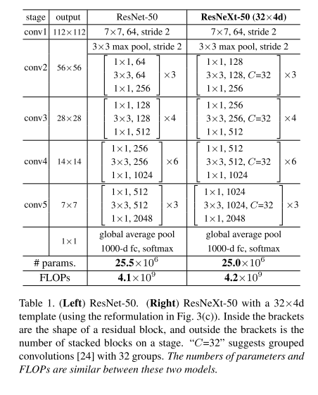
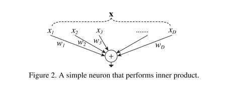
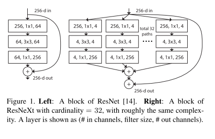
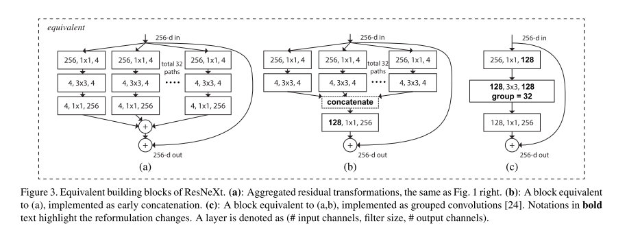
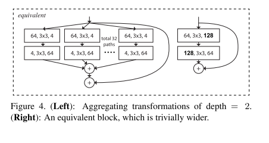

# ResNeXt

原论文：[Aggregated Residual Transformations for Deep Neural Networks](https://arxiv.org/abs/1611.05431)

利用分组卷积思想改造ResNet，ResNet和Inception的结合体。

论文结构：

1. 引文（介绍神经网络算法发展史，提出ResNeXt）
2. 相关工作（多分支卷积、分组卷积等）
3. 方法
4. 实现细节
5. 实验结果

以第3节翻译为主。

## 3 Method 

### 3.1 Template 架构

​		我们采用类似VGG/ResNets一样的高度模块化设计的网络。我们的网络由一系列residual blocks堆叠而成。这些blocks拥有相同的拓扑结构，并受制于受VGG/ResNets启发的两个简单规则：(i) 如果生成相同大小的空间图，blocks共享一样额超参数（宽度和卷积核尺寸），(ii) 每次空间图以步长2下采样时，块的通道结果数就乘以因子2。第二条规则确保计算复杂性，就FLOP而言，对于所有块大致相同。

​		基于这俩规则，我们只需要设计一个template模块，并且可以相应地确定网络中的所有模块。所以这两条规则大大缩小了设计空间，让我们能够专注于几个关键因素。由这些规则构建的网络如表1所示。

### 3.2 Revisiting Simple Neurons 重温简易神经元

​		人工神经网络忠最简单的神经元形成内积（加权和），这是由全连接层和卷积层完成的基本变换。内积可被视为聚合变换的一种形式：
$$
\sum_{i=1}^D w_ix_i \tag{1}
$$
其中$X=[x_1, x_2. \cdots, x_D]$是D通道的输入向量，$w_i$是第$i$通道的卷积核权重。这种操作（通常包括一些输出非线性）被称为“神经元”。见图2。

​		上述操作可被重铸为splitting、transforming、aggregating。(i) Splitting：向量$X$被切片为一个低维的嵌入，如上所示，变成一个单维的子空间$x_i$。(ii) Transforming：低维的表征被改变，如上所示，变成简单的尺度变换：$w_ix_i$。(iii) Aggregating：所有嵌入的转变被聚合在一起，通过$\sum_{i=1}^D$。

### 3.3 Aggregated Transformations 聚合变换

​		基于上述对于简易神经元的分析，我们考虑使用一个更通用的函数来替代元素变换($w_ix_i$)，它本身也可以是一个网络。与"Network-in-Network"增加深度维度不同的是，我们的"Network-in-Neuron"沿着一个新的维度扩展。

​		正式地，我们将聚合变换表示为：
$$
F(X) = \sum_{i=1}^C \tau_i(X) \tag{2}
$$
其中$\tau_i(X)$可被视为任意函数。类似于一个简单的神经元，$\tau_i$可将$X$投影到嵌入中，然后对其进行转换。

​		在等式(2)中，$C$是用于聚合转换的集合大小。我们将$C$称之为基数(cardinality)。在等式(2)中，$C$和等式(1)中$D$的位置类似，但是$C$和$D$不等同，能够是任意数字。虽然宽度的维度与简单转换（内积）的数量有关，但我们认为基数的维度控制更复杂转换的数量。我们通过实验表明基数是一个基本维度，并且比宽度和深度维度更有效。

​		在本文中，考虑一种简单的方式来设计转换函数：所有$\tau_i$拥有相同的拓扑结构。这扩展了VGG风格的重复相同形状层的策略，有助于隔离少数因子并扩展到任何大量转换。我们设置独立转换$\tau_i$为瓶颈型架构，如图1右所展示的。在该例子中，每个$\tau_i$的第一个$1 \times 1$层产生低维嵌入。等式(2)中的聚合转换可表现为残差方法（图1右）：
$$
y = X + \sum_{i=1}^C \tau_i(X) \tag{3}
$$
其中$y$是输出。

*Relation to Inception-ResNet.*

​		一些张量操作表明，图1右中的模块等效于图3(b)。图3(b)看起来与Inception-ResNet块相似，因为它涉及残差函数中的分支与连接。但与所有Inception或Inception-ResNet模块不同，我们在多条路径之间共享相同的拓扑。我们的模块需要最少的额外工作来设计每条路径。

*Relation to Grouped Convolutions.*

​		使用分组卷积的符号，上述模块变得更加简洁。这种重构如图3(c)所示。所有低维嵌入都可以由单个更宽的层（例如图3(c)中的$1 \times 1$，128-d）代替。Splitting本质上是由分组卷积在其输入通道分成组时完成的。图3(c)中的分组卷积层执行32组卷积，其输入和输出通道为4维。分组卷积层将它们连接起来作为该层的输出。图3(c)中的块看起来像图1（左）中的原始bottleneck residual block，除了图3(c)是一个更宽但连接稀疏的模块。

​		我们注意到，只有当block的深度大于等于3的时候，重构才会产生非平凡的拓扑结构。如果块的深度为2，则重构会导致一个宽而密集的模块，详见图4。

*Discussion*

​		我们注意到，尽管我们提出了串联(图3(b))或分组卷积(图3(c))形式的重构，但这种重构并不总是适用于方程(3)的一般形式。例如，如果转换式$\tau_i$采取任意形式并且是异质的。我们在本文中选择使用同构形式，因为它们更简单且可扩展。在这种简化的情况下，图3(c)形式的分组卷积有助于简化实现。

### 3.4 Model Capacity 模型容量

​		我们在下一节的实验表明，我们的模型在保持模型复杂性和参数数量的同时提高了准确性。这不仅在实践中很有趣，更重要的是，参数的复杂性和数量代表了模型的内在能力，因此经常作为深度网络的基本属性进行研究。

​		当我们在保持复杂性的同时评估不同的基数C时，我们希望最小化其他超参数的修改。我们选择调整bottleneck的宽度（图1(右)的4维）。这种策略没有对其他超参数进行任何改变(blocks的深度或输入输出的宽度)，有助于我们关注cardinality的影响。

​		在图1(左)，原始的ResNet bottleneck block拥有$256 \cdot 64 + 3 \cdot 3 \cdot 64 \cdot 64 + 64 \cdot 256 \approx 70k$的参数量和同等FLOPs（基于相同大小的特征图尺寸）。在bottleneck宽度为d的情况下，我们在图1(右)的架构拥有$C \cdot (256 \cdot d + 3 \cdot 3 \cdot d \cdot d + d \cdot 256)$的参数量和同等FLOPs。当$C=32,d=4$时，等式(4)约等于$70k$。表格2展示了基数C和bottleneck宽度d的联系。

​		基于我们采用了3.1节的两个准则，上述ResNet bottleneck block和我们的ResNeXt在所有stage是大致相等的。表1比较了相等容量的原始ResNet-50和ResNeXt-50。我们注意到复杂度只能近似保留，但复杂度的差异很小并且不会影响我们的结果。

# 理解点

1. Inception和ResNet的融合，通过分组卷积实现统一。

