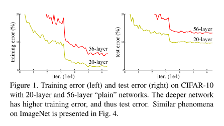
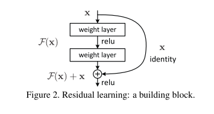
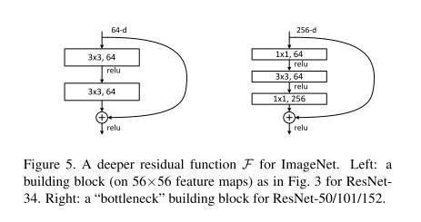
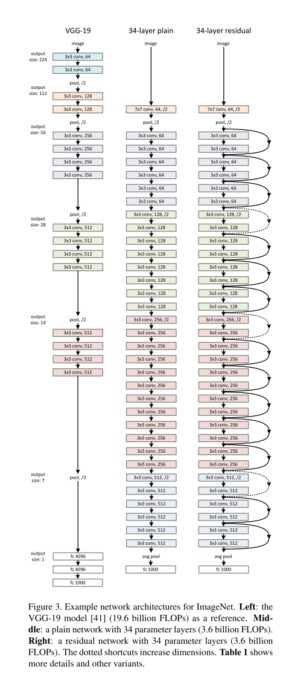

# ResNet

原论文：[Deep Residual Learning for Image Recognition](https://arxiv.org/abs/1512.03385)

ILSVRC2015冠军（分类、定位、检测）。通过残差块训练了152层网络。

解决了退化问题（plain网络随着网络加深，错误率升高）

网络加深：会出现梯度消失或梯度爆炸，这个问题可以通过正则初始化和BN来解决。

退化问题：深层网络到了一定深度，准确率趋近饱和，而且继续加深会降低准确率（degradation问题）。

> 这个问题并不是过拟合导致的（过拟合在训练集应该更好），也不是梯度消失造成的（论文检查了梯度）。

论文结构：

1. 引文（介绍深度卷积神经网络发展，通过网络加深、退化问题引出残差公式）
2. 相关工作（所用组件的发展史）
3. 深度残差网络
4. 实验结果

主要翻译第3节。

## 3 Deep Residual Learning 深度残差网络

### 3.1 Residual Learning

​		让我们假设$H(x)$作为通过堆叠层实现的要学习的隐藏映射，其中$x$定义为这些层第一层的输入。如果假设多个非线性层可以渐近逼近复杂函数，那么就相当于假设它们可以渐近逼近残差函数，即$H(x)-x$（假设输入输出为相同维度）。因此与其堆叠层来预测$H(x)$，不如让这些层来预测残差函数$F(x):= H(x)-x$。原始寒素就变成了$F(x)+x$。虽然这两种形式都应该能够逼近所需的函数（如假设的一样），但学习的难易程度可能有所不同。

​		这种重新定义学习函数的动机是关于退化问题的反直觉的现象引起的（如图1左）。正如引文中所讨论的那样，如果添加的层可以被认为是恒等映射，较深模型的训练误差不应大于其较浅模型的训练误差。退化问题表明求解器可能难以通过多个非线性层逼近恒等映射。通过残差学习公式，如果恒等映射是最优的话，求解器可以简单地将多个非线性层的权重推向0以接近恒等映射。

​		在实际例子中，恒等映射不太可能是最优操作，但我们的公式可有助于重新定义问题前提。如果最优函数更接近于恒等映射而不是零映射，则求解器应该更容易通过恒等映射找到扰动，而不是将其作为新的函数学习。我们通过实验（如图7）表明，学习到的残差函数通常具有很小的响应，这表明恒等映射提供了合理的预处理。

### 3.2 Identity Mapping by Shortcuts 通过shortcuts实现恒定映射

​		我们采用残差学习来训练每一个级联层。模块如图2所示。在本篇论文中，模块的准确定义如下：
$$
\begin{equation}
y= F(x,\{W_i\}) + x \tag{1}
\end{equation}
$$
其中$x$和$y$是该模块的输入和输出。$F(x,\{W_i\})$函数表示可学习的残差映射。对图2中所包含的两层例子，$F=W_2\sigma(W_1x)$，其中$\sigma$定义为ReLU，为了简化公式，偏差被舍去了。操作$F+x$通过shortcut connection和element-wise addition组合实现。我们采用加法后接非线性激活函数的方法（如图2）。

​		等式(1)中的shortcut connections不引入额外的参数也没有增加计算复杂度。这不仅在实践中很有吸引力，而且在我们比较普通网络和残差网络时也很重要。我们可以公平地比较同时具有相同数量的参数、深度、宽度和计算成本的普通/残差网络。

​		等式(1)中$F$和$x$的维度应当相等。如果不相等（输入输出维度不一致），我们可以通过一个线性映射$W_s$来实现维度的匹配：
$$
y=F(x,\{W_i\}) + W_s x \tag{2}
$$
我们将通过实验证明恒等映射足以解决退化问题并且是经济的，因此$W_s$仅仅用来进行维度匹配。

​		残差函数$F$是灵活的公式。本文实验中的函数$F$包含2-3层（如图5所示），当然更多层也是可行的。但如果$F$只有一层，那等式(1)就相当于一个线性层$y=W_1x + x$，在该层中我们没发现优势。

​		我们同样注意到虽然上述符号为简单起见是关于全连接层的，但它们同样适用于卷积层。$F(x,\{W_i\})$可表示为多层卷积层。在单通道上实现两个特征图的逐元素相加。

### 3.3 Network Architectures 网络结构

​		我们测试了各种各样的plain/residual网络，观察到了一致的现象。为了提供讨论的实例，我们描述了ImageNet的两个模型如下。

**Plain Network.** 我们的plain基准（图3中）受启发于VGG网络（图3左）。卷积层大多数是$3 \times 3$卷积，还遵循如下两种设计：(i)对于同样的输出特征图大小，该层中拥有相同数量的卷积核，(ii) 如果特征图尺寸变小一倍，卷积核的数量就增加一倍，以保持每层的时间复杂度。我么通过步长为2的卷积层直接执行下采样。网络的最后使用一层全局平均池化层和一个包含softmax的1000维度全连接层。层数的总量为34层（如图3中）。

​		值得注意的是，我们的模型与VGG网络相比拥有更少的卷积核和更小的复杂度（图3左）。我们的34层基准拥有36亿FLOPs，只有VGG-19的18%。

**Residual Network.** 基于上述plain网络，我们插入shortcut connections（图3右），将网络变成其对应的残差版本。公式(1)中的恒等映射在输入输出维度相同的情况下能直接使用，（图3中的实线连接方式）。当维度增加时（虚线连接方式），我们考虑两种选项：(A) shortcut仍然为恒等映射，通过添加额外的0填充维度；(B) 公式(2)中的projection shortcut方式用于匹配维度(通过$1 \times 1$卷积)。对于两种选项，当shortcuts跨越两种大小的特征图时，它们使用步长为2的卷积实现。

### 3.4 Implementation 实现

​		我们用于ImageNet的实现遵循AlexNet和VGG的实践。图像通过重整，将最短边随机采样为[256, 480]用于尺度增强。从图像或其水平翻转中随机采样$224 \times 224$裁剪，减去每像素平均值。AlexNet的标准颜色增强也被采纳。我们采用BN层，放在卷积层和激活函数层之间，如GoogLeNet v2中一样。我们采用[13]中的方法进行权重初始化，并从头训练所有普通/残差网络。我们使用SGD优化算法，mini-batch为256。学习率初始为0.1，当错误率下降遇到瓶颈时便降低10倍，总共训练$60 \times 10^4$轮次。我们使用权重衰减0.0001以及momentum设为0.9。不使用dropout。

​		在测试中，为了比较研究，我们采用标准的10-crop测试。为了得到最好的结果，我们采用VGG中的全卷积模式，在多个尺度平均分数。（图像尺寸最短边被重整为{224，256，384，480，640}）。

# 理解点

1. shortcut connection
2. residual block

