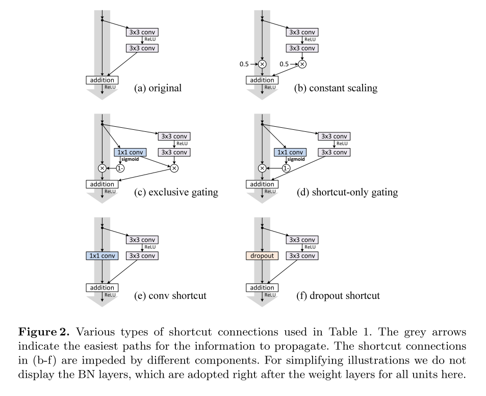
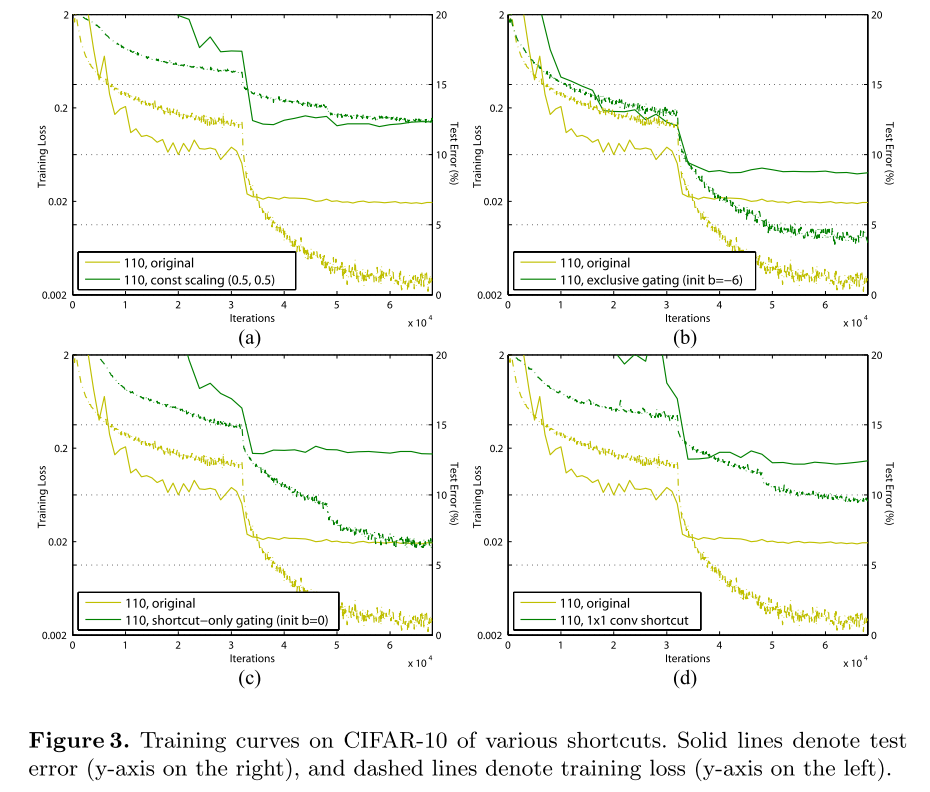
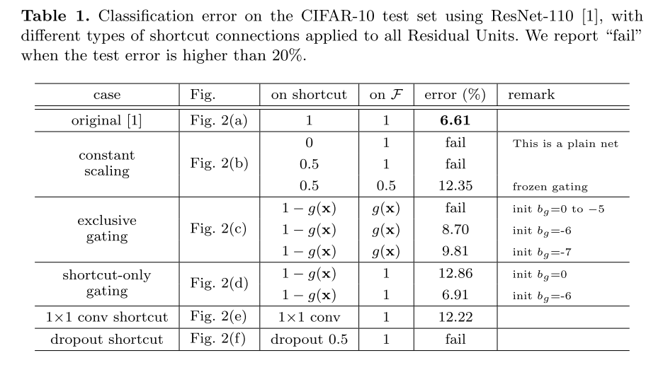
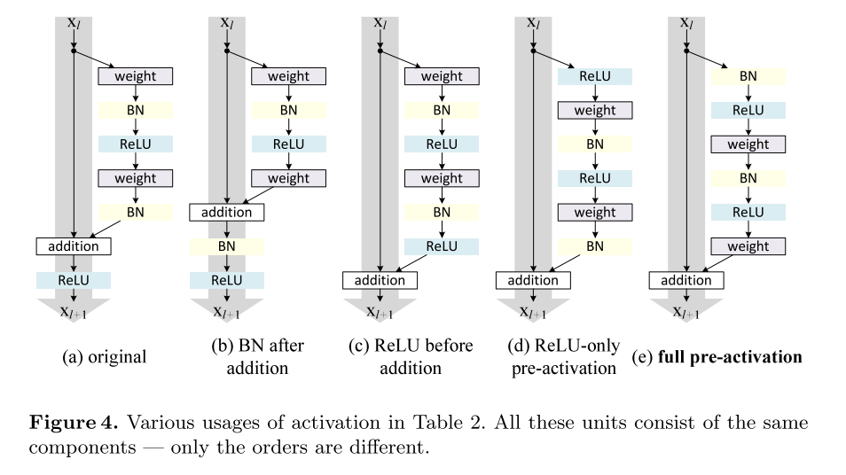

# ResNet v2

原论文：[Identity Mappings in Deep Residual Networks](https://arxiv.org/abs/1603.05027)

在ResNet v1的基础上，理论分析Residual模块及它在整体网络上的结构，并通过详细的实验来论证。

论文结构：

1. 引文（介绍ResNet v1相关）
2. Residual模块分析
3. 恒等残差连接研究
4. 激活函数研究
5. 不同数据集结果
6. 结论

主要翻译第2、3节

## 3 On the Importance of Identity Skip Connections

​		假设一个简单的式子，$h(x_l)=\lambda_l x_l$，来打破恒等映射：
$$
x_{l+1} = \lambda_l x_l + F(x_l, W_l)
$$
其中$\lambda_l$是一个可变的标量（为了简化，我们假设$f$是恒等映射的）。递归地应用这个等式，我们获得了如下式子：$x_L=(\Pi_{i=1}^{L-1} \lambda_i)x_l + \sum_{i=1}^{L-1}(\Pi_{j=i+1}^{L-1}\lambda_j)F(x_i,W_i)$，可简化为：
$$
x_l=(\Pi_{i=1}^{L-1} \lambda_i)x_l + \sum_{i=1}^{L-1}\hat{F}(x_i,W_i)
$$
其中符号$\hat{F}$讲标量吸收到残差函数中，反向传播式子如下：
$$
\frac{\partial \xi}{\partial x_l} = \frac{\partial \xi}{\partial x_L}((\Pi_{i=1}^{L-1}\lambda_i) + \frac{\partial}{\partial x_L} \hat{F}(x_i, W_i))
$$
该式子中，第一项加项由因子$\Pi_{i=1}^{L-1}\lambda_i$调制，对一个非常深的网络(L非常大)而言，如果$\lambda_i > 1$，对所有$i$而言，这个因子就会变得非常大；反之，则非常小，导致梯度消失，这会阻止来自残差连接的反向传播信号并强制它流过权重层。正如我们通过实验表明的那样，这会导致优化困难。

​		在上述分析中，原始恒等残差连接中的$x_L$被替换尺度变换的式子为$h(x_L)=\lambda_lx_l$。如果$h(x_l)$表示更为复杂的变换（比如gating和$1 \times 1$卷积），第一个因子就变成了$\Pi_{i=1}^{L-1} h_i'$，其中$h'$是$h$的偏导。这个设置也可能阻碍信息传播并妨碍训练过程，如以下实验中所见。

### 3.1 Experiments on Skip Connections

​		我们使用CIFAR-10数据集训练110层的ResNet。这个很深的的网络拥有54层两层的Residual Units（由$3 \times 3$卷积层组成）。我们的实现细节与ResNet一致。通篇论文采取在CIFAR的5次训练的中间值，减少随机变化的影响。

​		通过我们上述的分析，该节中的$f$均为ReLU，我们在下一节解决恒等$f$的问题。我们的基准ResNet-110在测试集上错误率为6.61%。变化因子的比较如下：

**Constant scaling.** 所有连接设置$\lambda=0.5$。然后研究两种情况：(i) $F$没有尺度变换(ii) $F$通过常量变换$1-\lambda=0.5$。前一种方案收敛效果不怎么好；后一种能够收敛，但测试误差比原来的高。图3(a)显示出训练误差比原来的高，表明当shortcut信号被缩小时优化有困难。

**Exclusive gating.** 与Highway Networks采用门机制类似，我们假设门函数$g(x)=\sigma(W_gx+b_g)$，其中$\sigma(x)= \frac{1}{1+e^{-x}}$。在卷积网络$g(x)$中，通过$1 \times 1$卷积层实现。门函数通过按元素相乘组合信号。

**Shortcut-only gating.** 在该方法中没有尺度变化；只有残差路径用$1-g(x)$决定是否通。如图2(d)所示。初始的偏置$b_g$对该例子仍然重要。当偏置为0时，网络收敛到不好的结果12.86%。这同样导致高的训练误差（如图3(c)）。

**$1 \times 1$ convolutional shortcut.** 接下来我们使用$1 \times 1$卷积残差连接来替换恒等映射。该选项在34层的ResNet中显示出了好的结果，显示出$1 \times 1$是有效的。但是当Residual Units更多的时候，并不是想象中的有效。110层的ResNet拥有更坏的结果12.22%（如表1所示）。同样，训练误差也变高了（图3d）。当堆叠更多Residual Units（ResNet-110包含54层），即使是最短的路径也可能会阻碍信号传播。在ImageNet上也观察到了同样的现象。

**Dropout shortcut.**  最后我们使用dropout（值设为0.5）来实现，如图2(f)所示。收敛失败。

## 4 On the Usage of Activation Functions

主要了讨论了不同的激活函数放置位置，最终得出full pre-activation是最好的。

# 理解点

详尽的实验确定Residual Block里面的组合为：BN->ReLU->weight

