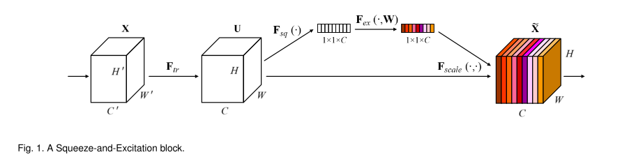

# SENet

原论文：[Squeeze-and-Excitation Networks](https://arxiv.org/abs/1709.01507)

在Inception Module基础上，引入了一种通道注意力机制。

主要翻译论文第3节。

## 3 Squeeze-And-Excitation Blocks

​		一个Squeeze-and-Excitation block是一个计算单元，可以建立在变换单元$F_{tr}$上，将输入$X \in R^{H' \times W' \times C'}$映射到特征图$U \in R^{H \times W \times C}$。在定义中我们将$F_{tr}$视为卷积操作，用$V=[v_1, v_2, \cdots, v_C]$来定义可学习的卷积核集合，其中$v_C$代表第$C$个通道。同样我们的输出可写为：$U=[u_1, u_2, \cdots , u_C]$，其中：
$$
u_C = v_C * X = \sum_{s=1}^{C'}v_c^s * x^s \tag{1}
$$
其中$*$代表卷积，$v_c = [v_c^1, v_c^2, \cdots , v_c^{C'}], X = [x^1, x^2, \cdots, x^{C'}], u_c \in R^{H \times W}$。$v_c^s$是2D空间核，对应$X$对应通道的表征。为了简化等式，偏置选项被忽略了。虽然输出通过求所有通道的总和产生，通道依赖被隐式的嵌入到$V_c$中，又与局部空间纠缠不清。卷积建模的通道关系本质上是隐含的局部的。我们希望可学习的卷积特征能够被相互依赖的通道加强，从而使得网络增强对信息特征的敏感度，有助于接下来的特征提取。因此，我们提出捕获全局信息和重新校准卷积核的方法分为两步，分别是squeeze和excitation，在它们被投到下一次变换前。SE模块的结构的图形展示如图1所示。

### 3.1 Squeeze: Global Information Embedding

​		为了解决通道依赖的问题，我们首先考虑输出特征中每个通道的信号。每个学习到的卷积核都使用局部感受野，因此转换输出U的每个单元都无法利用该区域之外的上下文信息。

​		为了缓解这个问题，我们提出压缩全局信息到一个通道的方法。者通过使用全局平均池化来产生单个通道的统计信息。正式地表示，一个统计$z \in R^C$通过将输出U的空间维度$H \times W$缩放产生，自此第$c$通道的值通过如下式产生：
$$
z_c = F_{sq(u_c)} = \frac{1}{H \times W} \sum_{i=1}^H \sum_{j=1}^W u_c(i,j) \tag{2}
$$

### 3.2 Excitation: Adaptive Recalibration

为了用好压缩操作得到的信息，随后的第二个操作我们致力于捕获逐通道的依赖。为了实现这个目标，函数必须满足两个条件：第一，它必须是灵活的；第二，它能学习非互斥的关系，从而确保允许强调多个通道。为了满足这些条件，我们采用了一个简单的门机制和一个sigmoid激活函数：
$$
s = F_{ex}(z,W) = \sigma(g(z,W)) = \sigma(W_2 \delta(W_1z)) \tag{3}
$$
其中$\delta$代表ReLU函数，$W_1 \in R^{\frac{C}{r} \times C}, W_2 \in R^{C \times \frac{C}{r}}$。为了限制模型复杂度和提高通用性，我们通过两层全连接层来实现门机制，其中包含下降系数$r$的维度缩减层、一个ReLU层、一个升维层。最终的输出通过重整$U$，使用激活函数$s$：
$$
\tilde{X}_c = F_{scale}(u_c, s_c)=s_cu_c \tag{4}
$$
其中$\tilde{X} = [\tilde{x}_1, \tilde{x}_2, \cdots, \tilde{x}_C]$，$F_{scale}(u_c,s_c)$代表标量$s_c$和特征图$u_c \in R^{H \times W}$的逐通道乘积。

# 理解点

1. SE block实现通道注意力
2. 即插即用，方便应用到其他网络

