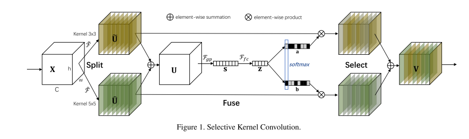
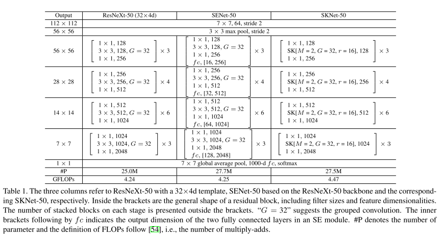

# SKNet

原论文：[Selective Kernel Network](https://arxiv.org/abs/1903.06586)

提出了一种自适应调整感受野大小的的结构块。

主要翻译第3节。

## 3 Methods

### 3.1 Selective Kernel Convolution

​		为了能让神经元适应性地调整它们的感受野大小，我们提出了一种自动选择操作，"Selective Kernel"(SK) convolution，在不同大小的卷积核里面进行多重选择。特别是，我们通过3个操作——Split、Fuse、Select来实现SK卷积，如图1所展示的那样，显示了两个分支的情况。因此在这个例子中，只有两个内核大小不同的内核，但可容易扩展到多分支情况。

**Split**

​		对于任意给定的特征图$X \in \mathbb{R}^{H' \times W' \times C'}$，默认使用两种变换方式：$\tilde{F}: X \rightarrow \tilde{U} \in \mathbb{R}^{H \times W \times C},\hat{F}: X \rightarrow \hat{U} \in \mathbb{R}^{H \times W \times C}$，分别使用3和5的内核。注意，$\tilde{F}$和$\hat{F}$均使用有效的组/深度卷积来实现，BN和ReLU函数也尾随其后。为了进一步提高效率，将具有$5 \times 5$内核的传统卷积替换为具有$3 \times 3$内核和扩张因子为2的空洞卷积。

**Fuse**

​		正如引文中所述，我们的目标是使得神经元能够根据上下文自动调整其感受野大小。基本思想是使用门来控制来自多个分支的信息流，这些分支携带不同尺度的信息进入下一层的神经元。为了实现这个目标，门需要整合来自所有分支的信息。我们首先通过元素求和融合来自多个（图1中的两个）分支的结果：
$$
U = \tilde{U} + \hat{U} \tag{1}
$$
然后我们通过使用全局平均池化来生成通道信号量$s \in \mathbb{R}^C$。特别是，$s$的第$c$个元素是通过将空间维度$H \times W$的$U$缩小来计算的：
$$
s_c = F_{gp}(U_c) = \frac{1}{H \times W} \sum_{i=1}^H \sum_{j=1}^W U_c(i,j) \tag{2}
$$
​		此外，创建一个紧凑的特征$z \in \mathbb{R}^{d \times 1}$来进行精确的和适应性选择的引导。这是通过一个简单的全连接层(fc)来实现的，降低维度以提高效率：
$$
z = F_{fc}(s) = \delta(\Beta(Ws)) \tag{3}
$$
其中$\delta$指的是ReLU函数，$\Beta$为BN函数，$W \in \mathbb{R}^{d \times C}$。为了研究$d$对模型效率的影响，我们使用一个降速比$r$来控制它的值：
$$
d = \max(C/r, L) \tag{4}
$$
其中$L$表示$d$的最小值（L=32是我们实验中的典型设置）。

**Select**

​		跨通道的soft attention用于适应自适应不同空间尺度的信息，这是由紧凑特征描述符$z$引导的。具体来说，一个softmax算子被应用到channel-wise digits：
$$
a_c = \frac{e^{A_cz}}{e^{A_cz}+e^{B_cz}}, b_c = \frac{e^{B_cz}}{e^{A_cz}+e^{B_cz}} \tag{5}
$$
其中$A,B \in \mathbb{R}^{C \times d}$，$a,b$分别定义为$\tilde{U}, \hat{U}$的soft attention vector。注意$A_c \in \mathbb{R}^{1 \times d}$指的是$A$的第$c$列，$a_c$指的是$a$的第$c$个元素，$B_c,b_c$同理。在两个分支的情况下，矩阵$B$是冗余的，因为$a_c + b_c =1$。最终的特征图$V$是通过各种内核上的注意力权重获得的：
$$
V_c = a_c \cdot \tilde{U}_c + b_c \cdot \hat{U}_c, a_c + b_c = 1 \tag{6}
$$
其中$V = [V_1, V_2, \cdots,V_C], V_c \in \mathbb{R}^{H \times W}$。请注意，这里我们为两分支情况提供了一个公式，并且可以通过扩展方程(1)(5)(6)很容易地推断出更多分支的情况。

### 3.2 Network Architecture

​		通过使用SK convolutions，整体的SKNet架构如表1所示。我们从ResNeXt开始有两个原因：1) 它具有低计算成本，广泛使用分组卷积，2) 它是最先进的网络架构之一，在对象识别方面具有高性能。与ResNeXt类似，所提出的SKNet主要由一堆重复的瓶颈块组成，称为"SK"单元。每个SK单元由$1 \times 1$卷积、SK卷积和$1 \times 1$卷积的序列组成。一般来说，ResNeXt中原始bottleneck blocks中的所有大内核卷积都被SK卷积替代，使网络能够以自适应方式选择合适的感受野大小。由于SK卷积在我们的设计中非常有效，与ResNeXt-50相比，SKNet-50仅导致参数数量增加10%，计算成本增加5%。

​		在SK单元中，由三个重要的超参数决定了SK卷积的最终设置：决定要聚合的不同内核的选择数的路径量$M$，控制每条路径的基数的组数$G$，以及控制fuse操作中参数数量的下降率$r$（见公式(4)）。在表1中，我们定义一个典型的SK卷积设置$[M,G,r]$为$[2,32,16]$。这些参数的选择和影响在4.3节中讨论。

​		表1显示了一个50层的SKNet的结构，其中有四个阶段，分别具有$\{3,4,6,3\}$SK单元。通过改变每一阶段SK单元的数量，可以获得不同的架构。在本研究中，我们对其它两种架构进行了实验，SKNet-26具有$\{2,2,2,2\}$个SK单元，SKNet-101具有$\{3,4,23,3\}$个SK单元，在各自的四个阶段。

​		请注意，所提出的SK卷积可应用于其它轻量级网络，例如MobileNet、ShuffleNet，其中广泛使用$3 \times 3$深度卷积。通过用SK卷积替换这些卷积，我们还可以在紧凑的架构中获得非常可喜的结果。（参见第4.1节）

# 理解点

1. 用通道注意力机制来实现多种卷积核的动态选择，实现自适应调整感受野大小。

