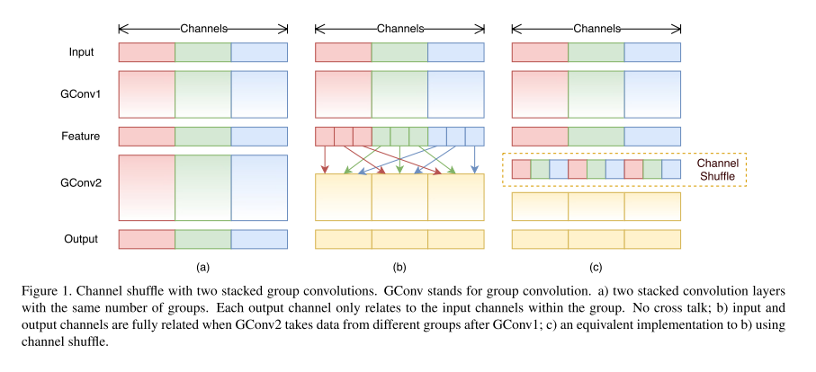
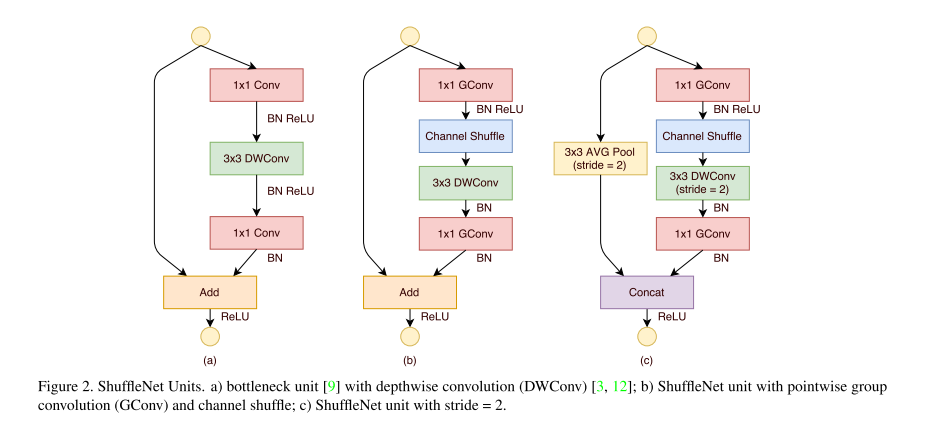
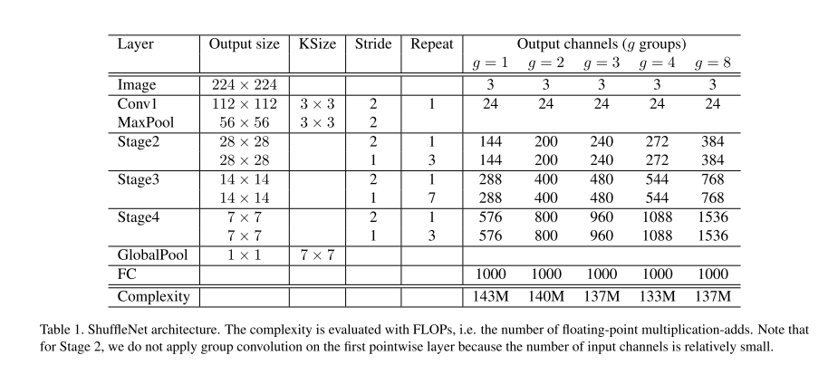

# ShuffleNet

原论文：[ShuffleNet: An Extremely Efficient Convolutional Neural Network for Mobile Devices](https://arxiv.org/abs/1707.01083)

通过逐点群卷积、通道混洗降低计算量。

论文主要以第3节翻译为主。

## 3 Approach

### 3.1 Channel Shuffle for Group Convolutions

​		现代卷积神经网络通常使用架构的模块堆叠。在它们之中，SOTA的网络中Xception以及ResNeXt通过引入有效的深度可分离卷积或组卷积到这些block中来达到表征能力和计算成本的trade-off。然而，我们注意到两种设计都没有将$1\times1$卷积（即逐点卷积）纳入统计，这需要相当大的复杂性。举个例子，在ResNeXt中只有$3 \times 3$卷积配备有组卷积。言而总之，对于ResNeXt中的每个residual unit，驻点卷积占了93.4%的计算量（cardinality=32）。在小网络中，昂贵的逐点卷积使得满足复杂性约束的通道数量有限，会降低准确度。

​		为了解决这个问题，一个直接的方法就是通道稀疏连接，例如在$1 \times 1$卷积层使用组卷积。通过确保每个卷积只对相应的输入通道组进行操作，组卷积显著降低了计算成本。然而，如果多个组卷积堆叠在一起，有一个副作用：输出通道的信息只来源于很小的输入通道。图1(a) 显示了两层级联的组卷积层的情况。它清楚的显示出组卷积的输出只与卷积的组有关。该属性会阻碍通道组之间的信息流动并削弱表征。

​		如果我们允许组卷积能够获得不同组的输入数据（如图1(b)），输入和输出通道能够完全相关。特别是，对于前组卷积层产生的特征图，我们可以将每个小组的通道分成几个子小组，然后在下一层形成不同的子小组。这可以通过channel shuffle操作来有效地实现（如图1(c)）：假设一个卷积层由$g$个组，它的输出有$g \times n$个通道；我们首先将输出通道维数重整成$(g,n)$，转置然后将其展平作为下一层的输入。值得注意的是，即使两个卷积的组数不同，该操作仍然有效。此外，channel shuffle也是可微的操作，这意味着它可以嵌入到网络结构中进行端到端的训练。

​		channel shuffle操作赋予了多重组卷积层有力的结构。在下一个小节我们介绍拥有channel shuffle和组卷积的有效网络。

### 3.2 ShuffleNet Unit

​		受益于通道混洗操作，我们提出一种新的专为小网络设计的ShuffleNet。刚开始设计成图2(a)的形式。它是一个residual block。在它的residual分支，对于$3 \times 3$层，我们在bottleneck特征图上应用了经济的$3 \times 3$深度卷积。然后，我们用逐点组卷积替换第一个$1 \times 1$卷积层，然后进行通道混洗操作，形成一个ShuffleNet单元，如图2(b)所示。第二个逐点组卷积的目的是恢复通道维度以匹配残差路径。为简单起见，我们没有在第二个逐点层之后应用额外的通道混洗操作，因为它会产生可比的分数。批量归一化(BN)和非线性的使用，我们在深度卷积后不使用ReLU。对于ShuffleNet与stride一起应用的情况，我们简单地做了两个修改(见图2(c))：(i) 在残差路径上添加了一个$3 \times 3$的平均池化；(ii) 用通道级联代替逐元素加法，这使得在增加通道维度地同时几乎没有额外的计算成本。

​		在带通道混洗的逐点组卷积的辅助下，ShuffleNet的所有组件都可以高效地计算。与ResNet和ResNeXt相比，在相同的设置下，我们的结构具有较低的复杂性。举个例子，给定输入大小为$c \times h \times w$，bottleneck的通道为$m$，ResNet单元需要$hw(2cm+9m^2)$的FLOPs，ResNeXt需要$hw(2cm+9m^2/g)$的FLOPs，然而我们的ShuffleNet单元只需要$hw(2cm/g+9m)$的FLOPs，其中$g$代表组卷积总数。换句话说，在给定计算预算下，ShuffleNet可以使用更广泛的特征图。我们发现这对于小型网络至关重要，因为小型网络通常没有足够数量的通道来处理信息。

​		另外，在ShuffleNet中深度卷积仅在bottlenck特征图上执行。尽管深度卷积通常具有非常低的理论复杂度，但我们发现它难以在低功耗移动设备上有效实现，这可能是由于与其他密集操作相比更差的计算/内存访问率。在ShuffleNet单元中，我们有意仅在bottleneck上使用深度卷积，以尽可能地防止开销。

### 3.3 Network Architecture

​		基于ShuffleNet单元建立，表1展示了ShuffleNet的整体架构。所提的网络主要由一堆ShuffleNet单元组成，分为三个阶段。每个stage的第一个block应用的stride=2。相同stage的其他超参数保持相同，对于下一个stage，输出通道数量就加倍。与ResNet相似，我们将bottleneck通道的数量设置为每个ShuffleNet输出通道的1/4单元。我们的目的是提供尽可能简单的参考设计，尽管我们发现进一步的超参数调整可能会产生更好的结果。

​		在ShuffleNet单元中，组数量$g$控制着逐点卷积的稀疏连接程度。表1实验了不同组数量的实验结果，并且我们调整了输出通道从而保证总体计算成本大致不变（~140MFLOP）。显然，对于给定的复杂性约束，更大的组数会导致更多的输出通道（因此更多的卷积滤波器），这有助于编码更多的信息，尽管由于相应的输入通道有限，这也可能导致单个卷积滤波器的性能下降。

​		为了将网络定制为所需的复杂度，我们可以简单地对通道数应用比例因子s。例如，我们将表1中地网络表示为"ShuffleNet 1$\times$"，那么"ShuffleNet s$\times$"意味着将ShuffleNet 1x中地过滤器数量缩放s倍，因此整体复杂度将大约是ShuffleNet 1x的s2倍。

# 理解点

1. 逐点群卷积(pointwise group convolution)
2. 通道混洗(channel shuffle)

