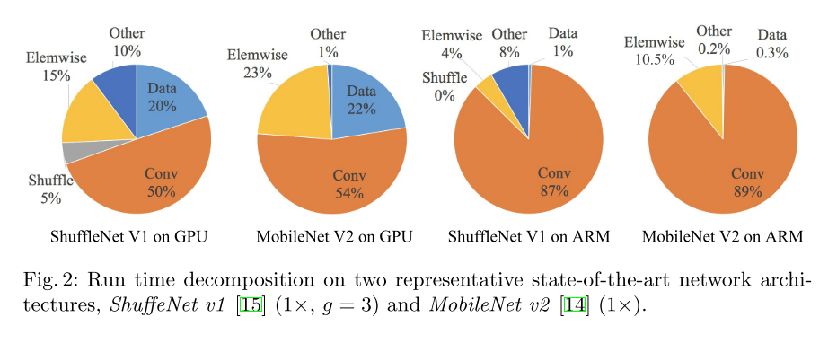
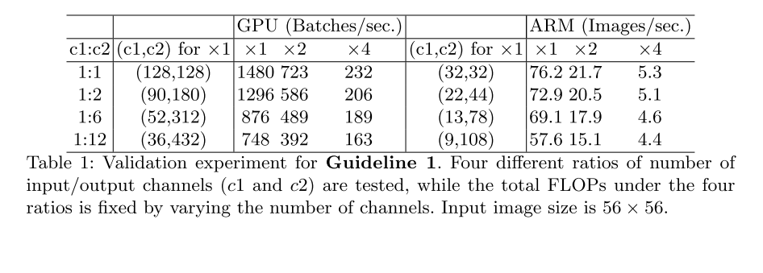
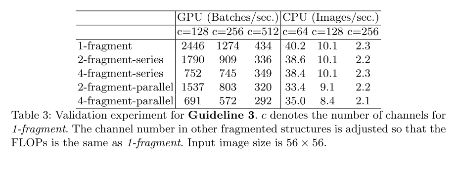
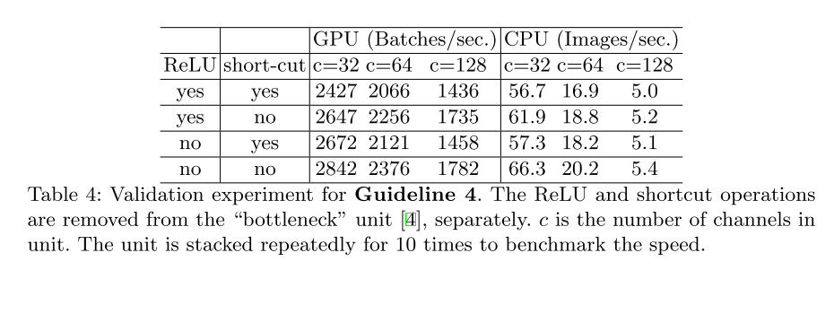
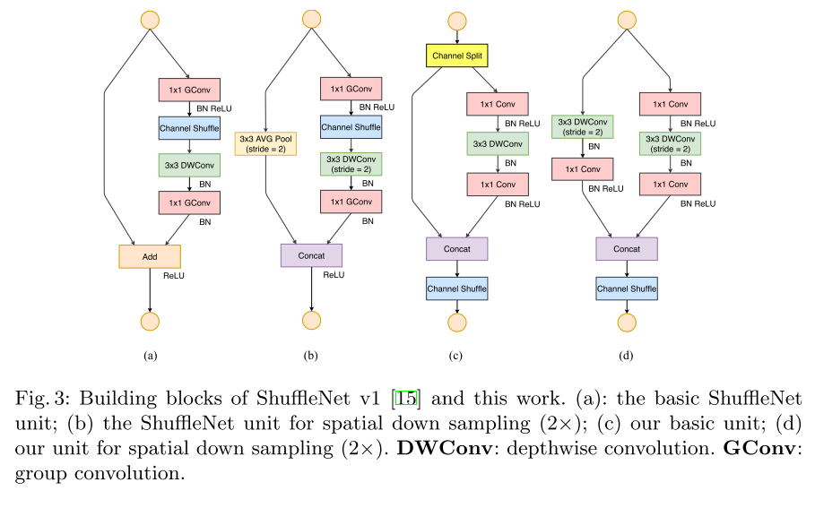

# ShuffleNet v2

原论文：[ShuffleNet V2: Practical Guidelines for Efficient CNN Architecture Design](https://arxiv.org/abs/1807.11164)

对ShuffleNet v1进行针对性的优化。

论文结构：

1. 引文（CNN发展现状）
2. 网络设计的实践标准
3. ShuffleNet v2的整体设计
4. 实验结果
5. 结论

主要翻译第2、3节

## 2 Practical Guidelines for Efficient Network Design

​		我们的研究是在两个广泛采用的硬件上进行的，并具有行业级的CNN库优化。值得注意的是我们的CNN库比现有的开源库都高效。因此，我们确保我们的观察和结果是可靠的，并且对工业实践具有重要的意义。

— GPU。一张NVIDIA GeForce GTX 1080Ti。使用卷积库版本为CUDNN 7.0。我们还激活了CUDNN的基准测试功能，分别为不同的卷积选择最快的算法。

— ARM。一张Qualcomm Snapdragon 810。使用高度优化的基于Neon的实现。单个线程用于评估。

​		其它的设定包括：全优化设置选项（例如：张量融合，用于减少小操作的开销）。输入图像大小为$224 \times 224$。每个网络随机初始化并且评估100次。选取平均运行时间作结果。

​		在开始我们的研究前，我们分析了现有的两个SOTA网络：ShuffleNet v1和MobileNet v2。它们都是在ImageNet分类任务上高效且准确的网络结构。并且它们都是在低端终端设备比如移动终端上广泛使用的网络。虽然我们只分析了这俩网络，我们注意到它们是当前的代表趋势。它们的核心是组卷积和深度卷积，也是其它SOTA网络的核心部件，比如ResNeXt、Xception、MobileNet、CondenseNet等。

​		整体的运行时间对不同的操作进行分解，就如图2所展示的。我们注意到FLOPs指标只涉及卷积部分。虽然卷积部分耗时很多，但其它部分，比如数据I/O、数据混洗和逐元素操作等占据了大量的时间。因此，FLOPs对实际运行时间的估计不够准确。

​		基于这些发现，我们从几个不同的方面对运行时进行了详细分析，并得出了一些有效的网络架构设计的实用指南。

### G1) Equal channel width minimizes memory access cost(MAC)

​		现代网络通常采用深度可分离卷积，其中逐点卷积($1 \times 1$卷积)占据了大量的复杂度。我们研究了$1 \times 1$卷积的形状。它的形状主要由两部分组成：输入通道数量$c_1$和输出通道数量$c_2$。$h$和$w$代表特征图的空间尺寸，从而$1 \times 1$卷积的FLOPs为$B=hwc_1c_2$。

​		为了简化，我们假设计算设备中的缓存足够大，能够存储整个特征图和参数。那么，MAC或称之为内存访问操作数量为$MAC=hw(c_1+c_2)+c_1c_2$。请注意，这两个术语分别对应于输入/输出特征图和内核权重的内存访问。

​		从均值不等式，我们有
$$
MAC \ge 2 \sqrt{hwB} + \frac{B}{hw} \tag{1}
$$
​		因此，MAC有一个由FLOP给出的下限。当输入和输出通道的数量相等时达到最低点。

​		结论是理论层面的。在实践中，许多设备的缓存是不够大的。同样，现代计算库通常采用复杂的阻塞策略来充分利用缓存机制。因此，真实的MAC可能会偏离理论值。为验证上述结论，进行如下实验。一个基准网络是通过重复堆叠10个构建块来构建的。每个block包括两层卷积层。第一个包含$c_1$输入通道和$c_2$输出通道，第二个则反过来。

​		表1展示了在固定时改变c1:c2比率的运行速度的总FLOP。很清晰的是c1:c2为1:1时，MAC变得更小，网络速度更快。

### G2) Excessive group convolution increases MAC

​		组卷积是现代网络结构的核心。它通过将所有通道之间的密集卷积更改为稀疏（仅在通道组内）来降低计算复杂度(FLOP)。一方面，它允许在给定固定FLOP的情况下使用更多通道并增加网络容量（从而提高准确性）。然而，另一方面，通道数量的增加导致更多的MAC。

​		正式地，遵循G1和等式1中的符号，对于$1\times1$组卷积而言，MAC和FLOPs之间的关系为：
$$
MAC &= hw(c_1 + c_2) + \frac{c_1c_2}{g} \\
 &=hwc_1+\frac{Bg}{c_1} + \frac{B}{hw} \tag{2}
$$
其中$g$指的是组的数量，FLOPs总数是：$B=hwc_1c_2/g$。显而易见的是，给定固定输入尺寸$c_1 \times h \times w$和计算成本$B$，MAC增长了$g$倍。

​		为了在实践中研究这种影响，通过堆叠10个逐点组卷积层来构建基准网络。表2展示了在固定总FLOPs的情况下，使用不同组数量运行速度。很明显，使用大组数会显著降低运行速度。例如，在GPU上使用8个组比使用1个组（标准密集卷积）慢两倍以上，在ARM上最多慢30%。这很大可能是由于MAC的增长。我们注意到我们的实现已经过特别优化，并且比逐组计算卷积要快得多。

​		因此，我们建议组数量应该基于目标平台和任务进行慎重选择。使用大数组是不明智地，因为这可以使用更多的通道，因为准确度的提高的好处很容易被快速增加的计算成本所抵消。

### G3) Network fragmentation reduces degree of parallelism

​		在GoogLeNet系列和自动生成架构系列中，每个网络块都广泛采用"multi-path"结构。使用了很多小算子（这里称为"fragmented operators"），而不是大算子。例如，在NASNET-A中，fragmented operators的数量（即一个构建块中的单个卷积或池化操作的数量）为13。相比之下，在像ResNet这样的常规结构中，这个数量为2或3。

​		虽然这种碎片化的结构已被证明有利于准确性，但它可能会降低效率，因为它对GPU等具有强大并行计算能力的设备不友好。它还引入了额外的开销，例如内核启动和同步。

​		为了量化网络碎片如何影响效率，我们评估了一系列具有不同碎片程度的网络块。特别是，每个构建块由1-4个$1\times1$卷积组成，线性或并行排列。块结构在附录中展示。每个块重复堆叠10次。表3的结果表明，碎片化显著降低了GPU上的速度，4-fragment结构比1-fragment结构慢3倍。在ARM上，速度慢得相对较小。

### G4) Element-wise operations are non-negligible

​		如图2所展示的那样，在轻量级模型中，逐元素操作占用大量时间，特别是在GPU上。这里，逐元素运算符包括ReLU、AddTensor、AddBias等。它们的FLOP较小，但MAC相对较重。特别地，我们还将深度卷积视为元素级算子，因为它也具有高MAC/FLOPs比率。

​		为了验证，我们在ResNet中的这些"bottleneck"单元中实验了一下（$1 \times 1$卷积后接$3 \times 3$卷积和$1 \times 1$卷积，还有ReLU和残差连接）。ReLU和残差连接分别去除。不同变种的运行时间在表4中展示。我们观察到，在移除ReLU和残差连接后，GPU和ARM都获得了大约20%的加速。

### Conclusion and Discussions

​		基于上述指导方针和经验性研究，我们得出一个有效的网络架构应当是1) 使用"balanced"卷积(相同通道宽度)；2) 注意使用组卷积的成本；3) 降低碎片化程度；4) 减少逐元素操作。这些理想的特性取决于超出理论FLOP的平台特性（例如内存操作和代码优化）。在实际的网络设计中应该考虑到它们。轻量级神经网络架构的最新进展主要基于FLOP的度量，并且不考虑上述这些属性。举个例子，ShuffleNet v1严重依赖于组卷积（违背G2）和bottleneck-like building blocks（违背G1）。MobileNet v2使用inverted bottleneck结构，违背了G1。它在"thick"特征图上使用深度卷积和ReLU，这违背了G4。自动生成结构式高度碎片化的，违背了G3。

## 3 ShuffleNet V2: an Efficient Architecture

# 理解点

1. 更加高效的CNN网络结构设计准则

