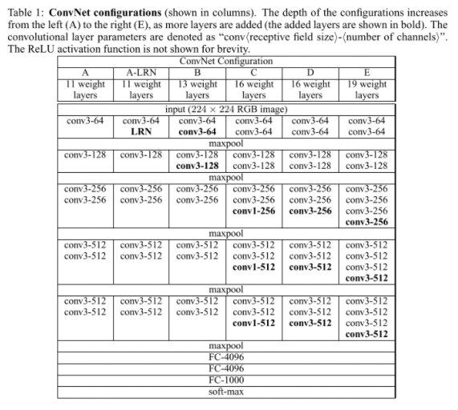
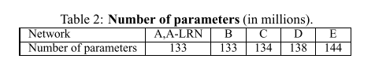

# VGG

原论文：[Very Deep Convolutional Networks For Large-Scale Image Recognition](https://arxiv.org/abs/1409.1556)

ILSVRC2014定位任务冠军，分类任务亚军。

主要思想：探索深度对性能的影响（消融实验），反复堆叠$3\times3$卷积。

论文架构：
1. 引文（介绍CNN发展及论文组织结构）
2. 模型结构
3. 网络训练和评估结构
4. 分类实验
5. 结论

主要翻译2、3节，理解VGG主体思想。

## 2 ConvNet Configurations 卷积网络设置

为了基于公平的准则来衡量卷积网络深度对结构性能的影响，我们的网络结构中所有的卷积层设置和AlexNet使用同样的原则。在该章节中，首先在2.1节中讨论我们卷积网络的通用布置，2.2节中展示评估网络的具体设置细节，2.3节讨论我们的网络结构选择与之前的对比。

### 2.1 Architecture 结构

在训练阶段，我们的卷积网络输入大小为固定的$224 \times 224$的RGB图像。唯一的预处理就是对训练集上的每个像素的RGB值取平均。图像经过堆叠的卷积层进行处理，其中感受野大小均为$3 \times 3$，这种大小的感受野刚好能够捕捉左右、上下、中间点的信息。在我们的设置中同样使用了$1 \times 1$卷积核，这可被视为输入通道的线性转换（后接非线性转换器）。卷积步长固定为1；卷积层的输入填充是为了卷积后分辨率保持不变，对$3 \times 3$卷积层而言填充设置为1像素。空间池化由五个最大池化层组成，接在一些卷积层后面（不是所有卷积层后面都接着最大池化层）。最大池化层设置为$2 \times 2$的像素窗口，步长为2。

卷积层的级联（在不同的结构中具有不同的深度）后面接着三层全连接层（FC层）：前两层各拥有4096通道，第三层包含1000通道（即ILSVRC的不同类别）。最后一层为softmax层。全连接层的设置在所有网络中设置相同。

所有的隐藏层都包含ReLU非线性激活函数。我们的网络中不包含LRN算法。在第4节中我们会介绍LRN算法没有提高网络在ILSVRC数据集上的表现力，还增加了内存占用和计算时间。如果网络结构中使用的话，就是使用AlexNet中LRN层的参数。

### 2.2 Configurations 设置

该篇论文中卷积网络的设置在表格1中展示出来。在接下来的环节中我们将使用它们的代词(A-E)。所有通用的设置在2.1节中叙述完，唯一的不同点就在于网络的深度：从A中的11层（8层卷积+3层全连接层）到E中的19层（16层卷积+3层全连接层）。卷积层的宽度（即通道数）是相对小的，从第一层的64，每经过一层最大池化层就扩大2倍，直到达到512。

在表格2中，展示了每种设置的参数总量。得益于网络深度的提升，参数总量也顺势提升。

### 2.3 Discussion 讨论

我们的卷积网络设置与ILSVRC-2012（AlexNet）和ILSVRC-2013（ZFNet）数据集的SOTA结果有所不同。与它们第一层使用大的感受野不同的是，我们整个网络中使用的都是$3 \times 3$的感受野，步长为1。显而易见的是两层级联$3 \times 3$卷积拥有$5 \times 5$的感受野；三层级联$3 \times 3$拥有$7 \times 7$的有效感受野。如果我们使用三层级联$3 \times 3$卷积替换$7 \times 7$卷积能够有什么好处？第一，用三层非线性整流层替换简单的一层，使得决策函数更具判别性。第二，降低了参数使用量：假设我们的输入输出都是$C$通道数，级联的参数量为$3(3^2C^2)=27C^2$，同时，单一的$7 \times 7$卷积的参数量为$7^2C^2=49C^2$。

表1中网络C的$1 \times 1$卷积的集成是在不影响卷积层感受野的情况下增强决策函数的非线性能力。尽管在我们的例子中$1\times 1$卷积本质上是在相同维度空间上的线性投影（输入和输出通道的数量相同），但ReLU激活函数引入了额外的非线性能力。值得注意的是，NIN网络架构中也使用了$1\times1$卷积。

## 3 Classification Framework 分类架构

在前面章节中，我们展示了网络结构的设置，在该章节中，我们叙述分类卷积网络的训练和测试细节。

### 3.1 Training 训练

卷积网络的训练程序大致跟AlexNet一样（除了输入训练图像的随机裁剪，过后解释）。训练优化器采用小批次梯度下降法（基于BP算法）。batch size设为256，momentum设为0.9。训练通过权重衰减进行正则化（L2惩罚系数设为$5 \times 10^{-4}$），最后两层全连接层的dropout系数设为0.5。初始学习率设为0.01，当验证集准确率不再提升的时候就降10倍。总计学习率降了3次，学习轮次停在了370K迭代次数（74 epochs）。我们推测，尽管我们的网络与AlexNet相比具有更多的参数和更大的深度，但由于(a) 更大深度和更小的卷积增强的正则化特性 (b) 某些确定层的预初始化 使得网络需要更少的epochs来收敛。

网络权重初始化是非常重要的，坏的初始化会使得深度网络的梯度的不稳定导致无法学习。为了解决这个问题，我们首先在网络A中使用随机初始化进行训练。然后到训练更深的结构时，我们将第一层卷积层和最后三层全连接层的参数用网络A中的参数初始化（中间层的参数随机初始化）。我们不下降预初始化层的学习率，允许它们在训练中改变。对于随机初始化，满足均值为0方差为0.01的正态分布。偏置初始化为0。

为了获得固定$224 \times 224$大小的输入图像，从大型训练集中随机裁剪（每SGD迭代一次，每张图像裁剪一次）。为了近一步扩大训练集，数据还经历了随即水平翻转和随机RGB颜色偏移。下面解释了训练图像重新缩放。

Training image size. 设S时各向同性重新缩放的训练图像的最小边，从中裁剪ConvNet的输入（我们也将S称为训练尺度）。虽然裁剪尺寸固定为$224\times224$，但原则上S可设为任何不小于224的值：S设为224，裁剪能够捕获整张图象的统计数据，完全跨越训练图像的最小边；设为大于224时，裁剪将对应图像的一小部分，包含一个小对象或一个对象部分。

我们考虑两种方法来设置训练尺度S。第一种是固定S，对应于单尺度训练。在我们的实验中，我们模型在两种固定尺寸上训练：$S=256, S=384$。给定卷积网络设置，首先使用$S=256$进行训练。为了加速$S=384$的训练，用$S=256$预训练好的参数初始化网络，然后使用小的初始学习率0.001。

第二种方法是多尺度训练。将每张训练图像分别随机上采样到尺寸范围$[S_{min}, S_{max}]$，其中$S_{min}=256$以及$S_{max}=512$。由于图像中的对象可能具有不同的大小，因此在训练中考虑到这一点是非常有益的。这可以看作是通过尺度抖动增强数据集，从多尺度训练单一模型去识别目标。为了速度上的考虑，我们通过将单一尺度上预训练好的模型参数迁移到多尺度模型中去。

### 3.2 Testing 测试

测试的相关介绍，可直接参考原文。

### 3.3 Implementation Details 实现细节

使用C++ Caffe toolbox实现。在单一系统下实现多GPU运行，同时在多种尺度的完整大小图像下训练和评估。多GPU训练方式实现了数据并行机制，通过将同一batch的训练图像等分到几个GPU中去，然后同时训练。当GPU的批次梯度训练好后，将所有GPU的梯度取平均。梯度计算在所有GPUs同步，所以最终结果与单张GPU训练等同。

最近加速卷积网络训练的先进方法提出，具体为为网络的不同层采用模型和数据并行机制。我们发现我们简单的数据并行机制能够在4-GPU上加速3.75倍，与单GPU做对比。GPU使用NVIDIA Titan Black GPUs，训练一个网络大致需要2-3周。

# 理解点

1. 堆叠$3 \times 3$卷积的优势
2. 网络深度对卷积网络效果的提升
3. 预训练低层模型参数为深层模型参数初始化赋值。
4. 多GPU运行（数据并行机制）