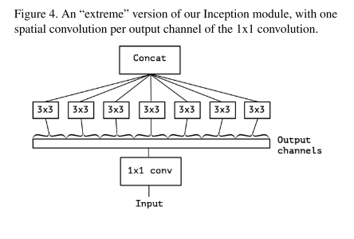
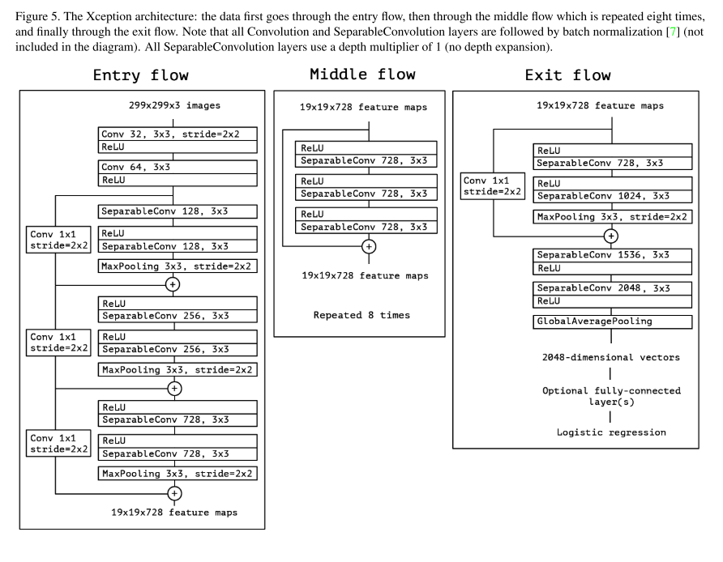
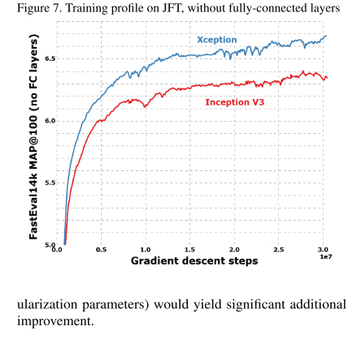
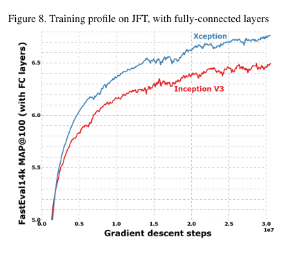

# Xception

原论文：[Xception: Deep Learning with Depthwise Separable Convolutions](https://arxiv.org/abs/1610.02357)

从Inception的角度出发，探讨了Inception和深度可分离卷积的关系，从一个全新的角度解释了深度可分离卷积。结合ResNet，提出Xception。

论文主要思想在原文第3节。

## 3 The Xception architecture

​		我们提出一种完全基于深度可分类卷积层的卷积神经网络架构。实际上，我们做出如下假设：卷积神经网络特征图中的跨通道相关性和空间相关性的映射可以完全解耦。因为这个假设是基于Inception架构假设的更强版本，所以我们将提出的架构命名为Xception，它代表"Extreme Inception"。

​		网络设置的完整描述如图5所示。Xception架构有36个卷积层，构成了网络的特征提取基础。在我们的实验评估中，我们专门研究图像分类，因此我们的架构后面跟着逻辑回归层。一个可选项是可在逻辑回归层之前插入全连接层，这在实验评估部分进行了探讨（特别参见图7和图8）。36个卷积层被构造成14个模块，除了第一个和最后一个模块外，所有模块周围都有线性残差连接。

​		简而言之，Xception架构是具有残差连接的深度可分离卷积层的线性堆栈。这使得架构非常容易定义和修改；使用高级库（例如Keras或Tensorflow）只需要30到40行代码，与VGG-16等架构没有什么不同，也不像Inception V2或V3定义那么复杂的架构。在MIT许可下，使用Keras和Tensorflow的Xception的开源实现作为Keras应用程序模块的一部分提供。

# 理解点

1. Xception和深度可分离卷积的关系。
2. Inception和深度可分离卷积的关系（全新角度解释）。

