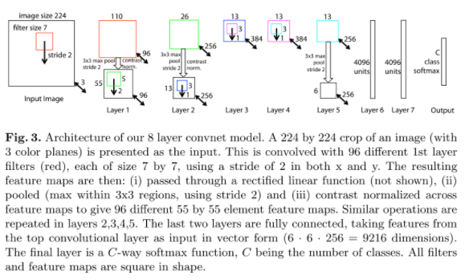
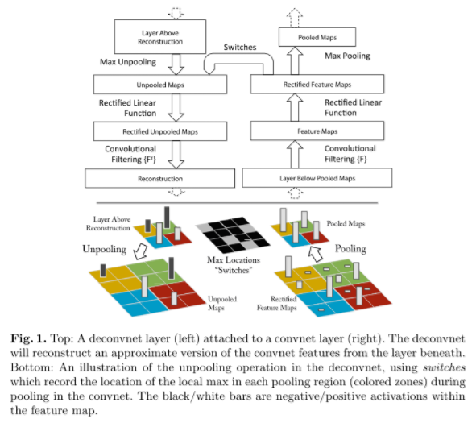

# ZFNet

原论文：[Visualizing and Understanding Convolutional Networks](https://arxiv.org/abs/1311.2901)

ILSVRC 2013冠军。

主要解决问题：卷积特征图的可视化

这篇主要以2、3章翻译为主（方法、训练细节）

# Abstract 摘要

Krizhevsky等人已经在ImageNet上验证了大型卷积网络模型的优良分类性能。可是，目前为止还没有对应的理论去理解它们为什么表现这么好以及为什么能提点。在这篇论文中，我们研究了这两个问题。我们引入一种新的可视化技术，能够可视化模型的中间特征层以及分类器的操作。这种可视化技术可以用来解释为什么Krizhevsky等人在ImageNet上分类的模型为什么效果那么好。我们同样做了消融实验来验证模型不同层的作用。我们将在ImageNet上的模型泛化到其他数据集上：重新训练softmax分类器后，它能在Caltech-101和Caltech-256数据集上表现SOTA。

# 2 Approach 方法

整篇论文中，我们使用的是LeCun等人（LeNet）和Krizhevsky等人（AlexNet）所定义的标准完整自监督卷积模型。这些模型通过将2D的图像输入$x_i$，通过一系列中间层后，映射到C个类别的结果向量$\hat{y_i}$。每一层包含(i)来自上一层的结果输出以及可学习的卷积核集合；(ii) 用整流线性函数$(relu(x)=\max{(x,0)})$作为激活函数；(iii)[可选]局部邻域的最大池化；(iv)[可选]对特征图的局部响应归一化。对于更多细节的展示就要参考AlexNet原文了。图3展示了我们所使用的结构。

我们使用大型数据集来训练我们的模型，该数据集总共包含N张标签数据${x,y}$，其中$y_i$表示真实类别的离散值。适用于图像分类的交叉熵损失函数用于比较$\hat{y_i}$和$y_i$。网络的参数通过随机梯度下降算法和BP算法传递训练。训练细节在第3节展示。

## 2.1 Visualization with a Deconvnet 反卷积可视化

理解卷积的操作需要中间层特征图的可解释性。我们推出一种新的方法，将这些中间层结果反卷积成输入像素空间进行展示，从而展示出特征图所包含的激活模式。我们通过使用Zeiler等人提出的反卷积网络来实现这种映射。反卷积可被视为正常卷积模块（卷积、池化）的逆过程，将映射特征的过程反过来。在Zeiler等人的论文中，反卷积可被视为非监督学习的有效方式。但在我们这里，它们不具备自我学习的能力，只是作为对已经训练好的卷积网络的扩展。

如图1顶部所示，为了理解一个卷积网络，反卷积网络在每一层中都有应用，提供一种映射回输入图像空间的路径。刚开始，输入图像像正常卷积那样计算特征。为了理解每个卷积的激活效果，我们设置当前层的其他激活为0，然后将这些特征图作为输入应用到对应的反卷积层。接下来我们就使用(i)unpool (ii)rectify (iii)filter 来重建展示当前层的激活效果。

Unpooling: 在卷积网络中，最大池化方法是不可逆的。然而我们可通一组开关变量来记录每个池化区域中的最大值的位置来获得近似的逆。在反卷积中，反池化操作使用这些开关变量来重组当前层的值到对应的位置中去，避免结构的改变。如图1底部所展示的过程。

Rectification: 卷积使用relu非线性激活函数，能够整流特征图确保特征图总是正值的。为了确保每一层的特征重建的有效性（也是要确保为正值），我们同样经过一个relu非线性激活函数。

Filtering: 卷积网络使用可训练的卷积核来卷积上一层的输出获得特征图。为了有效的逆反这个过程，反卷积使用同样卷积核的转置版本（就像其他自编码器模型，比如RBMs），但把它应用到整流映射，而不是像之前一样针对输出。在实际使用，这意味着每个卷积核都要垂直方向和水平方向旋转一波。

请注意，我们不适用任何对比归一化操作来重建路径。从更高层通过开关变量使得卷积的最大池化向上还原。由于这些开关变量是输入图像特有的，因此从单个激活的重建类似于原始输入图像的一小部分，其结构根据它们对特征激活的贡献进行加权。由于模型的训练是有区别的，这暗含着输入图像哪些部分是有区别的。请注意，这些预测因为不涉及生成过程，所以不是来自于模型的样本。整个生成过程类似于一张特征图的BP过程（与传统的梯度不同）。

# 3 Training Details 训练细节

图3展示了使用的网络模型的整体架构，与Krizhevsky所提出的类似（AlexNet），用于ImageNet的图像分类。一个不同点在于AlexNet中3,4,5层是稀疏连接（2GPU运算），而我们是使用密集连接。另外一个不同点在于1、2层的设置不同，详见原文4.1节。

模型训练使用ImageNet 2012训练集（130万张图像，1000种类别）。和AlexNet的预处理一致，每张RGB图像预处理为256维大小的图像，然后将256x256图像按中心和4个角点采样224x224大小的图像，再进行水平翻转。使用SGD优化算法，mini-batch size设为128，学习率为0.01，其中momentum设为0.9。当验证错误稳定时，我们手动降低学习率。Dropout在6、7层使用，随机值设为0.5。所有权重初始化为0.01，偏置初始化为0。

训练期间第一层卷积的可视化表明，第一层的卷积重要性很强。为了解决这个问题，我们将RMS值超过0.1固定半径的卷积层中的每个卷积核重新归一化到这个固定尺寸。这一点对第一层至关重要，输入图像范围大致在[-128, 128]。和AlexNet一致，我们使用多次剪切和翻转每张训练样本来进行数据增强。训练周期为70 epochs，单张GTX580训练耗时大概12天，其它具体实现和AlexNet一致。

# 理解点

1. 反卷积操作实现对中间层的可视化
2. 针对可视化结果对网络结构进行改进