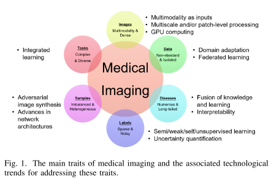
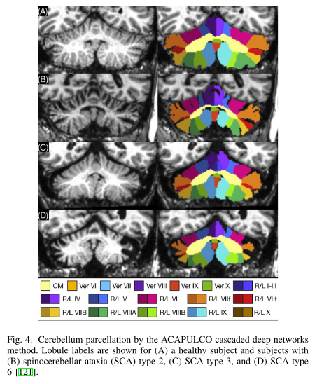
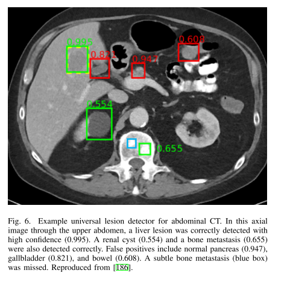

# A review of deep learning in medical imaging: Imaging traits, technology trends, case studies with progress highlights, and future promises 医学影像深度学习综述：影像特征、技术趋势、亮点案例研究、未来前景

## Abstract

自从深度学习的出现，它横扫了各种医学图像任务，并且再许多医学图像应用方面取得了可喜的成就，从而推动我们进入了所谓的人工智能时代。众所周知的是AI的成功大部分得益于对于单个任务的含有注释的大数据的便利性以及高性能计算的进步。然而，医学成像成为了深度学习方法面临的独特挑战。在该篇综述型论文中，我们首次展示了医学成像特征、医学影像临床需求以及技术挑战的紧迫性、深度学习的新兴方法如何解决这些问题。涵盖了网络架构、稀疏和嘈杂标签、联合学习、可解释性、不确定性量化等主题。然后，我们介绍了临床实践中常见的几个案例研究，包括数字病理学以及胸部、大脑、心血管和腹部成像。我们没有提供详尽的文献调查，而是描述了这些案例研究应用相关的一些突出的研究亮点。最后讨论未来的潜在方向。

## Index Terms 关键词

医学图像、深度学习、综述

## 1 Overview

​		医学成像利用物理现象，比如光、电磁辐射、放射性、核磁共振、声音等来产生视觉表征、人体外部或内部组织的图像、以非侵入性方式摄取人体部分、通过侵入式手术。临床医学中最常用的成像方式包括X射线成像(X-ray radiography)、计算机断层扫描(CT)、磁共振成像(MRI)、超声和数字病理学。影像数据约占所有医疗保健数据的90%，因此是临床分析和医疗干预最重要的证据来源之一。

### A. Traits of medical imaging 医学成像特征 

​		如上所述并参考图1，医学成像具有影响深度学习解决方案的适用性和性质的几个特征。请注意，这些特征不一定是医学成像所特有的。例如，卫星成像与医学成像共享下面描述的第一个特征。

*Medical images have multiple modalities and are dense in pixel resolution 医学图像具有多模态特性以及在像素级上具有密集型*

​		有许多现存的图像模态信息和新模态，比如光谱CT正被日常使用。即使对于常用的成像方式，像素或体素分辨率变高后，信息密度增加。例如，临床CT和MRI的空间分辨率已达到亚毫米级，超声的空间分辨率甚至更好，并且其时间分辨率已超过实时。

*Medical image data are isolated and acquired in non-standard settings 医学图像数据独立、未标准化*

​		虽然医疗图像数据在临床中大量存在，由于标准获取准则的确实，基于不同的设备和扫描设定，图像数据具有不同的特性，导致了所谓的"distribution drift"现象。由于病人隐私和临床数据管理的需要，图像分散在不同的医院和影像中心，真正中心化的开源医疗大数据集很少见。

*The disease patterns in medical images are numerous and their incidence exhibits a long tail distribution 医学图像中的疾病模式众多，其发病率呈长尾分布*

​		Radiology Gamuts Ontology定义了12878种"症状"（产生结果的条件）和4662种"疾病"（图像结论）。疾病的发生具有典型的长尾分布特点：虽然少数常见疾病具有足够的观察病例进行大规模分析，但大多数疾病在临床上并不常见。此外，当前的Ontology中未出现的新型传染病，例如COVID-19的爆发也在以一定频率发生。

*The labels associated with medical images are sparse and noisy 医学图像的标签是稀疏且含噪音的*

​		给一张医疗图像打标签或者注释是耗时且昂贵的。同样，不同的任务需要不同的注释形式，这造成了标签稀疏的现象。由于不同的经验和不同的条件，用户间和用户内标签的不一致程度很高，因此标签必须被认为是有噪声的。事实上，建立图像标记的黄金标准仍然是一个悬而未决的问题。

*Samples are heterogeneous and imbalanced 案例是异构、不均衡的*

​		在现有的标签图像中，外观因样本而异，其概率分布是多模态的。正负样本比例极不均衡。例如，属于肿瘤的像素数量通常比正常组织的像素数量少一到多个数量级。

*Medical image processing and analysis tasks are complex and diverse 医学图像处理和分析任务复杂多样*

​		医学图像拥有大量的任务。在技术层面，有一系列的技术，包括重建、增强、恢复、分类、检测、分割和配准。当这些技术与多种图像模态和多种疾病类型相结合时，就会形成与众多应用相关的大量高度复杂的任务，需要加以解决。

### B. Clinical needs and applications 临床需求和应用

​		医学影像通常是医学诊断的关键部分和治疗过程。典型的，放射科医师审查获得的医学图像并撰写它们的发现总结报告。转诊医生根据图像和放射科医师的报告确定诊断和医疗计划。通常，医学成像是作为患者随访的一部分，以验证治疗是否成功。此外，图像正在成为侵入性手术的重要组成部分，用于手术计划以及手术过程中的实时成像。

​		作为一个具体的例子，我们可以温故一下我们所说的“放射学挑战”。在过去的十年，随着图像获取技术的发展，图像设备在速度和分辨率层面大幅提升。举个例子，1990年，CT扫描仪可能采集50-100个切片，而今天的CT扫描仪每个病例可能采集1000-2500个切片。单张全玻片数字病理与单个前列腺活检核心对应的图像在40倍放大率下可以轻松占据10GB的空间。总体而言，全球每年进行数十亿次医学成像研究，而且这个数字还在增长。

​		大多数医学图像的注释是由医生，尤其是放射科医生标注的。然而，由于人类的主观性、解释者之间的巨大差异和疲劳程度，人类对图像额解释是有限的。审查病例的放射科医师审查越来越多的图像，而时间又有限，这就导致了遗漏发现、周转时间长以及缺乏数值结果或量化。反过来，这极大地限制了医学界朝着更基于证据的个性化医疗发展的能力。

​		深度学习技术等人工智能工具可以提供自动化图像分析的能力，为医生提供依据，产生了"Computational Radiology"。可以开发的自动化工具包括病理结果的检测、疾病范围的量化、病理特征的表征（例如，良性与恶性）以及可广泛表征为决策提供支持的各种软件工具。这项技术可以扩展医生的能力，包括对三维和时变事件的表征，由于时间限制，可视化和量化工具的限制，这些事件通常不包括在今天的放射学报告中。

### C. Key technologies and deep learning 关键技术和深度学习

​		多项关键技术源于各种医疗成像应用。

* Medical image reconstruction 医学图像重建

  > 旨在根据医学成像设备（例如CT或MRI扫描仪）获取的信号形成视觉表征（也称为图像）。根据低质量或者快速采集的图像重建高质量图像具有重要的临床意义。

* Medical image enhancement 医学图像增强

  > 它旨在调整图像的强度，使生成的图像更适合显示或进一步分析。增强方法包括去噪、超分辨率、MR偏置场校正和图像协调。最近，许多研究都集中在模态转换和合成上，可以将其视为图像增强步骤。

* Medical image segmentation 医学图像分割

  > 它旨在为像素分配标签，以便具有相同标签的像素形成一个分割对象。分割在临床量化、治疗和手术计划中有许多应用。

* Medical image registration 医学影像配准

  > 它旨在将一个或多个图像的空间坐标对齐到一个公共坐标系中。配准广泛用于群体分析、纵向分析和多模态融合，也常用于通过标签传输进行图像分割。

* Computer aided detection (CADe) and diagnosis (CADx)

  > CADe致力于定位或找到一个包含物体的（通常是病变）潜在边界框。CADx旨在将局部病变进一步分类为良性/恶性或多种病变类型之一。

* Others technologies 其他技术

  > 包括地标检测、图像或视图识别、报告自动生成等。

​		在数学领域，上述技术可看作是函数逼近方法，它逼近真实的映射$F$，它以一张图像（或多模态可访问的多张图像）为输入并输出一个特定的$y$，$y=F(x)$。$y$的定义因技术而异，而技术本身取决于应用程序或任务。在CADe中，$y$定义为一个回归框。在图像配准中，$y$是可变字段。在图像分割中，$y$是标签掩码。在图像增强中，$y$是质量增强后的图像，与输入图像$x$相同大小。

​		有许多方法来近似$F$，然而，深度学习(DL)是机器学习(ML)的一个分支，是最强大的函数逼近方法之一。自复兴以来，深度学习已广泛应用于各种医学成像任务，并在许多医学成像应用中取得了实质性的成功。由于专注于学习而不是建模，DL在医学成像中的使用代表了与之前的医学成像方法的大不同。以监督深度学习为例。假设一个训练数据集$\{(x_n, y_n); n=1,\cdots,N\}$，深度神经网络的参数为$\theta$，包含所有可训练可训练的参数，层的、权重连接、激活函数等。找到近似$F$的神经网络可以写成$\phi_{\hat{\theta}}(x)$，其中$\hat{\theta}$指最小化如下损失函数的参数：
$$
L(\theta) = \frac{1}{N} \sum_{n=1}^N l(\phi_{\theta}(x_n), y_n) +  R_1( \phi_{\theta}(x_n))+ R_2(\theta) \tag{1}
$$
其中，$l(\phi_{\theta}(x), y)$指的是按元素惩罚期望错误的损失函数，$R_1(\phi_{\theta}(x_n))$反映了关于输出的先验信息，$R_2(\theta)$是关于网络参数的正则化项。虽然神经网络$\phi_{\hat{\theta}}(x)$代表了模型的类型，但它可被视为一个”黑箱子“，因为它不代表基于通常的物理或者数学原理设计的模型。

​		如今已有很多关于基于深度学习的医学图像分析关键技术的调研论文。为了将当前的review论文和它们进行区分，我们特别省略了对DL本身技术细节的介绍，这些细节不再认为是最新的，并且在其他作品中都有很好的涵盖。然后我们更加专注于新兴的DL方法之间的联系，以及医学成像的特定需求，通过几个示例说明现有技术。

### D. Historical perspective 历史角度

​		在这节，我们简要概述DL在医学图像领域的发展时间线。深度学习被评为2013年十大突破性技术之一。这是继2012年大规模图像分类挑战赛之后，该挑战赛在ImageNet数据集上引入了CNN的优势。当时，DL成为一般成像和计算机视觉领域的领先机器学习工具，医学成像届开始就DL是否适用于医学成像领域展开辩论。这些担忧是由于我们上面概述的挑战，主要挑战是缺乏足够的标记数据，称为数据挑战(data challenge)。

​		可以详见的是，以下几个步骤是医学图像领域中使用DL技术的推动因素：在2015-2016年，使用”迁移学习“（TL）（或也称为"learning from non-medical features"）开发技术，通过解决源问题获得的知识应用于不同但相关的目标问题。一个关键问题是对自然图像进行预训练的网络是否适用于医学图像。几个小组通过实验来证明。使用基于ImageNet训练的深度网络并对医学图像任务进行微调有助于加速训练收敛并提高准确性。

​		在2017-2018年中，合成数据增强(synthetic data augmentation)作为解决处理限制型数据集的第二解决方案出现。经典增强是任何网络训练的关键组成部分。不过，要解决的关键问题是是否可以使用生成式建模等方案来合成医学数据，以及合成的数据是否可以作为可行的医学示例，并在实践中提高人工医学任务的表现。跨不同领域的几项工作表明事实确实如此。例如，在[37]中，基于生成对抗网络(GAN)的合成图像增强被证明可以生成未被放射科专家识别为合成的病变图像样本，并且提高了CNN在肝脏病变分类方面的性能。GAN，变分编码器以及它们的变体在最近的工作中仍在探索和推进，在下一节进行描述。

​		对于图像分割领域，医学图像领域的一个核心的贡献在于U-Net架构的出现。U-Net最初是为微观细胞分割而设计的，已被证明可以有效且稳健地学习许多医学图像分割任务的有效特征。

### E. Emerging deep learning approaches 新兴的深度学习方法

#### Network architectures. 网络架构

​		深度神经网络拥有大的模型容量以及比浅层神经网络更强的泛化能力。对于单一任务，在大型标注数据集上训练的深度模型能够达到绝佳的表现度，远远超过传统方法甚至是人类能力。

*Making it deeper.*

​		自AlexNet开始，研究趋势即转向设计更深的网络，就如VGGNet、Inception Net以及ResNet。残差连接的使用是的深度模型更易于训练，比如DenseNet和U-net。U-net最初是为了解决分割问题而提出的，而其它网络则是为图像分类开发的。深度监督进一步提高了判别力。

*Adversarial and attention mechanisms*

​		在生成对抗网络(GAN)中，Goodfellow等人提出将生成模型与判别器一起使用，该判别器可以判断样本是来自模型分布还是数据分布。生成器和判别器都是由深度网络表示，它们的训练是通过极小极大优化完成的。对抗学习广泛应用于医学成像，包括医学图像重建、图像质量增强、和图像分割。

​		注意力机制能够在描述图像内容或做出整体决策时，自动探索要关注"where"和"what"。SE模块能够被视为通道注意力机制，注意力在[48]中与GAN结合，在[49]中与U-net结合。

*Neural architecture search(NAS) and light weight design*

​		NAS旨在自动设计深度网络的架构，以实现面向给定任务的高性能。Zhu等人成功地将NAS应用于体积医学图像分割。在另一方面，轻量化设计致力于设计在资源受限的设备上进行高效计算维持准确度的架构，例如移动手机。

#### Annotation efficient approaches 高效注释方法

​		为了解决稀疏和嘈杂标签的问题，我们需要在annotation方面高效的方法。因此，一个关键思想是利用源自现有模型和数据的特征表示能力的强大功能和稳健性，即使模型或数据不一定来自同一领域或用于同一任务，并使这种表征适合人工任务。为此，文献[28]中提出了一些方法，包括迁移学习、领域适应、自监督学习、半监督学习、弱/部分监督学习等。

*Transfer learning(TL)*

​		迁移学习旨在应用源问题所学知识用于解决为不同领域但具有相关性的目标问题。一种常用的TL方法是使用基于ImageNet训练的深度网络并将其微调到医学图像任务中，以加快训练收敛速度并提高准确性。随着大量带注释的数据集的应用，这种TL方法取得了显著的成功。然而，ImageNet由自然图像组成，其预训练模型仅适用于2D图像，不一定适用于医学图像，尤其是小样本设置。Liu等人提出了一种3D各向异性混合网络，可以有效地将从2D图像中学习到有效卷积特征转移到3D各向异性体素。在[56]中，Chen等人将来自多个医学挑战地多个数据集与不同模态、目标器官和病理相结合，并学习一个3D网络，该网络为3D医学图像分析任务提供有效地预训练模型。

*Domain adaptation*

​		领域适应是迁移学习的一种形式，源域和目标域具有相同的特征空间但分布不同。在[57]中，领域不变性特征是通过对抗性机制学习的，该机制试图对输入数据的域进行分类。Zhang等人提出使用具有循环和形状一致性的GAN来合成和分割多模态医学体素(multimodal medical volumes)。在[59]中，提出了一个域适应模块，该模块将目标输入映射到与源域特征空间对齐的特征，用于跨膜态生物医学图像分割，使用域评论模块来区分两个域的特征空间。Huang等人提出了一个通用的U-Net，包括域通用和域特定参数，以处理多个域上的多个器官分割任务。这种集成的学习机制为处理多个领域甚至多个异构任务提供了新的可能性。

*Self-supervised learning*

​		非监督学习的一种形式，通过一个代理任务学习表征，其中数据提供监督信号。一旦学到了表征，就可以使用带注释的数据对其进行微调。The models genesis method使用一个代理任务，即使用失真图像作为输入来恢复原始图像。可能的失真包括非线性灰度值变换、局部像素混洗以及图像外涂和内涂。在[62]中，Zhu等人提出解决涉及三个操作的魔方代理任务(Cube proxy task)，即立方体排序、立方体旋转和立方体遮罩。这允许网络学习对平移和旋转不变并且对噪声也具有鲁棒性的特征。

*Semi-supervised learning*

​		半监督学习通常使用小的标注图像集来训练模型，然后给大量图像生成带有注释的伪标签，并通过混合两组图像来学习最终模型。Bai等人实现了这种心脏MR分割方法。在[64]中，Nie等人提出一种基于注意力的半监督深度网络进行分割。它对抗性地训练分割网络，从中计算置信度图作为基于区域注意地半监督学习策略，以包括未标记的数据进行训练。

*Weakly or partially supervised learning*

​		在[65]中，Wang等人在胸部X光片中解决弱监督的多标签疾病分类。为了减轻对图像分割的严格像素级注释，提出了使用图像级注释[66]或点和涂鸦等弱注释[67]的弱监督方法。对于多器官分割问题，Shi等人使用新提出的marginal loss和exclusion loss，从多个数据集的联合中训练单个多类网络，每个数据集都具有低样本量和部分器官标签。Schleg等人仅从正常图像构建深度模型，以检测测试图像中的异常区域。

*Unsupervised learning and disentanglement*

​		无监督学习不依赖于现有的标签图像。一种采用对抗学习策略设计的disentangled network，促进了深度特征的统计匹配，已被广泛使用。在医学图像领域，无监督学习和disentaglement已被用于图像配准、运动跟踪、伪影减少、改进分类、域适应和通用建模。

#### Embedding knowledge into learning 将知识嵌入学习

​		知识源自各种来源（例如成像物理、统计约束和任务细节）以及嵌入DL方法的方式也各不相同。对于胸部X射线疾病分类，Li等人将嵌入未配对CT中的解剖学知识编码成一个深度网络，该网络将胸部X射线分解为肺、骨骼和其余结构（见图2）。使用增强的骨抑制图像，预测14种常见肺部疾病种的11种的分类性能得到提高。在[78]中，基于CT的模拟X射线（DRR）中提取肺结构，通过训练学习，并与原始X射线图像融合来增强肺射线照片。增强显示增强了真实X射线图像中病理特征的结果。在[79]中，提出了一种双域网络来减少图像域和正弦图域上的金属伪影，它们似乎通过氡逆层而不是两个单独的模块集成到一个差分框架中。

#### Federated learning 联邦学习

​		为了解决与数据隐私、数据安全、访问权限等相关的问题，通过分布式计算和模型聚合策略学习通用、健壮的算法模型的能力变得越来越重要，从而不会将数据传输到医院或影像实验室之外。这个研究方向被称为联邦学习(FL)，这与传统的集中学习相反，它将所有本地数据集都上传到一个服务器。有许多与联邦学习相关的正在进行的研究挑战，例如减少通信负担、各种本地站点的数据异质性以及易受攻击的脆弱性。

​		尽管它很重要，但在医学成像中的FL工作最近才被报道。Sheller等人首次将FL用于多机构DL模型而不共享患者数据，通过联邦学习方式或集中学习方式得出的脑病变分割性能相似。在[85]中，Li等人研究了几种实用的FL方法，同时保护BraTS数据集上脑肿瘤分割的数据隐私，并证明了模型性能和隐私保护成本之间的权衡。最近，FL与域适应一起应用于训练模型，该模型具有增强的分析性能和疾病相关生物标志物的可靠发现。

#### Interpretability 可解释性

​		临床决策在很大程度上依赖于证据收集和解释。缺乏证据和解释使医生难以相信ML模型的预测，尤其是在疾病诊断方面。此外，可解释性也是新知识的来源。Murdoch等人将可解释的机器学习定义为利用机器学习模型来提取有关数据中包含的域关系的相关知识，旨在为用户提供对所选域问题的见解。大多数解释方法被归类为基于模型和事后可解释性。前者是关于约束模型，以便它可以很容易地提供有关未覆盖关系地有用信息（例如稀疏性、模块化等）。后者是关于提取有关模型已学习的关系的信息。

*Model-based interpretability 基于模型的可解释性*

​		对于心脏MRI分类，潜在空间中具有诊断意义的概念被编码。在[89]中，在训练健康和肥厚型心肌病分类模型时，它利用了从3D分割中学习到的可解释的特定于任务的解剖模式。

*Post-hoc interpretability 事后可解释性*

​		在[90]中，图神经网络的特征重要性得分，通过比较其与随机森林的解释能力来计算的。Li等人提出了一种通过频率归一化采样策略破坏图像的大脑生物标志物解释方法。在[92]中，在结肠镜图像息肉语义分割的背景下评估了各种可解释性方法。在[93]中，学习了一种关于脑病变分割的混合RBM-随机森林系统，目的是提高自动提取特征的可解释性。

#### Uncertainty quantification 不确定性量化

​		不确定性量化通过实用置信度测量来表征模型预测，这可被视为一种事后可解释性的方法，即使不确定性度量通常与模型预测一起计算。最近出现了量化医学图像分割、病变检测、胸部X线疾病分类和糖尿病视网膜病变分级的深度学习方法中的不确定性的新兴工作。不确定性的另一个扩展是它与给定标签是嘈杂的知识相结合。现在开始出现在网络架构建模及其训练中考虑标签不确定性的架构。

## 2 Case Studies With Progress Highlights 具有进展亮点的案例研究

​		鉴于DL已在媒体图像应用中大量使用，几乎不可能在一篇论文中涵盖所有可能的相关文献。因此，我们涵盖了临床实践中常见的几个选定病例，包括胸部、神经、心血管、腹部和显微镜成像。此外，我们没有为每个研究案例提供详尽的文献调研，而是在每个案例研究中提供一些突出的进展亮点。

### A. Deep learning in thoracic imaging 胸腔成像中的深度学习

​		肺部疾病具有很高的死亡率和发病率。在世界范围内死亡数最高的十大死因中，我们发现肺癌、慢性阻塞性肺病（COPD）、肺炎和结核病（TB）。在撰写本概述时，COVID-19的死亡率与结核病相当。

​		成像是与诊断、计划治疗以及其它肺部疾病的原因和机制高度相关的。除此之外，肺部并发症在住院患者中很常见。因此，胸片是迄今为止最常见的放射学检查，通常占放射科所有研究的三分之一以上。

​		平片和计算机断层扫描是两种胸部成像的最常见方式。充满空气的肺实质和组织之间的密度的高对比度使CT称为肺活体分析的理想选择，即使在非常低的辐射剂量下也能获得高质量和高分辨率的图像。核成像（PET或PET/CT）用于肿瘤患者的诊断和分期。MRI在肺部有些受限，但可以产生独特的功能信息。超声成像也很困难，因为声波在空气和组织的边界处强烈反射，但point-of-care超声用于急诊科并广泛用于检测COVID-19患者，其中第一个基于深度学习的决策支持应用程序已经出现。

#### Segmentation of anatomical structures 解剖结构的分割

​		对于胸部CT扫描的分析和量化，主要解剖结构的自动分割是一个重要的先决条件。最近的出版物不置可否地表明，深度学习现在是实现这一目标的先进方法。通过检查LOLA11的结果可以明显看出这一点，LOLA11使一项于2011年开始的胸部CT肺和肺叶分割竞赛。此挑战的测试数据集包括许多肺部受严重异常影响的具有挑战性案例。多年来，最好的结果是通过交互方法获得的。2019-2020年，基于U-Nets或其变体的7种全自动方法在肺分割方面进入前10名，在肺叶分割方面，最近两种方法获得的结果优于最佳交互方法。这两种方法都接受了来自COPDGene研究的数千次CT扫描的训练，说明了大型高质量数据集对于通过深度学习获得良好结果的重要性。这些数据可应要求公开提供。这两种方法都使用多分辨率的类似U-Net的架构，并具有多种自定义功能。Gerard等人整合先前开发的寻找裂缝的方法。Xie等人添加一个具有自注意力机制的non-local模块，并根据COVID-19嫌疑人的数据微调他们的方法，以准确分割受磨玻璃和实变影响的扫描中的叶。

​		分割脉管系统，分为动脉、静脉和气道树，包括分支的标记和支气管壁的分割，是另一个重要的研究领域。尽管已经提出了在某些步骤中使用卷积网络的方法，但开发一种完全基于深度学习的架构，可以准确跟踪和分割交织的树结构并利用这些复杂结构的已知几何形状，仍然是一个公开挑战。

#### Detection and diagnosis in chest radiography 胸片的检测与诊断

​		最近关于检测无处不在的胸部X线异常的出版物数量大幅增加。这一趋势是由大型公共数据集的可用性推动的，例如ChestXRay14、CheXpert、MIMIC、PadChest，总计868K图像。通过对随附的放射学报告进行文本挖掘，收集了超过150种不同异常迹象的存在与否的标签。这会使标签变得嘈杂。大多数出版物使用标准方法在流行的卷积网络架构种输入整个图像。方法论贡献包括预处理图像的新方法、处理标签不确定性和大量类别、抑制骨骼以及利用自监督学习作为预训练的一种形式。迄今为止，只有少数出版物分析同一患者的多次检查以检测间隔变化或分析侧视图。

#### Decision support in lung cancer screening 肺癌筛查决策支持

​		继NLST试验的积极结果，美国已经启动了一项针对重度吸烟者的筛查计划，以便通过每年一次的低剂量CT扫描及早发现肺癌。预计全球许多其他国家也会效仿。在美国，筛查中心必须使用称为Lung-RADS的报告系统。阅读肺癌筛查CT扫描非常耗时，因此自动化Lung-RADS中的各个步骤受到了很多关注。

​		研究最广泛的主题是结节检测，结节可能代表肺癌。在LUNA16挑战赛中对许多深度学习系统进行了比较。Lung-RADS根据最可疑的结节对扫描进行分类，这由结节类型和大小决定。利用DL确定结节类型的系统已经提出，并且可以通过基于阈值和数学形态学的传统方法以及DL网络来测量尺寸。最后，Lung-RADS包含直接参考对癌症高度可疑的结节进行扫描的选项。许多用于估计结节恶性程度的DL系统已经提出。

​		逐步自动化LUNG-RADS指南的优势在于，这会产生可解释的AI解决方案，可以直接支持放射科医生的阅读工作流程。或者，可以让计算机直接预测CT扫描是否包含可治疗的肺癌。这是2017年组织的Kaggle挑战赛的主题，其中近2000个团队争夺一百万美元的奖金。排名前10的解决方案都使用了深度学习方法并且开源。两年后，谷歌的一个团队按照Kaggle挑战赛获胜团队的方法发布了一个实现，采用现代架构，如3D inflated Inception architecture(I3D)。I3D架构基于用于2D图像分类的Inception v1模型，但将滤波器和池化内核扩展为3D。这使得使用2D数据预训练的图像分类模型能够用于3D图像分类任务。该论文表明，该模型的表现优于使用Lung-RADS的六名放射科医生。该模型还扩展到处理后续扫描，其性能略低于人类专家。

#### COVID-19 case study COVID-19案例研究

​		作为说明DL如何将预训练的元素用于快速构建应用程序，我们简要讨论了用于COVID-19检测的两种工具的开发，用于胸部X光片和胸部CT。2020年3约，许多欧洲医院因呼吸系统疾病急诊就诊的患者不堪重负。COVID-19的分子检测能力不足，检测结果的周转时间通常为数天。因此，医院使用胸部X光或者CT来获取有效诊断，并决定是否让患者住院以及如何治疗。在短短六周内，来自荷兰和德国多家医院、研究机构和一家公司的研究人员设法创建了一种解决方案，用于通过X射线和CT扫描检测COVID-19。图3显示了该CORADS-AI系统对COVID-19阳性病例诊断的结果。

​		X射线解决方案从使用局部和全局标签的卷积网络开始，预训练以检测结核病，使用有无肺炎的患者的公开和私人数据进行微调，以检测一般肺炎，然后对来自肺结核患者的X射线数据进行微调，数据源自COVID-19热点的荷兰医院。该系统随后在来自另一家荷兰医院的454张胸部X光片上进行了评估，并显示其性能与6位胸部放射科医生相当。该系统目前正在非洲进行现场测试。

​		CT解决方案称为CO-RADS，旨在实现COVID-19嫌疑人CT的自动临床报告系统。该系统从CO-RADS 1（极不可能）到CO-RADS 5（极有可能）评估COVID-19感染的可能性，并根据百分比使用每个肺叶的评分从0-5量化疾病的严重程度。受累肺实质的最大CT严重程度评分为25分。采用了前述的叶分割方案。肺中的异常区域使用由nnU-Net框架构建的3D U-Net以交叉验证的方式进行分割，具有108次扫描和相应的参考轮廓，以分割肺中的磨玻璃影和实变。CT的严重性评分是通过计算分割结果中每个肺叶受影响的实质组织的百分比得出的。nnU-Net与其他集中方法进行了比较并且表现最好。为了评估CO-RADS分数，前面提到了I3D架构表现最好。

### B. Deep learning in neuroimaging 神经影像学中的深度学习

​		近年来，深度学习在神经影像学界的热度急剧上升。许多神经影像任务，包括分割、配准和预测，现在都有基于深度学习的实现。此外，通过使用深度生成模型和对抗性训练，深度学习为复杂图像合成任务的研究开辟了新的途径。随着大型多样化的汇集神经影像研究的可用性不断增加，深度学习为提高准确性和泛化性，同时减少推理时间和复杂预处理的需求提供了有趣的前景。特别是CNN，允许有效的网络参数化和空间不变性，这两者在处理高维神经影像数据时都至关重要。CNN的可学习特征减少和选择能力已被证明在高级预测和分析任务中是有效的，并且减少了对高度特定领域知识的需求。U-Nets、V-Nets、GANs等专用网络在神经图像中也很受欢迎，并已被用于各种分割和合成任务。

#### Neuroimage segmentation and tissue classification 神经图像分割和组织分类

​		正确的分割时一个重要的预处理步骤，它为神经成像中完成许多下游分析和预测任务提供信息。FreeSurfer等常用工具依赖于基于图集的方法，其中图集可变形地注册到扫描中，这需要解决耗时的优化问题。然而，提出的基于深度学习的方法在推理过程中的计算成本相对较低。最近的研究集中在重要任务上，例如基于深度学习的大脑提取、皮层和皮层下分割、以及肿瘤和病变分割。一些有趣的研究着眼于提高基于深度学习的分割方法在不同扫描仪上的神经影像数据集图像的泛化性能。特别是，Kamnitsas等人提出了一种训练模式，它利用对抗性训练来学习扫描仪不变特征表征。他们使用对抗网络根据分割网络学习到的下游特征表示对输入数据的来源进行分类。通过惩罚分割网络以提高对抗网络的性能，它们展示了跨数据集改进的分割泛化能力。脑肿瘤分割一直是神经影像学界另一个活跃的研究领域，深度学习在其中显示出前景。过去，脑肿瘤数据集相对较小，尤其是在单个机构中对受试者继续宁成像的数据集。脑肿瘤分割挑战(BraTS)为社区提供了一个可访问的数据集以及一种对各种方法进行基准测试的方法。虽然已经看到深度学习难以在扫描次数相对较少的数据集上进行训练，但新的架构和训练方法在这方面变得越来越有效。Havaei等人证明了他们的胶质母细胞瘤分割网络在BraTS数据集上的性能，实现了高精度，同时比以前的方法快得多。深度网络取得越来越成功的另一项任务是语义分割，其中解剖标签不一定由图像强度变化明确定义，但可以通过相对解剖位置识别。一个很好的例子是小脑分割，其中深度网络在最近的方法比较中表现最好。更新的ACAPULCO方法使用两个级联的深度网络来生成小脑小叶标签，如图4所示。

#### Deformable image registration 可变形图像配准

​		图像配准允许用于跨成像模式和时间点的单个对象的成像分析。基于深度学习的神经影像数据的可变形配准已被证明是一个难题，特别是考虑到缺乏基本事实。尽管如此，一些独特而多样的方法已经以相对较快的运行时间取得了最先进的结果。Li等人提出了一种完全卷积的"自监督"方法，以在多个分辨率下学习适当的空间转换。Balakrishnan等人提出了一种无监督图像配准的方法，该方法试图直接计算变形字段。

#### Neuroimaging prediction 神经影像学预测

​		许多架构借鉴于计算机视觉方案，神经影像学中基于深度学习的预测迅速流行起来。传统上，基于机器学习的神经影像数据预测依赖于仔细的特征选择/工程。通常采用区域汇总措施的形式，这可能无法解释特定任务的所有信息变化。而在深度学习中，通常使用原始成像数据，其中可以通过优化学习适当的特征表示。这对于我们不知道哪些成像特征回提供信息的高级预测任务特别有用。此外，通过处理原始图像，可以减少对复杂且耗时的预处理的依赖。近年来，在基于深度学习的预测任务上发表了大量工作，例如脑年龄预测、阿尔茨海默病分类和轨迹建模、精神分裂症分类。一些工作考虑了使用深度连体网络及性能纵向图像分析。Siamese网络因其在面部识别方面的成功而广受欢迎。他们通过针对两个图像之间的某些距离度量联合优化两个图像上的一组权重来工作。这种设置使它们能够有效地识别某些选定维度上的纵向变化。Bhagwat等人考虑使用纵向连体网络预测未来阿尔茨海默病的发作，使用两个早期时间点。与仅使用基线扫描相比，使用两个时间点在识别未来的阿尔茨海默病例方面表现出显著提高的性能。

#### The use of GANs in neuroimaging 神经影像学中GAN的使用

​		GAN赋予了神经影像中的复杂图像合成任务的能力，其中许多方面在传统机器学习中没有可比的类似物。GAN及其变体已用于跨膜态合成的神经成像、运动伪影减少、分辨率升级、从低剂量PET估计全剂量PET、图像协调、异质性分析等。为了帮助促进此类工作，流行的MedGAN对传统GAN提出了一系列修改和新的损失函数，旨在保留解剖学相关的信息和细节。他们在翻译后的图像上使用辅助分类器来确保生成的图像特征表示与给定任务的预期图像表征相似。此外，他们将风格转移损失与对抗性损失结合使用，以确保在翻译中匹配精细的结构和纹理细节。一些有希望的新工作试图减少PET成像所需的放射性示踪剂的数量，从而可能降低相关成本和健康风险。这个问题可被定义为图像合成任务，由此可以从低剂量图像合成最终图像。在[157]中，像素位置信息被整合到一个深度网络中进行图像合成。Kaplan和Zhu提出了一种基于深度生成的去噪方法，该方法使用对低剂量和全剂量PET成像的对象进行配对扫描。它们表明，尽管示踪剂材料减少了十倍，但它们能够保留重要的边缘、结构和纹理细节。几十年来，由于MR图像强度和扫描分辨率的高度可变性，神经影像学的一致量化一直受到阻碍。Dewey等人使用U-Net风格的架构和使用两种不同协议扫描的配对对象，来学习两个站点之间的映射。通过对以较低分辨率获取的图像应用超分辨率方法来解决分辨率差异。它们能够使用网络来减少基于站点的变化，从而提高两个站点之间分段的一致性。

​		虽然神经影像领域的深度学习已经开启了很多有趣的图形，但某些方面还缺乏严谨的认识。重要的研究方向，例如从有限数据中学习、最优超参数选择、域适应、半监督设计和提高鲁棒性，需要进一步研究。

### C. Deep learning in cardiovascular imaging 心血管成像中深度学习

​		心脏解剖的量化与理解以及功能被数据驱动的深度学习领域的最新进展改变了。最近在心血管成像的各个子领域都有重要的工作，包括图像重建、从图像中对心脏病理学的端到端学习和非成像信息的结合（例如遗传学和临床信息）进行分析。在这里，我们简要介绍该领域深度学习的三个关键方面：心腔分割、心脏运动/变形分析和心脏血管分析。运动跟踪和分割在检测和量化心肌腔功能障碍方面都起着至关重要的作用，并且有助于诊断心血管疾病(CVD)。传统上，这些任务被单独处理并作为单独的步骤解决。很多时候，运动跟踪算法使用分割结果作为用于生成位移场的采样点和感兴趣区域的解剖学指南。部分由于这一点，还努力将运动跟踪和分割结合起来。

#### Cardiac image segmentation 心脏图像分割

​		心脏图像分割是许多临床应用的重要第一步。目的通常是分割主室，例如：左心室(LV)、右心室(RV)、左心房(LA)和右心房(RA)。这可以量化描述心脏形态的参数，例如：LV容积或质量、或心脏功能（壁增厚和射血分数）。在心腔分割方面已经有重要的深度学习工作，主要特征在于所采用的图像类型（模态）以及工作是2D还是3D。Tran首次尝试应用全卷积网络(FCN)从二维短轴心脏磁共振(MR)图像中分割左心房(LV)、心肌和右心室，在准确性和速度方面明显优于传统方法。从那时起，已经开发了各种其他基于FCN的策略，特别是关注流行的U-Net方法，通常包括2D和3D约束。空间和时间背景的结合也是一个重要的研究方向，包括努力在舒张末期和收缩末期状态下同时分割心脏。之前已经发现基于形状的约束对于使用其他类型机器学习的LV腔分割很有用，并且被[169]很好地包含在解剖学约束地深度学习策略中。这种堆叠卷积自编码器方法也成功地应用于从3D超声心动图数据中进行LV分割。其他重要的工作是针对MRI的心房分割、CT的全心分割和3D超声图像序列的LV分割，后者结合使用图谱配准和对抗性学习。心脏分割深度学习的进展得益于该领域的许多持续挑战。

#### Cardiac  motion tracking 心脏运动追踪

​		心脏运动跟踪是变形/应变分析的关键，并且对于分析心室的机械性能很重要。现已开发了各种使用生物力学模型和数据驱动学习的图像配准、基于特征的跟踪和正则化方法。一种用于跟踪的特殊类型的数据集是MRI标记采集的，深度学习最近在跟踪这些标记和量化运动跟踪和分析的位移信息方面发挥了作用，通过使用循环神经网络(RNN)和卷积神经网络(CNN)的组合来从短轴MRI标签图像序列估计心肌应变。估计运动位移和应变也可以从标准MR图像序列和4D超声心动图进行，最常见的是通过使用某种类型的图像配准来整合图像分割和帧之间映射的思想。最近通过磁共振(MR)成像进行心脏运动跟踪的努力采用了计算机视觉领域的方法，这表明运动跟踪和分割的任务密切相关，用于完成一项任务的信息可以补充和提高其他任务的整体性能。特别是，提出了一种有趣的深度学习方法，用于视频对象分割和被称为SegFlow的光流（运动位移）的联合学习，这是一个端到端的统一网络，它同时训练两个任务并通过双向特征共享利用这两个任务的共性。最早将这一想法整合到心脏分析中的是Qin等人。他通过开发双连体式循环空间变换器网络和全卷积分割网络来同时估计运动和生成分割掩码，成功地实现了在2D心脏MR序列上结合运动和分割的想法。这项工作主要针对2D MR图像，其具有比超声心动图图像更高的SNR，因此更清晰地描绘了LV壁。将这种方法直接应用于超声心动图仍然具有挑战性。Ta等人最近提出了一个4D（3D+t）半监督联合网络，以在分割LV壁地同时跟踪LV运动。该网络以迭代方式进行训练，其中一个分支影像的结果并规范另一个分支。位移场通过生物力学启发的不可压缩性约束进一步规范化，该约束强制执行逼真的心脏运动行为。所提出的模型与其他模型的不同之处在于它将网络扩展到4D以捕获平面外的运动。最后，深度学习衍生的运动信息的临床可解释性降时未来几年的一个重要主题。

#### Cardiac vessel segmentation 心脏血管分割

​		心脏血管分割是心脏图像分析领域的另一重要任务，包括血管的分割，包括大血管（例如：主动脉、肺动脉和静脉）以及冠状动脉。大血管（如主动脉）的分割对于准确的机械和血流动力学表征非常重要，例如：用于评估主动脉顺应性。已经针对此分割任务提出了几种深度学习方法，包括在存在噪声和伪影的情况下使用循环神经网络跟踪心脏MR图像序列中的主动脉。同样重要的任务是冠状动脉的分割，作为量化分析的前置，模拟血液流动、用于计算CT血管造影（CTA）的血流储备分数。冠状动脉分割的方法可以分为提取血管中心线的方法和分割血管腔的方法。[180]中提出了一种用于提取冠状动脉中心线的端到端可训练方法。在这种方法中，中心线是使用多任务全卷积网络提取的，该网络同时计算中心线距离图并检测分支端点。该方法生成没有虚假分支的单像素宽中心线。该技术的一个有趣方面是它可以处理任意血管树，而无需实现假设血管树的深度或其分叉模式。与此相反，Wolterink等人提出了一个CNN，该CNN通过训练用来预测局部3D图像块内冠状动脉最可能的方向和半径。从种子点开始，通过使用CNN的预测沿着玄关中心线跟踪冠状动脉。

​		中心线提取的替代方法是基于旨在分割血管腔的技术，例如：使用通过预测血管概率图来执行分割的CNN分割方法。Moeskops等人提出了一种优雅的方法：通过训练单个CNN来执行三种不同的分割任务，包括心脏CTA中的冠状动脉分割。Lee等人引入了体素分割，先为血管段引入管状形状，这是通过模板转换器网络来实现的，通过该网络可以通过基于网络的配准来实形状模板变形，以产生输入图像的准确分割，并保证拓扑约束。

​		最近，几何深度学习方法也已用于冠状动脉分割。例如，Wolterink等人使用图卷积网络进行冠状动脉分割。这里冠状动脉表面上的顶点用作图形节点，它们的位置以端到端的方式进行优化。

### D. Deep learning in abdominal imaging 腹部成像的深度学习

​		近来，使用医学成像对腹部解剖结构和疾病进行自动检测、分类和分割方面取得了加速进展。MICCAI Data Decathlon和Deep Lesion数据集等大型公共数据集促进了进展。

#### Organs and lesions 器官和病变

​		多器官方法已经称为解剖定位和分割的主流方法。对于单个器官，肝脏、前列腺和脊柱可以说是最准确分割的结构，也是深度学习研究最积极的结构。深度学习研究员感兴趣的其他器官包括胰腺、淋巴结核肠道。

​		许多研究已经使用U-Net来分割肝脏核肝脏病变并评估肝脏脂肪变性。肝脏分割的骰子系数通常超过95%。在前列腺中，腺体分割和病变检测已成为SPIE/AAPM挑战（竞赛）和众多出版物的主题。几个小组已经使用数据集（例如TCIA CT 胰腺）来改进胰腺分割，其中Dice系数达到中间80个百分点。也有使用深度学习自动检测胰腺癌的报道。深度学习已被用于确定胰腺神经内分泌肿瘤患者的胰腺肿瘤生长率。脾脏已被分割，Dice得分为0.962。最近，已经提出边际损失和排除损失来从部分标记的数据集的联合训练单个多器官分割网络。

​		淋巴结肿大可能表明存在炎症化、感染或转移性癌症。研究已经评估了CT上腹部淋巴结的一般情况和特定疾病，如前列腺癌。TCIA CT 淋巴结数据集在该领域取得了进展。

​		在肠道中，CT结肠成像计算机辅助息肉去除，在十多年前，剖腹产是腹部CT图像分析的热门话题。深度学习的最新进展有限，但研究报告称，电子肠道清洁得到改善，癌前结肠息肉检测具有更高的灵敏度和更低的假阳性率。最近使用持久同源性的深度学习在CT上的小肠分割方面取得了成功。可以通过深度学习在CT上检测结肠炎症。通过使用自然世界视频进行预训练，可以在CT扫描中检测到阑尾炎。Inception V3卷积神经网络可以检测腹部X光片上的小肠梗阻。

​		可以使用超声图像的深度学习来预测肾功能。使用深度学习可以检测到潜在的弥漫性疾病，例如卵巢癌和异常血液收集。男性骨盆放疗风险的器官，如膀胱和直肠，已使用U-Net在CT上进行分割。

​		已开发出的通用病变检测器用于身体CT，包括腹部CT（如图6）。通用病变检测器可识别、分类和测量整个腹部的淋巴结和各种肿瘤。该检测器使用公开可用的Deep Lesion数据集进行训练。

#### Opportunistic screening 机会性筛选

​		量化和检测不足的慢性病的机会性筛选一直是最近感兴趣的领域。用于腹部机会性筛查的示例深度学习方法包括自动骨矿物质密度测定、内脏脂肪评估、肌肉体积和质量评估以及主动脉粥样硬化斑块量化。研究表明，这些测量可以准确完成，并且可以很好地推广到新的患者群体。这些机会性筛查评估还可以预测存活率和心血管发病率，例如心脏病发作和中风。

​		腹部成像的深度学习还会继续快速发展。为了迁移到诊所，一些重要的进步将是弥补不同患者群体的普通性和图像采集的可变性的泛化能力。

### E. Deep learning in microscopy imaging 显微镜成像中的深度学习

​		随着全玻片扫描的出现和发展以及组织切片图像的大型数据集的出现，深度学习方法对数字病理数据的应用显著增加。虽然这些方法在数字病理学领域的最初应用主要集中在检测和分割单个原语（如淋巴细胞和癌核）的效用，但它们现在已经发展到解决更高级别的诊断和预后任务以及DL方法的应用，预测疾病的潜在分子基础和突变状态。下面简述DL方法在数字病理学中不断发展的应用。

#### Nuclei detection and segmentation 细胞核检测和分割

​		DL对整个切片病理图像的早期应用之一是单个细胞核的检测和分割。Xu等人提出了一种使用堆叠稀疏自动编码器方法来识别乳腺癌病理图像上单个癌核位置的方法。Janowczyk等人后续的工作，证明了DL方法用于识别和分割许多不同的组织学原语的效用，包括淋巴细胞、小管、有丝分裂图、癌症范围，以及对与白血病有关的不同疾病类别进行分类。综合教程还详细介绍了注释、网络训练和测试协议的最佳实践。随后Cruz-Roa等人证明了卷积神经网络可用于在整个载玻片乳腺癌病理图像上准确识别癌症的存在和范围。该方法在识别载玻片或患者水平上是否存在癌症方面具有100%的准确度。随后，Cruz-Roa等人还演示了使用高吞吐量自适应采样方法来提高先前在[217]中提出的CNN的效率。在[218]中，Veta及其同事讨论了用于检测乳腺癌女性淋巴结转移的DL算法的诊断评估，作为CAMELYON16挑战的一部分。研究发现，至少有物种DL算法的性能与病理学家在没有时间限制的情况下解释载玻片的性能相当，并且一些DL算法的诊断性能比参加旨在模拟常规病理工作流程的模拟练习的11名病理学家小组更好。在肺癌病理图像的相关研究中，Coudray等人在来自癌症基因组图谱（TCGA）的WSI上训练深度CNN（Inception V3），以准确自动地将它们分类为肺腺癌、鳞状细胞癌或正常肺组织，曲线下面积为0.97。

​		[216]、[217]、[218]、[219]中描述的基于CNN的方法的挑战之一是需要对感兴趣的目标进行详细注释。这是一项劳动密集型任务，因为通常需要由病理学家提供疾病范围的注释，它们的开始时间很短。在Campanella等人的一篇综合论文中，该团队采用弱监督方法来训练深度学习算法，以识别幻灯片水平上是否存在癌症。他们能够在超过15000名患者的超过44000WSI的大规模研究中证明，对于前列腺癌、基底细胞癌和乳腺癌转移到腋窝淋巴结，曲线下的相应面积均在0.98以上。作者建议病理学家可以使用该方法排除65-75%的载玻片，同时保持100%的癌症检测灵敏度。

#### Disease grading 疾病分级

​		病理学家可以可靠的识别疾病和H&E幻灯片上的类型和范围，并且几十年来一直观察到疾病的特征与其行为相关。然而，他们无法以足够严格的方式重复识别或量化这些疾病行为的组织学标记，以常规使用这些特征来决定疾病结果和疾病反应。DL应用的领域之一是模仿病理学家对疾病标志的识别，尤其是在癌症的背景下。例如，在前列腺癌中，病理学家通常旨在将癌症归入五种不同类别之一，称为格里森等级组。然而，与许多其他癌症和疾病一样，这种分级系统会收到读者之间的差异和分歧的影响。因此，最近提出了许多用于前列腺癌分级的DL方法。Bulten等人和Strom等人最近都发表了分别涉及1243和976名患者的大型队列研究，并表明了DL方法可用于实现与病理学家相当的Gleason分级性能。

#### Mutation identification and pathway association 突变鉴定和通路关联

​		疾病形态反映了疾病内所有时间遗传和表观遗传变化和改变的总和。认识到这一点，一些团体已经开始探索DL方法在识别疾病特异性突变与生物途径的关联方面的作用。Oncotype DX是一种21基因表达检测，可预测早期雌激素受体阳性乳腺癌辅助化疗的获益。在两项相关研究中，Romo-Bucheli表明DL可用于识别来自病理图像的小管密度和有丝分裂指数，并证明这些测量值与乳腺癌的Oncotype DX风险类别（低、中和高）之间存在很强的关联。有趣的是，小管密度和有丝分裂指数是乳腺癌分级的重要组成部分，MSI是由DNA错配修复受损导致的一种状况。为了评估肿瘤是否为MSI，需要进行基因或免疫组织化学测试。Kather等人的一项研究表明，DL可以从胃肠道癌症的组织学图像中预测MSI，AUC=0.84。Coudray等人表明可以训练DL网络来识别非小细胞肺腺癌中的许多常见突变基因。这些实验表明，这些突变基因中的六个——TK11、EGFR、FAT1、SETBP1、KRAS和TP53——可以从病理图像中预测，AUC为0.733到0.856。

#### Survival and disease outcome prediction 生存和疾病结果预测

​		最近，人们对将DL算法应用于病理图像以直接预测生存和疾病结果很感兴趣。在最近的一篇论文中，Skrede等人对DL进行了一项大型研究，该研究涉及来自2000多名患者的超过1200万个病理图像块，以预测早期结直肠癌患者的癌症特异性存活率。在1122名患者的验证队列中，DL产生的预后不良与良好预后的风险比为3.84（95% CI 2.72-5.43; p < 0.0001），并且在针对既定因素进行调整后的风险比为3.04（2.07-4.47; p < 0.0001），预后标志物包括T和N。Courtiol等人提出了一种使用DL来预测间皮癌患者预后的方法。Saillard等人使用DL来预测肝细胞癌切除术后的存活率。

​		虽然上述研究清楚地反映了DL在数字病理学中的各种图像分析和分类问题的影响力增长，但仍然存在关于其可解释性、对大型训练集的需求、对注释数据的需求以及泛化性的担忧。已尝试使用诸如视觉注意力映射之类的方法来提供一定程度的透明度，以了解DL网络在图像中似乎将注意力集中的位置。另一种增强可解释性的方法是通过混合方法，其中DL用于识别病理图像中感兴趣的特定基元（如淋巴细胞）（换句话说，将其用作检测和分割工具），然后从这些图像中推导出手工制作的特征原语（例如淋巴细胞排列的空间模式）来执行预后和分类任务。然而，正如Bera等人在最近的一篇评论文章中指出，虽然DL方法对于诊断适应症可能是可行的，但与结果预测和治疗反映相关的临床任务可能仍然涉及提供更大可解释性的方法。虽然DL的研究及其在数字病理学中的应用似乎很可能会继续增长，但这些方法在前瞻性和临床试验环境中的表现仍有待观察，这反过来可能最终决定它们向临床的转化。

## 3 Discussion

### Technical challenges ahead 未来的技术挑战

​		在这篇概述论文中，回顾了多个医学领域和任务中的许多技术挑战。一般来说，大多数挑战都是通过对众所周知的数据挑战的解决方案的持续改进来解决的。整个社区正在不断开发和改进基于迁移学习的解决方案和数据增强方案。随着系统开始跨数据集、医院和国家实施。出现了一系列新的挑战，包括跨采集协议、机器和医院的系统稳健性和泛化性。在这里，数据预处理、持续模型学习和跨系统微调是未来的一些新发展。可以在最近的几篇DL评论文章中找到对此处提出的主题的详细评论，以及其他主题，例如对抗性攻击的鲁棒性。

### How do we get new tools into the clinic? 如果将新工具引入临床？

​		DL工具是否用于临床的问题经常被提出。这个问题特别重要，因为许多任务和挑战的结果显示了放射科医生级别的表现。在最近几项评估基于AI的技术作为放射科医生辅助工具的效用的工作中，一致表明具有AI的人类专家比没有AI的人类专家表现更好。该领域的兴奋导致了许多人工智能医学影像初创公司的出现。尽管一些较早的亚久表明早期CAD工具在测试场景中不一定有用，但迄今为止，技术从研究到实际临床使用的转化并未发生。在大规模的情况下，有多项技术获得了FDA的批准。事实上，最近为一项人工只能技术办法了专门的报销代码。这种延迟的临床转化有多种原因，包括：用户对该技术持谨慎态度，特别是被人工智能取代的前景；需要证明该技术可以满足用户的实际需要并带来可量化的收益；漫长而昂贵的监管途径；患者安全考虑；以及经济因素，例如谁将为人工智能工具买单。

​		未来的预测是，这是一个新兴的领域，前景广阔。我们如何走？一个有趣的可能性是，全球对COVID-19大流行的经验实际上将有助于弥合需求和人工智能之间的差距——用户渴望获得支持，甚至监管步骤更适合促进通用计算工具的过度，特别是与COVID-AI相关的工具。在过去的几个月里，我们见证了几个有趣的进步：AI能够使用本文和[241]、[117]中描述的许多工具，从现有的预训练模型快速适应COVID-19的新疾病表现。用于COVID-19检测、定位、量化和表征的强大且稳健的基于DL的解决方案开始支持初始诊断，更多地支持住院患者的随访。开发了基于人工智能的工具来支持疾病严重程度的评估，最近，它们开始提供用于评估治疗和预测治疗成功的工具。最后，临床神经科学等领域的大量研究表明，基于人工智能的图像评估可以识别视觉放射学评估无法察觉的复杂成像模式。例如，许多神经精神疾病和神经系统疾病的解剖学、功能和连接组学特征不仅有望在神经生物学基础上以更精确的方式重新定义这些疾病，而且还提供早期检测和个性化风险估计。这种能力可能会显著扩展当前的临床协议并为精准医学做出贡献。

### Future promise 未来展望

​		当我们展望未来的可能性时，直接的一步是将图像与额外的临床背景相结合，从患者记录到额外的临床描述（如血液检查、基因组学、药物、生命体征和非成像数据，如心电图）。此步骤将提供从图像空间到患者级别信息的过度。收集队列将使人口水平的统计分析能够了解疾病表现、治疗反应、药物的不良反应和相互作用等。这一步需要构建复杂的基础设施，同时制定新的隐私和安全法规——在医院和学术研究机构之间、医院之间以及跨国联盟中。随着越来越多的数据变得可用，深度学习和人工智能将能够在数据中进行无监督的探索，从而为我们所知的医疗保健的进步和增强提供药物和治疗的新发现。

