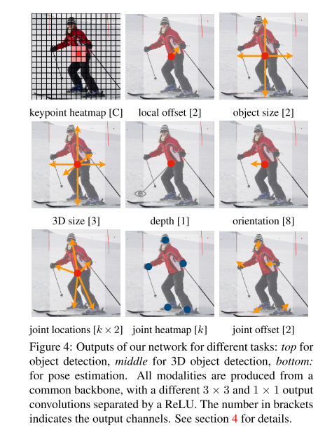

# CenterNet

原论文：[Objects as Points](https://arxiv.org/abs/1904.07850)

直接预测bounding box的中心点和尺寸，预测阶段不需要NMS操作。

主要翻译第3、4节。

## 3 Preliminary

​		设定$L \in R^{W \times H \times 3}$作为输入图像。我们的目的是产生keypoint heatmap $\hat{Y} \in [0,1]^{\frac{W}{R} \times \frac{H}{R} \times C}$，其中$R$是输出步长，$C$是关键点的类型数量。在人体姿态估计中Keypoint types有$C=17$个人体节点，目标检测中有$C=80$个目标类别。在本文中默认的输出步长$R=4$。输出步长下采样程度根据下降因子$R$来控制。预测$\hat{Y}_{x,y,z}=1$对应一个检测关键点，$\hat{Y}_{x,y,z}=0$为背景类。我们使用剧中不同的全卷积encoder-decoder网络从一张图像来预测$\hat{Y}$：堆叠hourglass网络、ResNet、DLA。

​		用Law and Deng它们的方式训练关键点预测网络。对于属于类别$c$的每个真值关键点$p \in R^2$，低分辨率的同等点为$\tilde{p} = \lfloor \frac{p}{R} \rfloor$。然后将所有真值关键点通过高斯内核$Y_{xyz}= \exp(-\frac{(x-\tilde{p}_x)^2 + (y-\tilde{p}_y)^2}{2 \sigma_p^2})$映射到heatmap $Y \in [0,1]^{\frac{W}{R} \times \frac{H}{R} \times C}$中，其中$\sigma_p$是目标大小自适应标准偏差。如果两个高斯函数拥有相同的类别覆盖，我们按元素取最大值。训练目标是具有focal loss的penalty-reduced pixel-wise logistic regression。
$$
L_k = \frac{-1}{N} \sum_{xyc} \begin{cases}
(1- \hat{Y}_{xyc})^{\alpha} \log(\hat{Y}_{xyc}) & \text{if }Y_{xyc} = 1 \\
(1- \hat{Y}_{xyc})^{\beta} (\hat{Y}_{xyc})^{\alpha} &\text{otherwise} \\
\log(1 - \hat{Y}_{xyc})
\end{cases} \tag{1}
$$
其中$\alpha, \beta$是focal loss的超参数，$N$是图像$I$的关键点总数。$N$用来正则化是用于规范所有positive focal loss instances至1。其中$\alpha = 2, \beta = 4$。

​		为了恢复输出步长导致的离散型误差，我们针对每个center point预测一个本地偏置$\hat{O} \in R^{\frac{W}{R} \times \frac{H}{R} \times 2}$。所有类别共享相同的offset预测。offset使用L1 Loss进行训练：
$$
L_{off} = \frac{1}{N} \sum_p |\hat{O}_{\tilde{p}} - (\frac{p}{R} - \tilde{p})| \tag{2}
$$
监督效果仅在关键点位置$\tilde{p}$起作用，其它位置都被忽略。在下一节中，我们将展示如何扩展这个关键点估计到通用目标检测器中。

## 4 Objects as Points

​		设定$(x_1^{(k)}, y_1^{(k)}, x_2^{(k)}, y_2^{(k)})$为关键点$k$为类别$c_k$的边界框。它的中心点在$p_k = ( \frac{x_1^{(k)} + x_2^{(k)}}{2},\frac{y_1^{(k)} + y_2^{(k)}}{2} )$。我们使用关键点估计$\hat{Y}$来预测所有中心点。此外，我们针对每个目标$k$回归目标尺寸$s_k = (x_2^{(k)} - x_1^{(k)}, y_2^{(k)} - y_1^{(k)})$。为了限制计算成本，我们针对所有目标类别使用单个尺寸估算$\hat{S} \in R^{\frac{W}{R} \times \frac{H}{R} \times 2}$。我们使用L1 Loss来针对中心点与真值点的相似度：
$$
L_{size} = \frac{1}{N} \sum_{k=1}^N |\hat{S}_{p_k} - s_k | \tag{3}
$$
我们不标准化尺度并直接使用原始像素坐标。我们改为使用一个常数$\lambda_{size}$来缩放损失。整体的训练目标是：
$$
L_{det} = L_k + \lambda_{size} L_{size} + \lambda_{off} L_{off} \tag{4}
$$
除非特别注明，我们的实验中设置$\lambda_{size}=0.1, \lambda_{off}=1$。我们使用单个网络来预测关键点$\hat{Y}$，偏移量$\hat{O}$，尺寸$\hat{S}$。每个位置预测总共$C+4$的输出。所有输出共享全卷积的backbone网络。对于每种模态，backbone形成的特征之后都会经过$3 \times 3$卷积、ReLU和另一个$1 \times 1$卷积。图4显示了网络输出的整体架构。第5节为额外的架构细节和补充。

**From points to bounding boxes**

​		在推理阶段，我们首先独立提取每个类别的the peaks in the heatmap。我们检测其值大于或等于其8个邻域的所有响应并保留前100个峰值。设定$\hat{P}_c$为$n$个检测中心点属于类别$c$的中心点$\hat{P} = \{(\hat{x}_i, \hat{y}_i)\}_{i=1}^n$。每个关键点位置由整数坐标$(x_i,y_i)$给定。我们使用关键点值$\hat{Y}_{x_iy_ic}$作为其检测置信度的度量，并在位置生成边界框：
$$
(\hat{x}_i + \delta \hat{x}_i - \hat{w}_i/2, \hat{y}_i + \delta \hat{y}_i - \hat{h}_i/2, \\ \hat{x}_i + \delta \hat{x}_i + \hat{w}_i/2, \hat{y}_i + \delta \hat{y}_i + \hat{h}_i/2,)
$$
其中$(\delta \hat{x}_i, \delta \hat{y}_i) = \hat{O}_{\hat{x}_i, \hat{y}_i}$是偏移预测，$(\hat{w}_i, \hat{h}_i) = \hat{S}_{\hat{x}_i,\hat{y}_i}$是尺寸预测。所有输出直接来源于关键点估计而非基于IoU的NMS或其它后处理步骤。峰值关键点提取作为一个足够的NMS替代方案，可以在使用$3 \times 3$卷积的最大池化操作的设备上有效实现。

### 4.1 3D detection

​		3D检测估算每个目标的三维边界框，并用额外的每个中心点属性：depth、3D dimension，orientation。为每一个添加额外的检测头。每个中心点预测一个标量$d$，然而，depth预测并没这么直接。我们使用$d= 1/ \sigma(\hat{d})-1$来预测depth，其中$\sigma$为sigmoid函数。我们将depth视为计算关键点预测的额外输出通道$\hat{D} \in [0,1]^{\frac{W}{R} \times \frac{W}{R}}$。它再次使用由ReLU分隔的两个卷积层。与之前的模态不同，它在输出层使用逆sigmoid变换。在sigmoid变换之后，我们在原始depth domain中使用L1 loss训练深度估计器。

​		一个目标的3D维度为3个标量。通过使用检测头$\hat{\varGamma} \in R^{\frac{W}{R} \times \frac{W}{R} \times 3}$和L1 loss来直接回归绝对值。

​		方向默认是个标量。然而，它并不好回归。我们使用two bins with in-bin regression来表示方向。特别是，对于每个orientation使用8个标量表示，每个bin使用4个标量表示。对于每个bin，两个标量用于softmax分类，剩余的用于回归每个bin的角度。在附录中详见这些损失的细节。

### 4.2 Human pose estimation

​		人体姿态估计用于估计每个人体实例的$k$个2D人体关节（COCO中$k=17$）。我们设定姿势视为中心点的$k \times 2$维属性，并通过到中心点的偏量堆每个关键点进行参数化。我们直接用L1 Loss回归关键点偏移（在像素点层面）$\hat{J} \in R^{\frac{W}{R} \times \frac{W}{R} \times k \times 2}$，我们通过掩盖损失来忽略不可见的关键点。这导致类似于基于回归的单阶段多人人体姿态估计器slow-RCNN版本。

​		为了微调关键点，我们进一步使用标准的自下而上的多人姿态估计来估计$k$个人体关节点的heatmaps $\hat{\Phi} \in R^{\frac{W}{R} \times \frac{H}{R} \times k}$。我们使用focal loss来训练人体节点heatmap，以及类似于第3节中讨论的中心检测的局部像素偏移。

​		然后，我们将初始预测捕捉到此heatmap上最近检测到的关键点。在这里，我们的中心偏移充当分组提示，将单个关键点检测分配给它们最近的人体实例。特别是，设定$(\hat{x}, \hat{y})$为检测的中心点。我们首先回归所有的关节位置$l_j = (\hat{x}, \hat{y}) + \hat{J}_{\hat{x}\hat{y}j}$，其中$j \in 1 \cdots k$。对于与heatmap$\Phi_{..j}$相对应的关节点$j$，其置信度大于0.1的提取所有关键点位置$L_j=\{\tilde{l}_{ji}\}_{i=1}^{n_j}$。然后我们分配每个回归位置$l_j$到它的邻近检测关键点$\arg \min_{l \in L_j}(l - l_j)^2$，只考虑边界框内检测物体的关节点检测。

# 理解点

1. 直接预测物体bounding box的中心点和尺寸
2. 预测阶段去除NMS

