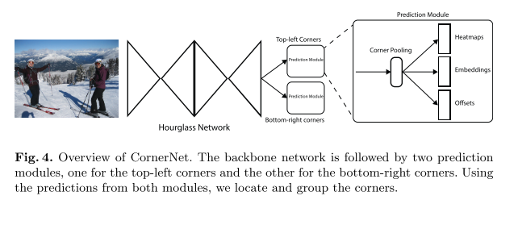
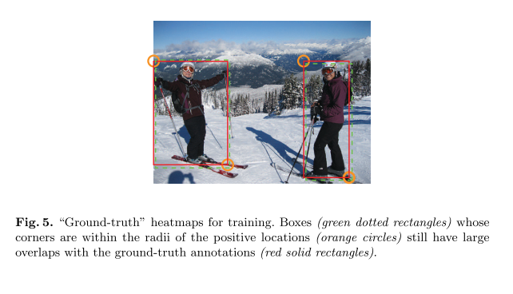
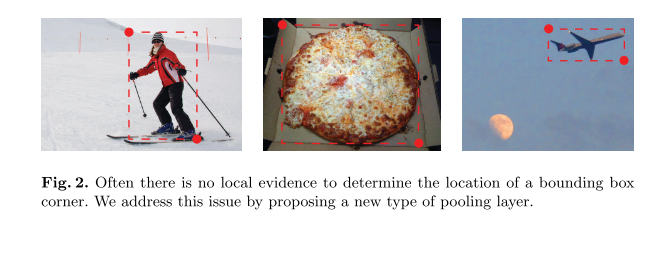
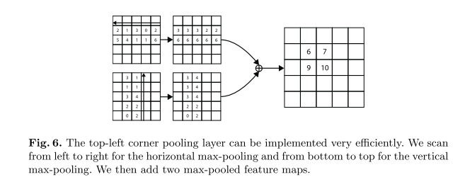
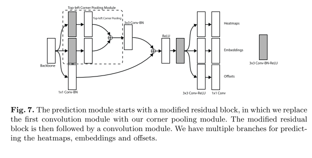

# CornerNet

原论文：[CornerNet: Detecting Objects as Paired Keypoints](https://arxiv.org/abs/1808.01244)

舍去传统的anchor boxes思路，将预测目标变为目标边界框的左上角和右下角一对顶点。

论文结构：

1. 引文（针对当前CNN的锚点问题，提出针对性的解决方案并简单介绍）
2. 相关工作（Two-stage检测器、One-stage检测器介绍）
3. CornerNet介绍
4. 实验结果
5. 结论

主要翻译第3节。

## 3 CornerNet

### 3.1 Overview

​		在CornerNet中，我们检测目标为一对keypoints——边界框的左上角点和右下角点。通过卷积网络预测两组heatmaps来表示不同对象类别的corners位置，一组用于左上角点，一组用于右下角点。网络还为每个detected corner预测an embedding vector，使得来自来自同一对象的两个corners的embeddings之间的距离很小。为了产生更紧密的边界框，网络还预测offsets以稍微调整corners的位置。在预测的heatmaps、embeddings和offsets条件下，我们应用简单的后处理算法来获取最终的边界框。

​		图4提供了CornerNet的整体结构。我们使用hourglass network作为CornerNet的backbone。hourglass network后接两个两个预测模块。一个用于预测左上角，另一个用于预测右下角。每个模块都有自己的corner pooling module，用于在预测heatmaps、embeddings、offsets前池化来自hourglass network的特征。不同于其它的object detectors，我们不使用不同尺度的特征来预测不同大小的目标（即FPN + YOLOv3那一套）。我们只是将这两个模块应用于hourglass network的输出。

### 3.2 Detecting Corners

​		我们预测两组heatmaps，一组为top-left corners，一组为bottom-right corners。每组heatmaps拥有$C$个通道，代表$C$个类别，大小为$H \times W$。没有背景通道。每个通道都是一个binary mask，代表类的角点位置。

​		对于每个corner，都有一个ground-truth positive location，所有其他位置就是negative的。在训练期间，我们不是同等的惩罚negative locations，我们减少了针对positive location半径内的negative locations的惩罚。这是因为一对错误的角点预测，如果靠近各自的ground truth locations，它们仍然可以产生一个与ground-truth box重叠的框（如图5所示）。我们通过对象的大小来确定半径，方法是确保半径内的一对points能够生成一个边界框，该边界框至少具有$t$的IoU值（与ground-truth的重叠度）（我们设置为0.7）。给定了半径，惩罚减少数量就由unnormalized 2D Gaussian来决定，$e^{-\frac{x^2+y^2}{2 \sigma^2}}$，中心值即positive location，$\sigma$为半径的1/3。

​		给定$p_{cij}$代表预测heatmaps中位置$(i,j)$对于类别$c$的预测值。给定$y_{cij}$为用unnormalized Gaussians增强的"ground-truth" heatmap。我们设计了focal loss的一个变种：
$$
L_{det} = \frac{-1}{N} \sum_{c=1}^C \sum_{i=1}^H \sum_{j=1}^W 
\begin{cases}
(1-p_{cij})^{\alpha} \log(p_{cij}) &\text{if } y_{cij}=1 \\
(1-y_{cij})^{\beta} (p_{cij})^{\alpha} \log(1-p_{cij}) &\text{otherwise} \tag{1}
\end{cases}
$$
其中$N$指的是一张图片的目标总数，$\alpha,\beta$指的是超参数，控制每个点对损失的贡献度（我们实验中设置$\alpha=2,\beta=4$）。在Gaussian加持下的$y_{cij}$，$(1-y_{cij})$就减少了ground truth locations周围的penalty。

​		许多网络通过下采样层来实现全局信息的汇合以及降低内存占用。当它们以全卷积的方式应用于图像时，输出的大小通常小于输入图像。因此，图像中的位置$(x,y)$映射到heatmap中就变成了位置$(\lfloor \frac{x}{n} \rfloor, \lfloor \frac{y}{n} \rfloor)$，其中$n$就是下降系数。当我们将heatmap中的位置映射回原输入图像位置时，会丧失一些准确度，从而影响小边界框和真值框的IoU值。为了解决这个问题，我们预测位置偏移在将它们映射回原输入分辨率来微调角点位置。
$$
o_k = (\frac{x_k}{n} - \lfloor \frac{x_k}{n} \rfloor , \frac{y_k}{n} - \lfloor \frac{y_k}{n} \rfloor) \tag{2}
$$
其中$o_k$即为offset，其中$x_k,y_k$为$x,y$对应的角点$k$。在实践中，我们预测所有类别的左上角共享的一组偏移量，以及右下角共享的另一组偏移量。对于训练，我们在ground-truth corner locations应用smooth L1 Loss：
$$
L_{off} = \frac{1}{N} \sum_{k=1}^N SmoothL1Loss(o_k, \hat{o}_k) \tag{3}
$$

### 3.3 Grouping Corners

​		多个目标可能出现在同一张图片中，所以多个top-left和bottom-right corners会被检测到。我们需要一种方法来将相同边界框的top-left corner和bottom-right corner组合在一起。我们所使用的方法受启发于Newell等人提出的用于多人姿态估计的的Associative Embedding method。Newell等人检测所有人体关节并为每个检测到的关节生成embedding。它们根据embeddings之间的距离对关节进行分组。

​		该思想同样适合我们的任务。网络针对属于同一边界框的左上角点和右下角点预测embedding vector，它们之间的距离应当很小。之后我们可基于该距离将corners分组。embeddings的真实值并不重要，它的值仅用来分组。

​		我们使用1维的embeddings。假设$e_{t_k}$代表目标$k$的左上角点的embedding，$e_{b_k}$代表右下角点的embedding。我们使用"pull" loss来训练网络分组角点，"push" loss来分离角点：
$$
L_{pull} = \frac{1}{N} \sum_{k=1}^N [(e_{t_k} - e_k)^2 + (e_{b_k} - e_k)^2] \tag{4} \\
$$

$$
L_{push} =\frac{1}{N(N-1)} \sum_{k=1}^N \sum_{j=1, j \not = k} \max(0, \varDelta - |e_k - e_j|) \tag{5}
$$

其中$e_k$是$e_{t_k}$和$e_{b_k}$的平均值，在所有实验中$\varDelta=1$。与offset loss相似，我们只在ground-truth corner location应用损失函数。

### 3.4 Corner Pooling

​		如图2所示，对于角点的存在，通常没有局部视觉特征。我了确定该像素是左上角点，我们需要水平向右看对象的最上边界，垂直向下看最左边界。因此，我们提出corner pooling，通过编码显式先验知识来更好的定位角点。

​		假设我们要确定$(i,j)$的像素点是否为左上角点。令$f_t,f_l$为左上角池化层输入的特征图，$f_{t_{ij}},f_{l_{ij}}$分别为特征图$f_t,f_l$特征图在位置$(i,j)$的向量。给定特征图为$H \times W$，corner pooling layer首先最大池化$f_t$中的$(i,j)$到$(i, H)$之间的所有特征向量到$t_{ij}$中，同样的道理适用于$f_l$中的$(i,j)$到$(W,j)$。最终，将$t_{ij}$和$l_{ij}$加在一起。该计算可表达为如下算式：
$$
t_{ij} = \begin{cases}
\max(f_{t_{ij}, t_{(i+1)j}}) &\text{if }i<H \\
f_{t_{Hj}} &\text{otherwise} \tag{6}
\end{cases}
$$

$$
l_{ij} = \begin{cases}
\max(f_{l_{ij}}, l_{i(j+1)}) &\text{if }j < W\\
f_{l_{iW}} &\text{otherwise} \tag{7}
\end{cases}
$$

其中我们应用了逐元素最大操作。$t_{ij}$和$l_{ij}$都可以通过动态规划有效地计算，如图6所示。

​		右下角的计算方式类似。corner pooling layers产生的结果用于预测模块产生heatmaps、embeddings和offsets。

​		图7展示了预测模块的整体架构。模块的第一部分是残差版本的修改版。在该修改版中，我们用corner pooling模块替换了首个$3 \times 3$卷积模块，通过2个128通道的$3 \times 3$卷积模块来处理backbone的特征，然后应用corner pooling layer。与residual block设计类似，之后我们将池化特征用256通道的$3 \times 3$Conv-BN层来处理，然后与另一个残差分支相加。修改版的residual block后接一个256通道的$3 \times 3$卷积模块，以及3个Conv-ReLU-Conv层用于产生heatmaps、embeddings、offsets。

### 3.5 Hourglass Network

​		CornerNet使用hourglass network作为我们的backbone。hourglass network首先应用于人体姿态估计任务。它是由多个hourglass模块组成的全卷积网络。一个hourglass模块通过一系列卷积层和最大池化层来下采样输入特征。然后通过一系列上采样和卷积层来还原原始分辨率。由于最大池化层中的细节丢失，因此添加了跳接层来将细节带回上采样特征。hourglass模块在单个同一结构中捕获全局和局部特征。当多个hourglass模块堆叠在网络中时，hourglass模块可以重新处理特征以捕获更高级别的信息。这些特征也使得hourglass网络称为目标检测的理想选择。

​		我们的hourglass网络由两个hourglasses组成，同时我们对hourglass模块的架构进行了一些修改。通过使用stride=2的卷积替换最大池化来降低特征分辨率。降低分辨率5次，同时增长特征维度数量(256, 384, 384, 384, 512)。当我们上采样特征时，我们应用2个残差模块，然后是最近邻上采样。每个残差连接由2个残差块组成。每个hourglass模块的中间由512通道的4个残差模块组成。在使用hourglass模块之前，我们使用$7 \times 7$卷积模块将图像分辨率降低了4倍，其步长为2，通道为128，然后是一个残差块，步长为2，通道数为256。

​		与原论文中的一样，我么在训练期间同样采样中间特征监督。然而，我们不会将中间预测添加回网络，因为我们发现这会损害网络的性能。我们将$3 \times 3$的Conv-BN模块应用于第一个hourglass模块的输入和输出。然后我们通过逐元素加法合并它们，然后是ReLU和具有256通道的残差块，然后将其用作第二个hourglass模块的输入。hourglass网络的深度为104。与许多其它最先进的检测器不同，我们只使用整个网络最后一层的特征来进行预测。

# 理解点

1. 用一对角点替换以前的anchor boxes，anchor-free新思路
2. corner pooling的解决思路很有启发性（巧妙应用动态规划）
3. 为什么要用heatmap、embedding、offsets，分别的作用是什么

