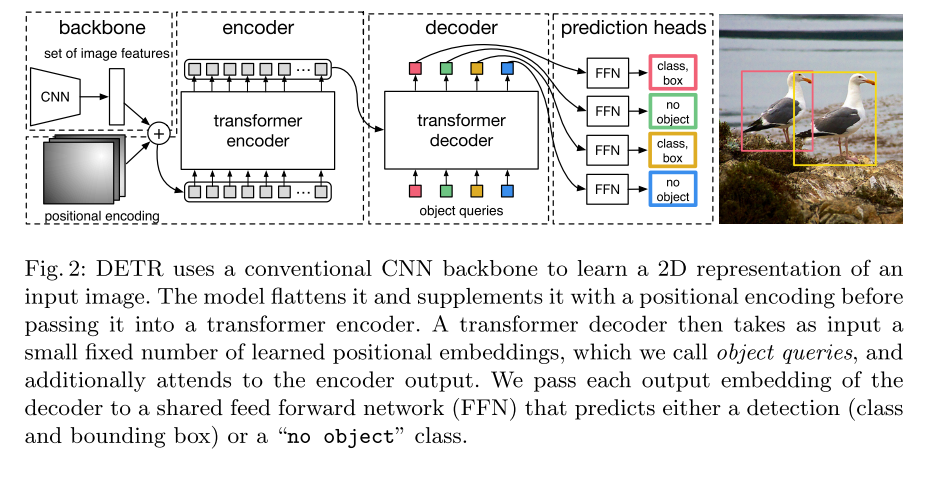

# DETR

原论文：[End-to-End Object Detection with Transformers](https://arxiv.org/abs/2005.12872)

将Transformer引入到目标检测领域的开篇之作。Transformer用作检测头。

主要翻译第3节。

## 3 The DETR model

​		对检测的直接集合预测很重要的两点是：(1) 集合预测损失需要预测框和真值框的一一匹配。(2) 一个预测一系列目标集合的架构，并建模它们的联系。图2展示详细细节。

### 3.1 Object detection set prediction loss

​		DETR推理一个固定尺寸为$N$的预测，通过decoder单向传播，其中$N$是远远大于一张图像的目标数量的。训练阶段的一个主要困难在于将预测目标(class, position, size) 与ground truth进行一一对应。我们的loss使用一个最优的二分匹配来进行预测目标和真值目标的一一配对，然后再优化特定目标的边界框损失。

​		设定$y$为目标的真值集合，$\hat{y}=\{\hat{y}_i\}_{i=1}^N$为$N$个预测值集合。假定$N$远远大于图像中的目标数量，我们设定$y$为包含$\varnothing$（no object）的大小为$N$的集合。为了在两个集合中找到最佳二分匹配，以最低计算成本搜索N个元素的最小成本：
$$
\hat{\sigma} = \arg \min_{\sigma} \sum_{i}^N L_{match}(y_i, \hat{y}_{\sigma(i)}) \tag{1}
$$
其中$L_{match}(y_i, \hat{y}_{\sigma(i)})$是真值$y_i$和预测坐标值$\sigma(i)$的配对匹配成本。这种最优的分配通过Hungarian algorithm计算。

​		匹配成本是class prediction和the similarity of predicted and ground truth boxes的集合。真值集合中每个元素$i$可被视为$y_i=(c_i,b_i)$，其中$c_i$代表target class label（可为$\varnothing$），同时$b_i \in [0,1]^4$是一个向量，代表ground truth box的中心坐标和它相对于图像大小的高和宽。为了预测$\sigma(i)$位置，我们设定类别$c_i$的概率为$\hat{p}_{\sigma(i)}(c_i)$，预测框为$\hat{b}_{\sigma(i)}$。通过这些设置，我们定义$L_{match}(y_i, \hat{y}_{\sigma(i)}) = - \mathbb{1}_{\{c_i \ne \varnothing \}} \hat{p}_{\sigma(i)}(c_i) + \mathbb{1}_{\{c_i \ne \varnothing \}} L_{box} (b_i, \hat{b}_{\sigma(i)})$。

​		在现代检测器中，这种寻找匹配的方式可作为启发式赋值来匹配proposal或anchors和ground truth objects进行对应。最大的不同在于我们找到一种一对一匹配的方式来直接进行集合预测，并非重复预测。

​		第二步就是计算损失函数，对上一步匹配的对进行Hungarian loss。我们定义和通常的目标检测器损失类似的损失函数，针对类别预测的负似然估计的线性聚合，以及边界框的损失定义如下：
$$
L_{Hungarian}(y, \hat{y}) = \sum_{i=1}^N [- \log_{\hat{p}_{\hat{\sigma}(i)}}(c_i) + \mathbb{1}_{\{c_i \ne \varnothing \}} L_{box}(b_i, \hat{b}_{\hat{\sigma}}(i))] \tag{2}
$$
其中$\hat{\sigma}$是上一步计算出最佳匹配。在实践中，为了解决类别不平衡，我们将类别为$c_i = \varnothing$的目标的似然估计权值降低10倍。这与Faster-RCNN训练正负样本的方式等同。值得注意的是，一个目标和$\varnothing$之间的计算成本不取决于预测值，这意味着在该例子中计算量为常量。这使得类预测项与$L_{box}(\cdot,\cdot)$（如下所述）相称，并且我们观察了更好的经验表现。

**Bounding box loss**

​		这是匹配成本的第二部分，也是Hungarian loss的边界框损失分数。不同于对预测做一些初始化猜测的边界框预测，我们直接进行边界框预测。虽然这种方法简化了实现，但它带来了损失相对缩放的问题。最常用的L1 Loss对于大小不同的boxes会有不同的尺度，即使它们相对误差相似。为了解决这个问题，我们使用了L1 Loss和GIoU loss的线性聚合。$L_{iou}(\cdot,\cdot)$是尺度不变的。总之，我们的box loss是$L_{box}(b_i, \hat{b}_{\sigma(i)})$，它定义为$\lambda_{iou} L_{iou}(b_i, \hat{b}_{\sigma(i)}) + \lambda_{L1}||b_i - \hat{b}_{\sigma(i)}||_1$，其中$\lambda_{iou}, \lambda_{L1} \in \mathbb{R}$属于超参数。这两个损失由批次内的对象数量标准化。

### 3.2 DETR architecture

​		整体的DETR架构是极其简单的，如图2所展示的那样。它包含了3种不同的部件：一个用于特征提取的CNN backbone，一个encoder-decoder transformer，一个简单的FFN用于最终的目标预测。

​		不同于现在的检测器，DETR能够在许多深度学习框架中简单实现，只要它提供CNN backbone和transformer架构。用PyTorch实现的话代码量少于50行。我们希望这种方法的简易性能够吸引更多的研究者致力于检测领域。

**Backbone**

​		初始图像大小为$x_{img} \in \mathbb{R}^{3 \times H_0 \times W_0}$。卷积的CNN backbone产生的低维特征图$f \in \mathbb{R}^{C \times H \times W}$。我们使用的结果为$C=2048, H = \frac{H_0}{32}, \frac{W_0}{32}$。

**Transformer encoder**

​		首先，一个$1 \times 1$卷积用于降维，将backbone产生的特征图$f$的通道维度降低为$d$。从而形成一个新的特征图$z_0 \in \mathbb{R}^{d \times H \times W}$。encoder希望一个序列作为输入，因此我们将$z_0$的空间维度压缩成一个维度，形成结果特征图$d \times HW$。每个encoder layer拥有一个标准结构，并由多头自注意力模块和一个FFN组成。transformer结构是permutation-invariant的，我们额外添加固定的positional encoding到每个attention层。

**Transformer decoder**

​		decoder使用transformer的标准结构，使用多头自注意力机制转换$N$个大小为$d$的向量。与原始transformer机制不同的是，我们的模型并行的 decodes $N$个目标。decoder也是permutation-invariant的，N个input embeddings应当产生不同的输出。这些input embeddings是learnt positional encodings，称之为object queries，与encoder中的类似，我们将它们与每个attention layer相加。N个object queries转换成对应的output embedding。然后通过FFN层分别转换成对应的边界框坐标和类别标签，最终产生$N$个结果。

**Prediction feed-forward networks(FFNs)**

​		最终的预测是通过一个3-layer perceptron以及ReLU激活函数，隐藏维度$d$，和一个linear projection layer生成。FFN预测规范化后的中心坐标，边界框的高和宽。线性层使用softmax函数预测类别标签。预测固定大小的$N$个边界框，其中$N$远远大于一张图片中的潜在目标数量，一个额外的类别标签$\varnothing$用于表示没有目标。可视为标准目标检测方法中的"background"类别。

**Auxiliary decoding losses**

​		在训练期间我们发现使用auxiliary losses非常有用，特别是帮厨模型输出每个目标类别的正确数量。在每个decoder层后添加预测FFNs层和Hungarian loss。所有预测FFNs层共享它们的参数。我们使用额外的共享layer-norm来正则化FFNs的不同decoder层的输出。

# 理解点

1. 将Transformer用于目标检测的开山之作
2. Hugarian algorithm

