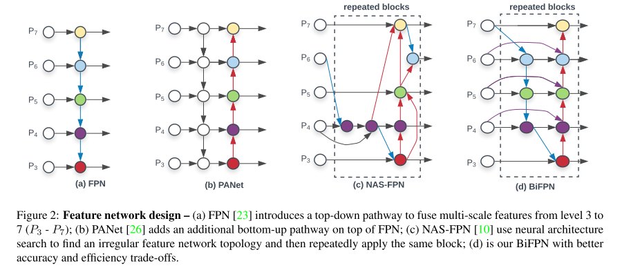
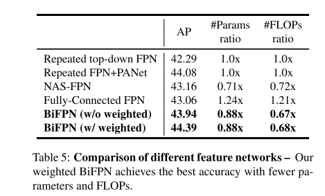
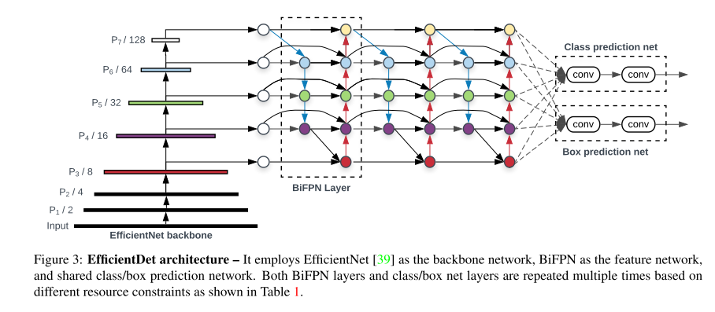

# EfficientDet

原论文：[EfficientDet: Scalable and Efficient Object Detection](https://arxiv.org/abs/1911.09070)

引入BiFPN，目标检测的大跨步。

主要翻译3、4节。

## 3 BiFPN

​		在该节中，我们首先介绍多尺度特征融合问题，然后提出我们的BiFPN主要思想：efficient bidirectional cross-scale connections 和 weighted feature fusion。

### 3.1 Problem Formulation

​		多尺度特征融合致力于融合不同分辨率的特征。正式的说，给定多尺度特征列表$\overrightarrow{P}^{out} = (P_{l_1}^{in}, P_{l_2}^{in}, \cdots)$，其中$P_{l_i}^{in}$代表$l_i$层的特征，我们的目标是要找一种转换方式$f$将不同的特征聚合，并输出一个特征集合：$\overrightarrow{P}^{out} = f(\overrightarrow{P}^{in})$。具体的例子，图2(a)显示了自上而下的卷积FPN。它吸纳3-7级的输入特征$\overrightarrow{P}^{in}=(P_3^{in}, \cdots, P_7^{in})$，其中$P_i^{in}$表示该级特征图为输入图像分辨率的$1/2^i$。举个例子，如果输入分辨率为$640\times 640$，那么$P_3^{in}$表示第3级特征图($640/2^3=80$)，分辨率为$80 \times 80$，其中第7级特征，分辨率变为$5 \times 5$。卷积FPN以自上而下的方式进行多尺度特征聚合。

### 3.2 Cross-Scale Connections

​		传统的自上而下的FPN受限于单向信息流。为了解决这个问题，PANet添加了一个额外的自下而上的聚合路径，如图2(b)所展示的那样。Cross-scale的连接也被进一步研究了。最近，NAS-FPN使用NAS来搜索更好的跨尺度特征网络拓扑结构，但它需要大量的GPU时间用于搜索，并且搜索到的网络是不够稳定或微调的。如图2(c)所展示的。

​		通过研究这三个网络的表现和有效性（表5）。我们发现PANet达到了比FPN和NAS-FPN更好的准确度，但消耗了更多的参数和计算量。为了提高模型的效率，本文提出了几个优化cross-scale connections的方法：第一，我们移除哪些只包含单个input edge的nodes。初始动机很简单：如果一个input edge不包含特征融合，那么它对不同特征融合的贡献度不同。这推导出简单的bidirectional network；第二，我们添加了额外的边从输入到输出，并且假定它们在相同的层，为了保证在不添加额外的消耗下进行特征融合；第三，不同于PANet只有一条自上而下和自下而上的路径，我们将每个bidrectional path视为一个特征网络层，重复相同的层多次，以确保更多的高层特征融合。图2、3展示了我们新的特征网络BiFPN。

### 3.3 Weighted Feature Fusion

​		当融合不同分辨率的特征时，首先是将它们resize成相同分辨率，然后将它们相加。Pyramid attention network引入了global self-attention upsampling来恢复像素定位。所有先前的工作都对输入特征一视同仁。然而，我们发现，由于不同分辨率的输入特征，通常对输出特征的贡献不均等。为了解决这个问题，我们提出了在每个输入添加额外的权重，然后让网络自主学习每个输入特征的重要性。基于这个想法，我们考虑3种加权融合方法：

**Unbounded fusion**

​		$O=\sum_i w_i \cdot I_i$，其中$w_i$是可学习的权重，可为scalar(per-feature)，vector(per-channel)，或multi-dimensional tensor(per-pixel)。我们发现相比其他低计算量的方法，一个标量能够达到具有竞争性的准确度。然而，标量权重是无穷的，它可能会导致训练的不稳定性。因此，我们针对每个权重进行了权重正则化到一定区间。

**Softmax-based fusion**

​		$O= \sum_i \frac{e^{w_i}}{\sum_j e^{w_j}}$。初始动机是，将softmax应用到每个权重，这样就归化到了0-1范围。代表每个输入的重要性。

**Fast normalized fusion**

​		$O = \sum_i \frac{w_i}{\epsilon + \sum_j w_j}$。其中$w_i \ge 0$通过在每个$w_i$后应用ReLU保证，$\epsilon = 0.0001$是一个小的数值从而保证数值的稳定性。相似的，每个正则权值在0-1范围。相比softmax方式，速度更快，并且和softmax效果差不多。

## 4 EfficientDet

​		基于我们提出的BiFPN，我们开发了EfficientDet目标检测器系列。在该节中，我们讨论下网络结构，以及一种新的compound scaling method用于EfficientDet。

### 4.1 EfficientDet Architecture

​		图3展示EfficientDet的整体架构，遵循one-stage detectors原则。我们使用预训练的EfficientNets作为backbone。我们提出的BiFPN类似特则会那个网络，从backbone网络中提取3-7级特征，然后重复自上而下和自下而上路径进行双向特征融合。这些融合的特征送入class和box网络进行预测。和RetinaNet类似，class和box分支共享所有层的特征。

### 4.2 Compound Scaling

​		为了最优化速度和准确度的平衡，我们发展了一系列模型来满足不同的资源受限的条件下。这里的一个关键挑战在于如何对baseline EfficientDet模型进行尺度变换。

​		先前的工作都是对大的backbone网络尺度变换baseline detector，通过使用大的输入图像，或者堆叠更多FPN层。这些方法通常是无效的，因为它们只关注单一或有限的缩放维度。最近的工作展示了联合网络width、depth、input resolution进行尺度变换的有效方法。受这些方法启发，我们提出了一种的用于目标检测的新的compound scaling method，它采用一个单一的compound coefficient $\phi$ 用于联合尺度变换backbone所有维度。

**Backbone network**

​		我们使用和EfficientNet-B0 to B6相同的width/depth scaling coefficients。从而我们能轻松使用ImageNet-pretrained checkpoints。

**BiFPN network**

​		我们线性地增加BiFPN深度$D_{bifpn}$(#layers)，因为深度需要四舍五入为小整数。对于BiFPN的宽度$W_{bifpn}$(#channels)，与[39]类似，以指数形式增长BiFPN宽度$W_{bifpn}$(#channels)。特别是，我们在一个值列表$\{1.2, 1.25, 1.3, 1.35, 1.4, 1.45\}$里面选择最佳的值1.35作为BiFPN的width scaling factor。正式的，BiFPN的的width和depth遵从以下变换规则：
$$
W_{bifpn} = 64 \cdot (1.35^{\phi}), \space \space D_{bifpn} = 3 + \phi \tag{1}
$$
**Box/class prediction network**

​		我们使用和BiFPN的同样的width来固定($W_{pred}=W_{bifpn}$)。使用如下等式线性增长depth(#layers)：
$$
D_{box} = D_{class} = 3 + \lfloor \phi/3 \rfloor \tag{2}
$$
**Input image resolution**

​		BiFPN里面使用3-7级特征，输入分辨率会被下降$2^7=128$倍，所以我们使用以下等式线性增长分辨率：
$$
R_{input} = 512 + \phi \cdot 128 \tag{3}
$$
利用等式1，2，3和不同的$\phi$，我们构建了如表1所示的EfficientDet-D0($\phi=0$) to EfficientDet-D7($\phi=7$)。其中D7和D7x拥有相同的BiFPN和检测头，但是D7使用高分辨率，D7x使用大的backbone网络和更多级的特征图(从$P_3$到$P_8$)。

# 理解点

1. 尺度缩放方法用于BiFPN的构建
2. BiFPN架构

