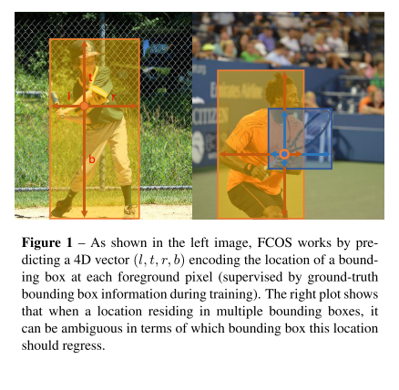
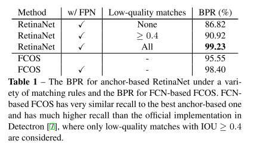
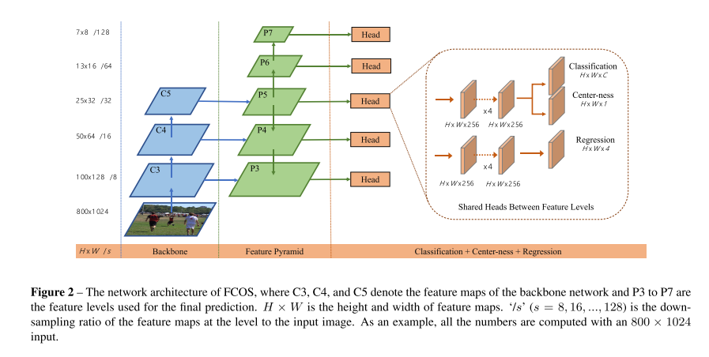
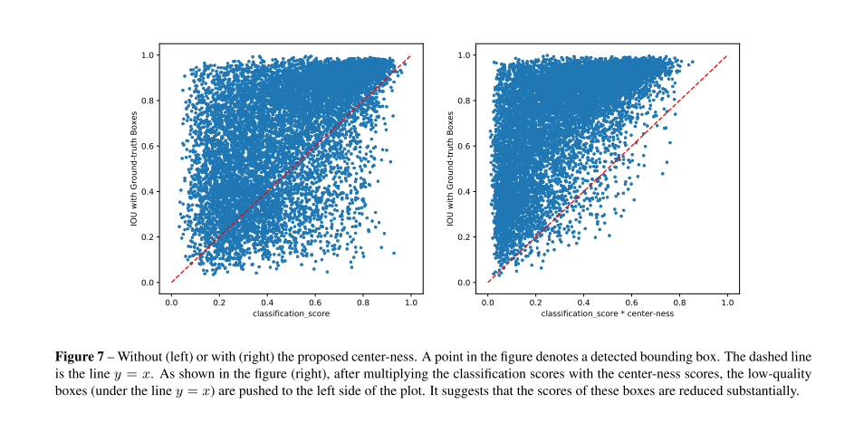
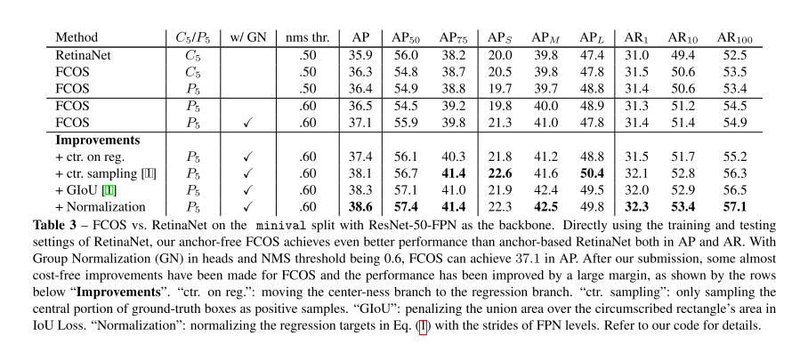

# FCOS

原论文：[FCOS: Fully Convolutional One-Stage Object Detection](https://arxiv.org/abs/1904.01355)

anchor-free，one-stage

论文结构：

1. 引文（CNN在目标检测的发展史，以及存在的问题，引出FCOS）
2. 相关工作（anchor-based和anchor-free检测器介绍）
3. 具体方法
4. 实验结果
5. RPN的扩展实验
6. 结论

主要翻译第3节。

## 3 Our Approach

​		在该章节，我们首先将目标检测视为逐像素预测问题。然后，我们展示我们如何使用多级预测来提高召回率和解决重叠边界框导致的歧义。最后，我们列出提出的"centerness"分支，这有助于抑制检测到的低质量边界框，并大幅提高整体性能。

### 3.1 Fully Convolutional One-Stage Object Detector

​		假定$F_i \in R^{H \times W \times C}$表示backbone中第$i$层的特征图，$s$表示当前层的总步长。一张输入图像的真值边界框定义为$\{B_i\}$，其中$B_i = (x_0^{(i)}, y_0^{(i)}, x_1^{(i)}, y_1^{(i)}, c^{(i)}) \in R^4 \times\{1,2,\cdots,C\}$。其中$(x_0^{(i)}, y_0^{(i)})$和$(x_1^{(i)},y_1^{(i)})$表示边界框的左上角点和右下角点坐标。$c^{(i)}$指的是边界框的类别指向。$C$是类别数量，其中MS-COCO数据集包括80类。

​		对于特征图$F_i$的每个位置$(x,y)$，可以反向映射回原图坐标$(\lfloor \frac{s}{2} \rfloor + xs, \lfloor \frac{s}{2} \rfloor +ys)$，在坐标$(x,y)$处的感受野中心。与anchor-based的检测器不同，将输入图像上的位置视为（多个）锚框的中心，并以这些锚框作为参考回归目标边界框，我们直接在该位置回归目标边界框。换句话说，我们的检测器将位置视为训练样本，而不是anchor-based detectors中的anchor boxes，这与语义分割的FCN相同。

​		特别是，如果$(x,y)$是处于真值区域且类别标签$c^*$与真值区域的标签一致，就可视为一个positive sample。否则就是为negative sample且$c^*=0$（即背景类）。除了分类标签，我们还用一个4D的标签$t^*=(l^*, t^*, r^*, b^*)$表示回归目标的位置。其中$l^*,t^*,r^*,b^*$表示该位置到4个边的距离。如图1左所示。如果一个位置同时落入多个边界框中，它可被视为ambiguous sample。我们简单地选择面积最小的边界框作为其回归目标。在下一节中，我们会展示多级预测，ambiguous samples的数量会显著下降并且不会对最终结果产生明显影响。形式上，如果位置$(x,y)$与边界框$B_i$相关链，则该位置的训练回归目标可表示为：
$$
l^* = x-x_0^{(i)}, t^* = y - y_0^{(i)} \\
r^* = x_1^{(i)} - x, b^* = y_1^{(i)} - y \tag{1}
$$

**值得注意的是，FCOS可以利用尽可能多的foreground samples来训练回归器。**它与anchor-based检测器不同，anchor-based检测器主要将与ground-truth boxes拥有高IOU的anchor boxes视为positive samples。我们认为这可能是FCOS比同等的anchor-based检测器优异的原因。

**Network Outputs.**

​		与训练目标对应，最终层预测80D的向量$p$用于分类标签和4D的向量$t=(l,t,r,b)$用于边界框坐标。与RetinaNet类似，我们不训练多类分类器，而是训练C个二元分类器。与RetinaNet类似，我们在backbone生成的特征图后分别添加4层卷积层用于分类和回归分支。此外，由于回归目标始终为positive，我们使用$\exp(x)$在回归分支顶部将结果映射到$(0,\infty)$。值得注意的是，FCOS的网络输出变量比流行的基于锚点的检测器（RetinaNet、Faster R-CNN）少9倍（它们在每个位置有9个锚框）。

**Loss Function.**

​		我们定义我们的训练损失函数为如下式子：
$$
L(\{p_{x,y}\},\{t_{x,y}\}) = \frac{1}{N_{pos}} \sum_{x,y} L_{cls}(p_{x,y},c_{x,y}^*) + \frac{\lambda}{N_{pos}} \mathbb{1}_{\{c_{x,y}^*>0\}} L_{reg}(t_{x,y}, t_{x,y}^*) \tag{2}
$$
其中$L_{cls}$是RetinaNet中使用的focal loss，$L_{reg}$是UnitBox中使用的IOU Loss。$N_{pos}$指的是positive samples数量，同时在本文中$\lambda=1$。损失总和是在特征图$F_i$上的所有位置上计算的。$\mathbb{1}_{\{c_i^*>0\}}$是指标函数，如果$c_i^*>0$则为1，反之则为0。

**Inference.**

​		FCOS的推理是直接的。给定一张输入图像，用它进行前向运算，获得特征图$F_i$每个位置的分类分数$p_{x,y}$和回归预测$t_{x,y}$。和RetinaNet一样，选择$p_{x,y} > 0.05$的位置作为positive samples，然后转换公式(1)来获取预测边界框。

### 3.2 Multi-level Prediction with FPN for FCOS

​		这节我们展示如何通过结合FPN的多级预测解决FCOS面临的两个问题。1) CNN网络的最终特征图的下降幅度（例如16倍）会导致相对较低的最佳召回率(BPR)。对于anchor based detectors，可以通过降低所需的IOU阈值来获取positive anchor boxes，从而弥补大的下降幅度导致的低召回率。对于FCOS，乍一看，人们可能会认为BPR可能比基于锚点的检测器低得多，因为由于步幅较大，无法召回最终特征图上没有位置编码的对象。再次，我们的实验显示出即使是大的步长，FCN-based FCOS仍然能够产生好的BPR，它甚至可以比官方Detectron实现的基于锚点的检测器RetinaNet的BPR更好（参见表1）。因此，BPR就不是FCOS的问题。此外，与多级FPN预测的结合，BPR能够提升很多，并且能够比RetinaNet更好。2) 真值框的重叠会导致难以处理的歧义。比如：重叠中的位置一共回归哪个边界框？这种模糊性会导致基于FCN的检测器性能下降。在这项工作中，我们表明可以通过多级预测极大地解决歧义，并且与基于锚点的检测器相比，基于FCN的检测器可以获得同等甚至更好的性能。

​		与FPN类似，我们在不同级别特征图检测不同大小的目标。特别是，我们使用定义为$\{P_3, P_4, P_5, P_6, P_7\}$的五级特征图。$P_3,P_4,P_5$是backbone特征图$C_3,C_4,C_5$后接一个$1 \times 1$卷积层以及自上而下连接生成的，如图2所展示的那样。$P_6,P_7$的生成是在$P_5,P_6$后分别后接步长为2的卷积层形成的。最终，$P_3,P_4,P_5,P_6,P_7$分别下降8,16,32,64,128倍。

​		不同于anchor-based detectors中的针对不同特征级别分配不同大小的锚点框，我们直接限制每级特征图的边界回归框边界范围。更具体地说，我们首先计算所有特征级别上每个位置的回归坐标$l^*,t^*,r^*,b^*$。接下来，如果一个位置满足$\max(l^*,t^*,r^*,b^*) > m_i$或者$\max(l^*,t^*,r^*,b^*) < m_{i-1}$，它被视为负样本，就不用回归边界框了。此处的$m_i$是特征级别$i$需要回归的最大距离。在这项工作中，$m_2,m_3,m_4,m_5,m_6,m_7$分别设置为0，64，128，256，512，和无穷。由于具有不同大小的对象被分配到不同的特征级别，并且大多数重叠发生在具有不同大小的对象之间。如果一个位置，即使使用了多级预测，仍然被分配给多个真值框，我们只需选择面积最小的真值框作为其目标。正如我们的实验所示，多级预测可以在很大程度上缓解上述歧义，并将基于FCN的检测器提高到与基于锚点的检测器相同的水平。

​		最终，与FPN、RetinaNet一致，不同特征级别的特征图共享检测头，不仅使检测器参数高效，而且还提高了检测性能。然而，我们发现需要不同的特征级别来回归不同的大小范围（例如，P3的范围为[0，64]，P4的范围为[64,128]），因此针对不同的特征级别不合理利用相同检测头。因此，我们没有使用标准的$\exp(x)$，而是使用带有可训练标量$s_i$的$\exp(s_ix)$来自动调整特征级别$P_i$的指数函数的基数，这略微提高了检测性能。

### 3.3 Center-ness for FCOS

​		在FCOS中使用多级预测后，在FCOS和anchor-based detectors之间仍存在一定差距。我们观察到这是由于远离对象中心的位置产生了许多低质量的预测边界框。我们提出了一种简单而有效的策略来抑制这些低质量的边界框，并且没有引入任何超参数。具体来说，我们添加了一个与分类分支并行的单层分支（如图2所示）来预测位置的"center-ness"。center-ness描述了从该位置到该位置负责的对象中心的归一化距离，如图7所示。给定一个位置的回归目标为$(l^*,t^*,r^*,b^*)$，center-ness目标定义为：
$$
centerness^* = \sqrt{ \frac{\min(l^*,r^*)}{\max(l^*,r^*)} \times \frac{\min(t^*,b^*)}{\max(t^*, b^*)}} \tag{3}
$$
在此使用sqrt来减缓中心度的衰减。中心度范围从0到1，因此使用二元交叉熵(BCE)损失来进行训练。损失被添加到损失函数方程(2)中。测试阶段，最终分数（用于对检测到的边界框进行排序）是通过将预测的中心度与相应的分类分数相乘来计算的。因此，中心度可以降低远离对象中心的边界框的分数。因此，这些低质量的边界框很有可能被最终的NMS过程过滤掉，从而显著提高检测性能。

​		center-ness的另一种选择是仅使用真实边界框的中心部分作为正样本，以一个额外的超参数为代价。在我们提交之后，表明两种方法的结合可以实现更好的性能。实验结果详见表3。

# 理解点

1. anchor-free，变成语义分割类似的keypoint
2. 添加center-ness弥补FCOS与anchor-based detectors的效果差距

