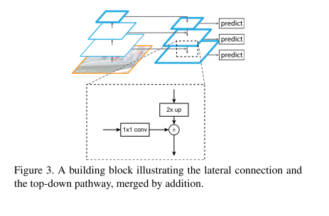

# FPN

原论文：[Feature Pyramid Networks for Object Detection](https://arxiv.org/abs/1612.03144)

实现浅层特征和深层特征的融合。

主要思想在于第3节。

## 3 Feature Pyramid Networks 特征金字塔网络

​		我们的目标在于探索一个属于卷积网络的金字塔型特征层次，它拥有从低级到高级的语义特征，并构建一个具有高级语义的特征金字塔。由此产生的特征金字塔网络是通用的，在本文中，我们专注于滑动窗口提议器（区域提议网络，RPN）和基于区域的检测器（Fast R-CNN）。

​		我们方法的输入为任意大小的单尺度图片，并用全卷积的方式输出多个级别成比例大小的特征图。该过程独立于主干卷积架构，在本文中，我们使用ResNets展示结果。我们金字塔的构建涉及自下而上的路径、自上而下的路径和横向连接，如下所述。

**Bottom-up pathway 自下而上的路径**

​		自下而上的路径是主干ConvNet的前馈计算，它计算由多个尺度的特征图组成的特征层次结构，缩放步长为2。通常有很多层产生相同大小的输出图，我们说这些层在同一个stage。对于我们的特征金字塔，我们定义一个stage为一个金字塔级别。我们选择每个stage的最后一层的输出作为我们的特征图引用集合，我们将丰富它（某种方式）然后创建我们的金字塔。这种选择是很自然的，因为每个stage的最深层应该具有最强的特征。

​		特别是，对于ResNet系列而言，我们使用每个stage的最后一个residual block的激活特征结果。我们定义这些residual block的输出为$\{C_2, C_3, C_4, C_5\}$对应为conv2、conv3、conv4、conv5的输出，分别对应输入图像下采样$\{4,8,16,32\}$倍。由于其大内存占用，我们没有将conv1包含在金字塔中。

**Top-down pathway and lateral connections 自上而下的路径和横向连接**

​		自上而下的路径通过对来自更高金字塔级别的空间上更粗糙但语义上更强大的特征图进行上采样来幻化更高分辨率的特征。然后这些特征通过横向连接从自下而上的路径中得到增强。每个横向连接从自下而上的路径和自上而下的路径合并相同空间大小的特征图。自下而上的特征图具有较低级别的语义，但由于它被下采样的次数较少，能够更准确地定位。

​		图3显示了构建自上而下特征图的构建块。对于较粗分辨率的特征图，我们将空间分辨率上采样2倍（为简单起见，使用最近邻上采样）。然后上采样特征图和对应的自下而上特征图汇合（通过$1 \times 1$卷积层来降低通道维度），通过按元素相加。这个过程迭代进行，知道最终分辨率的特征图生成。为了开始迭代流程，我们简单的在$C_5$层附加$1 \times 1$卷积层来生成最粗分辨率图。最后，在每个汇总后的特征图上使用$3 \times 3$卷积来生成最终特征图，这是为了减少上采样的混叠效应。特征图的最终集合称为$\{P_2, P_3, P_4, P_5\}$，分别对应$\{C_2, C_3, C_4, C_5\}$，拥有相同的空间大小。

​		因为金字塔的所有层次都使用共享的分类分支/回归分支，与传统特征化图像金字塔中的一样，我们在所有特征图中固定特征维度（通道数，表示为d）。设置$d=256$，然后所有额外的卷积层的输出都是256维。这些额外层中不包含非线性操作，依据经验发现它们的影响很小。

​		简化是我们设计的核心，并且我们发现我们的模型对很多设计结构都具有鲁棒性。我们在很多当前先进的blocks进行了实验验证，发现表现优于之前的模型。设计更好的连接模型不是本文的重点，因此我们选择了上述的简单设计。

# 理解点

1. 借鉴ResNet的跳接操作，结合浅层特征和深层特征。
2. 在不同分辨率的特征图上做预测。

