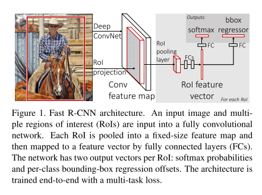
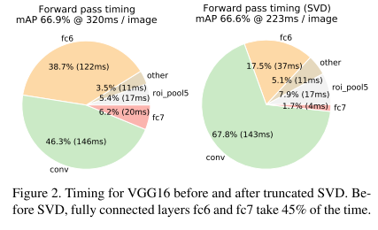

# Fast R-CNN

原论文：[Fast R-CNN](https://arxiv.org/abs/1504.08083)

通过改进加速R-CNN、SPPNet的运行

论文结构：

1. 引文（介绍R-CNN、SPPNet的不足，提出Fast R-CNN来解决）
2. Fast R-CNN架构和训练
3. Fast R-CNN检测
4. 实验结论
5. 消融实验
6. 结论

第2、3节包含结构的整体思想。

## 2 Fast R-CNN architecture and training Fast R-CNN架构和训练

​		图1展示了Fast R-CNN的结构。Fast R-CNN结构将一整张图像和目标候选框集合视为输入对象。该网络首先用几层卷积层和最大池化层来处理整张图象产生卷积特征图。然后，对每个目标候选框通过RoI(region of interest)池化层从特征图提取出固定长度的特征向量(feature map)。每个特征向量都被后续的一系列全连接层处理，最终将输出层分成两个分支：一个用于产生包含K个种类和1个背景的softmax概率，一个用于产生对K个种类的每种类4个真实目标值（每4个值代表K个种类之一的边界框位置）。

### 2.1 The RoI pooling layer RoI池化层

​		RoI池化层使用最大池化来提取特征，将各种有效RoI映射为小的固定尺寸为$H \times W$​（比如$7 \times 7$）的特征图，其中$H$和$W$​​是该层的超参数，独立于任意的RoI大小（参考SPPNet的空间金字塔池化）。本论文中，一个RoI可被视为针对卷积特征图的转换窗口。每个RoI用四元组$(r,c,h,w)$来唯一定义，其中$(r,c)$表示左上角的点，$(h,w)$表示该窗口的高和宽。

​		RoI最大池化层通过将$h \times w$的RoI窗口转化成$H \times W$的子窗口网格，每个子窗口像素由大小约为$h/H \times w/W$​的窗口进行最大池化得来。池化独立的应用在每个特征图通道，如标准最大池化一样。RoI层相当于SPPNets中空间金字塔池化层的特例，它只有一层。池化子窗口的计算和SPPNets的一致。

### 2.2 Initializing from pre-trained networks 预训练网络初始化

​		我们实验使用了三种经过ImageNet预训练的网络，每个拥有5层最大池化层，卷积层数量在5层到13层之间。当一个预训练的网络初始化一个Fast R-CNN网络时，它会经过三个步骤。

​		第一，最后的最大池化层换成RoI池化层，$H$和$W$的设置与第一个全连接层匹配。（比如：VGG16的$H=W=7$）

​		第二，网络最后的全连接层和softmax层替换为两个之前提出过的分支。（一个是：全连接层+softmax层用于$K+1$个类别的识别，一个是：每个类别的边界回归框）

​		第三，网络的数据输入改为：图片列表和每张图片的RoI列表。

### 2.3 Fine-tuning for detection 微调后用于目标检测

​		在Fast R-CNN中，用BP算法训练所有网络权重。第一，让我们先阐明为什么SPPNet无法更新空间金字塔池化层以下的权重。

​		导致这个问题的主要原因在于当每个训练样本（即RoI）来自不同图像时，SPP层的BP算法效率是非常低的，而这正是R-CNN和SPPnet的训练方式。这种低效源于每个RoI可能包含非常大的感受野，通常跨越整张图像。由于前向传播必须处理整个感受野，因此训练输入很大（通常为整张图像）。

​		我们提出一种得益于训练期间特征共享的有效训练方法。在Fast R-CNN训练中，随机梯度下降（SGD）小批量分层采样算法，首先通过采样N个图像，然后从每个图像中采样R/N个RoI。严格来讲，从相同图像产生的RoIs共享前向后向传播的计算和内存。将N取小可以减少小批次的计算量。举个例子，设置$N=2$和$R=128$后，所提出的训练机制比从128张图片中采样一个RoI（R-CNN和SPPNet的训练策略）快64倍。

​		这种策略的一个担忧点在于由于RoI产生于同一张图片会导致训练收敛慢。这个问题似乎不是一个实际问题，我们在$N=2,R=128$的情况下使用比R-CNN更少的SGD迭代次数取得了良好的结果。

​		与层次采样不同的是，Fast R-CNN使用简化的训练过程和一个微调阶段，联合优化softmax分类器和边界框回归器，而不是在三个单独的阶段训练softmax分类器、SVM和回归器。该过程的组成部分（损失、小批量采样策略、通过RoI池化层的反向传播和SGD超参数）描述如下。

**Multi-task loss.** 一个Fast R-CNN网络有两个输出分支。第一个输出离散的概率分布（每个RoI），$p=(p_0,\dots,p_K)$，总共$K+1$​个类别。和平常一样，$p$是通过全连接层后的softmax层输出$K+1$个类别。第二个分支是输出边界回归框偏移，$t^k = (t_x^k, t_y^k,t_w^k,t_h^k)$，对$K$个目标种类，每个用$k$​​标记。针对$t^k$我们使用R-CNN所使用的参数化，其中$t^k$​代表相对于目标候选框的尺度不变平移和对数空间高度/宽度的偏移。

​		每个训练使用的RoI由一个真实标记类别$u$​​和一个真实边界框回归目标$v$​组成。我们使用针对每个标记RoI的多任务损失$L$来联合训练分类和边界回归框：
$$
L(p,u,t^u,v) = L_{cls}(p,u) + \lambda[u\ge1]L_{loc}(t^u,v)
$$
其中$L_{cls}(p,u)=-\log{p_u}$是对真实类别$u$的对数损失。

​		第二个任务损失，$L_{loc}$​，定义为针对真实类别$u$​的边界回归框元组，$v=(v_x, v_y,v_w,v_h)$​，和期望元组$t^u=(t_x^u, t_y^u,t_w^u,t_h^u)$​​，与$u$​刚好相对。当$u\ge1$​时，Iverson括号指示函数$[u\ge1]$​​值为1，否则为0。按照惯例，将背景类别标记为$u=0$​。​对于背景类别的RoIs，就不计算边界回归框的损失了，自此$L_{loc}$就被忽略了。对边界回归框，我们使用以下损失公式来计算：
$$
L_{loc}(t^u,v)=\sum_{i \in \{x,y,w,h\} } smooth_{L_1}(t_i^u - v_i)
$$
其中：
$$
smooth_{L_1}(x) = \begin{cases}
0.5 x^2 & \text{if} |x|<1 \\
|x|-0.5 & otherwise
\end{cases}
$$
smooth L1损失是一个稳健的L1损失，与R-CNN和SPPnet中使用的L2损失相比，它对异常值的敏感度更低。当回归目标无界时，使用L2损失进行训练需要仔细调整学习率，以防止梯度爆炸。

​		上述公式中的$\lambda$​控制两个任务之间的平衡。我们将真实回归目标$v_i$归一化为具有零均值和单位方差。所有实验$\lambda=1$。

**Mini-batch sampling.**  在微调期间，每个SGD的小批次设置为$N=2$​​。使用的mini-batches设置为$R=128$​​​​，从每张图像采样64个RoIs得来。如在R-CNN中一样，我们从目标候选框中选取与真实边界框IoU值超过0.5的RoIs作为正样本，占总量25%。将这些RoI作为包含标有前景对象的例子，设置$u \ge 1$​。剩余的RoI从与真实框IoU值在$[0.1,0.5)$之间的目标候选框中采样，和SPPNet一样。这些被标记为背景样本，标记为$u=0$​。更低的阈值作为困难样本挖掘。在训练期间，图像以0.5的概率水平翻转。没有使用其它数据增强。

**Back-propagation through RoI pooling layers.** RoI池化层的反向梯度传播。为了解释更清晰，我们假设每个mini-batch只有一张图片($N=1$)，虽然$N>1$情况一致，因为前向传播是独立对待每张图片的。

​		假设$x_i \in \R$​是RoI池化层输入的第$i$​个激活输入，$y_{rj}$​是第$r$​个RoI后的第$j$​个输出。RoI池化层计算$y_{rj}=x_{i*(r,j)}$​，其中$i*(r,j)=\arg\max_{i' \in \Re(r,j) x_{i'}}$​。$\Re(r,j)$​​指的是输出单元$y_{rj}$​​最大池化的子窗口的一组输入。同一个$x_i$可能被分配到不同的输出$y_{rj}$。​

​		RoI池化层的反向函数通过计算损失函数相对于每个输入变量$x_i$​的偏导数：
$$
\frac{\partial L}{\partial x_i}= \sum_r \sum_j [i=i*(r,j)]\frac{\partial L}{\partial y_{rj}}
$$
言而总之，对每个mini-batch的RoI $r$和每个池化输出$y_{rj}$而言，如果$i$是通过最大池化为$y_{rj}$选择的argmax，则累计偏导$\partial L / \partial y_{rj}$。在反向传播中，偏导$\partial L / \partial y_{rj}$已经在RoI池化层的顶部的反向传播函数中进行了计算。

**SGD hyper-parameters.**  用于softmax分类和边界框回归的全连接层的初始化分别符合标准差为0.01和0.001的零均值高斯分布。偏置初始化为0。所有层都使用针对权重的学习率为1，针对偏置的学习率为2，全局学习率为0.001。在VOC07或VOC12的trainval集上训练时，使用SGD进行训练，在前30k的mini-batch迭代后，降低学习率为0.0001，然后再用10k迭代次数用于训练。当在大型数据集上训练时，使用SGD训练更多轮次。momentum设为0.9，权重衰减为0.0005（针对权重和偏置）。

### 2.4 Scale invariance 尺度不变性

​		我们研究了两种实现尺度不变的目标检测方式：(1) 通过“暴力”学习 (2) 使用图像金字塔。这些策略跟SPPNet中的一致。在暴力方法中，在训练和测试期间，每个图象都以预定义的像素大小进行处理。网络能从训练集中学到尺度不变的目标检测。

​		与之相对的是，通过图象金字塔方式实现的多尺度方法能够给网络提供接近尺度不变的数据。在测试期间，图像金字塔用于每个目标候选框的尺度正则化。在多尺度训练中，我们每次对图象进行采样时随机采样一个金字塔尺度，如SPPNet一样，相当于数据增强的一种形式。由于GPU显存的限制，我们的多尺度训练仅限于小网络。

## 3 Fast R-CNN detection Fast R-CNN用于目标检测

​		当Fast R-CNN网络被微调时，检测就相当于运行一次前向传递（假设对象候选框是预先计算的）。网络将图像（或图象金字塔，编码为图象列表）和要评分的R个目标候选框列表作为输入。在测试期间，R设置为2000。当使用图像金字塔时，每个RoI分配一个尺度比例，使得变换后的RoI接近$224^2$的像素区域。

​		对每个测试的RoI $r$而言，前向传播输出类别的后验分布$p$和一组相对于$r$的预测边界框偏移量(K中的每个类别都有自己的精修边界框预测)。我们对每个目标类别$k$分配一个目标检测置信度$r$，使用估计概率$Pr(class=k|r) \triangleq p_k$。然后对每个类别单独使用NMS算法，和R-CNN一致。​

### 3.1 Truncated SVD for faster detection 截断SVD以加快检测速度

​		对整张图像分类而言，与卷积层的计算相比，全连接层的时间消耗更小。相反，为了检测，要处理的RoI数量很大，前向传递的近一半时间用于计算全连接层（如图2所示）。大的全连接层可以通过截断SVD来加速压缩。

​		在该技术中，一层的参数矩阵$W$为$u \times v$，可被SVD算法近似分解为：
$$
W \approx UΣ_tV^T
$$
在该因式分解中，$U$是$u \times t$的压缩矩阵，$Σ_t$是$t \times t$的对角矩阵，$V$是$v \times t$的矩阵。截断SVD算法将参数量从$uv$降低为$t(u+v)$，其中$t$远远小于$\min{(u,v)}$。为了压缩网络，一个参数矩阵为$W$全连接层被两层全连接层替换，在它们之间不使用非线性。第一层使用权重矩阵$Σ_tV^T$（无偏置），第二层使用权重矩阵$U$（附带原$W$矩阵的偏置）。这种简单的压缩方法在RoI数量过大时能够加速运行。

# 理解点

1. Fast R-CNN是two-stage方法的元结构雏形
2. RoI Pooling的实现
3. RoI 中正负样本的按比例提取
4. smooth L1损失函数
5. 分类、回归损失函数的统一

