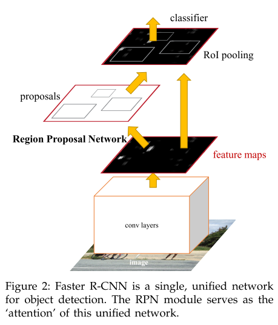

# Faster R-CNN

原论文：[Faster R-CNN: Towards Real-Time Object Detection with Region Proposal Networks](https://arxiv.org/abs/1506.01497)

将目标检测实现为端到端的框架。奠定了two-stage方法的元结构。

论文架构：

1. 引文：目标检测的卷积网络发展
2. 相关工作（目标候选框、用于目标检测的深度网络）
3. Faster R-CNN结构
4. 实验验证（VOC、COCO数据集）
5. 结论

主体思想在第三部分，以第三部分翻译+理解。

## 3 Faster R-CNN

​		我们的目标检测系统称之为：Faster R-CNN，由两部分组成。第一部分是用于生成区域候选框的深度卷积神经网络，第二部分是使用这些区域候选框的Fast R-CNN的检测头。整体结构呈现为用于目标检测的统一结构（如图2所示）。通过使用最近出名的attention机制，RPN模组能让Fast R-CNN知道从哪块区域进行检测。3.1节介绍区域生成框网络的设计实现，3.2节介绍通过特征共享实现的多模块计算算法。

### 3.1 Region Proposal Networks 区域生成网络

​		一个RPN网络输入为一张图片（任意大小），输出为一系列目标生成框以及一个是否为目标的分数。我们把这个过程建模为一个全卷积网络。由于我们的最终目标是与Fast R-CNN目标检测网络共享计算，因此我们假设两个网络共享同一系列卷积网络进行特征提取。在我们的实验中，我们研究了ZFNet的五层卷积以及VGG-16的前13层卷积用于特征提取。

​		为了生成区域候选框，我们在最后一个卷积后的特征图上滑动一个小的网络。这个小网络将输入卷积特征图的$n \times n$大小的空间窗口作为输出。每一个滑动窗口映射为一个更低维的特征（ZF用256维，VGG用512维，都使用了ReLU）。这个特征被输送到两个分支全连接网络——一个生成边界回归框(reg)、一个生成物体类别分数(cls)。本文中设置$n=3$，请注意，输入图像的有效感受野是足够大的（ZF为171像素，VGG为228像素）。这个在单一位置的小网络在图3左展示出来。值得注意的是由于小网络以滑动窗口的形式计算，全连接层共享到了所有空间位置的信息。该架构自然而言由一个$n \times n$的卷积层和两个不同$1 \times 1$卷积分支组成（分别用于reg和cls）。

#### 3.1.1 Anchors 锚点

​		在每个局部滑动窗口，我们同时预测多个候选框，每个位置的最大可能候选框数量设置为$k$。自然回归分支拥有$4k$个输出对应$k$个框，类别分支用于$2k$个输出，标记每个框是否包含物体的估计概率。$k$个提议相当于$k$个相关框的参数化，我们称之为锚点(anchors)。在该问题中，锚点为每个滑动窗口的中心，并且与比例、纵横比相关联（图3左）。默认我们使用3种尺度和3种纵横比，自此在每个滑动位置产生$k=9$种锚点。对一个大小为$W \times H$的卷积特征图而言，这里总计会有$WHk$个锚点。

**Translation-Invariant Anchors 平移不变锚点**

​		我们的方法具有的一大特征是具有平移不变性，不仅在于锚点生成，还在于锚点相关的生成框计算函数。如果一个锚点生成一张图片的一个物体，那么生成框和对应框的类别也应被预测。我们的方法保证了这种平移不变性。与之相对的是，MultiBox使用k-means生成800个锚点，它不具有平移不变性。因此MultiBox无法保证如果一个物体被识别后能生成同样的候选框。

​		这种平移不变性同样减少了模型大小。MultiBox拥有$(4+1) \times 800$的全连接输出，而我们的方法在$k=9$的情况下，输出为$(4+2) \times 9$维。最终，我们的输出层含有$2.8 \times 10^4$参数量（VGG有$512 \times (4+2) \times 9$），两者均比MultiBox少。如果加上特征投影层，参数量依然小于MultiBox。我们期望我们的方法在小型数据集，比如VOC上，过拟合程度低。

**Multi-Scale Anchors as Regression References 多尺度锚点作为回归相关点**

​		我们的锚点设计展现了解决多尺度（多纵横比）的一种新方案。如图1所示，这有两种著名的用于多尺度预测的方法。第一种基于图象/特征金字塔（比如DPM），第二种是基于CNN的方法。图像重整为多尺度，然后特征图（HOG或深度卷积特征）用于每种尺度的计算（如图1(a)）。这种方式通常有效但耗时。第二种方法是在同一特征图上取多尺度（或纵横比）的滑动窗口。举个例子，在DPM中，不同纵横比的模型分别使用不同尺寸的过滤器训练（比如$5 \times 7$和$7 \times 5$）。这种用于解决多尺度的方式可被视为“过滤器金字塔”（如图1(b)）。第二种方式通常和第一种方式结合使用。

​		与之相对比，我们基于锚点的方法可被视为锚点金字塔(a pyramid of anchors)，更高效。我们的方法参考多个尺度和纵横比的锚框对边界框进行分类和回归。它只依赖与图片和单一尺度的特征图，以及单一尺度的过滤器（即特征图上的滑动窗口）。在表8中通过详细的实验展示该机制用于解决多尺度和大小的有效性。

​		由于这种基于锚点设计的多尺度方式，我们可以通过基于单一尺度的图像进行卷积特征提取，然后将它送入到Fast R-CNN检测器。这种多尺度锚点的设计是实现没有额外开销解决尺度特征共享的关键部件。

#### 3.1.2 Loss Function 损失函数

​		为了训练RPNs，我们在每个锚点设置了二进制类别标签（代表是否包含物体）。我们将两种锚点标记为正样本：(i) 锚点与真实边框IoU取最高，或者(ii) 该锚点与任意真实边框IoU超过0.7。注意，单一真实边框可分配正样本给多个锚点。通常第二个条件就足以确定正样本。我们仍采用第一个条件，是因为在极端情况下，第二种条件可能找不到正样本。如果与所有真值框的IoU比例小于0.3，我们为这种锚点定义为负样本。非正非负样本的锚点对训练目标不存在贡献。

​		有了上述定义，我们最小化一个Fast R-CNN中的多任务损失的目标函数。对单一图像的损失函数定义为如下：
$$
L(\{p_i\},\{t_i\}) = \frac{1}{N_{cls}} \sum_i L_{cls}(p_i, p_i^*) + \lambda \frac{1}{N_{reg}}\sum_i p_i^*L_{reg}(t_i,t_i^*)
$$
其中，$i$指代一个mini-batch中一个anchor的索引，$p_i$代表锚点$i$是否为物体的估计概率。如果锚点为正样本，真实标记$p_i^*$为1，负样本为0。$t_i$代表预测边界框的4个参数化坐标的向量，$t_i^*$代表正样本的真实边界框。分类损失$L_{cls}$是覆盖两种类别（是否有物体）的对数损失。针对回归损失，我们使用$L_{reg}(t_i, t_i^*)=R(t_i - t_i^*)$，其中$R$代表稳健的smooth L1损失（在Fast R-CNN中定义）。$p_i^*L_{reg}$代表只针对正样本锚点的回归损失，其它的忽略。cls和reg分支的输出分别由$\{p_i\}$和$\{t_i\}$组成。

​		这两项由$N_{cls}$和$N_{reg}$进行归一化，然后由平衡因子$\lambda$加权。在我们开源的现有实现中，其中cls分支被mini-batch的大小归一化（比如$N_{cls}=256$），reg分支由锚点位置数量进行归一化($N_{reg} \sim 2400 $)。其中默认设置$\lambda = 10$，然后两个分支求加权和。表9中展示了不同$\lambda$的结果。我们还注意到，上述规范化不是必须的，可以简化。

​		针对边界框回归，我们对4个坐标采用如下方式：
$$
t_x = (x - x_a)/w_a, \space \space t_y = (y - y_a)/h_a, \\
t_w = \log(w/w_a), \space \space t_h = \log(h/h_a), \\
t_x^* = (x^* - x_a)/w_a, \space \space t_y^* = (y^* - y_a)/h_a, \\
t_w^* = \log(w^*/w_a), \space \space t_h^* = \log(h^*/h_a), 
$$
其中$x,y,w,h$定义框的中心坐标和它的宽和高。$x,x_a,x^*$分别代表框的期望值，锚点框，真实值($y,w,h$同理)。这可被视为从一个锚点框到真实框的相对边界框坐标预测。

​		无论如何，与先前的RoI方法相比我们的边界框回归使用了不同的方法。在SPPNet和Fast R-CNN中，边界框回归是通过任意大小的RoI特征池化提取的，并且回归分支权重由所有区域共享。在我们的方法中，回归所使用的特征都是特征图上的同样大小的区域($3 \times 3$)。为了获得任意大小，可学习$k$个边界框回归集合。每个回归对应一种尺度以及一种纵横比，同时$k$个回归不共享权重。因此，借助于锚点的设计，即使特征具有固定大小/比例，仍然可以预测各种大小的框。

#### 3.1.3 Training RPNs 训练RPN

​		RPN网络可通过BP算法和SGD优化器实现端到端训练。我们效仿Fast R-CNN中的”以图象为中心“的采样策略来训练网络。每个mini-batch是从一个单一图像提取来的，包含许多正负样本锚点。这适用于对所有锚点的损失函数优化，但这将偏向于负样本，因为它们占据主导地位。取而代之的是，我们随机采样一张图片的256个锚点来计算一个mini-batch的损失函数，其中正负样本的锚点比例上升到1:1。如果一张图像中正样本少于128，就用负样本填充该mini-batch。

​		我们随机初始化所有层的参数，满足均值为0，方差为0.01的高斯分布。其他层（即共享卷积层）由ImageNet分类预训练好的模型组成。我们微调ZFNet的所有层，VGG网络的conv3_1及以上用于节省显存。前60k mini-batches使用0.001的学习率，后20k使用0.0001学习率，VOC数据集。momentum设为0.9，权重衰减为0.0005。用Caffe实现。

### 3.2 Sharing Features for RPN and Fast R-CNN RPN和Fast R-CNN的特征共享

​		我们已经讨论了如何训练一个网络用于区域候选框生成，还没讨论如何使用这些候选框的基于区域的目标检测CNN。接下来，我们叙述结合RPN和Fast R-CNN共享特征提取卷积层的统一网络的训练方法（如图2）。

​		RPN和Fast R-CNN是分别训练的，同时也会以不同的方式改变它们的卷积层。因此我们需要一种允许两种网络共享卷积层的技术，而不是学习两个独立的网络。我们讨论了具有共享特征的网络的三种方法：

1. Alternating training. 交替训练

   在这种解决方案中，首先训练RPN，然后使用候选框训练Fast R-CNN。经Fast R-CNN微调的网络再用来训练RPN，这个过程迭代运行。这是该论文中所有实验所采取的方案。

2. Approximate joint training. 近似联合训练

   在该方案中，RPN和Fast R-CNN网络在训练期间联合成一个网络，如图2所示。在每个SGD迭代周期，当训练Fast R-CNN检测器时，前向计算生成的区域候选框被认为是固定的、预计算的。BP算法和往常一样，对于共享层，来自RPN的损失和Fast R-CNN的损失的BP信号被组合在一起。该方案简单易行。但该方案忽略了区域生成框的坐标也是网络的响应，所以称之为近似(approximate)。在我们的实验中，我们根据经验发现这个方案产生了接近的结果，但与上个方案相比，训练时间减少了25%-50%。

3. Non-approximate joint training. 非近似联合训练

   如上述所讨论的那样，RPN的边界框预测同样是输入的函数。Fast R-CNN中的RoI池化层接收卷积特征以及边界框预测值作为输入，所以一个理论上有效的反向传播解决方案应当是包含边界框坐标梯度的。这些梯度在上述的近似联合训练中是被忽略的。在非近似联合训练中，我们需要一个可微分的包含边界框坐标的RoI池化层。这是一个重要的问题，可以通过[15]中的"RoI warping"层解决，但超出了本文的范畴。

**4-Step Alternating Training 4步交替训练**

​		在本文中，我们采用一种务实的4步训练算法通过交替优化来实现特征共享。在第一步，我们使用3.1.3节中的方法训练RPN。使用ImageNet预训练的模型，对区域生成任务端到端微调。第二步，我们使用第一步训练好的RPN来训练一个单独的Fast R-CNN目标检测网络。该网络同样使用ImageNet预训练好的模型。到这时，两个网络没有共享卷积层。第三步，使用检测器的网络来初始化RPN训练，同时我们固定共享卷积层，只微调RPN的网络层。现在，两个网络共享卷积层了。最后，保持共享卷积层固定，微调Fast R-CNN的检测层。通过如上方法，两个网络共享了卷积层同时集成到一个网络中。类似的交替训练可以运行更多次迭代，但我们观察到的改进可以忽略不计。

### 3.3 Implementation Details 实现细节

​		我们RPN和目标检测网络的训练和测试阶段均使用单个尺度的输入图像。我们将图像的最短边设置为600像素。多尺度特征提取（使用图像金字塔）可达到更好的表现，但无法在速度和准确度上取得平衡。对于重缩放后的图像，对于ZF和VGG网络的最后一个卷积层的步长为16像素。虽然这样大的步长也能带来良好的结果，但更小的步长可能会进一步提高准确度。

​		对于锚点，我们使用3种尺度$(128^2, 256^2, 512^2)$，3种纵横比$(1:1,1:2,2:1)$。这些超参数不是为某个数据集特别选择的，我们将在下一节提供有关其效果的消融实验。正如讨论的那样，我们的解决方案不需要图像金字塔或者过滤器金字塔来进行多尺度的区域预测，节约运行时间。图3右展示了我们的方法在各种尺度和纵横比方面的能力。表1显示了使用ZFnet学习到的每个锚点的平均区域大小。我们注意到我们的算法允许预测比潜在感受野更大的区域。这种预测并非不可能，如果只有物体的中间是可见的，人们仍然可以粗略地推断出物体的范围。

​		跨越图像边界的锚点需要小心处理。在训练期间，我们忽略所有跨边界的锚点，所以它们不对损失做贡献。对一个典型的$1000 \times 600$的图像而言，这里总计将会有大概20000($\approx 60 \times 40 \times 9$)个锚点。忽略跨边界的锚点以后，每张图像这里大概有6000个锚点用于训练。如果跨边界锚点离群值没有在训练时忽略，它们会对目标函数的优化产生大的误导性，导致训练无法收敛。在测试期间，我们仍然采用全卷积RPN用于整张图像。这可能会产生跨边界生成框，有则将其裁剪到图像边界。

​		一些RPN生成框彼此重叠度很大。为了降低冗余度，我们基于cls分数对区域生成框采用NMS算法。我们设定NMS的IoU阈值为0.7，这使得每张图片留下大约2000个区域候选框。正如我们所要展示的那样，NMS并未对最终结果产生实质的影响，同时降低了候选框的数量。经过NMS后，我们使用top-N排列检测的候选区域。随后，我们用2000个RPN生成区域来训练Fast R-CNN，在测试期间评估不同数量的候选框。

# 理解点

1. Faster R-CNN = Fast R-CNN + RPN
2. 将检测任务统一到一个端到端two-stage框架
3. 如何实现RPN和Fast R-CNN检测头的特征共享（4步学习法）
4. anchor思想

