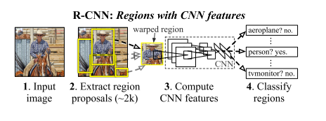

# RCNN

原论文：[Rich feature hierarchies for accurate object detection and semantic segmentation](https://arxiv.org/abs/1311.2524)

将检测任务转化为区域上的分类任务，是深度学习方法在检测任务上的试水。

论文架构：
1. 引文（介绍CNN之前的一些尝试）
2. R-CNN目标检测架构
3. 结果可视化、消融实验
4. ILSVRC2013目标检测数据集
5. 语义分割
6. 结论

主要思想为 第2节，以此作翻译+理解。

## 2 Object detection with R-CNN 用R-CNN作目标检测

我们的目标检测系统包括3个模块。第一个模块产生类别独立的区域生成框。这些生成框是我们目标检测器检测的候选目标集合。第二个模块是一个大型的卷积神经网络，用于提取固定区域大小的特征向量。第三个模块是线性SVM类别分类器。在该章节中，我们介绍每个模块的详细设计，介绍它们在测试期间的使用，展示参数是如何学习的，展示在PASCAL VOC 2010-12和ILSVRC2013上的结果。

### 2.1 Module design 模块设计

Region proposals. 用于生成类别独立的区域生成框的论文方法有很多。其中包括：objectness, selective search, category-independent object proposals, constrained parametric min-cuts(CPMC), multi-scale combinatorial grouping, Ciresan等人提出的用CNN提取规则间隔的方形区域方法。在上述方法中，我们选择selective search作为区域生成的方法。

Feature extraction. 我们使用由Caffe实现的AlexNet网络提取每一个区域生成块的4096维的特征向量。特征的计算通过将$227 \times 227$RGB的图像经过5层卷积网络和两层全连接层的前向计算得来。我们提醒读者去阅读Caffe和AlexNet两篇文章获取更多网络细节。

为了从一个区域生成框中计算特征，我们必须将区域中的图像数据转成能够输入到CNN中的格式（它要求输入图像大小固定为$227 \times 227$）。对于我们生成的任意大小的图像，我们优先选择最简单的。不管候选区域的大小或者纵横比多少，我们将围绕它的边界框将所有像素扭曲成固定大小。在变形之前，我们先扩张边界框，这样就能让原始框恰好有$p$个像素的变形图像上下文（固定使用$p=16$）。

### 2.2 Test-time detection 测试期间检测

在测试时间，我们使用selective search算法在测试图像上提取2000个生成区域（在所有例子中，使用selective search的快速模式）。将每个区域形变至固定大小然后送进CNN中前向计算特征。然后，对每个类别，我们使用训练好的SVM分类器依据每个提取的特征进行分类。给定一张图像的所有区域分数，我们应用贪婪NMS算法（每个类别单独使用），通过计算IoU值，当它达到一定值后就将它覆盖。

Run-time analysis. 两个方法使得检测高效。第一，所有CNN参数由所有类别共享。第二，与其它现有方法相比，CNN计算的特征向量具有低维特性，例如具有视觉词袋编码的空间金字塔。举个例子，UVA检测系统中使用的特征，比我们的特征维度大两个数量级。（360k vs 4k-dimensional）

这种特征共享的结果是区域生成和特征计算由所有类别共同享有(13s/image on a GPU or 53s/image on a CPU)。按类别计算的部分为特征与SVM权重的点积和NMS算法。在实践中，所有图像的点积计算都被包装成简单的矩阵-矩阵运算。特征矩阵大小为$2000 \times 4096$，SVM权重矩阵为$4096 \times N$，其中$N$是类别的数量。

经过该分析可知，R-CNN能够扩展到数千个对象类，而无需求助于近似技术，例如哈希。即使这里有100k种类别，结果矩阵也只需要在多核CPU中花费10秒计算。这种高效不仅仅是区域生成和特征共享的结果。UVA系统由于它的高维特征，比我们慢2个数量级，并且需要134GB的内存空间来存储100k的线性预测，与我们的低维特征并且只占1.5GB的情况相比的话。

### 2.3 Training 训练

Supervised pre-training. 我们将CNN放在大型数据集上进行预训练。使用开源的Caffe CNN库。简而言之，我们的CNN与AlexNet表现大致匹配，在ILSVRC2012验证集上top-1错误率提升了2.2个点。这得益于训练流程的简化。

Domain-specific fine-tuning. 为了将我们的CNN适用到新的任务（检测）以及新的领域（形变区域框），我们继续使用SGD算法训练CNN参数，只使用形变的区域生成框。与在ImageNet上的CNN的1000种类别分类层不同的是，我们使用随机初始化的$(N+1)$类别分类层（其中$N$是目标类别数量，外加1个背景类别），CNN架构未改变。对VOC数据集而言，$N=20$；对ILSVRC2013数据集而言，$N=200$。NMS参数阈值设置为0.5。SGD的学习率设置为0.001（是预训练设置的十分之一），这允许在不破坏初始化的情况下，微调能得到想要的效果。在每次SGD迭代中，我们使用32种正类（在所有类别中）和96种负类框组成128 batch size。我们偏向于采样正样本框是因为与背景框相比它们数量太少。

Object category classifiers. 假设训练一个二分类器来检测汽车。可以想象，包含汽车的所有框都应该是正样本，相似的，没有包含汽车的应该属于负样本。不清晰的点在于如何标记包含汽车的框。我们使用IoU重叠阈值来解决这个问题，低于阈值的区域就属于负样本。阈值选择了0.3。我们发现阈值选择至关重要。当把它设为0.5后，mAP下降了5个点。同样的，设置为0也下降了4个点。正样本简单地定义为每个类别地真实边界框。

一旦特征提取好，训练类别标记好，我们给每个类别使用一个线性SVM分类。因为训练集过去庞大，我们采样标准的难例挖掘算法。该算法收敛块，并且在实验中，仅通过一次遍历所有图像，mAP即可保持稳定。

在附录B中，我们讨论了为什么在微调和SVM训练阶段正负样本定义不同。我们还讨论了训练检测SVM所涉及的权衡，而不是简单的使用来自微调CNN的最终softmax层的输出。

# 理解点

1. CNN可用于基于区域的定位和分割物体。
2. 用分类网络（ImageNet）预训练好的模型作为基网络，在检测问题上fine-tuning的方法在之后的任务中经常使用。
3. 检测任务如何转化成区域上的分类任务，将分类任务和检测任务联系起来。
4. CNN用于特征提取的通用性。