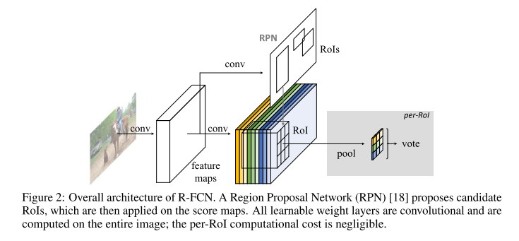
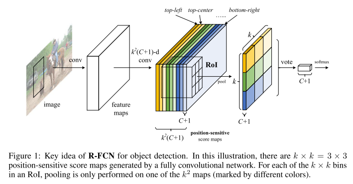
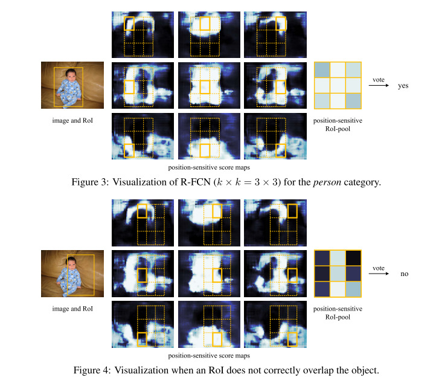
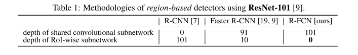

# R-FCN

原论文：[R-FCN：Object Detection via Region-based Fully Convolutional Networks](https://arxiv.org/abs/1605.06409)

主要解决：分类任务中位移不变性和检测任务中位移可变性之间的矛盾

论文架构：

1. 引文(介绍CNN发展情况，引出分类任务和检测任务的矛盾，R-FCN用于解决这个矛盾)
2. 方法
3. 相关工作
4. 实验
5. 结论和未来期望

以第二节翻译为主

## 2 Our approach

**Overview.**

​		与R-CNN相似，我们采用两阶段目标检测策略，包含：(i) 区域生成，(ii) 区域分类。虽然不依赖区域生成框的方法确实存在，但基于区域生成的系统在几个benchmarks上都达到了更高的准确度。我们通过RPN网络获取候选框，它是全卷积的架构。跟Faster R-CNN类似，我们在RPN和R-FCN之间共享特征。图2显示了我们系统的整体架构。

​		给定RoIs，R-FCN架构用于实现将RoIs分类为目标类别和背景。在R-FCN中，所有可学习的层都是卷积层，并且在整个图像上进行计算。最后的卷积层生成针对每个类别的$k^2$个位置敏感分数特征图，因此输出层含有$k^2(C+1)$个通道，其中$C$是目标类别数，$1$是指背景。$k^2$的分数图对应$k \times k$的空间单元的相对位置。举个例子，$k \times k = 3 \times 3$，9个分数图编码每个目标类别的位置{左上，中上，右上，...，右下}。

​		R-FCN以位置敏感的RoI池化层(position-sensitive RoI pooling layer)结束。该层聚合了最后卷积层的输出并且生成每个RoI的分数。不同于Fast R-CNN和SPPNet，我们的position-sensitive RoI layer进行选择性池化(selective pooling)，每$k \times k$ bin聚合了来自$k \times k$个分数图中的一个分数图。通过端到端训练，这个RoI层引导最后一个卷积层来学习专用的位置敏感分数图。图1揭示了这个想法，图3和图4可视化了一个例子。细节展示如下。

**Backbone architecture.**

​		本文中的R-FCN采用ResNet-101作为backbone，尽管其它网络（AlexNet、VGG）也适用。ResNet-101包含100个卷积层，后接全局平均池化层和1000类别的全连接层。我们移除平均池化层和全连接层，只使用卷积层来计算特征图。我们使用在ImageNet上预训练好的ResNet-101。ResNet-101最后卷积层的输出结果为2048维，我们后接一个随机初始化的1024维的$1 \times 1$卷积层用于降维（准确来说，将表1的深度增加了1）。然后我们应用$k^2(C+1)$通道的卷积层来生成分数图，就像之后介绍的那样。

**Position-sensitive score maps & Position-sensitive RoI pooling.**

​		为了将位置信息明确编码到每个RoI中，我们将每个RoI矩形通过规则网格划分为$k \times k$个bin。对于大小为$w \times h$的一张RoI，一个bin的大小约为$\frac{w}{k} \times \frac{h}{k}$。在我们的方法中，最后的卷积层用于生成$k^2$个针对每个类别的分数图。在$(i,j)$个bin中($0 \le i,j \le k-1$)，我们定义position-sensitive RoI pooling操作为仅在第$(i,j)$个得分图上进行池化：
$$
r_c(i,j|\Theta) = \sum_{(x,y) \in bin(i,j)} z_{i,j,c}(x+x_0, y+y_0|\Theta)/n \tag{1}
$$
其中$r_c(i,j)$指的是第$(i,j)$个bin针对第$c$个类别的响应，$z_{i,j,c}$指的是$k^2(C+1)$个分数图中的一个，$(x_0,y_0)$定义为RoI的左上角，$n$指的是该bin中的像素数量，$\Theta$定义为网络中所有可训练的参数。第$(i,j)$个bin的像素范围为$\lfloor i \frac{w}{k} \rfloor \le x < \lceil (i+1)\frac{w}{k} \rceil, \lfloor j \frac{h}{k} \le y < \lceil (j+1) \frac{h}{k} \rceil$。(1)式的计算在图1中展示出来了，其中一种颜色代表一个$(i,j)$。等式(1)使用的平均池化（通篇论文也是使用的它），其实最大池化表现得也不错。

​		$k^2$个位置敏感分数对RoI进行投票。在该论文中，我们通过平均分数来简化投票过程，对每个RoI产生产生$(C+1)$维的向量：$r_c(\Theta)=\sum_{i,j}r_c(i,j|\Theta)$。然后我们针对类别计算softmax响应：$s_c(\Theta)=e^{r_c(\Theta)}/ \sum_{c'=0}^C e^{r_c'(\Theta)}$。它们用于评估训练期间的交叉熵损失和推理期间的RoI排名。

​		然后我们使用同样的方法来解决边界框回归问题。与上述$k^2(C+1)$维卷积层并行的是，我们另开一个分支$4k^2$维用于边界框回归。position-sensitive RoI pooling 是在这$4k^2$张图上进行的，针对每个RoI产生$4k^2$维度向量。然后通过average voting生成4维向量。这个4维向量按照Fast R-CNN中的方式参数化边界框为$t=(t_x,t_y,t_w,t_h)$。我们注意到，为了简单起见，我们执行了与类无关的边界框回归，但特定于类的对应物（拥有$4k^2C$维的输出层）也是适用的。

**Training.** 

​		使用预计算的区域生成框，可以轻松地实现端到端地训练R-FCN架构。与Fast R-CNN一致，我们针对每个RoI的损失函数定义为交叉熵损失函数和边界框回归损失函数的总和：$L(s,t_{x,y,w,h})=L_{cls}(s_{c^*}) + \lambda[c^* > 0]L_{reg}(t,t^*)$。这里的$c^*$指的是RoI的真值标签（$c^*$指的是背景）。$L_{cls}(s_{c^*})=- \log{(s_{c^*})}$指的是用于分类的交叉熵损失函数，$L_{reg}$指的是Fast R-CNN中定义的边界框回归损失函数，$t^*$指的是真值框。$[c^* > 0]$指的是该项如果存在就为1，否则为0。将平衡权重值设为$\lambda=1$。我们将正例定义为与真值框IoU重叠度超过0.5的RoI，其余的为负例。

​		我们的方法很容易在训练期间采用在线难例挖掘(OHEM)。我们可以忽略不计的per-RoI计算实现了几乎免费的示例挖掘。假设每个图像有N个生成框，在前向传播阶段，我们评估所有N个生成框的损失。然后我们按损失对所有RoI(正的和负的)进行排序，并选择具有最高损失的$B$个RoI。反向传播是基于所选示例执行的。因为我们的per-RoI计算可以忽略不计，所以前向传播时间几乎不受$N$的影响，与OHEM相反，Fast R-CNN会使训练时间加倍。

​		权重衰减为0.0005，momentum设置为0.9。默认我们使用单尺度训练：图像大小重整为最短边为600像素大小。每个GPU训练一张图片，选择$B=128$个RoI用于反向传播。使用8张GPU进行训练。我们使用0.001的学习率进行微调R-FCN的前20k mini-batches，使用0.0001学习率微调后10k mini-batches，在VOC数据集上。我们使用Faster R-CNN的四步训练法来实现共享特征的训练，在RPN和R-FCN训练中交替实现。

**Inference.**

​		正如图2揭示的一样，RPN和R-FCN的共享特征图的计算在单一尺度为600的单一图像上。然后RPN部分生成RoIs，R-FCN部分评估类别得分并回归边界框。在推理期间，为了公平比较，我们像Faster R-CNN一样评估了300个RoIs。结果的后处理使用NMS算法，设置IoU阈值为0.3。

**À trous and stride.**

​		我们的全卷积架构享有FCN广泛用于语义分割的网络修改的好处。特别是，我们将ResNet-101的有效步幅从32像素减少到了16像素，从而提高了分数图的的分辨率。conv4阶段（stride=16）之前和之中的所有层都没有改变；conv5模块中的stride从2改为1。并且conv5阶段的所有convolutional filters都由"hole algorithm"修改，以补偿减少的步长。为了公平的比较，RPN在conv4阶段的顶部计算（与R-FCN共享）。

**Visualization.**

​		在图3和图4中，我们可视化了position-sensitive score maps，其中$k \times k = 3 \times 3$。这些特定的maps会在物体的特定相对位置被强烈激活。

# 理解点

1. Position-sensitive score maps & Position-sensitive RoI pooling.