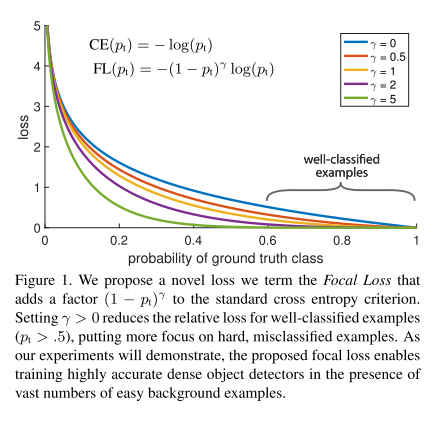
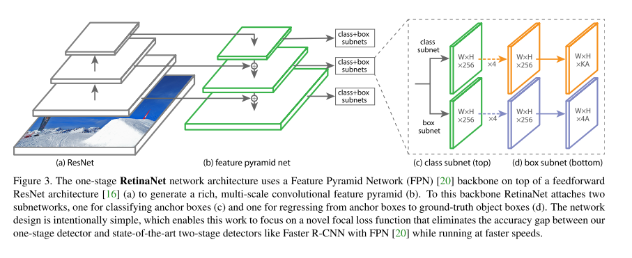
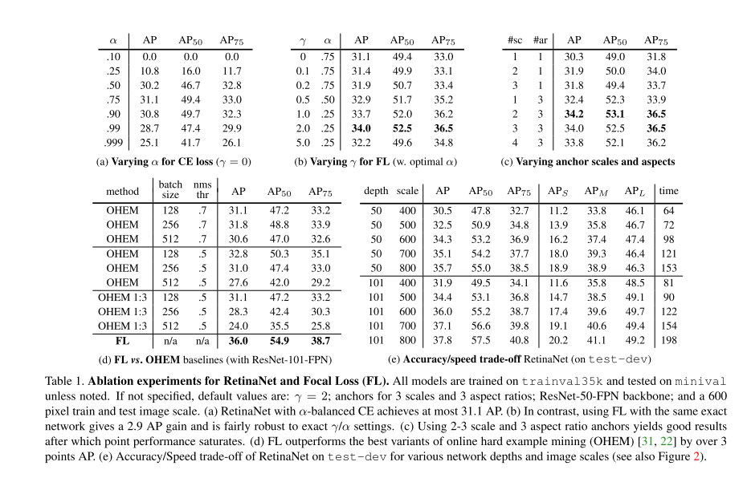

# RetinaNet

原论文：[Focal Loss for Dense Object Detection](https://arxiv.org/abs/1708.02002)

通过解决类别不平衡问题来实现One-stage和Two-stage检测器的检测准确度平衡。

主要翻译第3、4节。

## 3 Focal Loss

​		Focal Loss旨在解决One-stage目标检测器在训练期间前景和背景类别之间存在极端不平衡的问题（例如1:1000）。我们从二元分类的交叉熵（CE）损失开始引入focal loss：
$$
CE(p,y) = \begin{cases}
- \log(p) &\text{if } y = 1 \\
- \log(1-p) & \text{otherwise }
\end{cases} \tag{1}
$$
在上式中，$y \in \{\pm 1\}$指明真值类别，$p \in [0, 1]$代表$y=1$的目标属于哪一个类别的具体概率。为了符号方便，我们定义$p_t$：
$$
p_t = \begin{cases}
p & \text{if } y = 1 \\
1-p & \text{otherwise}
\end{cases} \tag{2}
$$
至此，我们就可以重写：$CE(p,y) = CE(p_t) = - \log(p_t)$。

​		CE loss可被视为图1顶部的蓝色曲线。这种损失的一个显著特性（可以在其图中很容易看出）是，即使是易于分类的示例($p_t \gg .5$)也会产生不平凡量级的损失。当对大量简单示例求和时，这些小的损失值可能会超过稀疏的类别。

### 3.1 Balanced Cross Entropy

​		一个常用的解决类别不平衡的方法是引入一个权重因子$\alpha \in [0,1]$针对类别1，$1-\alpha$针对类别-1。在实践中，$\alpha$可通过逆类频率设置或被视为超参数以通过交叉验证设置。为了符号简单，我们用定义$p_t$的方法定义$\alpha_t$。从而$\alpha$-balanced CE loss变为：
$$
CE(p_t) = - \alpha_t \log(p_t) \tag{3}
$$
该损失是对CE的简单扩展，我们将其视为提出的Focal Loss的实验baseline。

### 3.2 Focal Loss Definition

​		正如我们实验所展示的那样，在密集检测器的训练过程中遇到的大类不平衡问题压倒了交叉熵损失。容易分类的负数构成了大部分损失并主导了梯度。虽然$\alpha$平衡了正/负样例的重要性，但它不区分简单/困难样例。相反，我们建议将损失函数重塑为减轻简单示例的权重，从而将训练重点放在硬负例上。更正式的说，我们建议在交叉熵损失中添加一个调制因子$(1-p_t)^\gamma$，具有可调参数$\gamma \ge 0$。我们定义focal loss为：
$$
FL(p_t) = - (1-p_t)^\gamma \log(p_t) \tag{4}
$$
​		在图1中我们展示了不同$\gamma \in [0,5]$的可视化图象。我们注意到Focal loss的两个属性。(1) 当一个示例被错误分类且$p_t$非常小时，调质因子接近1，损失不受影响。当$p_t \rightarrow 1$，调制因子接近0，分类良好的示例的损失被降低了权重。(2) 聚焦参数$\gamma$平滑地调整了简单示例的降权率。当$\gamma=0$时，FL和CE同理，随着$\gamma$的增加，调节因子的影响也同样增加（我们发现$\gamma=2$时实验效果最好）。

​		直观地说，调制因子减少了简单示例的损失贡献，并扩展了一个例子得到低损失的范围。举个例子，当$\gamma=2$时，一个例子的分类概率为$p_t=0.9$，与同样的CE损失要低100倍，$p_t \approx 0.968$时，与同期的CE损失要低1000倍。这反过来又增加了纠正错误分类示例的重要性。（对于$p_t \le .5, \gamma=2$的情况，其损失最多按比例缩放4倍）

​		在实践中，我们使用具有$\alpha$平衡因子的变体Focal loss：
$$
FL(p_t) = - \alpha_t (1-p_t)^\gamma \log(p_t) \tag{5}
$$
​		我们在试验中采用这种形式，因为它比非$\alpha$平衡形式的精度略有提高。最后，我们注意到损失层的实现将计算$p$的sigmoid操作与损失计算相结合，从而提高了数值稳定性。

​		在我们的主要实验结果中，我们使用上述的focal loss定义，其精确形式并不重要。在附录中，我们考虑了Focal loss的其他实例，并证明它们同样有效。

### 3.3 Class Imbalance and Model Initialization

​		二元分类模型默认初始化是输出$y=-1 \space or \space 1$的概率相等。在这样的初始化下，在存在类别不平衡的情况下，由于频繁类产生的损失会主导总的损失，从而导致早期训练的不稳定。为了解决这个问题，我们引入了模型在训练开始时为稀疏类（前景）估计的值的"prior"概念。我们用$\pi$表示先验并设置它，以便模型对稀疏类示例的估计$p$较低，例如：0.01。我们注意到这是模型初始化的变化（参见4.1节），而不是损失函数的变化。我们发现这可以在严重类别不平衡的情况下提高交叉熵和Focal loss的训练稳定性。

### 3.4 Class Imbalance and Two-stage Detectors

​		Two-stage检测器通常使用交叉熵损失训练，没有使用$\alpha$平衡因子以及我们提出的损失函数。相反，它们通过两种机制来解决类别不平衡问题：(1) 两级级联 (2) 有偏小批量抽样。第一个级联阶段是一个object proposal机制，它将几乎无限的可能对象位置集减少到一两千。重要的是，所选择的proposals不是随机的，而是可能对应于真实的对象位置，这消除了绝大多数容易的负类别。在训练的第二阶段，通常使用有偏采样来构建包含（例如1：3正负样例）比例的小批量。这个比率就像是通过采样实现的隐式$\alpha$平衡因子。我们提出的focal loss旨在通过损失函数直接解决one-stage检测系统中的这些问题。

## 4 RetinaNet Detector

​		RetinaNet是一个单阶段的统一的网络，由一个backbone和两个任务子分支网络组成。主干负责计算整个输入图像上的卷积特征图，并且是一个非自身的卷积网络。第一个子网对主干的输出执行卷积对象分类；第二个子网执行卷积边界框回归。这两个子网络具有我们专门为单阶段密集检测提出的简单设计，详见图3。虽然这些组件的细节有很多可能的选择，但大多数设计参数对实验中显示的精确值并不特别敏感。我们接下来详细描述RetinaNet的每个组件。

#### Feature Pyramid Network Backbone

​		我们采用FPN作为RetinaNet的backbone。简而言之，FPN采用自上而下的路径和横向连接来增强标准卷积网络，因此该网络从单个分辨率的输入图像有效地构建了丰富的多尺度特征金字塔，见图3(a)-(b)。金字塔的每一层都可用于检测不同尺度的对象。FPN改进了全卷积网络(FCN)的多尺度预测，如其在RPN和DeepMask风格的proposals以及两阶段检测器（如Fast R-CNN或Mask R-CNN）。

​		和原论文中的一样，在ResNet的顶部建立FPN架构。我们构建了一个P3到P7级的金字塔，其中$l$代表金字塔级（$P_l$表示输入分辨率降低$2^l$倍）。和原论文一样，所有金字塔层拥有$C=256$通道。虽然许多设计选择并不重要，但我们强调FPN backbone的使用；仅使用来自最终ResNet层的特征的初步实验产生了低AP。

#### Anchors

​		我们使用与[20]中的RPN变体类似的平移不变锚框。锚点在金字塔层P3到P7上的面积分别为$32^2$到$512^2$。每个金字塔级的锚点使用纵横比{1:2, 1:1, 2:1}。对于比[20]中更密集的覆盖范围，在每个级别我们添加大小为$\{2^0, 2^{1/3}, 2^{2/3}\}$的原始锚点集的3个纵横比锚点。这在我们的设置中提高了AP。每层总共由$A=9$个锚点，跨层它们覆盖了相对于网络输入图像的32-813像素的尺度范围。

​		每个锚点被分配一个长度为$K$的分类目标的one-hot vector，其中$K$是对象类的数量，以及一个4-vector的框回归目标。我们使用RPN中的分配规则，但针对多类检测进行了修改并调整了阈值。具体来说，使用0.5的IoU阈值将锚点分配给真实对象框；如果它们的IoU在[0,0.4)中，则作为背景。由于每个锚点最多分配一个对相框，因此我们将长度$K$标签向量中的相应条目设置为1，将所有其他条目设置为0。如果一个anchor是未分配的，这可能会在$[0.4,0.5)$中发生重叠，在训练期间它会被忽略。框回归目标计算为每个锚点与其分配的对象框之间的偏移量，如果没有分配则省略。

#### Classification Subnet

​		分类子网预测每个空间位置的A个锚点和K个对象类的存在概率。这个子网是一个小FCN附加到每个FPN级别；此子网的参数在所有金字塔级别之间共享。它的设计是简单的。从给定的金字塔级别获取具有$C$个通道的输入特征图，子网应用4个$3 \times 3$卷积层，每个层都有$C$个过滤器，每个曾后跟ReLU激活函数，然后是一个$3 \times 3$卷积层和$KA$个卷积核。最后，附加sigmoid激活以输出每个位置的KA二进制预测，参见图3(c)。我们在大多数实验中使用$C=256,A=9$。

​		与RPN相比，我们的对象分类子网更深，仅使用$3 \times 3$卷积，并且不与框回归子网共享参数（如下所述）。我们发现这些更高级别的设计决策比超参数的特定值更重要。

#### Box Regression Subnet

​		与object classification subnet并行运算，我们将另一个小的FCN附加到每个金字塔层，目的是将每个锚框的偏移量回归到附近的真实对象（如果存在）。框回归子网的设计与分类子网相同，只是它以每个空间位置的$4A$线性输出终止，见图3(d)。对于每个空间位置的A个锚点，这4个输出预测锚点和真实框之间的相对偏移（我们使用来自R-CNN的标准框参数化）。我们注意到，与最近的工作不同，我们使用了一个与类别无关的边界框回归器，它使用的参数更少，而且我们发现同样有效。object classification subnet和box regression subnet虽然共享相同的结构，但使用不同的参数。

### 4.1 Inference and Training 

#### Inference

​		RetinaNet通过组装ResNet-FPN backbone，一个classification subnet和一个box regression subnet形成一个全卷积网络，见图3。因此，推理阶段包含单张图象经过全网络。为了提高速度，在将检测器置信度阈值设置为0.05后，我们仅从每个FPN级别最多1k个得分最高的预测中解码框预测。合并所有级别的最高预测，并应用阈值为0.5的NMS算法来产生最终预测。

#### Focal Loss

​		我们使用这项工作中的Focal loss作为分类子网输出的损失。如第5节实验所展示的那样，我们发现$\gamma = 2$的时候效果最好。强调一点，在训练RetinaNet是，focal loss应用在每张采样图象的所有~100k个锚点上。这与使用启发式采样（RPN）或困难示例挖掘（OHEM、SSD）为每个小批量选择一小组锚点（例如，256）的常见做法形成对比。图象的总focal loss为所有锚点的focal loss总和，并通过分配给真值框的锚点数量进行归一化。我们通过分配的锚点数量而不是总的锚点进行归一化，因为绝大多数锚点都是容易负类的，并且在focal loss下接收到的损失值可以忽略不计。最后，我们注意到分配给稀疏类别的权重$\alpha$也有一个稳定的范围，与$\gamma$相互作用，因此有必要将两者一起选择（见表1a和1b）。一般来说，随着$\gamma$的增加，$\alpha$应该稍微减小（对于$\gamma=2, \alpha=0.25$效果最好）。

#### Initialization

​		我们实验使用ResNet-50-FPN和ResNet-101-FPN backbone。ResNet-50和ResNet-101模型在ImageNet1k上进行预训练。除了RetinaNet子网的最后一层，其余所有的卷积层都使用高斯权重初始化$\sigma = 0.01, b=0$。对于分类子网的最后卷积层，我们设置偏置初始化为$b=-\log((1-\pi)/\pi)$，其中$\pi$指的是在训练开始时，每个锚点都应该被标记为前景，并具有~$\pi$的置信度。我们在所有实验中使用$\pi = .01$，虽然结果对确切值是鲁棒的。如3.3节所述，这种初始化可以防止大量背景锚点在第一次训练迭代中产生大的、不稳定的损失值。

#### Optimization

​		RetinaNet使用SGD优化算法。8张GPU，每张GPU两张图片，每个minibatch总共16张图。除非另有说明，否则所有模型都以0.01的初始学习率训练90k次迭代，然后在60k和80k次迭代时除以10。除非另有说明，我们使用水平图像翻转作为数据增强的唯一形式。使用0.0001的权重衰减和0.9的momentum。训练损失是focal loss和用于框回归的标准smooth L1 loss的总和。表1e中的模型的训练时间在10到35小时之间。

# 理解点

1. focal loss如何解决类别不平衡
2. RetinaNet的网络架构

