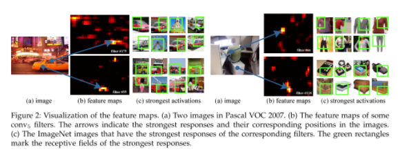
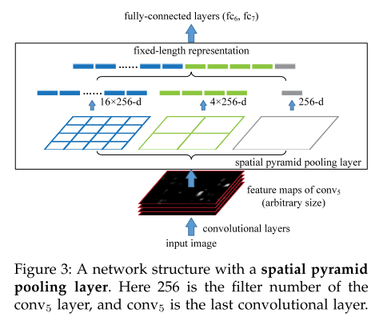
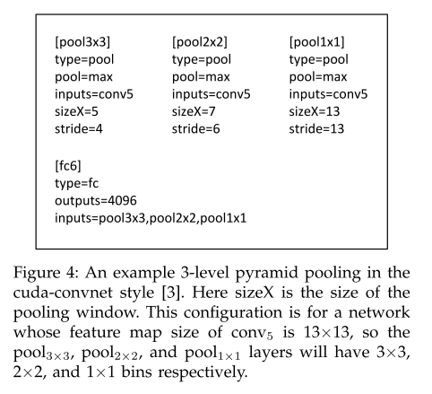

# SPPNet

原论文：[Spatial Pyramid Pooling in Deep Convolutional Networks for Visual Recognition](https://arxiv.org/pdf/1406.4729.pdf)

主要贡献：解决FC层导致的需要输入固定size的图像的问题，同一张图像共享卷积进行特征提取

论文结构：
1. 引文（介绍SPP之前的网络以及相比的优势）
2. SPP的网络结构
3. 分类实验
4. 目标检测实验
5. 结论

主要思想位于第2节，以第2节的翻译+理解为主。

## 2 Deep Networks With Spatial Pyramid Pooling SPP网络

### 2.1 Convolutional Layers and Feature Maps 卷积层和特征图

设想最出名的两个七层网络架构AlexNet和ZFNet。前五层为卷积层，其中穿插着池化层。这些池化层同样可理解为卷积层，想象成滑动窗口。最后两层为全连接层，最后输出N个经过softmax的值，N代表类别数量。

以上的深度网络均需要固定输入尺寸的图像。然而，我们注意到固定输入大小的限制是由于全连接层固定输入长度的限制。从另外一个角度说，卷积层可以接收任意尺度的输入。卷积层使用滑动过滤器，然后它们的输出拥有输入差不多的纵横比。这些输出被视为特征图（feature map）：它们不仅仅包括了响应的强度，还包括它们的空间位置。

在图2中，我们将一些特征图可视化。它们产生于第五个卷积层的卷积核。图2(c)展示了ImageNet数据集经过卷积后产生的高强度激活图像。我们能明晰一个卷积核能够被一些语义上下文激活。举个例子，第55个卷积核（图2，中左）大多数是被圆形形状激活；第66个卷积核（图2，上右）被∧形状激活，第118个卷积核（图2，中右）被∨形状激活。在输入图像中的这些形状和特征图中的
位置一一对应。

值得注意的是，图2的特征图没有固定输入尺寸。这些由深度卷积层生成的特征图类似于传统方法中的特征图。在这些方法中，SIFT向量或图像块被密集提取然后编码，比如 矢量量化，稀疏编码，Fisher内核等。这些编码特征包括特征图，然后被BoW或者空间金字塔池化。与此相同，深度卷积特征也可以以类似的方法池化。

### 2.2 The Spatial Pyramid Pooling Layer 空间金字塔池化层

卷积层能接收非固定输入大小，但同时它们也生成各种大小的输入。分类器(SVM/softmax)或者全连接层需要固定长度的向量。这种向量可以用BoW方法池化特征来生成。空间金字塔池化能够比BoW更进一步，它能通过局部空间箱(local spatial bins)来保存空间信息。这些空间箱和图像尺寸成比例，所有无论图像大小如何，数量是固定的。这与之前的滑动窗口池化有所不同，其中滑动窗口数量取决于输入大小。

为了让深度网络适应任意尺寸的图像，我们用空间金字塔池化层(spatial pyramid pooling layer)替换最后一层池化层。图3揭示了我们的方法。在每个空间箱中，我们池化每个卷积核的响应（通篇文章使用最大池化）。空间金字塔池化的输出为$kM$维向量，其中箱数量为$M$，($k$是最后一层卷积层的卷积核数量）。固定维度的向量就被送入全连接层。

在空间金字塔池化的帮助下，输入图像可以是任意尺寸大小的。这不仅仅是任意纵横比，还有任意尺度，应用相同的深度网络。当输入图像是不同尺度时，网络（相同卷积核大小）能够提取不同尺度的特征信息。在传统方法中尺度的作用很大，比如说，SIFT向量中通过多尺度提取特征（由patch大小和高斯核决定）。随后还会说明尺度对深度网络的准确度也很重要。

有趣的是，最粗糙的金字塔级别也有一个单一的空间箱覆盖整张图片。可以理解为事实上的”全局池化“操作，它和其它几个池化同时实现。

### 2.3 Training the Network 网络训练

理论上，上述网络可用标准BP算法训练，无论输入尺寸大小如何，但在实际的GPU实现中更倾向于固定输入大小。接下来，我们将描述我们的训练解决方案，该解决方案利用这些GPU来实现，同时保留空间金字塔池化行为。

Single-size training 单一尺度训练

在先前的工作中，我们首先考虑从图像中裁剪固定的大小($224 \times 224$)。这种裁剪方法是为了数据增强。对于给定的一张图像，我们能预计算空间金字塔池化所需的箱大小。假设第五层卷积层输出的特征图大小为$a \times a$（比如$13 \times 13$）。设定金字塔层为$n \times n$大小的箱子，我们将池化方式视为滑动窗口池化，其中窗口大小$win=⌈a/n⌉$，步长$str = ⌊a/n⌋$。如果有l级的金字塔，我们就实现l层该层。接下来的全连接层将l个输出连接起来。图4就展示了3级金字塔池化在CUDA下的实现。

单一尺寸训练的主要目的在于赋予多级池化能力。实验结论得出它能提高准确度。

Multi-size training 多尺度训练

我们的SPP网络可被用于任意大小的图像。为了解决训练图像任意大小的问题，我们考虑一些预定大小的集合。我们考虑了两种尺寸：$180 \times 180$和$224 \times 224$。与裁剪更小的$180 \times 180$区域不同的是，我们将上述$224 \times 224$区域大小调整为$180 \times 180$。因此，区域的不同在于分辨率的不同，而不是上下文/布局的不同。为了让网络接收$180 \times 180$大小的输入，我们实现了另一个固定大小输入的网络。经过第5层卷积层的输出为$a \times a = 10 \times 10$。然后我们仍使用$win=⌈a/n⌉$和$str = ⌊a/n⌋$来实现每级金字塔。180分辨率的网络和225分辨率的网络都拥有固定尺寸。咋某种程度上，两个网络在每一层中拥有相同参数。换句话说，在训练期间，我们通过两个共享参数的固定大小的网络来实现不同输入大小的SPP网络。

为了减少两个网络之间切换的开销，一个网络训练完一个epoch，就切换到另一个网络训练完整epoch（保存所有权重）。在实验中，我们发现多尺度训练的收敛和上述单尺度训练类似。

我们多尺度训练的主要目的在于模拟在输入大小不同的情况下，仍然能利用现有的优化好的固定大小来实现。除了上述两种尺度的实现外，我们还测试了输入为$s \times s$大小，其中$s$为每一epoch中$[180,224]$范围的任意值。

值得注意的是，单/多尺度的情况主要用于训练阶段。在测试阶段，它就可以直接使用任意尺度的SPP-net了。

# 理解点

1. 多尺度训练如何实现（参数共享）
2. 空间金字塔池化
3. 一张图片特征提取一次
4. 先CNN提取整张图片的feature map，然后再对每个feature map上的块做空间金字塔池化。