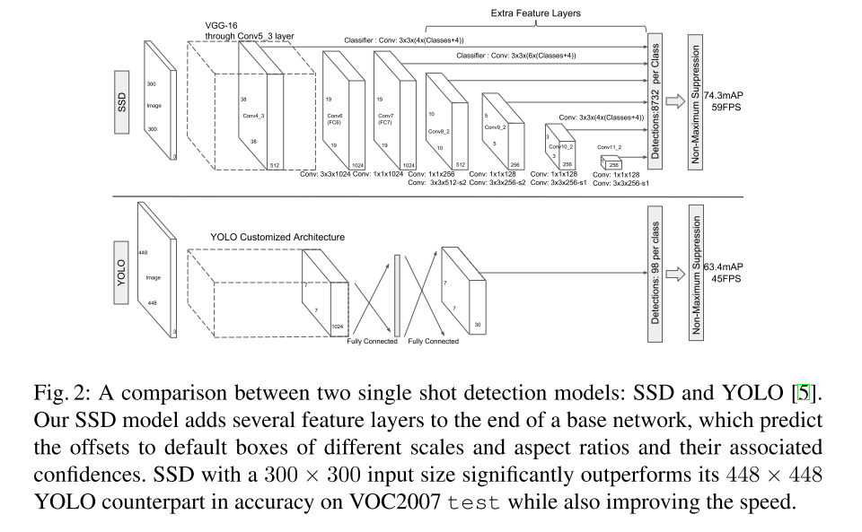
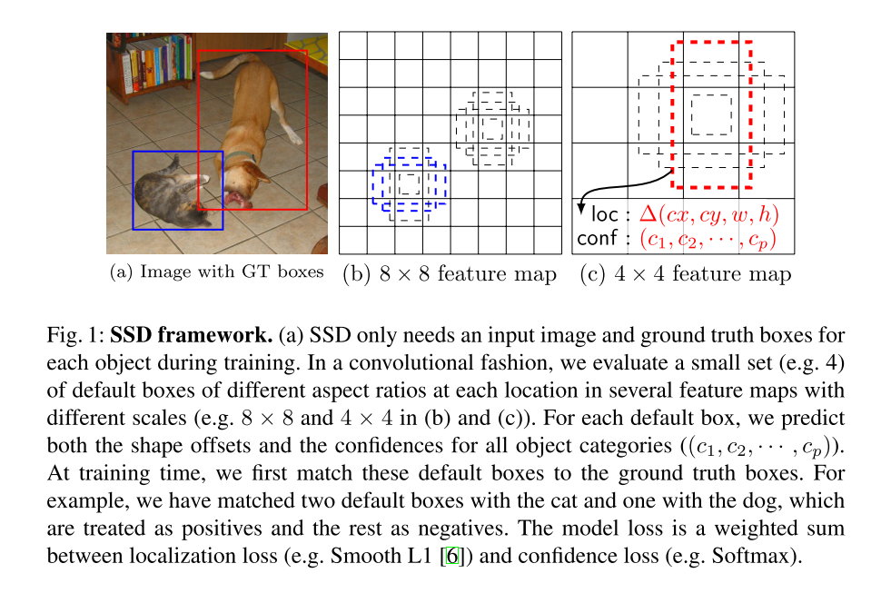
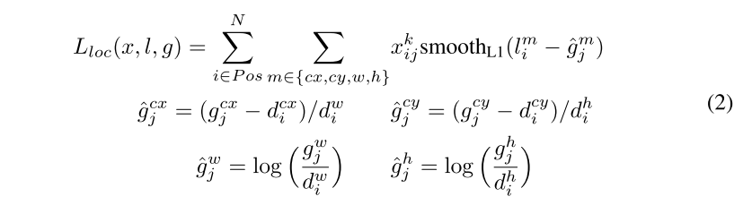
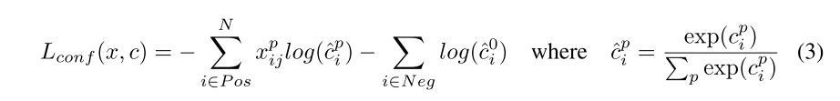

# SSD

原论文：[SSD: Single Shot MultiBox Detector](https://arxiv.org/abs/1512.02325)

多尺度特征图，大特征图提取小物体，小特征图提取大物体

论文结构：

1. 引文（介绍发展史引出SSD）
2. SSD结构
3. 实验结论
4. 相关工作（R-CNN、YOLO、OverFeat等对比介绍）
5. 结论
6. 致谢

主要以第二节翻译为主

## 2 The Single Shot Detector(SSD)

​		2.1节描述我们的检测器的架构，2.2节讲解相关联的训练策略，之后的第3节讲解数据集特定的模型细节和实验结论。

### 2.1 Model

​		SSD方法基于一个前向传播卷积网络产生一个固定尺寸的边界框集合，附带标记这些边界框里面物体实例的类别，然后通过NMS算法产生最后的预测。网络的早期层基于高标准图像分类的标准结构（在分类层之前截断），这种结构我们称之为基网。然后我们添加辅助结构来产生预测框，主要结构为以下几个：

**Multi-scale feature maps for detection** 

我们在基网的最后添加卷积特征层。这些层按尺度顺序下降，并且能够在多个尺度进行检测预测。每层卷积层预测检测结果是不同的（OverFeat和YOLO都是单尺度预测）。

**Convolutional predictors for detection**

通过使用一系列卷积核，每层特征层（可以说是除基网以外的特征层）能产生固定数量的检测集合。这些在图2中的SSD网络显示出。对特征图大小为$m \times n$，通道为$p$，

用于预测的基本参数为$3 \times 3 \times p$的小卷积核组成，产生一个类别分数或者相对于默认框的相对坐标。在每个$m \times n$的位置上，通过卷积核产生一个输出结果。边界框的偏移值是与每张特征图对应位置的默认框大小而言的（YOLO通过使用全连接层来替换卷积核实现这一步）。

**Default boxes and aspect ratios**

我们将一组默认边界框与每个特征图单元相关联，用于网络顶部的多个特征图。默认框以卷积的方式平铺特征图，这样每个框相对于其对应单元格的位置是固定的。在每个特征图单元格，我们预测相对于单元格中默认框形状的偏移量，以及每个类别的分数，这些分数表明每个框类是否存在类别实例。具体而言，就是对于指定位置中的k个框，每个框，我们就预测$c$类分数和相对于默认框的4个坐标偏移量。这些结果通过特征图每个位置的$(c+4)k$个卷积核计算得来，对$m\times n$大小的特征图就产生$(c+4)kmn$的输出。对于默认框的设置，可参考图1。我们的默认框与Faster R-CNN的锚点框类似，不同点在于我们将它们应用到不同特征图分辨率中。在几个特征图中允许不同的默认框形状让我们有效地离散化可能的输出框形状的空间。

### 2.2 Training

​		训练SSD和训练基于区域生成框的检测器不同点在于，需要将ground truth信息分配给固定检测器用于输出集中的特定结果。一些版本采用了YOLO的训练方法，以及Faster R-CNN和MultiBox等区域生成类方法。一旦分配决定以后，损失函数和BP算法就能实现端到端训练。训练同样包括选定用于检测的默认框及其尺度，同样还有难例挖掘和数据增强策略。

**Matching strategy**

在训练期间，我们需要决定哪个默认框匹配哪个真值框，然后再训练。对每个真值框而言，我们从不同位置、长宽比和比例的默认框来进行选择。我们首先将每个真值框和具有最佳jaccard重叠的默认框匹配（如MultiBox中一样）。不同于MultiBox，我们将阈值设为0.5。这简化了学习困难，赋予网络对多个重叠的默认框预测高分的能力，而不是仅仅拥有最大重叠度的那一个。

**Training objective**

SSD的训练目标源自MultiBox的目标，将其扩展到处理多个对象类别。定义$x_{ij}^p=\{1,0\}$为类别$p$的第$i$个默认框和第$j$个真值框的匹配度。在上述匹配策略中，我们会得到$\sum_i x_{ij}^p \ge 1$。整体的目标损失函数是位置损失和置信度损失的加权和：
$$
L(x,c,l,g)=\frac{1}{N}(L_{conf}(x,c)+\alpha L_{loc}(x,l,g))
$$
其中$N$指匹配默认框数量。如果$N=0$，设置损失为0。位置损失采用Smooth L1 Loss。与Faster R-CNN相似的是，我们采用与中心点的相对坐标以及它的宽高：

置信度损失采用对于多个类别置信度的softmax损失。

通过交叉验证后，$\alpha$设为1。

**Choosing scales and aspect ratios for default boxes**

为了解决不同目标尺度的问题，一些方法建议处理不同尺度的图像，然后组合结果。然而，通过利用单一网络中不同层的特征图用于预测，我们可以模拟出同样的结果，同时还跨所有对象比例共享参数。先前的工作已然证明，使用低层的特征图有助于增强语义分割质量，因为低层能够捕获输入目标的更多细节。同样的，ParseNet架构展示出对特征图进行全局信息上下文池化能够使语义结果更加平滑。受这些方法启发，我们使用低层和高层的特征图来做预测。图1显示了两个示例特征图($8 \times 8$和$4 \times 4$)。在实践中，我们可以使用更多小的计算开销来替换。

​		从同一网络中不同层得到的特征图拥有不同的感受野尺寸。在SSD架构中，默认框不需要与每一层的实际感受野相对应。我们设计了默认框的平铺，以便特定的特征图能够对特定尺度的对象作出反映。假设我们使用$m$个特征图用于预测，对每个特征图的默认框尺度就由下式计算：
$$
s_k = s_{min} + \frac{s_{max}-s_{min}}{m-1}(k-1), \space \space k \in [1,m]
$$
其中$s_{min}=0,2,s_{max}=0.9$，意味着最底层的尺度为0.2，最高层的为0.9，中间的所有层结果是线性变化的。我们对默认框使用不同的长宽比，将它们定义为$\{1,2,3,\frac{1}{2},\frac{1}{3}\}$。对每个默认框，我们能计算宽($w_k^a=s_k \sqrt{a_r}$)和高($h_k^a=s_k/\sqrt{a_r}$)。对长宽比为1的，我们也设置默认框的尺寸为$s_k'=\sqrt{s_ks_{k+1}}$，在每个特征图位置产生6个默认框。我们设置每个默认框中心点为$(\frac{i+0.5}{|f_k|}, \frac{j+0.5}{|f_k|})$，其中$|f_k|$为第$k$个方形特征图，$i,j \in [0,|f_k|]$。在实践中，可以针对特定的数据集来设计默认框的分布。如何设计最优就是个开放的问题了。

​		通过聚合所有默认框的预测，我们就拥有了不同的预测集合，包含各种各样的输入目标尺寸和形状。举个例子，在图1中，对于$4 \times 4$特征图默认框能够匹配狗，但在$8 \times 8$特征图就无法匹配。这是因为这些框具有不同的尺度并且与狗框不匹配，因此在训练期间被视为负数。

**Hard negative mining**

​		经过匹配步骤后，大多数默认框属于难例，特别是可能默认框数量庞大的时候。这就引入了一个重要的正负训练样本不平衡的问题。与其使用所有负例，我们使用最高置信度损失对每个默认框进行排序，然后选择顶部的几个，以此保持正负样本比例在1:3。我们发现这样的设置可以拥有更快的优化和更稳定的训练。

**Data augmentation**

为了使模型对不同输入目标尺度和形状更具鲁棒性，每个训练图像随机通过下列方式进行采样：

1. 使用完整原始输入图像；
2. 采样部分使得最低jaccard重叠为0.1，0.3，0.5，0.7，或0.9；
3. 随机采样一个patch。

每个采样patch的大小为原图像尺寸的[0.1,1]，长宽比在0.5和2之间。如果中心在采样patch中，我们就保留GT的重叠部分。经过上述采样步骤后，每个采样patch重整为固定尺寸，水平翻转率为0.5，还应用了其它的光度失真方法。

# 理解点

1. 多尺度特征图
2. 利用卷积进行预测
3. 先验框（Default boxes and aspect ratios）

