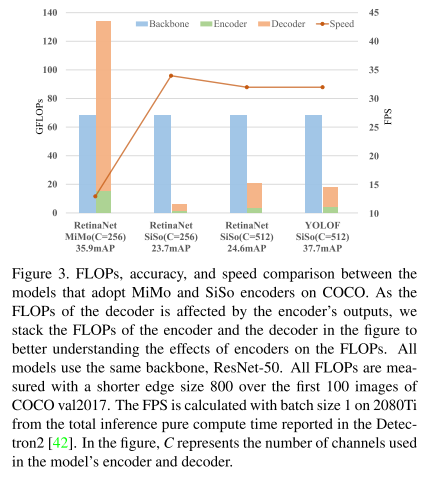
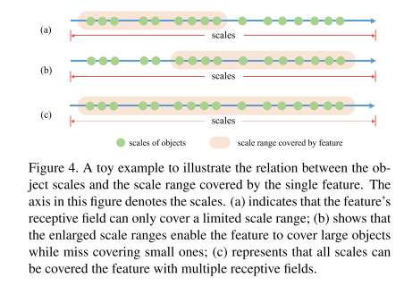
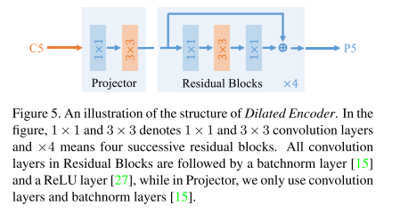
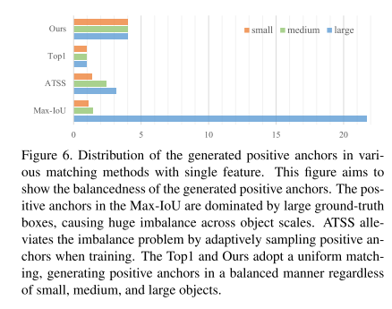
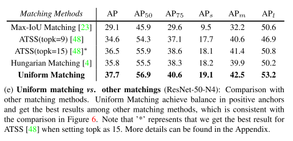
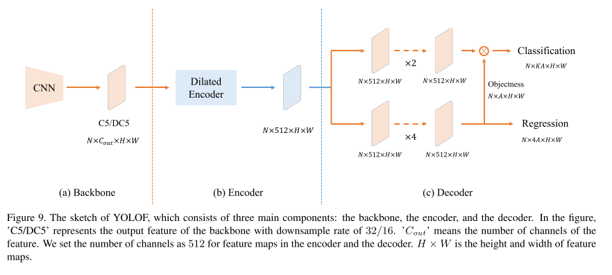

# YOLOF

原论文：[You Only Look One-level Feature](https://arxiv.org/abs/2103.09460)

用空洞卷积实现FPN效果。

主要思想在第4节。

## 4 Method

​		受上述目的启发，并基于C5特征已经包含各个目标的丰富上下文信息，在该节中，我们尝试使用简单的SiSo encoder替换复杂的MiMo encoder。但是根据图3的结果，使用SiSo encoders这种替换是不寻常的，表现大幅下降。给定这种情况，我们仔细分析了SiSo无法与MiMo达到相同结果的原因。我们发现SiSo encoders结果下降主要是两个问题。第一个问题是对于尺度匹配的C5特征的感受野是受限的，这妨碍了跨尺度的物体检测性能。第二个问题是单一尺度稀疏锚点导致的正锚点不平衡问题。接下来，我们详细讨论这两个问题并提供我们的解决方案。

### 4.1 Limited Scale Range

​		识别不同尺度的目标是目标检测领域的基础挑战。针对该挑战可行的一个方案是使用多尺度特征。在MiMo或SiMo encoders的检测器中，他们整合不同感受野的多尺度特征(P3-P7)，然后在对应尺度进行目标检测。然而，单一尺度的设定将改变该架构。在SiSo只有一个输出特征图，它的感受野是一个常量。如图4(a)所示，C5特征的感受野只能覆盖受限的尺度范围，从而导致感受野外的目标无法匹配从而导致低性能。为了达到通过SiSo encoders实现检测所有目标的期望，我们找到一种通过不同大小感受野的方式来生成一个输出特征图，补偿多尺度特征的缺陷。

​		我们首先通过堆叠标准卷积和空洞卷积来扩大C5特征的感受野。虽然在一定程度上扩大了尺度范围，但它仍然不能覆盖所有所有对象尺度，因为扩展过程将大于1的因子乘以所有最初覆盖的尺度。如图4(b)所展示的结果一样，与图4(a)相比，整个尺度范围变得更大。然后，我们通过对应特征相加来联合原始的尺度范围和扩张的尺度范围，最终得到多个感受野能够覆盖所有目标尺度的最终输出特征图，如图4(c)。上述操作可通过construction residual blocks with dilations在中间$3\times3$卷积轻松实现。

**Dilated Encoder**

​		基于上述设计，我们推出如图5所示的SiSo encoder，命名为Dilated Encoder。它包含两个主要部件：Projector和Residual Blocks。projection层首先用$1 \times 1$卷积来实现通道维度下降，然后用$3\times 3$卷积层来微调语义信息，与FPN类似。在这之后，我们堆叠连续的具有不同空洞因子的$3\times3$卷积层的dilated residual blocks来生成包含多感受野信息的输出特征图，能够覆盖所有目标尺度。

**Discussion**

​		空洞卷积是目标检测领域扩张特征感受野的常用策略。如第2节所述，TridentNet用空洞卷积来生成多尺度特征。它通过多分支架构和权重共享机制来解决目标检测的尺度变化问题，与我们的单尺度特征设定不同。此外，Dilated Encoder线性堆叠没有权重共享的dilated residual blocks。虽然DetNet也线性堆叠dilated residual blocks，它的目的在于确保特征的空间分辨率和维持backbone输出的细节，然而我们是用于为backbone生成多感受野的特征。Dilated Encoder的设计赋予我们在单尺度特征上检测所有目标的能力，而不是像TridentNet和DetNet那样的多级特征图。

### 4.2 Imbalance Problem on Positive Anchors

​		在目标检测领域中正锚点的定义是非常严谨的。在anchor-based检测器中，它的定义由anchors和ground-truth boxes之间的IoU值主导。在RetinaNet中，如果anchor和ground-truth的IoU超过阈值0.5，即被视为正锚点。我们称之为Max-IoU matching。

​		在MiMo encoders中，在密集型检测头中锚点是在多级特征图中预定义的，给定divide-and-conquer机制，Max-IoU matching赋予了每个尺度的ground-truth boxes产生一系列正锚点的作用。然而，当我们采用SiSo encoder的时候，与MiMo encoder相比，锚点数量从100k降低到5k，变成稀疏锚点。稀疏锚点在使用Max-IoU时遇到匹配困难，如图6所示。与小的ground-truth boxes相比大的ground-truth boxes包含更多的正锚点，这导致了正锚点的不平衡问题。这种不平衡使得训练阶段检测器更多的关注大的ground-truth boxes而忽略了小的。

**Uniform Matching**

​		为了解决正样本的不平衡问题，我们提出了Uniform Matching策略：对每个ground-truth box采用k近邻锚点作为正样本，这能确保无论大小如何，都能匹配到一定数量的正锚点。正样本的平衡确保所有ground-truth boxes对训练的贡献程度一致。此外，与Max-IoU matching策略相似，我们设定Uniform Matching中的IoU阈值来忽略IoU大于0.7的负样本和小于0.15的正样本。

**Discussion: relation to other matching methods**

​		应用topk为匹配策略不是新东西。ATSS首先针对$L$特征图中的每个ground-truth box选择topk个锚点，然后通过动态IoU阈值针对$k \times L$个候选框选择正样本锚点。然而，ATSS分别定义正负样本，然而我们的uniform matching侧重于达到稀疏锚点间正样本的平衡。虽然上述几个方法达到了正样本间的平衡，但他们的分配策略并不是为不平衡问题设计的。举个例子，YOLO和YOLOv2将ground-truth boxes与最好的锚点匹配；DETR使用Hungarian algorithm来匹配。这些策略都能视为top1策略，相当于我们的uniform matching的特例。跟重要的是，我们的uniform matching和learning-to-match方法不同的是：learning-to-match方法根据学习的状态分配正负样本，例如FreeAnchor和PAA，然而我们的uniform matching是固定的且在训练过程中不可进化的。

### 4.3 YOLOF

我们将YOLOF定义为三部分：backbone，encoder，decoder。图9显示YOLOF的整体架构。在该节中，我们简单介绍YOLOF的主要部件。

**Backbone**

​		在所有模型中，我们简单的采用了ResNet和ResNeXt系列作为我们的backbone。所有模型都在ImageNet上预训练。C5特征图的输出有2048通道，下降因子32。为了与其他检测器作比较，backbone中的所有batchnorm层都固定了。

**Encoder**

​		对于encoder，我们首先和FPN类似，在backbone之后使用两个卷积层（一个$1\times1$，一个$3 \times 3$），结果为512通道的特征图。然后，使用encoder的输出特征图覆盖任意尺度的所有目标，我们提出添加residual blocks，它包含3个连续的卷积组合：首先是$1\times1$卷积应用通道下降因子为4，然后使用包含空洞卷积的$3\times3$卷积来扩大感受野，最后，使用$1\times1$卷积来回到原先的通道数。

**Decoder**

​		对于decoder，我们采用RetinaNet的主要涉及。包含两个平行的任务头：分类头和回归头。我们只进行了两个主要改动。第一个是和DETR里面的FFN类似，使得两个头里面的卷积层数量不同。在回归头中使用4层卷积层后接BN层和ReLU层，而分类头中使用两层。第二是我们使用类似Autoassign的机制，添加一个针对每个锚点和回归点隐含的objectness prediction（不直接监督）。最终的分类预测是分类输出和对应的implicit objectness的结果相乘。

**Other Details**

​		如上节所述，YOLOF里面预定义的锚点是稀疏的，降低了锚点和真值点间的匹配质量。我们在图像上添加随机位移操作以规避此问题。此外，我们发现，在使用单级特征图时，对锚点中心的移位限制也有助于分类。我们添加了针对所有锚点的移位限制在32像素以内。

# 理解点

1. Dilated encoder可实现替代FPN的效果
2. Uniform matching解决不同尺度样本不平衡问题

