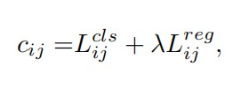

# YOLOX: Exceeding YOLO Series in 2021

## Abstract

在这份报告中，我们对YOLO系列进行了一些经验性的改进，形成了一个新的高性能的检测器 - YOLOX。我们将YOLO检测器切换为无锚（Anchor-free),的方式，并采用其他先进的检测技术，即解耦头和领先的标签分配策略SimOTA，在大规模的模型范围内取得最先进的结果。对于只有0.91M参数和1.08G FLOPs的YOLONano,我们在COCO上得到25.3%的AP，超过NanoDet 1.8%的AP；对于YOLOv3，工业界最广泛使用的检测器之一，我们将其在COCO上的AP提高47.3%，比目前的最佳实验还高出3.0%的AP，对于YOLOX-L而言，它的参数数量和YOLOv4-CSP、YOLOv5-L大致持平，我们基于COCO数据集上在Tesla V100以68.9 FPS的速度实现了50.0%的AP， 此外，我们使用一个YOLOX-L模型还获得了Streaming Perception Challenge(CVPR 2021的自动驾驶研讨会)的第一名，我们希望本报告可以为开发人员和研究人员在实际场景中提供有用的经验，我们还提供了ONNX、TensorRT、NCNN和Openvino支持的部署版本。

## Introduction

随着目标检测的发展，YOLO系列算法一直在追求实时应用的最优速度和最高准确度的权衡。他们采用了世界上最先进的检测技术（锚用于YOLOv2，Resnet用于YOLOv3），并且优化实施步骤以达到最佳效果。 目前，YOLOv5拥有最佳的速度和准确度平衡性能，在COCO数据集上以13ms的运行速度达到48.2%的AP表现。

然而，在过去的两年里，在目标检测领域主要的提升是聚焦于无锚（anchor free）检测器，先进的标签分配策略，end-to-end（端对端）的检测器（NMS-free）.这些技术还没有并入YOLO大家庭里面， 因为YOLOv4和YOLOv5仍然是基于锚（anchor based）的检测器,用手工制作的分配规则进行训练。

这就是把我们带到这里的原因，通过经验性的优化为YOLO系列提供这些最新的进展。考虑到YOLOv4和YOLOv5对于基于锚的管道可能有点过度优化了，我们选择了YOLOv3作为我们的起点（我们将YOLOv3-SPP设置为默认的YOLOv3）。确实，在各种实际应用中由于计算资源有限和软件支持不足，YOLOv3仍然是工业领域内使用最广泛的检测器之一。

正如图一所展示的一样，通过对上述技术经验性的更新，我们在640×640分辨率的COCO数据集上将YOLOv3提高到47.3%AP（YOLOX-DarkNet53），超过了目前YOLOv3的最佳实践（44.3% AP, ultralytics version）。除此之外，当切换到先进的采用了先进的CSPNet骨干网和一个额外的PAN头的YOLOv5架构时，YOLOX-L在640×640分辨率的COCO数据集上实现了50.0%的AP，比对应的YOLOv5-L高出1.8%的AP。我们还在小尺寸模型上测试了我们的实际策略。YOLOX-Tiny和YOLOX-Nano（只有0.91M参数和1.08G FLOPs）超过对应的YOLOv4-Tiny和NanoDet3分别10% AP和1.8% AP。

我们已经将我们的代码发布在 https://github.com/Megvii-BaseDetection/YOLOX 还有支持的ONNX、TensorRT、NCNN和Openvino。还有一个值得提到的是，我们使用一个YOLOX-L模型还获得了Streaming Perception Challenge(CVPR 2021的自动驾驶研讨会)的第一名。

<h4>图1 精确模型的速度-精度权衡和YOLOX和其他最先进的物体检测器在移动设备上精简模型的尺寸-精度曲线</h4>

## 2.YOLOX

### 2.1 YOLOX-DarkNet53

我们选择YOLOv3和Darknet53作为我们的基本主干网络。在下面的部分，我们将一步一步的遍历YOLOX整个设计系统。

#### Implementation details（实施细节）

我们的训练设置是从基本主干网络持续到最终模型。我们在COCO2017训练集上训练模型总共训练了训练了300个epochs，其中5个epochs用来warmup(一种学习率优化算法)，我们使用随机梯度下降法进行训练。我们使用一个学习率为lr×BatchSize/64（线性缩放）初始Ir=0.01和余弦计划学习率。权重衰减为0.0005，随机梯度下降的动量为0.9.批量大小为128，默认是典型的8个GPU的设备。其他批量大小包括单GPU训练也可以很好的工作。输入的尺寸大小是从448到832中均匀抽取的，有32个步长。 本报告中的FPS和延迟都是在单台Tesla V100上以FP16-precision和batch=1测量的。

#### YOLOV3基本主干网络

我们的基本网络采用了DarkNet53主干网和SPP层的结构，在一些论文中被称为YOLOv3-SPP。与最初的实现相比，我们稍微改变了一些训练策略，增加了EMA权重更新、cosine lr schedule、IoU loss和IoU-aware branch。我们使用BCE Loss来训练cls和obj分支，和使用IoU Loss来训练reg分支。这些普遍的训练技巧与YOLOX的关键改进是正交的，因此我们把它们放在基本网络上。此外，我们只进行RandomHorizontalFlip，颜色抖动（colorjitter）和多尺度来增强数据，而放弃RandomResizedCrop策略，因为我们发现RandomResizedCrop与计划中的马赛克图像增强有某种程度的重叠。随着这些增强，我们的基本网络在COCO值上实现了38.5%的AP如表2所示。

#### Decoupled head

在目标检测领域，分类和回归任务的冲突是一个众所周知的问题。因此，用于分类和定位的Decoupled head（解耦头）被广泛用于大多数 one-stage and two-stage检测器中。 然而，由于YOLO系列的主干网络和特征金字塔（如FPN，PAN）不断发展，它们的检测头仍然是耦合的，如图2所示。

<h4>图2 说明YOLOv3头和拟议的解耦头之间的区别，对于每一层的FPN特征，我们首先采用一个1×1的卷积层，将特征通道减少到256个，然后增加两个平行分支，每个分支有两个3×3的卷积层，分别用于分类和回归任务，在回归分支上增加了IoU分支</h4>

我们的两个分析实验表明耦合的检测头可能会损害性能。用一个解耦的YOLO头替换可以极大的提高收敛速度。解耦头对end to end (端对端)版本的YOLO也是非常重要的（接下来将会叙述）。一个可以从表1获知，在耦合头的情况下端到端的YOLO属性下降了4.2%的AP，而在解耦合的情况下则减少到0.8%AP。因此，我们在图2中用轻量级解耦头取代YOLO检测头，具体的来说，它包含一个1×1的卷积层来减少通道的维度，然后是两个平行的分支，分别是两个3×3的卷积层。 我们报告了在V100上batch=1的inference（推理）时间见表2，轻量型解耦头带来额外的1.1ms(11.6ms对10.5ms)。

<h4>表2 YOLOX-Darknet53在COCO值（COCO val)上的AP（%）,所有的模型都是在640×640的分辨率下测试的,在Tesla V100上以FP16-precision和batch=1测试,本表中的延迟和FPS是在没有后期处理的情况下测量的.</h4>

#### Strong data augmentation（数据增强）

我们将Mosaic和MixUp加入到我们的增强策略，以提高YOLOX的性能。Mosaic是一种高效的增强策略，在Ultralytics-YOLOv3这篇论文中提出。它随后还广泛的应用于YOLOv4，YOLOV5和其他检测器中。Mixup最初是图像分类任务而设计的，但后来在BoF中进行了修改，用于目标检测训练。我们在模型中采用了MixUp和Mosaic，并在最后15个epochs关闭它,实现了42.0%的AP，见表2。在使用强大的数据增强技术后，我们发现ImageNet的预训练并没有更多的好处，因此，我们从头开始训练以下所有模型。

#### Anchor-free

YOLOv4和YOLOv5都遵循YOLOv3的原始的anchor-based(基于锚）的管道。然而，这个锚的机制存在很多众所周知的问题，第一，为了实现最佳的检测性能，一是在训练之前需要通过聚类分析确定一组最佳锚点。这些聚类的锚点是特定领域的，不那么普遍。第二，锚机制增加了检测头的复杂性以及每个图像的预测数量。在一些人工智能边缘系统，在设备之间移动（如从NPU到CPU）如此大量的预测在整体延迟方面可能会成为一个潜在的瓶颈。无锚检测器在过去两年发展的非常迅速。这些工作表明无锚检测器的性能可以与基于锚的检测器相提并论。无锚机制大大减少了设计参数的数量，这些参数需要启发式的调整和许多技巧（如锚点聚类，Grid sensitive)来获得良好的性能,特别是其训练和解码阶段大大简化。

将YOLO转换成无锚方式是非常简单的。我们把每个位置的预测值从3减到1，并使其直接预测四个值，即在网格的左上角的两个偏移量，以及预测框的高度和宽度。我们将每个物体的中心位置指定为正样本，并预先定义了规模范围，指定每个目标的FPN级别。这些改进减少了参数和检测器的GFLOPS，并使其更快。但是获得了更好的性能表现，如表2所示42.9%的AP。

#### Multi positives

为了与YOLOv3的分配规则保持一致，上面的无锚版本只选择了一个即每个物体的正样本（中心位置），同时忽略了其他高质量的预测。然而，优化这些高质量的预测也可能带来好的梯度，这可能会缓解训练期间正样本和负样本采样率极端不平衡的情况。我们只是将中心3×3区域分配为正样本区域，也成为中心FCOS中的采样。检测器的性能提高到45%AP,如表2所示。已经超过当前ultralytics-YOLOv3的最佳实践（44.3% AP）。

#### SimOTA

先进的标签分配策略是近些年来目标检测另一个重要的过程。基于我们自己的研究OTA，我们为这种先进的标签分配策略总结了4个重要的关键点：

1）loss/quality aware 

2） center prior（中心先验）

3)对每一个真实框而言，动态变化的正样本锚的数目（简称为动态top-k） 

4)全局视野（global view)

OTA满足上面的全部四条规则，因此，我们选择其作为候选标签分配策略。

具体来说，OTA从全局角度分析了标签分配并将分配过程构建为一个最佳传输的问题看，在目前的分配策略中产生SOTA性能。然而，在实中我们发现通过Sinkhorn-Knopp算法解决OT问题会带来
25%的额外训练时间，这对于训练300个epochs来说是相当昂贵的。因此，我们将其简化为动态top-k策略，命名为SimOTA，以获得一个和合适的解决方案。

我们在这里简要的介绍一下SimOTA，SimOTA首先计算成对匹配度，通过cost或者 quality来表示每个预测gt(ground truth)对的匹配度。举个例子，预测框$p_j$与真实框$g_i$之间的cost可以用以下公式计算：

$\lambda$是平衡系数，$L^{cls}_{ij}$和$L^{reg}_{ij}$分别是真实框和预测框的分类损失和回归损失.然后，对于gt（$g_i$),我们选择固定中心区域内cost最低的top-k预测作为正样本。最后，这些正向预测的相应网格被分配为正样本，注意到K值对于不同的gt(ground truth),更多细节请参考OTA中的动态k估计策略。

SimOTA不仅能够减少训练时间，而且还避免了SinkhornKnopp算法中额外的求解器超参数。如表2所示， SimOTA提高了检测器从45.0%AP提高到47.3%AP，比SOTA的ultralytics--YOLOv3高3.0% AP，显示了先进分配策略的能力。

#### End-to-end YOLO（端对端YOLO）

我们接下来要增加两个额外的卷积层，一对一的标签分配和停止梯度，这些可以保证检测器表现出端对端的方式进行检测，但是性能和推理速度会略有下降，如表2所示。因此，我们把它作为一个可选的在我们的最终模型中不涉及的模块。

####  Other Backbones

除了 DarkNet53,我们还在其他不同规模的骨干网上测试了YOLO，在这些骨干网上，YOLOX取得了与所有相应的一致的改进。

#### Modifified CSPNet in YOLOv5

为了获得一个公平的比较，我们采用准确的YOLOv5的骨干网，包括修改后的CSPNet，SiLU激活以及PAN头。我们还遵循其缩放规则来制作YOLOXS、YOLOX-M、YOLOX-L和YOLOX-X模型。与表3中的YOLOv5相比，我们的模型得到了连续的的改进，从3.0%到1.0%的AP，只有轻微的时间的增加（来自于解耦头）。

#### Tiny and Nano detectors

我们进一步缩小了我们的模型作为YOLOX-Tiny来与YOLOv4-Tiny进行比较。对于移动设备，我们采用深度卷积法来构建YOLOX-Nano模型，它只有0.91M的参数和1.08G的FLOPs，如表四所示，YOLOX表现良好，模型尺寸甚至比相应类型的模型更小。

#### Model size and data augmentation（模型尺寸和数据增强）

在我们的实验中，所有的模型都保持几乎相同的学习进度和优化参数，如2.1描述所示。然而，我们发现合适的增强策略在不同规模的模型中是变化的。如表5所示，当将MixUp应用于YOLOX-L可以提高0.9%AP。这是对于像YOLOX-Nano这样的小模型，最好是减弱其增强作用。 具体来说，在训练小模型即YOLOX-S、YOLOX-Tiny和YOLOX-Nano时我们取消了mix up增强并削弱了mosaic(将比例范围从[0.1,2]减少到[0.5,1.5]),这样的修改使YOLOX-Nano的AP从24.0%提高到25.3%.

对于大的模型来说，我们也可以发现更强的增强策略是更有用的。的确，我们的实现比原来的版本更重。受Copypaste的启发，我们在mix up这些图像之前，用一个随机采样的比例因子抖动（jitter）它们。为了了解Mixup在scale jittering方面的能力，我们把它与YOLOX-L上的Copypaste进行比较。注意到Copypaste需要
额外的实例掩码注释，而MixUp不需要。但是如表5所示，这两种方法取得了相似的性能，这表明，在没有实例掩码的情况下，带有规模抖动的MixUp是一个合格的Copypaste替代品。

<h4>不同模型下数据增强的效果。Scale Jit. "代表了马赛克图像的比例抖动范围，来自COCO的实例掩码注释
trainval在采用Copypaste</h4>

##  Comparison with the SOTA

有一个传统的显示SOTA的比较表，如表6所示。然而，请记住，本表中模型的推理速度往往是不可控的，因为速度随软件和硬件的变化而变化，因此，我们使用相同的图1中所有YOLO系列的硬件和代码基础绘制出有点受控的速度/精度曲线。

我们注意到，有一些高性能的YOLO系列有较大的模型尺寸，如Scale-YOLOv4和YOLOv5-P6 ，而目前基于Transformer的检测器将SOTA的精度提高到了∼60 AP。由于时间和资源的限制，我们没有在本报告中探讨这些重要的功能。然而，它们已经在我们的范围。

<h4>在COCO 2017 test-dev上比较不同物体检测器的速度和准确性。我们选择所有的模型在300个epochs上进行训练以进行公平比较</h4>

## 1st Place on Streaming Perception Challenge(WAD at CVPR 2021）

WAD 2021上的Streaming Perception Challenge是通过最近提出的一个指标对准确性和延迟进行评估：流媒体准确性。这个指标背后的关键见解是在每个时间点上对整个感知堆栈的输出进行联合评估。迫使堆栈考虑在计算过程中应该忽略的流数据量。；我们发现在30FPS的数据流上，指标的最佳权衡点是一个推理时间≤33ms的强大的模型。因此，我们采用YOLOX-L模型和TensorRT来制作我们的最终模型，以赢得挑战赛的第一名，请参考挑战赛网站，了解更多细节。

##  Conclusion

在这份报告中，我们提出了对YOLO系列的一些经验性的更新，形成了一个高性能的无锚检测器，称为YOLOX。配备了一些最新的先进检测技术，即解耦头。无锚，以及先进的标签分配策略。在所有的模型尺寸中，YOLOX在速度和精度之间取得了比其他模型更好的平衡。值得注意的是我们提升了YOLOv3的架构，由于其广泛的兼容，它仍然是工业界最广泛使用的探测器之一。在COCO上的AP达到47.3%，超过了目前的最佳实践3.0%的AP。我们希望这份报告可以帮助开发者和研究人员在实际场景中获得更好的经验。
