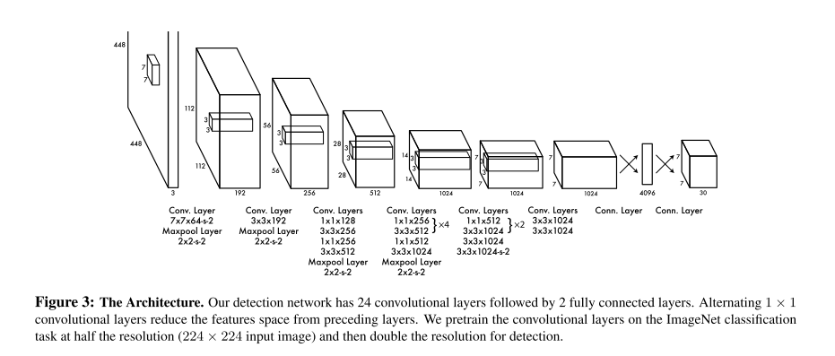
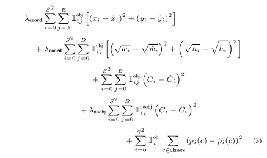

# YOLO v1

原论文：[You only look once: Unified, real-time object detection](https://arxiv.org/abs/1506.02640)

one-stage目标检测的开山之作。

将检测任务表述成统一的、端到端的回归问题。

论文结构：

1. 引文（介绍YOLO思想来源）
2. YOLO架构
3. 与现有目标检测系统对比
4. 实验结论
5. YOLO的实时速度优势，源码链接
6. 结论（YOLO在实时目标检测领域SOTA）

主体思想在第2节，本篇以第2节翻译。

## 2 Unified Detection 统一检测

​		我们将目标检测的各个模块统一成一个单一的神经网络。我们的网络使用整张图像的特征来预测每一个边界框。它在预测所有边界框的同时还预测边界框所包含的类别。从全局的角度，这意味着我们的网络能够从图像特征直接推导图像中所有目标所在位置。YOLO的设计在保证平均精度的同时实现了端到端训练和实时速度。

​		我们的系统将输入图像分成$S \times S$个网格。如果目标中心点落入其中一个网格，那个网络就用来预测该目标。

​		每个网格预测$B$个边界框和这些边界框的置信度。这些置信度分数反映了边界框包含物体的概率以及它认为该物体是其预测的准确度，将置信度公式定义为：$Pr(Object)*IOU_{pred}^{truth}$。如果该网格不存在物体，那么置信度分数应该为0。否则我们认为置信度分数等同于真实边框和预测边框的IOU值。

​		每个边界框包括5个预测值：$(x,y,w,h,confidence)$。$(x,y)$代表相对于网格边界框的预测框中心。宽和高的预测值是相对于整张图而言的。最终，置信度的预测代表了真实边框和预测边框之间的IOU值。

​		每个网格单元预测$C$种条件类别概率，$Pr(Class_i|Object)$。这些概率的限制条件是该网格单元包含对象。无论$B$的数量多少，每个网格单元只预测一个类别概率集合。

​		在测试时间，我们将条件类别概率和单一边界框的置信度预测相乘。
$$
Pr(Class_i|Object)*Pr(Object)*IOU_{pred}^{truth} = Pr(Class_i)*IOU_{pred}^{truth}
$$
这就给了我们每个边界框的特定类别预测分数。这些分数内置了边界框中类别出现的概率以及预测边界框包含物体的程度。

​		为了在PASCAL VOC数据集上检验YOLO，我们设定$S=7,B=2$。VOC数据集包含20个标记类别，所以$C=20$。我们最终的预测结果为$7 \times 7 \times 30$的张量。

### 2.1 Network Design 网络设计

​		我们实现的模型使用卷积神经网络，在VOC检测数据集上做测试。最初的卷积层用于特征提取，过后的全连接层做概率和坐标预测。

​		我们的网络结构受用于图像分类的GoogLeNet的启发。我们的网络包含24个卷积层+2个全连接层。与GoogLeNet的Inception模块不同的是，我们只使用$3 \times 3$卷积和$1 \times 1$卷积的结合，和NIN类似。图3显示整体网络结构。

​		同样我们训练一种YOLO的快速版本来推动边界框的快速预测。Fast YOlO使用更少的卷积层（24层改为9层）和更少的卷积核。与网络大小不同的是，所有训练和测试的参数在两个版本均相同。

​		我们网络的最终结果是$7 \times 7 \times 30$的张量预测。

### 2.2 Training 训练

​		我们网络的卷积层在ImageNet上进行预训练。为了预训练我们使用了图3中的前20层卷积层，外加一层平均池化层和一层全连接层。该网络训练了接近一周，在ImageNet 2012的验证集上单次裁剪top-5准确率指标达到了88%，与Caffe的Model Zoo中的GoogLeNet模型相当。

​		然后我们将模型用于检测任务。Ren等人的实验结果表明卷积层和全连接层添加到预训练网络能够提点。借鉴他们的例子，我们添加了4层卷积层和2层全连接层，均随机初始化。检测通常需要细粒度的视觉信息，因此我们将输入分辨率从$224 \times 224$提高到$448 \times 448$。

​		我们最后的全连接层预测类别概率和边界框坐标。我们将边界框宽高除以整张图的宽高，所以它们在0到1范围内。我们将参数坐标$x,y$设定为一个特定网格坐标的偏移值，因此他们同样在0到1范围内。

​		我们在最后一层使用线性激活函数，所有其它层使用LeakyReLU函数。

​		我们针对模型输出中的平方和误差进行了优化。我们使用平方和误差是因为它们易于优化，然而，它并不完全符合我们最大化平均精度的目标。它将定位误差和分类误差同等加权，这或许并不理想。同样，在每张图像中许多网格单元不包含任意目标。这些都使得置信度分数偏向于0，通常会压倒包含对象的单元格的梯度。从而导致模型的不稳定性，进而导致训练早期出现分歧。

​		为了解决这个问题，我们增加了边界框坐标预测损失的权重，降低了边界框内无物体时置信度预测损失的权重。我们使用两个参数$\lambda_{coord}$和$\lambda_{noobj}$来实现。是定$\lambda_{coord}=5, \lambda_{noobj}=.5$。

​		平方和误差针对大小边界框的权重是一致的。我们的误差度量应该反映出大物体中的小偏差应当比小物体中的小。为了部分的解决这个问题，我们预测边界框宽度和高度的平方根，而不是直接预测宽度和高度。

​		YOLO预测单个网格单元的多个边界框。在训练期间，我们希望一个边界框预测一个物体。我们指定一个预测器“负责”预测一个物体，该物体与真实值具有最大的IOU值。这使得边界框预测器之间的专业化。每个预测器在预测特定大小、纵横比或对象类别方面会变得更好，从而提高整体召回率。

​		在训练期间，我们使用如下的多部份损失函数：

​		请注意，损失函数只会惩罚该网格单元中存在对象的分类错误（因此时前面讨论的条件类概率）。它同样惩罚预测与真实边界框的偏移错误（在同一网格中真实边界框与预测值有最大IOU的那一项）。

​		网络训练135epochs，验证集从VOC 2007换成了VOC 2012。当测试2012数据集时，我们同样包括VOC 2007的测试数据用于训练。batch size设为64，momentum设为0.9，权重衰减为0.0005。

​		我们的学习率遵从如下规则：对开始的epochs，我们学习率从0.001缓慢上升到0.01。如果我们该开始就用较大的学习率那么就会导致模型的梯度不稳定从而引发无法收敛。然后继续用0.01继续训练75epochs，然后0.001训练30epochs，最后0.0001训练30epochs。

​		为了避免过拟合，我们采用了dropout以及丰富的数据增强。在第一个连接层之后具有$rate=.5$的dropout层可防止层之间的协同适应。为了数据增强，我们引入了随机缩放和平移。我们还在HSV颜色空间中随机调整图像的曝光和饱和度，最高可达1.5倍。

### 2.3 Inference 推理

​		如训练一样，测试图像的检测预测只需要一次网络评估。在VOC数据集上，网络在单一图像上预测98个边界框以及对每个框的类别概率。YOLO在测试期间是特别快的，因为它只需要一次网络评估，和基于分类器的方法不同。

​		网格的设计使得边界框预测中包含空间多样性。通常很清楚一个对象属于哪个网格单元，并且网络只为每个对象预测一个框。然而，一些大的目标或者或邻近多个网格边界的目标可被多个网格很好的定位。NMS算法可被很好的用于固定多个检测。没有经过向R-CNN或DPM那样杨哥预测，NMS可以在mAP上提点2-3%。

# 理解点

1. 将目标检测转化为统一的回归问题
2. 损失函数的巧妙设计（宽高取根号的作用、坐标与置信度损失的权重、有无目标的权重）
3. 基于网格的回归（先验知识）

