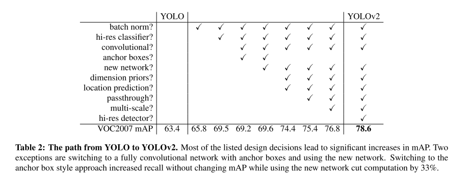
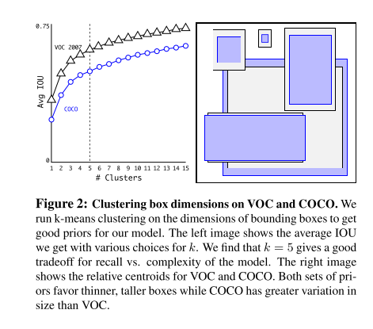
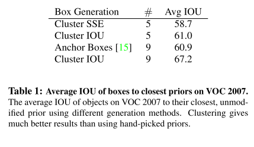
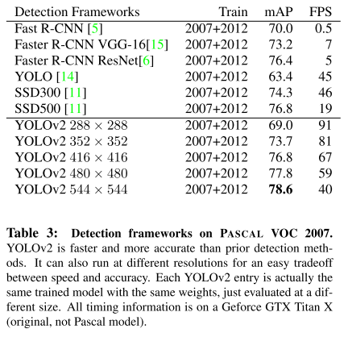
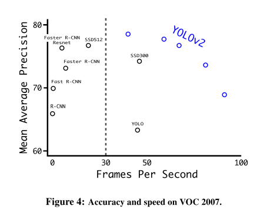
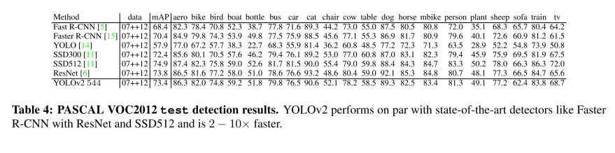
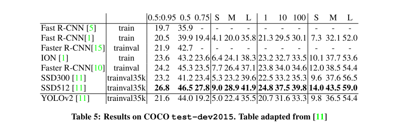
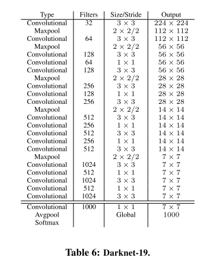
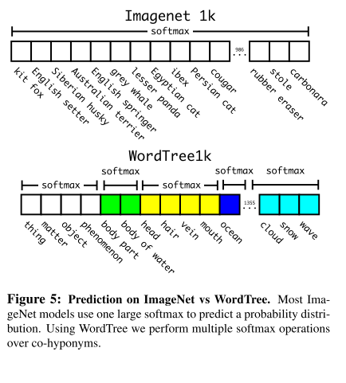
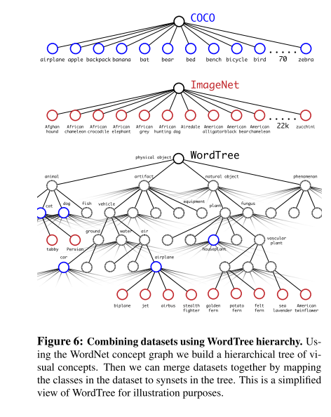

# YOLO v2

原论文：[YOLO9000: Better, Faster, Stronger](https://arxiv.org/abs/1612.08242)

基于YOLO v1的改进版，通过联合训练方法，基于COCO检测数据集和ImageNet分类数据集训练出YOLO9000模型，可以检测超过9000多类物体。

论文结构：

1. 引文（介绍目标检测发展，引出YOLO9000）
2. Better
3. Faster
4. Stronger
5. 结论（提出YOLOv2和YOLO9000）

主要翻译第2、3、4节。

## 2 Better

​		YOLO相对于SOTA的检测系统面临各种各样的短板。将YOLO的错误分析和Fast R-CNN的做对比发现YOLO在定位方面具有大量错误。此外，相对基于区域生成框的方法YOLO有相对少的召回率。因此我们的重点在于维持分类准确度的同时提高召回率和定位准确度。

​		计算机视觉现如今倾向于使用更大、更深的网络。更好的性能通常取决于训练更大的网络或将多个模型集成在一起。然而对于YOLOv2，我们想要一个更准确、速度仍然很快的检测器。我们没有扩展我们的网络，而是简化了网络，然后使表征更容易学习。我们使用了过去工作中的各种idea以及我们新的想法来提高YOLO的表现度。表2展示了系列结果。

### Batch Normalization

​		BN算法使得收敛显著增强，同时消除了对其他形式的正则化的需要。通过在YOLO中的所有卷积层上添加批量归一化层，我们在mAP上获得了超过2%的改进。BN还有助于规范模型。通过BN，我们可以从模型中移除dropout而不会过拟合。

### High Resolution Classifier

​		所有SOTA的检测方法都使用ImageNet预训练的分类器。从AlexNet开始，大多数分类器处理小于$256 \times 256$的输入图像。原始的YOLO使用$224 \times 224$的图像训练分类网络，图像分辨率增加到$448$用于检测。这意味着网络同步训练目标检测器并且调整到新的输入分辨率。

​		对于YOLO v2，我们在ImageNet数据集上的前10epochs用$448 \times 448$的分辨率微调分类网络。这使得网络拥有充足的时间调整卷积核使得在高分辨率输入上表现得更好。然后再去训练检测器。高分辨率分类网络提高了4%的mAP。

### Convolutional With Anchor Boxes

​		YOLO直接使用基于卷积层特征的全连接层来预测边界框的坐标。Faster R-CNN不是直接预测坐标，而是使用精选的先验预测边界框。Faster R-CNN中的区域提议网络（RPN）仅使用卷积层来预测锚框的偏移量和置信度。由于预测层是卷积层，因此RPN在特征图中的每个位置预测这些偏移量。预测偏移而不是坐标可以简化问题并使网络更容易学习。

​		我们移除YOLO的全连接层，使用锚点来预测边界框。首先，我们消除了一个池化层，使网络卷积层的输出分辨率更高。同时我们缩小输入图像的大小从$448 \times 448$到416。我们这样做是因为我们希望在我们的特征图中有奇数个位置，所以只有一个中心单元。物体，尤其是大物体，往往会占据图像的中心，因此最好在中心有一个位置来预测这些物体，而不是四个位置都在附近。YOLO的卷积层对图像进行了32倍的下采样，因此通过使用416的输入图像，我们得到了$13 \times 13$的输出特征图。

​		当我们将视角移到锚框时，我们也会从空间位置的类预测机制解耦出来，然后针对每个锚框预测类别和是否包含物体。与YOLO一致，objectness预测仍然预测真值框与预测框的IOU值，类别预测值为预测给定类别是否在这出现的概率。

​	使用锚框后，准确率略有下降。YOLO在每张图像只预测98个边界框，但有了锚框后，我们的模型预测就有上千个框了。没有锚框，我们的中间模型的mAP为69.5，召回率为81%。有了锚框后，mAP为69.2，召回率为88%。虽然mAP下降了，但召回率的提升意味着我们的模型还有很多改进空间。

### Dimension Clusters

​		在YOLO中应用锚框时我们遇到了两个问题。首先是盒子尺寸是手工挑选的。网络可以学习适当地调整框，但如果我们为网络选择更好的先验，我们可以让网络更容易学习好的检测。

​		与其使用手工选择先验框，我们使用k-means聚类算法在训练集的边界框中自动找到最好的先验框。如果我们使用标准的欧氏距离的k-means，那么大边界框比小边界框产生更多的错误。然而，我们真正想要的是这些先验框能够得到更好IOU分数，独立于边界框的大小。因此对于我们的距离测量，我们使用：
$$
d(box, centroid) = 1- IOU(box, centroid)
$$
​		我们使用k-means在不同的参数k上运行，然后画出平均的IOU值曲线，详见图2。我们选$k=5$作为在模型复杂度和高召回率之间最好的trade-off。集群质心与手工挑选的锚框有显著不同。短而宽的框越来越少，而又高又薄的框越来越多。

​		我们用平均IOU对我们聚类策略得出的最优先验和手工锚框作了比较，见表1。在只有5个先验框的基础上，达到了9个手工框的mIOU值。如果我们使用9个聚类中心框可以得到更好的mIOU。这表明使用k-means生成我们的边界框以更好的表示开始模型，并使任务更容易学习。

### Direct location prediction

​		在YOLO中应用锚框时我们遇到了第二个问题：模型不稳定，特别是早期迭代中。大多数不稳定性来自预测框的$(x,y)$位置。在RPN网络中预测的值$t_x,t_y$和中心坐标$(x,y)$的计算式如下：
$$
x = (t_x * w_a) - x_a \\
y = (t_y * h_a) - y_a
$$
​		举个例子，$t_x = 1$的预测会将预测框向右移动，$t_x=-1$的预测会将预测框向左移动相同的量。

​		这个公式是不受约束的，所以任何锚框都可以最终出现在图像中任何一点，无论预测框的位置如何。通过随机初始化，模型需要很长时间才能稳定以预测合理的偏移量。

​		我们遵循的方法不是YOLO中的预测偏移量和相对于网络单元位置的位置坐标。这限制了真实值落在0和1之间。我们使用逻辑激活来限制网络的预测落在这个范围中。

​		该网络在输出特征图的每个坐标上预测5个边界框。针对每个边界框预测5个坐标，$t_x,t_y,t_w,t_h,t_o$。如果单元格从图像左上角$(c_x,c_y)$偏移并且边界框先验具有宽度和高度$p_w,p_h$，则对应的预测为：
$$
b_x = \sigma(t_x) + c_x \\
b_y = \sigma(t_y) + c_y \\
b_w = p_w e^{t_w} \\
b_h = p_h e^{t_h} \\
Pr(object) * IOU(b, object) = \sigma (t_o)
$$
​		由于我们约束位置预测，因此参数化更容易学习，使网络更稳定。与使用锚框的版本相比，使用维度集群以及直接预测边界框中心位置使YOLO结果提升了5%。

### Fine-Grained Features

​		这种修改的YOLO基于$13 \times 13$的特征图做预测。这对于大物体是不充分的，它可能会受益于用于定位较小对象的细粒度特征。Faster R-CNN和SSD两者通过在各种特征图上训练它们的区域提议网络，从而得到大范围的分辨率。我们采用了不同的方法，简单地添加一个直通层，以$26 \times 26$的分辨率从较早的层中引入特征。直通层连接更高分辨率，通过将相邻的特征堆叠到不同的通道而不是空间位置来使用具有低分辨率特征的特征，类似ResNet的恒等映射。该操作将$26 \times 26 \times 512$的特征图变为$13 \times 13 \times 2048$的特征图，它可以与原始特征连接。我们的检测器运行在这个扩展的特征图上，以便它可以访问细粒度的特征。这将适度提高1%的性能。

### Multi-Scale Training

​		原YOLO使用的输入分辨率为$448 \times 448$。在锚框的辅助下，我们将分辨率改为$416 \times 416$。但是，由于我们的模型仅使用卷积层和池化层，因此可以动态调整大小。我们希望YOLO v2在运行不同尺寸的图像时具有鲁棒性，因此我们将多尺度训练应用于我们的模型。

​		我们每隔几次迭代改变网络而不是固定输入图像大小。每10个batch我们的网络随机选择一个新的图像维度尺寸。由于我们的模型下采样32倍，我们从以下32的倍数中提取：{320，352，...，608}。因此最小的选择为$320 \times 320$，最大的选择为$608 \times 608$。我们将网络重整为适应该维度，然后继续训练。

​		这种制度迫使网络能够跨越各种输入维度进行很好的预测。这意味着同一个网络可以预测不同分辨率的检测。网络在较小的规模下运行得更快，因此YOLO v2提供了速度和准确性之间的简单权衡。

​		在低分辨率下YOLO v2作为一种廉价、公平、准确的检测器。在$288 \times 288$下，它以超过90FPS的速度运行，mAP几乎与Fast R-CNN一样好。这使得它非常适合较小的GPU、高帧率视频和多个视频流。

​		在高分辨率下，YOLO v2在VOC2007数据集上SOTA的检测器，达到78.6mAP，并且还保持实时的速度。表3展示YOLO v2和其他框架在VOC2007数据集上的对比。

### Further Experiments

​		我们在VOC 2012上训练YOLO v2检测器。表4显示了YOLO v2与其他SOTA检测系统的比较性能。YOLO v2在达到73.4mAP的基础上，与同期的方法比较，速度最快。我们同样在COCO数据集上和其他方法做了对比，见表5。在VOC指标上(IOU=.5)，YOLO v2达到了44.0 mAP。

## 3 Faster

​		我们希望检测器更准确，还希望速度更快。大多数检测应用程序，如机器人或自动驾驶汽车，都依赖于低延迟预测。为了最大限度地提高性能，我们将YOLO v2从头开始设计为快速型。

​		大多数检测框架依赖VGG-16作为基本特征提取器。VGG-16是一个强大、准确地分类网络，但它不必要地复杂。输入分辨率为$224 \times 224$的VGG-16需要306.9亿次的浮点计算。

​		YOLO框架使用基于GoogLeNet架构的网络作为基网。该网络比VGG-16快，单次运算只需要85.2亿次浮点计算。但是，它的准确度比VGG-16低。对于分辨率为$224 \times 224$的ImageNet的top-5准确度，相比VGG-16的90%准确度，YOLO模型达到了88.0%的准确度。

### Darknet-19

​		用于YOLO v2的基本网络。我们的模型建立在网络设计的先前工作以及该领域的常识之上。与VGG模型类似，我们主要使用$3 \times 3$顾虑其，并在每个池化步骤后将通道数加倍。基于NIN的工作，我们使用全局平均池化进行预测，并使用$1 \times 1$卷积来压缩$3 \times 3$卷积之间的特征表示。我们使用BN来稳定训练，加速收敛，正则化模型。

​		我们最终的模型，称之为Darknet-19，拥有19层卷积层和5层最大池化层。详细描述见表6。Darknet-19只使用55.8亿次操作来处理单张图像，在ImageNet上的top-1准确度达到了72.9%，top-5准确度达到了91.2%。

### Training for classification

​		我们在标准的ImageNet 1000类别分类的数据集上训练网络160epochs，使用SGD算法，初始学习率为0.1，多项式速率衰减为4次方，权重衰减为0.0005，动量衰减为0.9，使用Darknet网络。在训练期间，我们使用标准的数据增强trick，包括随机裁剪、旋转、色调、饱和度和曝光偏移。

​		如上所讨论的，在我们对图像$224 \times 224$进行初步训练后，我们以更大的尺寸$448$来微调网络。对于这种微调，我们使用上述参数进行训练，但仅使用10个epochs，并以0.001的学习率开始。在这个更高分辨率下，我们的网络达到了76.5%的top-1准确率和93.3%的top-5准确率。

### Training for detection

​		我们通过将最后的卷积层用3层1024通道的$3 \times 3$卷积层，每个后接1层$1 \times 1$卷积层进行替换从而用来实现检测。对于VOC数据集，我们预测5个框，每个框5个坐标和20个类别，因此有125通道。我们还从最后的$3 \times 3 \times 512$卷积层到到数第二个卷积层添加了一个直通层，以便我们的模型可以使用细粒度特征。训练160epochs，初始学习率为0.001，在第60和90epoch下降一倍。权重衰减为0.0005，momentum为0.9。我们使用与YOLO和SSD类似的数据增强，随机裁剪、颜色偏移等，我们在COCO和VOC上使用相同的训练策略。

## 4 Stronger

​		我们提出了一种联合训练分类和检测的架构。我们的方法是使用标记为检测的图像来学习特定于检测的信息，例如边界框坐标预测、是否含有物体、如果分类常见对象。它使用只有类别标签的图像来扩展它可以检测的类别数量。

​		在训练期间，我们混合检测和分类数据集的图像数据。当我们的网络检测到标记为检测的图像时，反向传播基于完整的YOLOv2的损失函数。检测到分类图像时，反向传播架构的类别损失。

​		该方法面临一系列挑战。检测数据集只包含常见目标和通用标签，比如"dog"或"boat"。分类数据集拥有更多的类别标签。ImageNet有上百种狗的品种。如果我们要训练两个数据集，我们就需要一种联合的方式将这些标签汇聚。

​		大多数方法使用softmax层，跨所有可能的类别来计算最终的概率分布。使用softmax假设这些类是互斥的。这给组合数据集带来了问题，例如，您不希望使用此模型组合ImageNet和COCO，因为"Norfolk terrier"和"dog"这两个类并不相互排斥。

​		我们可以改为使用多标签来组合，不假设互斥的数据集。这种方法忽略了我们所知道的关于数据的所有结构，例如所有的COCO类都是互斥的。

### Hierarchical classification

​		ImageNet的标签来自WordNet，一种构建概念及其关联方式的语言数据库。在WordNet中，"Norfolk terrier"和"Yorkshire terrier"同属于"terrier"概念，属于"hunting dog"，属于"dog"，属于"canine"等。大多数分类方法都假设标签具有扁平结构，但是对于组合数据集，结构正是我们所需要的。

​		WordNet的结构是一个有向图，不是一棵树，因为语言具有复杂性。例如，"dog"既是"canine"也是"domestic animal"，它们都是WordNet中的同义词。我们没有使用完整的图结构，而是通过从ImageNet中的概念构建层次树来简化问题。

​		为了构建这棵树，我们检查了ImageNet并查看它们通过WordNet图到根节点的路径，在本例中为“物理对象”。许多同义词集在图中只有一条路径，因此首先我们将所有这些路径添加到我们的树中。然后我们迭代地检查我们留下的概念并添加尽可能少的增长树的路径。因此，如果一个概念有两条到根的路径，一条路径会给我们的树添加三个边，而另一个只会添加一条边，我们选择较短的路径。

​		最终的结果表示为WordTree，一个视觉概念的分层模型。为了使用WordTree来执行分类，我们预测给定同义词集的同义词集的每个下位词的概率的每个节点的条件概率。举个例子，对于"terrier"节点：
$$
Pr(Norfolk \space terrier|terrier) \\
Pr(Yorkshire \space terrier|terrier) \\
Pr(Bedlington \space terrier | terrier) \\
...
$$
​		如果我们想计算一个特定节点的绝对概率，对于特定节点，我们只需沿着树的路径到达根节点，然后乘以条件概率。所以如果我们想知道一张图片是不是Norfolk terrier，我们计算：
$$
Pr(Norfolk \space terrier) = Pr(Norfolk \space terrier|terrier) * Pr(terrier|hunting \space dog) * \cdots* Pr(animal|physical \space object)
$$
​		对于分类问题，我们假设图像包含一个对象：$Pr(physical \space object) =1$。

​		为了验证这种方法，我们训练了Darknet-19模型，在使用1000类ImageNet构建的WordTree上。为了构建WordTree1k，我们添加了所有将标签空间从1000扩展到1369的中间节点。在训练期间，我们在树上传播真值标签，这样如果图象被标记为"Norfolk terrier"后，它也会被标记为"dog"和"mammal"等。为了计算条件概率，我们的模型预测了一个包含1369个值的向量，我们计算了作为同一概念的下位词的所有系统集的softmax，参见图5。

​		使用上述的相同训练参数，我们的层次Darknet-19在top-1准确度上达到了71.9%，top-5准确度上达到了90.4%。尽管添加了369个额外的概念并让我们的网络预测了树结构，但我们的准确率仅略有下降。以这种方式执行分类也有一些好处。性能在新的或未知的对象类别上正常下降。例如，如果网络看到一张狗的图片，但不确定它是什么类型的狗，它仍然会以高置信度预测"dog"，但在下位词中分布较低的置信度。

​		这种方式同样在检测上成功运行。现在，我们没有假设每个图象都有一个对象，而是使用YOLO v2的对象预测器来为我们提供$Pr(physical \space object)$的值。检测器预测一个边界回归框和概率树。我们向下遍历树，在每次拆分时采用最高置信度路径，直到达到某个阈值并预测该对象类别。

### Dataset combination with WordTree

​		通过使用WordTree，可以以一种有效的方式将多个数据集联合在一起。我们只是简单的映射到数据集上的同义词类别。图6显示了从ImageNet到COCO数据集联合使用WordTree的方式。WordNet非常多样化，因此我们可以将这种技术用于大多数数据集。

### Joint classification and detection

​		现在我们可以使用WordTree组合数据集，可以在分类和检测方面训练我们的联合数据集。我们想训练一个超大规模的检测器，因此我们使用COCO检测数据集和完整ImageNet版本中的前9000个类别创建了我们的组合数据集。我们同样还需评估我们的方法，因此我们添加了ImageNet检测挑战中尚未包含的任何类。该数据集对应的WordTree有9418类。ImageNet是一个更大的数据集，因此我们通过对COCO进行过采样来平衡数据集，以便ImageNet仅增大4:1的因子。

​		使用该数据集训练YOLO9000。我们使用基本YOLOv2架构但只有3个先验框而不是5个来限制输出大小。当我们的网络看到检测图像时，我们会像往常一样反向传播损失。对于分类损失，我们只在标签的相应级别或更高级别上反向传播损失。例如，如果标签是"dog"，我们确实将任何错误分配给树中更下方的预测，"Golden Retriever"等，因为我们没有这些信息。

# 理解点

1. WordTree的实现，多数据集联合训练
2. 各种改良方法的应用
3. 设计了Darknet-19

