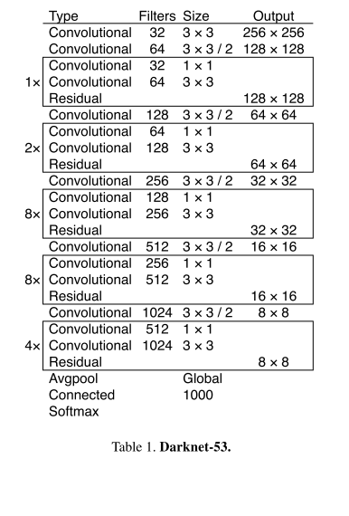
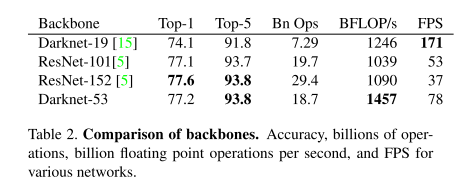

# YOLO v3

原论文：[YOLOv3: An Incremental Improvement](https://arxiv.org/abs/1804.02767)

不仅提出了新网络DarkNet-53，还基于FPN的思想设计了三个分支分别预测大中小物体。

论文结构：

1. 引文（YOLO系列缺点介绍）
2. YOLOv3采用的方法
3. 实验效果
4. 一些我们测试但并不有效的部件
5. 总结

主要翻译第2节。（这篇论文作者写得很有趣）

## 2 The Deal

​		本文中推出YOLOv3网络架构：从他人研究成果中提取了很多有用的想法。同时训练了一个比其他分类器效果都好的分类网络。我们从头梳理网络结构从而能够让您理解整个网络结构。

### 2.1 Bounding Box Prediction

​		如YOLO9000那样，我们的系统使用维度聚类边界框形成锚点框。网络对每个边界框预测4个坐标$(t_x,t_y,t_w,t_h)$。如果网格的坐标是图像左上角的偏移值$(c_x,c_y)$，边界框先验具有宽度和高度$p_w, p_h$，那么预测就对应于：
$$
b_x = \sigma(t_x) + c_x \\
b_y = \sigma(t_y) + c_y \\
b_w = p_w e^{t_w} \\
b_h = p_h e^{t_h}
$$
​		在训练期间我们使用平方误差损失总和。如果一些真值坐标预测是$\hat{t}_*$，我们的梯度是真实值（从真实值框计算）减去我们的预测：$\hat{t}_* - t_*$。通过反转上面的等式，可以很容易地计算出这个真实值。

​		YOLOv3使用逻辑回归预测每个边界框的objectness score。如果边界框先验与真值对象的重叠比任何其他边界框先验都多，则该值应该为1。如果边界框先验不是最佳的，但确实与真实对象重叠超过某个阈值，我们忽略了预测。我们的阈值设置为.5。不同于我们的系统针对每个真值对象分配一个边界框先验。如果边界框先验未分配给真值对象，则不会导致坐标或类别预测损失，只会导致objectness损失。

### 2.2 Class Prediction

​		每个框使用多标签分类预测边界框可能包含的类别。我们不使用softmax，因为我们发现它对于性能的增长没必要。在训练期间，我们使用binary cross-entropy loss来实现类别预测。

​		当我们转向更复杂的情况时，如Open Images Dataset等，这个公式会有所帮助。在这个数据集中有许多重叠的标签（比如Woman和Person）。使用softmax强加了一个假设，即每个框只有一个类，但通常情况并非如此。多标签方法可以更好地对数据建模。

### 2.3 Predictions Across Scales

​		YOLOv3在3个不同的尺度预测边界框。我们的系统使用与特征金字塔网络类似的概念从这些尺度中提取特征。从我们的基本特征提取器中，我们添加了几个卷积层。最后一个预测3维张量编码边界框、对象和类别预测。在我们对COCO实验中，我们在每个尺度上预测了3个框，因此对于4个边界框偏移、1个对象预测和80个类别预测，张量是$N \times N \times [3 * (4+1+80)]$。

​		接下来我们从之前的2层中获取特征图，然后将其上采样2倍。我们还从网络的早期结构中获取特征图，并使用串联的方式将其与我们的上采样特征合并。这种方法使我们能够从上采样的特征中获得更有意义的语义信息，并从早期的特征图中获得更细粒度的信息。然后我们再添加几个卷积层来处理这个组合的特征图，最终预测一个类似的张量，尽管现在是两倍。

​		我们再执行一次相同的设计来预测用于最终尺度的框。因此，我们对第三个尺度的预测受益于所有先前的计算以及网络早期的细粒度特征。

​		我们仍然使用k-means聚类算法来确定我们的边界框先验。我们只是随意选择了9个clusters和3种尺度，然后在各个尺度上均匀划分clusters。针对COCO数据集的9个clusters是：$(10 \times 13), (16 \times 30), (33 \times 23), (30 \times 61), (62 \times 45), (59 \times 119), (116 \times 90), (156 \times 198), (373 \times 326)$。

### 2.4 Feature Extractor

​		我们使用一个新的网络进行特征提取。我们的新网络是YOLOv2、DarkNet-19中使用的网络和新的残差网络之间的混合方法。我们的网络使用连续的$3 \times 3$和$1 \times 1$卷积层，但现在也有一些残差连接，而且明显更大。它拥有53层卷积层，因此我们叫它Darknet-53！

​		该网络比Darknet-19更有效，并且比ResNet-101或ResNet-152更有效。

​		这是在ImageNet上的训练结果：

​		每个网络都使用相同的设置$256 \times 256$进行训练和测试，单次裁剪准确度。运行时间是在Titan X上以$256 \times 256$测量的。因此，Darknet-53的性能与最先进的分类器相当，但浮点运算更少，速度更快。Darknet-53比ResNet-101好，并且快1.5倍。DarkNet-53的性能与ResNet-152相似，速度快2倍。

​		Darknet-53还实现了每秒最高实测浮点计算操作。这意味着网络结构更好地利用了GPU，使其评估效率更高，从而速度更快。这主要是因为ResNets层太多，效率不高。

### 2.5 Training

​		我们没有使用难例挖掘或其他方法在完整图像上。我们使用多尺度训练、大量数据增强、批量归一化、以及所有标准的东西。我们使用Darknet网络架构用于训练和测试。

# 理解点

1. 新网络Darknet-53
2. 采用多分支结构预测大中小物体

