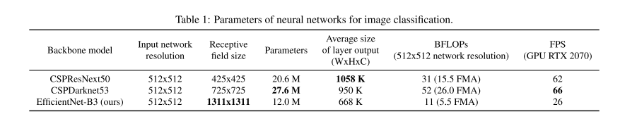
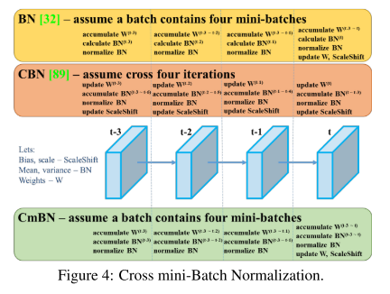
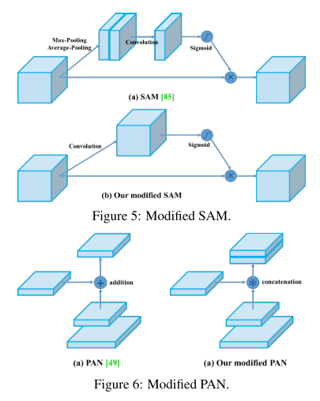

# YOLO v4

原论文：[YOLOv4: Optimal Speed and Accuracy of Object Detection](https://arxiv.org/abs/2004.10934)

主要翻译第3节。

## 3 Methodology

​		基础的目标在于优化神经网络在生产系统以及并行计算上的快速操作速度，而不是理论上的低BFLOP。我们推出了两种实时神经网络：

* 对于GPU，我们使用一个小的组数量(1-8)用于卷积层：CSPResNeXt50/CSPDarknet53
* 对于VPU，我们使用组卷积，避免使用SE模块 - 特别是包括该模块的以下模型：EfficientNet-lite/MixNet/GhostNet/MobileNetV3

### 3.1 Selection of architecture

​		我们的目标是找到输入网络分辨率、卷积层数量、参数数量($filter\_size^2 * filters * channel/groups $)、输出层数量的最优平衡。举个例子，我们的实验证明CSPResNeXt50在ImageNet目标分类上的效果优于CSPDarknet53。然而，相反而言，CSPDarkNnet53在目标检测的COCO数据集上优于CSPResNeXt50。

​		另一个目标是选择额外的模块用于增长感受野和聚合不同backbone层的不同检测层：比如FPN、PAN、ASFF、BiFPN。

​		一个在分类领域相对较优的模型不一定在检测领域较优。与分类器相比，检测器需要以下几方面：

* 高输入图像尺寸 - 为了检测到多个小尺寸的目标
* 更多层 - 用大的感受野来覆盖输入图像的尺寸增长
* 更多参数 - 为了提升一个模型的更好的检测单张图像不同大小目标的表达能力

​		假设来说，我们设定一个具有大的感受野和大量参数的模型能够作为backbone。表1显示了CSPResNeXt50、CSPDarknet53、EfficientNet B3的信息。CSPResNeXt50包含16层$3\times3$卷积层，一个$425 \times 425$的感受野和20.6M的参数量，然而CSPDarknet53包含29层$3 \times 3$的卷积层和$725 \times 725$的感受野和27.6M的参数量。这是理论上的比较，并结合我们的多次实验，证明CSPDarknet53是作为backbone的最优选择。

​		不同大小感受野的影响总结如下：

* 取决于目标大小 - 能够查看整个对象
* 取决于网络大小 - 能够查看目标上下文
* 超过网络大小 - 增加图像点和最终激活之间的连接数量。

​		在CSPDarknet53中添加SPP块，它能够显著增加感受野大小，分理处上下文的特征，并且不会影响网络的速度。我们使用PANet作为Neck，而不是YOLOv3中的FPN。

​		最终，我们选择CSPDarknet53作为backbone，SPP额外模块，PANet作为neck，YOLO v3的检测头(achor based)作为YOLO v4的检测头。

​		我们没有使用Cross-GPU Batch Normalization(CGBN or SyncBN)或其他昂贵的特定设备。这使得每个人都可以用传统的图形处理器复现我们的SOTA结果：GTX 1080Ti 或 RTX 2080Ti。

### 3.2 Selection of BoF and BoS

​		为了提高目标检测的训练，一个CNN网络通常设置如下：

* **Activations**: ReLU, Leaky-ReLU, parametric-ReLU, ReLU6, SELU, Swish, or Mish
* **Bounding box regression loss**: MSE, IoU, GIoU, CIoU, DIoU
* **Data augmentation**: CutOut, MixUp, CutMix
* **Regularization method**: DropOut, DropPath, Spatial DropOut, or DropBlock
* **Normalization of the network activations by their mean and variance**: Batch Normalization(BN), Cross-GPU Batch Normalization(CGBN or SyncBN), Filter Response Normalization(FRN), or Cross-Iteration Batch Normalization(CBN)
* **Skip-connections**: Residual connections, Weighted residual connections, Multi-input weighted residual connections, or Cross stage partial connections(CSP)

​		至于训练的激活函数，PReLU和SELU是非常难训练的，ReLU6是为量化网络设计的，因此，我们从候选列表中删除了上述激活函数。在reqularization方法中，发表Drop-Block方法的人详细对比了该方法和其他方法，证明有效性。因此，我们毫不犹豫的选择DropBlock方法作为我们的正则化方法。至于归一化方法的选择，优于我们专注于仅使用一个GPU的训练策略，因此没有考虑SyncBN。

### 3.3 Additional improvements

​		为了使得设计的检测器能够在单个GPU上训练稳定，我们添加了额外的设计如下：

* 引入新的数据增强方法Mosaic和Self-Adversarial Training(SAT)
* 我们通过遗传算法选择最优的超参数
* 我们修改了现有的方法来使得我们的设计能够有效训练和检测 - modified SAM, modified PAN, and Cross mini-Batch Normalization(CmBN)

​		Mosaic代表一种新的数据增强方法，能够混合四张训练图像。然后，4张不同的上下文被混合，然而CutMix混合两张。这使得目标的检测能够脱离原先的上下文。此外，batch normalization计算每层4张不同图像的激活统计量。这大大减轻了大的mini-batch设置的需要。

​		SAT表示一种新的数据增强技术，在2个前向后向阶段运行的技术。在第1 stage，神经网络改变原始图像而不是网络权重。通过这个方法，神经网络对自身执行对抗性攻击，改变原始图像以创建图像上没有所需对象的欺骗。在第2 stage，训练神经网络以常规方式检测此修改图像上的对象。

​		CmBN表示一个CBN的修改版本，如图4所示。

​		我们将SAM从spatial-wise attention变成了point-wise attention，并且将PAN中的shortcut connection替换为concatenation，如图5，6所示。

### 3.4 YOLO v4

​		在该节，我们将详细说明YOLOv4的细节。

​		YOLOv4包含：

* Backbone: CSPDarknet53
* Neck: SPP, PAN
* Head: YOLOv3

​		YOLOv4使用的模块：

* Bag of Freebies(BoF) for backbone: CutMix and Mosaic data augmentation, DropBlock regularization, Class label smoothing
* Bag of Specials(BoS) for backbone: Mish activation, Cross-stage partial connections(CSP), Multi-input weighted residual connections(MiWRC)
* Bag of Freebies(BoF) for detector: CIoU-loss, CmBN, DropBlock regularization, Mosaic data augmentation, Self-Adversarial Training, Eliminate grid sensitivity, Using multiple anchors for a single ground truth, Cosine annealing scheduler, Optimal hyper-parameters, Random training shapes
* Bag of Specials(BoS) for detector: Mish activation, SPP-block, SAM-block, PAN path-aggregation block, DIoU-NMS

# 理解点

1. 各种trick的介绍和集成
2. 最好通读原文，信息量很大

