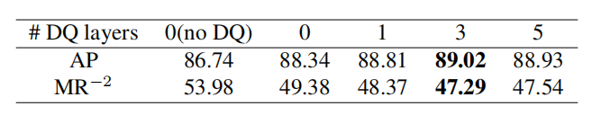

# DETR for Crowd Pedestrian Detection

Matthieu Lin 1 Chuming Li 2 Xingyuan Bu 2 Ming Sun 2 Chen Lin 3
Junjie Yan 2 Wanli Ouyang 4 Zhidong Deng 1 1Department of Computer Science and Technology, Tsinghua University.* 2SenseTime Group Limited, 3University of Oxford , 4The University of Sydney
{lin-yh19@mails, michael@}.tsinghua.edu.cn
{lichuming, sunming1, yanjunjie }@sensetime.com
sefira32@gmail.com, chen.lin@eng.ox.ac.uk, wanli.ouyang@sydney.edu.au

## **Abstract**

由于从 anchors到行人的 heuristically 定义的映射，以及NMS和高度重叠的行人之间的矛盾，人群场景中的行人检测提出了一个具有挑战性的问题。最近提出的端到端检测器(ED)、DETR和可变形DETR，取代了手工设计的组件，例如使用了 transformer结构的NMS和anchors，它通过计算queries之间的所有成对交互来消除重复的预测。受这些工作的启发，我们探讨了它们在人群行人检测方面的表现。令人惊讶的是，与使用FPN的Faster-RCNN相比，结果与在COCO上获得的结果相反。此外，ED的二分匹配由于人群场景中ground truth数量较大，降低了训练效率。在这项工作中，我们确定了导致ED性能不佳的潜在因素，并提出了一种新的解码器来解决它们。此外，我们设计了一种机制，专门为ED利用遮挡较少的行人可见部分，实现进一步的性能提升。引入了一种更快的二分图匹配算法，使人群数据集上的ED训练更加实用。提出的探测器PED（行人端到端探测器）在城市居民和人群上优于之前的 EDs和 baseline Faster-RCNN。它还达到了与最先进的行人检测方法相当的性能。代码将在https://github.com/Hatmm/PED-DETR-for-Pedestrian-Detection.上提供

图1：绿色的方框是后面的人的可见区域。蓝色的框和点是与人相匹配的anchor和point。正如我们可以观察到的，这个point或者anchor的point是在前面的人的身体上，因此使映射模糊不清。而可变形的DETR能够自适应地改善其注意位置到可见部分的特征（红点）。

## **1. Introduction**

行人检测由于其在自动驾驶、监控和机器人技术领域的广泛应用，是一个重要的研究领域。近年来行人检测技术已经有了很好的改进。然而在被遮挡或人群场景中的行人仍然难以准确发现。

行人检测涉及两个基本问题有待解决：(1) 将特征映射到实例 (2) 排除重复预测。在前一种情况下，大多数检测器从卷积神经网络(CNN)特征图上的点映射到ground truth(GT)边界框建立启发式映射。如果一个点与GT中心的距离较小，或其定义的anchor与GT的联合IOU值较高，则分配给GT。然而，由于行人高度重叠，外观变化等，位于一个GT的中心部分的点很可能被映射到另一个GT。这意味着 heuristically 定义的映射是不准确的。在图1中，我们展示了即使有可见的注释，基于距离的映射和基于anchor的映射也会出现歧义。在后一种情况下，（2），单个GT的重复proposals通常由现代detectors 产生，需要一个后处理机制来过滤掉。然而，广泛使用的non-maximum suppression(NMS)依赖于intersection-over-union(IOU)，并在人群场景中失效。因为重复的proposals和另一个GT的proposals可能都与GT的真正positive proposals有很高的IOUs。

现有的行人检测解决方案主要集中于两种类型的改进上。一些研究人员探索使用更独特的身体部位，如头部或可见区域，并用它来学习额外的监督，重新加权feature map或指导anchor选择[40,28,5]。其他一些工作提出了聪明的方法来引入更多的信号，包括邻近GT的存在和方向、可见区域之间的IOU和局部密度[24,17,5]，使重复的proposals和关闭GT的proposals更容易区分。这两种类型的工作都取得了显著的改进，并部分解决了上述两个挑战。

最近提出的端到端检测器，DETR和可变形DETR[4,43]，在公共对象检测上的性能相当，甚至更好。在接下来的部分中，我们使用“DETR”来指代DETR和可变形的DETR。我们确定了DETRs的两个特性，这说明了它们在行人检测方面优于前者的自然优势。一方面，DETR是基于query的，不依赖于feature map点和GTs之间的映射的heuristic设计。相反，DETR查询会自适应地确定它们的有效注意区域feature maps和相应的objects。另一方面，DETR学习了queries和GTs之间的二分图匹配。匹配为每个GT分配一个单独的query，没有任何重复的proposal。这两个特性表明了DETR在解决行人检测这两个挑战方面的潜力。

*表1：在 CrowdHuman上的DETRs和 Faster-RCNN+FPN的比较。所有模型都在8张Tesla V-100s显卡上进行了训练。因为CrowdHuman有大量的GT数量，我们将对象queries的数量增加到400个。*

我们探讨了DETR在行人检测方面的性能，并将其与Faster-RCNN[30]进行了比较，后者是DETR工作和行人检测工作中使用的标准基线。不幸的是，结果与COCO上的结果相反[23]。表1显示，在CrowdHuman[31]上，原始的DETR和可变形的DETR性能都比Faster-RCNN差得多。此外，由于DETR在人群行人数据集上训练的标准KM算法[1]非常耗时，其二分图匹配的时间复杂度为GT数量的立方。二分图匹配的成本大约是检测器在CrowdHuman上正向加反向传播的2倍，成为DETR训练的瓶颈。

我们分析了可变形DETR比原始DETR的优势但在行人检测方面性能较差的原因。我们发现其(1) 稀疏均匀queries和(2) 弱注意力机制影响了性能。可变形DETR的解码器学习从稀疏均匀分布的queries到自然局部密集的行人集群的映射。正如我们在第4.2节中所讨论的，这种映射是模糊的，并导致了遗漏的GTs。在feature maps上的解码器的注意位置也存在问题。注意位置在训练过程中被自适应地学习，而它们不收敛到一个良好覆盖相应GT的校正和紧凑的位置集。相反，它们往往覆盖一个以上的GTs，或不足以为大量人物扩展。从这些观察结果中，我们提出了一个具有密集查询和整正注意场(DQRF)的解码器。DQRF显著提高了DETR的行人检测能力，缩小了DETR和Faster-RCNN之间的差距。此外，我们还探讨了如何利用可见区域的注释，建立一个基于可见区域的集监督，即V-Match，以及具有可见区域感知能力的数据增强，这进一步提高了DETR的性能。最后，我们设计了一种基于先验的KM算法的启发式改进，即GT在ED双分图匹配中倾向于匹配其密切的proposals。这导致了Fast-KM速度提高了10倍，使DETR在行人检测任务中更加实用。

我们的贡献总结为：

我们对行人检测任务中的DETR进行了深入的分析，并确定了直接将DETR应用于行人检测时存在的问题。

我们提出了一种新的DETR解码器，DQRF，它显著提高了DETR的行人检测性能，并缩小了DETR和Faster-RCNN之间的差距。并提出了一种 Fast-KM法，提高了DETR在行人检测方面的实用性。

我们进一步探索了专门针对DETR可见区域注释的利用，并建立了一个基于可见区域的集群监督，V-Match，以及感知可见区域的数据增强。

结果得到的特定行人DETR，即PED，优于有竞争力的Faster-RCNN，并在具有挑战性的 CrowdHuman 和 CityPersons[39]基准上取得了与最先进的结果相当的性能。我们希望我们的工作能够作为行人检测的端到端检测器的新基线，就像同样的DETR和可变形DETR的公共目标检测一样。

​       *图2：我们的具有N个DQ层和M个RF层的DQRF解码器的概述。编码器架构与[43]中保持一致。*

## **2. Related Work**

**Generic Object Detection.**在深度学习时代，大多数通用对象检测可以分为两类： two-stage检测[12,14,11,30]和one-stage检测[25,29,22,20]，这取决于是否采用了明确的区域建议和池化流程。为了进一步提高性能，引入了FPN[21,10]和DCN系列[7,42]来增强特征表示。同时，迭代预测[3]和额外监督[13,19,18]可以产生更精确的bounding boxes。最近，一些工作试图删除feature map网格上的预定义锚定假设，称为anchor-free检测方法。他们倾向于使用中心点[9]或关键点[41,34]，而不是 anchor box。关系网络[16]通过 long-range注意力机制来建立不同proposals之间的模型关系，然后用来区分生成的proposal是否是唯一的预测。然而，它仍然涉及到hand-crafted的排序和box embedding。与上述通用的目标检测方法不同，DETR[4]可以直接从输入图像中生成预测集。

**Pedestrian Detection.**行人检测是自动驾驶、监控和机器人技术的基本技术。尽管[8,38,39]在过去的十年中取得了很大的进展，但由于NMS[31]具有令人困惑的特征和极端情况，在人群场景中的行人检测仍然具有挑战性。OR-CNN[40]和MGAN[28]认为不可见部分是噪声，并降低这些特征的权重来处理令人困惑的特征。PedHunter[6]采用了更严格的重叠策略来减少匹配的模糊性。在[6,5]中使用人类头部也可以作为线索进行探索。对于dilemmatic NMS，自适应NMS[24]首先预测人群密度，然后根据预测的密度动态调整NMS阈值。可见框和头部框[17,5]也提高了NMS的性能，并部分解决了如何生成适当预测的基本问题。Anchor-free方法也适用于[27,37]中的行人检测，并保留了NMS。[33]将提案预测视为一个序列生成，这是检测中不必要的属性。

**DETR.**一般的对象检测方法通常包含一个 hand-crafted的后处理，即NMS。尽管它的变体类型是[2,15]，但这个后处理过程无法访问图像信息和网络特征，必须单独使用。因此，对NMS不能进行端到端优化。最近的DETR[4]和可变形的DETR[43]利用了基于transformer模块的encoder-decoder体系结构，它本质上可以构建上下文特征和删除副本。虽然它们在公共检测数据集中实现了相对较高的性能，但在人群场景中，如前言所述它们无法很好地实现行人检测。

## **3. Revisit DETR**

#### 3.1. Decoder

最近的DETRs是基于transformer[35]的体系结构，并通过二分匹配为每个GT分配一个唯一的query。这里我们简要阐述了DETR的检测过程如下。

设$q$表示$$q_i∈R^C$$的一组查询，$x$表示$$x_i∈R^C$$的特征映射点。在transformer的解码器中，查询集$$q$$通过$$q$$和$$x$$之间的cross-attention和$$q$$之间的self-attention进行迭代更新。这个过程可以表述为一系列函数$$F^t$$，其中$$q^t=F^t(q^{t−1}，x)$$，并且$$t∈1，...，T$$，$$T$$表示解码器层数。我们进一步将$F^t$分解为$$F_c^t$$和$$F_s^t$$。$$F_c^t(q,x)$$表示q和x之间的cross attention，$$F_s^t(q)$$表示q之间的self attention。因此，$$F^t(q^{t−1},x)=F_c^t(F_s^t(q^{t−1}),x)$$。

#### **3.2. Multi-Head Attention**

DETR的功能$$F_c^t$$和$$F_s^t$$是基于 transformer的multi-head attention。在这两个DETRs中，$$F_c^t$$由一个标准的 multi-head自我注意模块(MSA)组成，然后是一个多线性映射(MLP)，如Eq1，2所示。其中LN表示层归一化。
$$
q^{t−1}_msa = LN(MSA(q^{t−1}) + q^{t−1}), \tag{1}
$$

$$
F_s^t(q^{t−1}) = q^{t−1}_s = LN(MLP(q^{t−1}_{msa}) + q^{t−1}_{msa}).\tag{2}
$$

交叉注意函数$$F_c^t$$同样由q和x之间的多头交叉注意模块(MCA)组成，然后是一个MLP(Eq.3,4)。
$$
q^{t−1}_{mca} = LN(MCA(q^{t−1}_s, x) + q^{t−1}_s), \tag{3}
$$

$$
F_c^t(q^{t−1}, x) = q^t = LN(MLP(q^{t−1}_{mca}) + q^{t−1}_{mca}). \tag{4}
$$

MSA和MCA都可以通过一个基本的 multi head attention(MA)模块来表示，如Eq.5,6,7。
$$
MA(q_i, z) = \sum_{m=1}^MWm\sum_{k∈Ωi} A_{mik}W^V_mz_k, \tag{5}
$$

$$
MSA(q_i) = MA(q_i, q), \tag{6}
$$

$$
MCA(q_i, x) = MA(q_i, x). \tag{7}
$$

$$z$$是一组$$q_i$$会注意的向量。在MSA中，$$z$$是$$q$$本身，在MCA中，是feature maps $x$。对于每个头$$m$$，在$z$上操作一个线性投影$W^V_m∈R^{\frac{M}{C}×C}$，以将其映射到一个新的表示形式。将注意力权重$$A_{mik}$$应用于$$Ω_i$$中位置表示的加权求和，即$q_i$的注意力场。最后，将所有头部的加权求和特征线性投影到$$R^C$$上并求和。

原始的DETR和可变形DETR在MCA的设计上有所不同，其中MA模块有不同的$Ω_i$和$A_{mik}$表达。在可变形DETR中，$$Ω_i$$是一组小的部分位置，它覆盖了不同分辨率的多个feature maps上的点，$Ω_i$是通过在查询$$q_i$$上的线性投影得到的。然而，在DETR中，$$Ωi$$是 feature map 上分辨率最低的所有点。前一种方法更有效，因此支持高分辨率。此外，通过线性投影也得到了可变形DETR的$$A_{mik}$$，其计算成本低于DETR，后者将$$q_i$$和$$z_k$$投影到新的表示中，并计算它们之间的内积。

#### **3.3. Set Prediction**

在DETR中，每个解码器层的查询集$$q^t$$分别通过两个MLPs，映射到bounding box集$$b^t$$中，进行分类和边界框回归。每个边界框集$$b^t$$都通过$$b^t$$和GTs之间的二分匹配进行监督。对于二分匹配，DETR和可变形DETR均使用标准的KM算法。

## **4. Method**

#### **4.1. Why DETR Fails in Pedestrian Detection?**

我们在CrowdHuman上比较了原始DETR和可变形DETR，这是一个具有挑战性的数据集，包含高度重叠和人群，并将它们与行人检测的标准基线Faster-RCNN进行比较。所有的检测器都是按照标准的超参数来实现的。表1展示了一个反直觉的结果。原始DETR和可变形DETR与基线相比都有明显的性能下降。此外，DETR在CrowdHuman上的训练效率远低于公共目标检测数据集COCO。

由于可变形DETR比原始的DETR具有更高的性能，我们以其为起点，分析了其性能下降背后的原因。我们的研究重点是解码器，这是DETR的集预测机制的关键架构。我们将$$Ω^{c,t}_i$$定义为特征图上第$$i$$个查询的交叉注意域，将$$Ω^{s,t}_i$$定义为第i个查询在第$$t$$个解码器层中实现自我注意的位置集。在解码器中，迭代更新查询集$$q^0,q^1,...,q^T$$。在每个解码器层$$t$$中，$$q^{t−1}$$通过self attention在$$Ω^{s，t−1}$$上相互交换信息，然后预测attention field $$Ω^{c,t−1}$$，从特征图中提取对象信息。在最后一层$$T$$中，每个查询$$q^T_i$$将一个GT或背景与其注意轨迹$$Ω^{c,0}_i,Ω^{c,1}_i,...,Ω^{c,T-1}_i$$相匹配。 

#### **4.2. Dense Queries**

*图3：在第一个解码器层（左)和最后一个解码器层(右）中，queries的注意力区域$$Ω^c$$的中心位置之间的可视化比较。我们可以观察到，对象查询需要学习从稀疏均匀分布到密集的行人集群的压缩。每个圆的大小代表了相应查询预测的每个box的预测面积。*

首先，我们发现GT的局部密集分布与查询集$q$的均匀稀疏分布之间存在冲突。具体来说，经过训练后，由于行人的外观相似，不同查询集的初始交叉域$$Ω^{c,0}$$均匀分布在feature map上，如图3（左）所示。由于计算资源的限制，这些queries也很稀疏。当然，在单个图像中，行人往往自然地密集分布在一些局部地区（例如一个角落或水平线），attention field$$Ω^{c,0}$$最初位于这样的局部密集区域的查询的数量$$q^0$$并不总能足以匹配区域内所有行人，如图3所示。这意味着，解码器层$$F^t$$学习从整个图像逐步缩小均匀分布稀疏查询的注意力域$$Ω^{c，t−1}$$，从而集聚密集的对象集群。这个过程有两个要求：（1)对象的巨大感受野，(2）从大量的初始位置到局部密集GTs的映射。在这两个要求中存在两个冲突。一方面，巨大的感知范围表明对CNN的感受野有严格的要求。另一方面，映射是非常模糊的，因为很少有queries的先验几何线索来决定GTs如何分配，事实上，尽管queries由严格的两分匹配监督，在密集的对象集群中，位于不同GTs上的queries数量之间仍然存在不平衡，有些GTs被忽略，而另一些GTs包含超过3个queries，如图4所示。

​                                            *图4：可变形DETR基线的预测。我们用绿色GTs突出显示这些是被忽略的，而许多其他GTs包含超过3个queries。*

上面的讨论意味着，密集的queries将会有所帮助。当queries足够密集时，每个GT的二分匹配结果大致是其最近的唯一查询，并且对query感受野的要求要低得多。然而，MSA模块的时间复杂度是queries数的二次方，几乎没有一个密集的qureies集。我们设计了一个Dense Query(DQ)模块，通过将MSA的复杂性从query数量$$N_q$$的$$O(N_q^2)$$降低到$$O(N_q)$$来支持密集设置。

transformer的局部自注意力机制是提高计算效率的有效方法。然而，在transformer中，queries与标记位置有一对一的对应关系，并且可以通过将$$Ω^s_i$$限制为一些临近位置$$\{...，i−1，i，i+1，…\}$$来自然地设计位置。然而，虽然DETR中的queries在feature map上标注了注意位置，但在训练过程中，这些位置是零散和可变的。为了给DETR中的queries开发一种距离度量，我们首先回顾了$$Ω^s_i$$中某个query $$q_i$$应该是哪些queries。在MSA中，$$q_i$$从$$Ω^s_i$$中的queries中接收信息，以确定它自己或$$Ω^s_i$$中的其他queries是否与GT相匹配，正如DETR中所讨论的那样。这个合理的假设表明，距离应该通过两个queries匹配相同GT的可能性来衡量。考虑每个解码器层按顺序预测其box集$b^{t-1}_i$，我们在之前的解码器层使用$q^{t-1}_i$的box预测$b^{t-1}_i$和$q^{t-1}_j$的$b^{t-1}_j$的重叠部分，来衡量$q^{t-1}_i$和$q^{t-1}_j$的距离，因为重叠越高，$q^{t-1}_i$和$q^{t-1}_j$越可能预测相同的GT。因此，我们将距离测度量$$d^{t-1}_ij$$和$$Ω_i^{s,t−1}$$定义为：
$$
d^{t-1}_{ij}= 1 − GIOU(b^{t−1}_i , b^{t−1}_j ),\tag{8}
$$

$$
Ω_i^{s,t−1} =\{{τ^{t−1}_{i1} , τ^{t−1}_{i1},..., τ^{t−1}_{iK}}\},\tag{9}
$$

其中$$τ^{t−1}_i$$是$d^{t−1}_{i}$的升序，我们根据定义的$d^{t−1}_{i}$选择$q^{t−1}_{i}$最近的K个邻居。如第5节所示，我们的DQ算法支持在不增加计算成本的情况下两倍的queries数量，并且比不改变$Ω_i^s$通过强制查询只关注附近的queries而简单地添加两倍queries获得更好的性能。

#### **4.3. Rectifified Attention Field**

在DETR中出现的另一个问题是交叉注意$$Ω^{c,T}_i$$。$$Ω^{c,t}_i$$是通过在query特征上的线性投影来预测的，它有混乱或有限的风险。在我们的实验中，在$$Ω^{c,t}_i$$中平均34.9%的注意位置是在GT与之对应匹配的query $q^t_i$ 框外的，其中69.7%位于附近的GT的框上，如图5（左）所示，这引入了噪声。此外，学习到的$$Ω^{c,t}_i$$对于匹配大型人群的queries来说往往不够充分，如图5（右）所示，它损害了分类评分和box回归的准确性。

*图5：基线和矫正集中注意力区域之间的视觉比较。每个点的大小代表每个采样点的权重。带有绿色框的图片显示了可变形DETR在k=4时预测的注意力区域。*

*表2：每一层与前一层之间匹配的ground truth的相似比，以及每个预测框与前一层之间的 IoU重叠。数值是通过在CrowdHuman上使用预训练的可变形的DETR对训练集进行平均计算得到的。*

为了减轻query的噪声或有限的的注意力区域，我们设计了一个RF（Rectified attention Field）模块来校正最终M层的注意力区域$$Ω^{c,t}_i$$。如表2所示，我们发现超过95%的queries在最后三层匹配相同的GT。这意味着第4层或第5层的box预测$$b^t_i$$几乎总是在最终目标GT附近，我们可以使用中间体box预测$$b^t_i$$来得到一个更紧凑、足够宽泛的注意力区域$$Ω^{c,t}_i$$。我们将这个注意力区域$$Ω^{c,t}_i$$设置为：
$$
Ω^{c,t −1}_i = \{{(x^{t−1}_i + \frac{i1}{R+1} w^{t−1}_i, y_i^{t−1} + \frac{i2}{R+1} h^{t−1}_i)}\}, i1, i2 ∈ \{1, ..., R\},\tag{10}
$$
其中，在$x^{t−1}_i$,$y^{t−1}_i$,$w^{t−1}_i$,$h^{t−1}_i$是box预测$$b^{t−1}_i$$的位置、宽度和高度。我们在$$x^{t−1}_i$$中使用统一识别的R×R点，它可以减轻学习到的$$Ω^{c,t-1}_i$$混乱或有限的风险。表4显示，我们提出的方法在CrowdHoman上显著超过基线。所提出的解码器，即DQRF，如图2所示。

#### **4.4. Further improvement with visible region**

 在最近的工作中，[17,5]开发了利用可见区域注释的方法。这些方法表明，在边际额外成本下，合理利用可见注释会带来相当大的收益。因此，我们还建议利用端到端框架下的可见注释。所提出的**V-match**方法，实现了类似的性能增益，并且没有引入额外的计算成本。

我们设计了一种新的DETR目标的适应方法。考虑到DETR预测了一组连续的边框$$b_1，...，b_T$$，我们在最后一个$$L$$层上对所有 boxes，第一个$$T−L$$层上可见的boxes分配监督。这意味着在第一个$$T−L$$层中，回归倾向于预测可见的方框，并且queries被明确地限制为专注于行人的可见部分。如第5.1节所示，V-match以零成本实现了稳定的改进。

#### **4.5. Other Adaptations**

在人群行人数据集上进行DETR训练时GPU利用率较低，因为二分匹配的标准KM算法是GT数量的立方。我们使用先验，即GT被分配到其最近的预测box，并相应地调整它，这导致Fast-KM的速度比CrowdHuman上的标准KM快10倍。我们忽略了一些细节比如KM算法的复杂性，并在我们的代码中发布它。

我们保留了用于DETR和可变形DETR的crop增强。虽然它对传统的检测器帮助不大，但它提供了对象分布的多样性，以防止DETR在训练数据集中过度拟合对象分布。然而，它在人群行人的检测中是不利的，因为封闭的行人往往有一个小的可见部分，这很容易被裁剪出来。因此，我们调整了crop操作，以保护每个行人至少有80%的可见区域。

## **5. Experiments**

​                                                                                *表3：每个数据集的统计数据。重叠的阈值设置为IoU>0.5*

**Datasets**.我们在两个人类检测基准 CrowdHuman和 CityPersons上评估了我们的PED。这两个数据集都包含这两类bounding boxes注释：人类可见区域和人类全身bounding boxes。如表3所示，与 CityPersons相比，CrowdHuman数据集更具挑战性，因为它每张图像包含更多的实例，而且这些实例往往高度重叠。

**Evaluation Metrics**.我们使用了用于行人检测的两个标准指标来评估PED的性能：

平均精度遵循标准的COCO评估度量，该度量计算插值精度$w.r.t$召回率曲线的曲线下面积。该度量是检测中最常用的度量，因为它反映了精度和召回率。

对数平均缺失率($$Mr^{−2}$$)，它以对数尺度计算每张图像的假阳性缺失率，其范围为[$$10^{−2},10^0]。$$该度量标准是行人检测中最常用的度量标准，因为它反映了未被检测到的行人的数量。

**Detailed Settings**.由于DETR需要超长时间的训练，我们选择了在基于可变形DETR上用迭代边界框细化方式实验我们提出的方法。对于所有的对比实验，我们采用使用迭代边界框细化的标准变形DETR作为基线，除了我们将queries数量从300增加到400以外，所有超参设置都遵循Deformable DETR，并将4.2节中提到的Dense Query方法的queries数量设置为1000。对于训练，我们使用与可变形DETR相同的方案，例如，模型训练50个epochs，在第40个epoch学习速率下降了10倍。我们还稍微修改了原始的裁剪，这样全身bounding-box就不会被裁剪，因为它们经常超过图像的大小。对于我们的最终结果，由于DETR受益于更长时间的训练，我们还建议训练模型100个epochs，在第90个epoch学习率下降10倍。我们使用DQ设置，将L设置为2以进行全框监督，并使用3个RF层。

#### **5.1. Ablation Study**

我们进行了 对比实验，并报告了我们用第4节中提出的新方法在CrowdHuman数据集上的最高精度。对于对比实验，我们用我们提出的从最后一层开始的迭代边界框细化方法取代了deformable DETR层，因为它被认为是最准确的bounding box预测。如表2所示，在后一层，预测的bounding box不太可能波动。我们假设替换第一层并没有进一步改善，因为表2显示第一层的bounding boxes噪声很大，变化(IoU很低)很大。

**Ablation study on Rectifified Attention Field**. 正如4.3中所讨论的，可变形机制可能会在多个人之间产生噪声注意位置，并可能使检测框内的实例模糊，因此我们建议添加我们的Rectifified Attention Field来适应解码器层。表4显示了我们引入的新方法通过Rectifified Attention Field改变解码器层数的对比，我们的方法在所有RF设置下都比基线有显著改善。

​                                                                           *表4：强化注意场(RF)层数的影响。请注意第一行相当于基线*

**Ablation study on V-Match**. 表5显示了第4.4节中提出的 V-match在不同L值的对比。我们可以观察到，对于任何设置，引入可见框的监督都比基线有所改进。

​                                         *表5：具有 full box监督的层数的效果。注意在L=6的情况下，它相当于基线，因为我们的基线有6个解码器层。*

**Ablation study on Dense Queries**. 表6显示了密集查询算法的对比情况。如前所述，为了进行公平的比较，我们通过迭代边界框细化来训练另一个基线Deformable DETR，并将queries的数量从400个增加到1000个。我们使用1000个queries的基线比使用400个queries的基线有显著改善，这支持了我们的假设，即需要一种密集的查询方法。我们通过DQ改变层数以降低计算成本，并观察到在基线上使用1000个查询应用5个DQ层甚至会进一步改进，因为它迫使查询只关注附近的queries，而不是不相关的queries或背景。交叉验证后，K固定为100。

​                      *表6：密集查询方法对层数的影响。注意第一列相当于包含400个queries的基线，后一列对1000个queries的基线应用不同数量的DQ层。*

**Ablation studies on Crop Augmentation**. 正如4.5节中所讨论的，我们保留了每个行人至少80%的可见区域，因为被遮挡的行人只显示一小部分可见部分，这很容易裁剪出表7显示了我们新提出的数据增强的对比。

​                                                                                                *表7：对我们的Crop Augmentation技术的对比研究。*

#### **5.2. Results on CityPersons and CrowdHuman**

CityPersons分别包含2975和500张图像用于训练和验证，CrowdHuman分别包含15000和4370张图像用于训练和验证。

与标准的Faster-RCNN+FPN基线以及CrowdHuman 和 CityPersons其他最先进的方法进行比较。我们报告了CityPersons的严重遮挡子集的结果，而在CrowdHuman上，我们报告了$$AP$$和$$MR^{-2}$$。表8和表9显示了我们在CrowdHuman 和 CityPersons上的最终结果。与可变形的DETR和Faster R-CNN相比，我们提出的PED在行人检测方面有了很大的提高，甚至能够与非常具竞争力的最先进的方法比如PBM竞争，同时具有有可比性的FLOPs。

​                                                                      *表8： CityPerson的 Heavy子集 结果表明，我们的方法在封闭拥挤场景中是有效的。*

​                                                                                        *表9：CrowdHuman上的结果。*表示不使用可见的boxes3*

## **6. Conclusion**

本文设计了一种新的解码器DQRF，它可以轻松地实现，并帮助缓解DETR在行人需求上的明显缺点。我们还提出了一种更快的双向匹配算法，并利用可见的框注释专门为DETR获得进一步的改进。我们希望所得到的检测器，即PED，能够激发未来的工作，并作为端到端行人检测的基线。  
