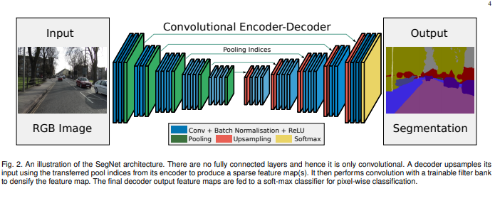
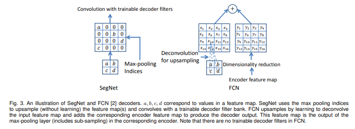
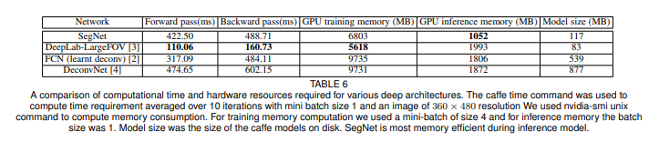

# SegNet

原论文：[SegNet: A Deep Convolutional Encoder-Decoder Architecture for Image Segmentation](https://arxiv.org/pdf/1511.00561.pdf)

## Abstract

我们提出了一种新颖且实用的深度完全卷积神经网络结构用于语义分割，称之为SegNet。该核心可训练的分割网络由编码网络、相应的解码网络和像素分类层组成。编码部分的架构在拓扑上与VGG16网络中的13个卷积层相同。解码网络的作用是将低分辨率编码网络特征映射到完整的输入分辨率特征图上，以此来进行像素级分类。SegNet的新颖之处在于解码网络对较低分辨率的输入特征图进行上采样。具体来说，解码网络使用相应编码网络的最大池化步骤来计算池化索引，用其来执行非线性上采样。这就消除了学习向上采样的必要性。上采样的图是稀疏的，然后用可训练的滤波器进行卷积，从而生成密集的特征图。我们将提出的架构与广泛应用的FCN和著名的DeepLab-LargeFOV,DecovNet架构进行比较。这种比较揭示：实现良好分割性能在内存与精度之间的权衡情况。

SegNet起初为了解决场景理解问题。因此，在推理过程中，它在内存和计算时间方面都是高效的。与其他架构相比，它的可训练参数数量也显著减少，并且可以只用随机梯度下降进行端到端的训练。

##  3 Architecture

SegNet有一个编码网络和一个相对应的解码网络，最后跟一个像素级分类层。编码网络由13卷积层组成，它们对应于分类网络VGG16中的前13个卷积层。因此，我们可以使用从大数据集上进行分类训练得到的权重来初始化训练。我们也可以丢弃全连接层，以便在最深的编码编码输出中保留较高分辨率的特征图。与其他架构相比，SegNet编码网络中的参数量显著减少（从134M减少到14.7M）。每个编码层都有对应的解码层，因此该解码网络也有13层。最终解码层的输出被送到多类softmax分类器，以分别产生每个像素的类别概率。

在编码网络中每个编码层都用一个滤波器组进行卷积，从而产生一组特征图。接着进行批处理标准化(BN)。然后，应用元素级整流线性非线性函数（ReLU)$ \max(0，x)$。在这之后，执行窗口为2*2大小和步长为2（非重叠窗口）的最大池化操作，并对结果输出按因子2进行下采样。最大池化用于实现输入图像在小空间位移上的平移不变性。下采样为特征图中的每个像素产生一个大的空间窗口。虽然几层最大池化和子采样可以为鲁棒分类实现更多的平移不变性，但相应地会损失特征图的空间分辨率。逐渐增大的损失（边界细节）不利于图像分割，因为边界描绘是至关重要的。因此，在下采样之前，需要在编码特征图中捕获和储存边界信息。如果推理过程中的内存不受限制，则可以储存所有编码特征图（下采样之后）。但在实际应用中通常不是这样的，因此我们提出了一种更有效的方法来存储这些信息。它只存储最大池化索引，即为每个编码特征图存储每个池化窗口中最大特征值的位置。原则上，这可以通过为每个 2 × 2 池化窗口使用 2 bits 来完成，因此与以浮点精度记忆特征图相比，存储效率更高。正如我们稍后在这项工作中展示的那样，这种较低的内存存储导致精度略有下降，但仍然适用于实际应用。

适当的编码网络是用对应编码特征图中存储的最大池化索引作为输入特征图进行上采样。此步骤产生稀疏特征图。图3展示了SegNet decoding技术的过程。将这些特征图与可训练的解码滤波器组进行卷积以生成密集的特征图。然后将批量归一化应用于每个特征图。请注意，对应于第一个编码层（最接近输入图像）的解码层生成多通道特征图，尽管其编码层输入具有 3 个通道（RGB）。这与网络中的其他解码层不同，这些解码层生成的特征图的大小和通道数与其编码器输入相同。最终解码层输出的高维特征表示被馈送到可训练的 softmax 分类器。 这个 softmax 独立地对每个像素进行分类。 softmax 分类器的输出是一个 K 通道的概率图像，其中 K 是类的数量。 预测的分割结果对应于每个像素上概率最大的类别。

我们在这里添加另外两个架构，DeconvNet [53] 和 U-Net [16] 与 SegNet 共享相似的架构，但有一些差异。 DeconvNet 具有更大的参数化，需要更多的计算资源并且更难进行端到端的训练(表6)，这主要是由于使用了全连接层（尽管以卷积方式）。

与 SegNet 相比，U-Net （为医学成像领域提出）不重用池化索引，而是将整个特征图（以更多内存为代价）传输到相应的解码器并将它们连接起来进行上采样（通过反卷积）。 U-Net 中没有 VGG 网络架构中的 conv5 和 max-pool 5 块。 另一方面，SegNet 使用来自 VGG 网络的所有预训练卷积层权重作为预训练权重。

### 3.2 Training

我们使用 CamVid 道路场景数据集来对解码器变体的性能进行基准测试。该数据集很小，由 367 个训练和 233 个测试 RGB 图像（白天和黄昏场景）组成，分辨率为 360×480。 面临的挑战是分割 11 个类别，例如道路、建筑物、汽车、行人、标志、电线杆、人行道等。我们对 RGB 输入执行局部对比度归一化 [54]。

编码网络和解码网络的权重均使用 He 等人中描述的技术进行初始化。为了训练所有变体，我们使用 SegNet-Basic 的 Caffe 实现，使用具有 0.1 固定学习率和 0.9 动量的随机梯度下降 (SGD)。我们训练直到损失收敛。 在每个 epoch 之前，训练集被打乱，然后按顺序挑选每个小批量（12 张图像），从而确保每个图像在一个 epoch 中只使用一次。 我们选择在验证数据集上表现最好的模型。

我们使用交叉熵损失作为训练网络的目标函数。 损失是小批量中所有像素的总和。 当训练集中每个类别的像素数量变化很大时（例如道路、天空和建筑物像素在 CamVid 数据集中占主导地位），则需要根据真实类别对损失进行不同的加权。 这称为类平衡(class balancing)。 我们使用中值频率平衡(median frequency balancing)，其中分配给损失函数中的类的权重是在整个训练集上计算的类频率中值除以类频率的比率。 这意味着训练集中较大类的权重小于 1，最小类的权重最高。 我们还尝试在没有类平衡或等效地使用自然频率平衡(natural frequency balancing)的情况下训练不同的变体。

## 4 Benchmarking

为了执行受控基准测试，我们使用了相同的 SGD 求解器，其固定学习率为 $10^{-3}$，动量为 0.9。 对数据集进行了 100 多个 epoch 的优化，直到没有观察到进一步的性能提升。 在所有模型的更深卷积层的末尾添加了 0.5 的 Dropout，以防止过拟合。 对于有 11 个类的道路场景，我们使用了 mini-batch=5，对于有 37 个类的室内场景，我们使用mini-batch=4。

## 6 Conclusion

我们提出了 SegNet，这是一种用于语义分割的深度卷积网络架构。 SegNet 背后的主要动机是需要为道路和室内场景理解设计一种有效的架构，该架构在内存和计算时间方面都很有效。 我们分析了 SegNet 并将其与其他重要变体进行了比较，以揭示设计分割架构所涉及的实际权衡问题，尤其是训练时间、内存与准确性。那些能完整存储编码网络特征图的架构性能最好，但在推理期间消耗更多内存。 另一方面，SegNet 更有效，因为它只存储特征图的最大池化索引并在其解码网络中使用它们以实现良好的性能。 在大型的数据集上，SegNet 具有竞争力，在道路场景理解方面取得了高分。 深度分割架构的端到端学习是一项艰巨的挑战，我们希望看到更多人关注这个重要问题。
