# 深度学习-行人重识别：调查与展望

Mang Ye, Jianbing Shen, **Senior Member, IEEE**, Gaojie Lin, Tao Xiang 

Ling Shao and Steven C. H. Hoi, **Fellow, IEEE**

## 摘要 Abstract

摘要：行人重识别（Re-ID）旨在通过多个non-overlapping的相机检索潜在行人。随着深度神经网络的发展和智能视频监控需求的增加，它显著增加了人们对计算机视觉领域的兴趣。通过解构一个行人重识别系统所涉及的要素，我们将其分为 closed-world和 open-world。被广泛研究的closed-world setting通常应用于各种面向研究的假设下，并使用深度学习在许多数据集上取得了鼓舞人心的成功。我们首先从deep feature representation learning、deep metric learning和ranking optimization三个不同的角度，对closed-world环境下的Re-ID进行了全面的深入分析。随着closed-world下的性能饱和，个人Re-ID的研究重点最近已经转移到open-world中，面临着更具挑战性的问题。这种环境更接近于特定场景下的实际应用。我们从五个不同的方面总结了open-world的Re-ID。通过分析现有方法的优势，我们设计了一个强大的AGW baseline，在4个不同的Re-ID任务的12个数据集上实现了最先进的或至少具有可比性的性能优势。同时，我们为personal Re-ID引入了一个新的评价指标(mINP)，指出查找所有正确匹配项的成本（用来评价找到最困难匹配行人所需要的代价），这为评估Re-ID系统的实际应用提供了一个额外标准。最后，讨论了一些重要但尚未得到研究的开放问题。

关键词：-行人重识别，行人检索，文献调查，评估度量，深度学习

 

## 1 INTRODUCTION

行人重识别(person Re-ID)作为一种跨多摄像机的特定人物检索问题已经得到了广泛的研究[1]，[2]。给定一个person-of-interest的查询对象，Re-ID的目标是确定这个人是否在其他时间和地点被其他相机捕获，甚至是在同一相机的不同时间被捕获[3]。查询目标人物可以用图像[4]、[5]、[6]、一个视频序列[7]、[8]，甚至是文本描述[9]、[10]来表示。由于对公共安全的迫切需求和监控摄像头数量的不断增加，行人重识别在智能监控系统中具有重要的研究影响性和现实重要性。

Re-ID是一项具有挑战性的任务，因为存在不同的视角[11]，[12]，不同的低分辨率[13]，[14]，照明变化[15]，动态变化的姿态[16]，[17]，[18]，遮挡[19]，[20]，复杂多样的形式[10]，[21]，复杂的相机环境，背景干扰[22]，不可靠的行人框等。这些结果导致了不同的变化和不确定性。此外，对于实际的模型部署，动态更新的相机网络[23]，[24]，大规模数据中的高效检索[25], 分组不确定性[26]、显著的范围位移[27]、看不见的测试场景[28]、增量模型更新[29]和服装变化[30]也极大提高了难度。这些挑战导致行人重识别仍然没有较好的解决方案。早期的研究主要集中在通过身体结构[31]，[32]，[33]，[34]，[35]或者相似度度量学习[36]，[37]，[38]，[39]，[40]，[41]进行手工特征标注。随着深度学习的进步，Re-ID在广泛使用的基准测试[5]、[42]、[43]、[44]上取得了鼓舞人心的性能。然而，面向研究的场景和实际应用[45]间仍存在很大的差距。这促使我们进行一个全面的调查，为不同的Re-ID任务开发一个强大的基准，并讨论未来的几个方向。

虽然一些surveys也总结了深度学习技术[2]、[46]、[47]，但我们的survey有三个主要区别：1)我们通过讨论现有深度学习方法的优势和局限性，分析其技术发展水平，对这些方法进行了深入和全面的分析。这为未来的算法设计和新的主题探索提供了见解。2)我们设计了一个新的强大的基线(AGW：Attention Generalized mean pooling with Weighted triplet loss)和一个新的评估度量(mINP：mean Inverse Negative Penalty)。AGW在4个不同的Re-ID任务的12个数据集上实现了最先进的性能。mINP提供了对现有CMC/mAP的补充度量指标，用来评价找到最困难匹配行人所需要的代价。3)我们试图讨论几个重要的研究方向，以及研究不足的开放问题，以缩小 closed-world和open-world应用之间的差距，朝着真实世界的Re-ID系统设计迈出了一步。

 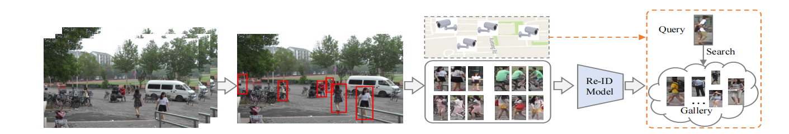

​                   图 1. 构建行人重识别系统的五个主要步骤。包括：1）原始数据采集，2）行人框生成，3）训练数据标注；4）重识别模型训练，5）行人检索

 

除非另有说明，本调查中的行人重识别视为是从计算机视角看多个监控摄像头的行人检索问题。一般来说，为特定的场景构建一个行人重识别系统需要五个主要步骤(如图1所示):

1) 步骤1：原始数据采集：从监控摄像机中获取原始视频数据是实际视频调查的主要要求。这些相机通常位于不同的环境下不同的地方[48]。通常这些原始数据包含了大量的复杂和有噪声的背景杂波。

2) 步骤2：边界框生成：从原始视频数据中提取包含人物图像的边界框。一般来说，在大规模的应用中，不可能手动裁剪所有的个人图像。边界框通常由人工检查[49]、[50]或跟踪算法[51]、[52]获得。

3) 步骤3：训练数据标注：标注跨摄像头标签。由于跨摄像机的变化较大，训练数据标注对于判别性Re-ID模型学习通常是必不可少的。在存在大范围改动[53]的情况下，我们通常需要在每个新场景中重新标注训练数据。

4) 步骤4：模型训练：用之前标注的人物图像/视频训练一个强有力的Re-ID模型。这一步是开发Re-ID系统的核心，也是文献中研究最广泛的形式。广泛多样的模型已经被开发出来处理各种挑战，集中在特征表示学习[54]，[55]，距离度量学习[56]，[57]或它们的组合。

5) 步骤5：行人检索：在测试阶段进行行人检索。给定一个person-of-interest（query）和一个gallery set，我们使用上一阶段学习到的Re-ID模型来提取特征表示。通过对计算出的query到gallery的相似度进行排序，得到检索排序列表。一些方法也研究了排序优化，以提高检索性能[58]，[59]。

根据上述五个步骤，我们将现有的Re-ID方法分为两个主要方向：closed-world和open-world，如表1所示。主要比较在以下五个方面：

 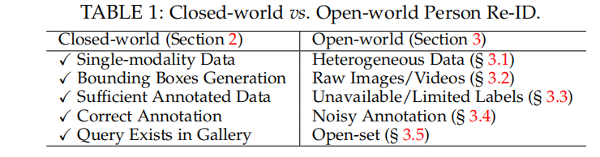

​                                                 如表1所示。逐步比较可分为以下五个方面。

 

**1）单模态vs异构数据（Single-modality Data vs. Heterogeneous Data）**：对于步骤1中的原始数据采集，默认所有人在closed-world[5]、[8]、[31]、[42]、[43]、[44]中用单模态可见摄像机捕获的图像/视频表示。然而，在实际的开放世界应用中，我们可能还需要处理异构数据，即红外图像[21]、[60]、草图[61]、深度图像[62]，甚至是文本描述[63]。这引出了了3.1中的异构Re-ID。

**2）边界框生成vs原始图像/视频（Bounding Box Generation vs. Raw Images/Videos）**：对于步骤2中的边界框生成，closed-world中的行人Re-ID通常根据生成的边界框进行训练和测试，其中边界框主要包含行人外观信息。相比之下，一些实际的open-world应用需要从原始图像或视频中实现端到端的人员搜索。这就引出了另一个open-world的主题，即3.2中的端到端人员搜索。

**3）丰富的标签数据vs不可用/有限的标签（Sufficient Annotated Data vs. Unavailable/Limited Labels）**：对于步骤3中的训练数据标注，封闭世界的Re-ID通常假设我们有足够的注释训练数据来进行有监督的Re-ID模型训练。然而在每个新环境中，每个相机对的标签标注都是耗时耗力的，会导致高昂的成本。在open--world的场景中，我们可能没有足够的注释数据（即有限的标签）[65]，甚至没有任何标签信息[66]。这引发了在3.3中对无监督和半监督的Re-ID的讨论。

**4）正确标签vs噪声标签（Correct Annotation vs. Noisy Annotation）**：对于步骤4，现有的closed-world person Re-ID系统通常假定所有标签清晰且正确。然而，由于注释错误（即标签噪声）或不完善的检测/跟踪结果，样本噪声通常是不可避免的。这引出了对3.4中不同噪声类型下的噪声鲁棒行人Re-ID的分析。

**5）query是否存在于gallery中（Query Exists in Gallery vs. Open-set）**：在行人检索阶段（步骤5），大多数closed-world person Re-ID工作，都假设query必须存在于gallery中，并计算CMC[68]和mAP[5]。但在许多情况下，query可能不会出现在gallery[69]、[70]中，或者我们需要执行验证，而不是检索[26]。这让我们看到了3.5中的open-set person Re-ID。

本调查在第二节首先介绍了在封闭世界的环境下被广泛研究的Re-ID。2.4节对数据集和新技术发展进行了详细的回顾。然后我们在第三节中介绍了open-world person Re-ID。第四节介绍了对未来Re-ID的展望，包括一个新的评估度量（4.1），一个新的强大的AGW基线（4.2）。我们将讨论几个有待充分研究的开放问题（4.3）。结论总结在第五节。补充文件中还有一个结构回顾。

## 2 CLOSED-WORLD PERSON RE-IDENTIFICATION

本节提供closed-world person Re-ID的概述。如第1节所述，该设置通常有以下假设：1）通过可见摄像机或图像或视频捕捉单模态行人外观；2）行人用边界框表示，其中大部分边界框区域属于同一行人；3）训练具有足够的标注训练数据进行有监督的Re-ID模型训练；4）这些注释通常是正确的；5）query必须出现在gallery中。通常，一个标准的closed-world Re-ID系统包含三个主要组成部分：特征表示学习（2.1)，专注于开发构造特征提取策略；深度度量学习(2.2)，旨在设计具有不同损失函数或采样策略的训练目标；排序优化(2.3），重点在优化检索到的排序列表。2.4.2提供了经过深入分析的数据集和最先进技术的概述。

### 2.1 Feature Representation Learning 特征表示学习

 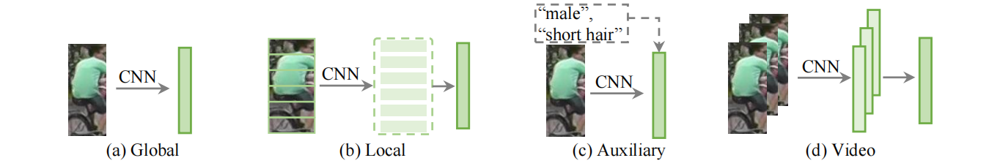

​    图2: 四种不同的特征学习策略。a)全局特征，在2.1.1中学习每个行人图像的全局表示；b)局部特征，学习2.1.2中的部分聚合的局部特征；c)辅助特征，使用辅助信息学习特征表示，如2.1.3中的属性[71]、[72]和d)视频特征，使用多个图像帧和时间信息[73]、[74]学习视频表示。

 

我们首先讨论了在closed-world中的行人重识别的特征学习策略。主要有四类(如图2所示）a)全局特征（2.1.1），为每个行人图像提取全局特征，没有附加标注[55]；b）局部特征（2.1.2），汇总了被分块的局部特征，为每个行人图像制定了组合表示。[75]、[76]、[77]；c)辅助特征（2.1.3），利用属性[71]、[72]、[78]、GAN生成的图像[42]等辅助信息改进特征表示学习。d)视频特性（2.1.4），利用多重图像帧和时间信息[73]，[74]来学习基于视频的Re-ID[7]的特征表示。我们还回顾了2.1.5中几个行人重识别的特别结构设计。

 

#### 2.1.1、 Global Feature Representation Learning（全局特征）

全局特征表示学习为每个人的图像提取一个全局特征向量，如图2(a)所示。由于深度神经网络最初应用于图像分类[79]、[80]，全局特征学习是早期将先进的深度学习技术应用到Re-ID领域的主要选择。

为了捕获全局特征学习中的fine-grained cues，[81]中开发了一个由单图像表示(SIR)和交叉图像表示(CIR)组成的联合学习框架，使用特定的子网络进行triplet loss训练。广泛使用的ID-discriminative Embedding(IDE)模型[55]通过将每个行人视为一个不同的类，将训练过程构建为一个多类别分类问题。现在广泛应用于Re-ID社区[42]、[58]、[77]、[82]、[83]。Qian等人[84]开发了一个多尺度的深度表征学习模型来捕获不同尺度上的鉴别线索。

**Attention Information**

注意力机制在增强表征学习的文献中得到了广泛的研究[85]。1)Group 1：Attention within the person image。典型的策略包括像素级注意力信息(the pixel level attention)[86]和通道特征重新加权响应(the channel-wise feature response re-weighting)[86]、[87]、[88]、[89]或背景滤除(background suppressing)[22]。将空间信息集成在[90]中。2)Group 2：attention across multiple person images。在[91]中提出了一种感知上下文的特征学习方法，结合序列内和序列间注意力信息进行成对特征对齐和优化。在[92]，[93]中添加了注意力一致性属性。组相似度[94]，[95]是另一种流行的利用交叉图像注意力机制的方法，它涉及多个图像进行局部和全局相似性建模。第一组主要提高了对错位/不完美检测的鲁棒性，第二组通过挖掘多个图像之间的关系，提高了特征学习能力。

 

#### 2.1.2、 Local Feature Representation Learning（局部特征）

它学习部分/区域聚合特征，增强对抗错位的鲁棒性[77]，[96]。人体部位可以通过人体解析/姿态估计（组1）自动生成，或者大致水平划分（组2）。

通过自动身体部位检测，流行的解决方案是结合全局特征和局部特征信息[97]，[98]。具体来说，设计了多通道聚合(the multi-channel aggregation)[99]、多尺度上下文感知卷积(multi-scale context-aware convolutions)[100]、多阶段特征分解(multi-stage feature decomposition)[17]和双线性池化(bilinear-pooling)[97]来提高局部特征学习能力。在[98]中也研究了特征级融合的局部相似性组合，而不是特征级融合。另一个流行的解决方案是通过使用姿态驱动的匹配(pose-driven matching)[101]，姿态引导部分注意力模块(pose-guided part attention module)[102]，语义部分对齐(semantically part alignment)[103]，[104]来增强对抗背景杂乱的鲁棒性。

对于水平划分的区域特征，在 Part-based Convolutional Baseline(PCB)[77]中学习多个局部分类器，是目前最先进的特征学习基线[28]，[105]，[106]的重要部分。为了捕捉多个身体部位的关系，设计了 the Siamese Long Short-Term Memory(LSTM)体系结构[96]、 second-order non-local attention[107]、Interaction-and-Aggregation(IA)[108]来加强特征学习。

第一组使用人类解析技术来获得具有身体部分的语义信息，这提供了良好对齐的部分特征。然而，它们需要一个额外的姿态检测器，并且容易产生有噪声的姿态检测[77]。第二组通过水平划分来进行分块，更灵活，但对重度遮挡和背景杂波敏感。

 

 

#### 2.1.3、 Auxiliary Feature Representation Learning（辅助特征）

辅助特征表示学习通常需要额外的注释信息（例如，语义属性[71]）或生成/增强的训练样本来加强特征表示[19]，[42]。

**Semantic Attributes 语义属性**

在[72]中引入了一个行人和属性联合的学习基线。[71]中通过结合预测的语义属性信息，提出了一个深度属性学习框架，在半监督学习方式中增强特征表示的通用性和鲁棒性。结合语义属性和注意力机制，提高局部特征学习[109]。在[110]中也采用了语义属性来进行视频Re-ID特征表示学习。它们也被用作无监督学习[111]中的辅助监督信息。

**Viewpoint Information 视点信息**

视点信息还可以增强特征表示学习[112]，[113]。Multi-Level Factorisation Net(MLFN)[112]也试图在多个语义层次上学习身份识别和视觉不变的特征表示。[113]提取通用视角和特定视角的组合进行学习。在[114]视点感知特征学习中加入了一个角正则化方法。

**Domain Information 域信息**

设计了一种Domain Guided Dropout(DGD)算法[54]，可以自适应地挖掘共享域和特定域的神经元，用于多域深度特征表示学习。Lin等人提出了一个multi-camera consistent matching constraint方法在深度学习框架中获得全局最优表示。类似地，在[18]中也应用camera view information或the detected camera location，以通过特定相机的信息建模来改进特征表示。

**GAN Generation GAN生成**

本节讨论如何使用GAN生成的图像作为辅助信息。Zheng等人。[42]开始第一次尝试将GAN技术应用到Re-ID。利用生成的人物图像改进了监督表征学习。在[116]中加入了姿态约束，以提高生成的人图像的质量，生成具有新的姿态变体的行人图像。在[117]中设计了一种姿态归一化图像生成方法，增强了对姿态变化的鲁棒性。相机种类信息[118]也集成在图像生成过程中，以解决跨相机的变化。联合判别和生成学习模型[119]分别用于学习外观和结构代码，以提高图像生成质量。利用GAN生成的图像也是一种广泛应用的无监督域自适应Re-ID [120]，[121]，近似于目标分布。

**Data Augmentation 数据增强**

对于Re-ID，现有的操作包括随机调整大小、裁剪和水平翻转[122]。此外，生成反向遮挡的样本(adversarially occluded samples)[19]，以增加训练数据的变化。在[123]中提出了一种类似的随机擦除策略(random erasing strategy)，即向输入图像添加随机噪声。A batch DropBlock[124]在特征图中随机丢弃一个区域块，以加强特征学习。Bak等人[125]在不同光照条件下生成渲染的虚拟人。这些方法通过增加的样本丰富了监督信息，提高了测试集的通用性。

#### 2.1.4 Video Feature Representation Learning（视频特征）

基于视频的Re-ID是另一个流行的主题[126]，其中每个人都用一个多帧的视频序列表示。由于具有丰富的外观和时间信息，它在Re-ID领吸引了越来越多的兴趣。这也给使用多幅图像的视频特征表示学习带来了额外的挑战。

主要的挑战是准确地捕获时间信息。针对基于视频的行人Re-ID[127]设计了一种循环神经网络结构，联合优化了用于时间信息传播的最终循环层(the final recurrent layer)和时间池化层(temporal pooling layer)。[128]中提出了一种时空流的加权方案。Yan等人。[129]提出了一个渐进/顺序的融合框架来聚合 frame-level的人类区域表征。在[110]中还采用语义属性进行具有特征分离和帧重新加权的视频Re-ID。聚合frame-level特征和时空外观信息的联合学习对于视频表征学习[130]、[131]、[132]至关重要。

另一个主要的挑战是视频中不可避免的离群值跟踪帧。在时空联合注意力池化网络(ASTPN)[131]中选择信息框架，并将上下文信息集成在[130]中。一个联合分割启发的注意力模型[132]通过相互评估检测多个视频帧的显著特征。采用多样性正则化[133]在每个视频序列中挖掘多个有区别的身体部分。采用仿射包来处理视频序列[83]内的离群帧。利用多个视频帧来自动完成遮挡区域[20]是一个有趣的工作。这些工作表明，处理噪声帧可以极大地增强视频表征学习。

处理不同长度的视频序列也具有挑战性，Chen等人。[134]将长视频序列划分为多个短片段，将排序的片段聚合起来以学习紧凑的嵌入。一个 clip-level学习策略[135]利用空间和时间维度的注意力信息来产生一个鲁棒的 clip-level表示。短期和长期关系[136]都被集成在一个自注意机制中。

#### 2.1.5 Architecture Design（架构设计）

将行人ReID视为特定的行人检索问题，现有大多工作都采用以图像分类为基础的网络体系结构。一些工作试图修改主干架构以获得更好的性能。对于广泛使用的ResNet50主干网络，重要的修改包括：将最后的卷积核步长/大小修改为1，将最后的池化层改为自适应平均池化，并在最后池化层后加一层BN层。

提高精度是特定的Re-ID网络架构设计改进的主要问题。[43]首先尝试设计了一个滤波器配对神经网络(FPNN)，该网络通过挖掘部分判别信息联合处理错位和遮挡。Wang等人。[89]提出了一种具有专门设计的WConv层和Channel Scaling层的BraidNet。WConv层提取了两幅图像的差分信息，提高了对错位的鲁棒性，Channel Scaling层优化了每个输入通道的缩放因子。一个多层次的因子分解网络(MLFN)[112]包含多个堆叠块，以在特定的层次上模拟各种潜在因素，并动态地选择这些因子来形成最终的表达。开发了一种具有卷积相似度模块的高效全卷积暹罗网络[137]，以优化multi-level相似度度量。利用深度卷积可以有效地捕获和优化其相似度。

效率是Re-ID体系结构设计的另一个重要因素。通过结合point-wise和depth-wise卷积，设计了一个有效的小规模网络，即OmniScale Network(OSNet)[138]。为了实现多尺度特征学习，引入了一种由多个卷积组成的残差块。

随着人们对自动机器学习的兴趣不断增加，一种自动Re-ID[139]模型产生了。Auto-ReID提供了一种基于基本结构组件的高效的自动神经网络结构设计，使用部分感知模块来捕获有区别的局部ReID特征。这为探索强大的特定领域体系结构提供了一个潜在的研究方向。

### 2.2 Deep Metric Learning 深度度量学习

在深度学习时代之前，通过学习马氏氏距离函数(Mahalanobis distance function)[36]、[37]或向量矩阵(projection matrix)[40]，度量学习已经得到了广泛的研究。度量学习在表征学习中的作用已经被损失函数所取代。我们将首先在2.2.1中回顾广泛使用的损失函数，然后在2.2.2总结具体抽样设计的训练策略。

#### 2.2.1 Loss Function Design

本调查仅关注为深度学习[56]设计的损失函数。为 hand-crafted的系统设计的距离度量学习的概述可以在[2]，[143]中找到。在行人Re-ID文献中，主要有三种损失函数及其变体被广泛研究，包括identity loss、verification loss和triplet loss。三种损失函数的说明如图3所示。

 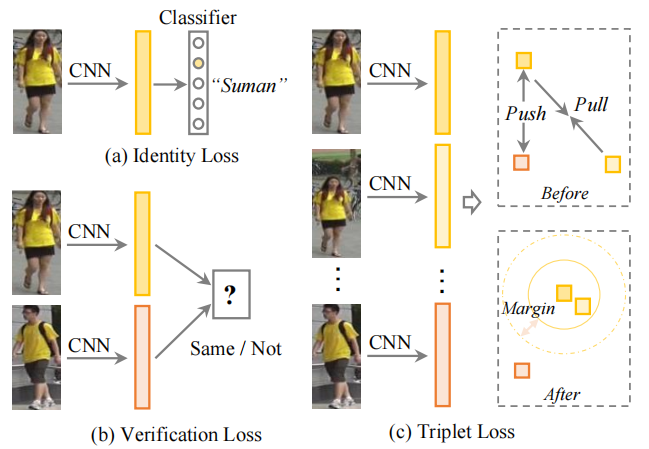

 图3: 在文献中广泛使用的三种损失函数。(a)Identity Loss[42]，[82]，[118]，[140]；(b)Verification Loss[94]、[141]和(c)Triplet Loss[14]，[22]、[57]。许多工作采用了他们的组合，[87]，[137]，[141]，[142]。

**Identity Loss**

它将行人Re-ID的训练过程视为一个图像分类问题[55]，即每个身份都是一个不同的类。在测试阶段，采用池化层或嵌入层的输出作为特征提取器。给定一个带有标签$y_i$的输入图像$x_i$，$x_i$被识别为$y_i$类的预测概率用一个softmax函数表示，用$p(y_i|x_i)$表示。然后用交叉熵计算Identity Loss。
$$
L_{id} = - \frac{1}{n} \sum_{i=1}^n \log(p(y_i|x_i)) \tag{1}
$$
 其中，n表示每个batch训练样本的数量。Identity Loss已被广泛应用于现有的方法[19]，[42]，[82]，[92]，[95]，[106]，[118]，[120]，[140]，[144]。一般来说，在训练过程中，训练和自动挖掘复杂样本很容易，在[145]中所证实。一些工作也研究了softmax变体[146]，如[147]的 sphere loss和[95]的AM softmax。另一个简单而有效的策略，即标签平滑(label smoothing)[42]，[122]，通常被集成到标准的softmax交叉熵损失中。其基本思想是避免模型过拟合到，提高了通用性 [148]。

**Verification Loss**

它优化了成对关系，包括对比损失(contrastive loss)[96]，[120]或二进制验证损失(binary verification loss)[43]，[141]。对比损失提高了成对距离的比较，有以下公式：
$$
L_{con}=(1-δ_{ij})\{max(0,ρ-d_{ij})\}^2+ δ_{ij}{d^2_{ij}}\tag{2}
$$
其中，$d_{ij}$表示两个输入样本$x_i$和$x_j$的嵌入特征之间的欧氏距离。$$δ_{ij}$$是一个二进制标记指示器(当$x_i$和$x_j$属于同一标识时，为$$δ_{ij}$$=1，否则为$$δ_{ij}$$=0)。ρ是一个边缘参数。有几种变体，例如，与[81]中ranking SVM的对照。

二进制验证[43]，[141]区分输入图像对的positive and negative。一般来说，一个差分特征$$f_{ij}$$是由$$f_{ij}=(f_i-f_j)^2$$（此处原论文公式可能写错了）[141]得到的，其中$$f_i$$和$$f_j$$是两个样本$$x_i$$和$$x_j$$的嵌入特征。验证网络把差分特征分类为 positive or negative。我们用$$p(δ_{ij}|f_{ij})$$来表示一个输入对($$x_i$$和$$x_j$$)被识别为$$δ_{ij}$$（0或1）的概率。这个具有交叉熵的验证损失为
$$
L_{veri}(i, j) = −δ_{ij}\log(p(δ_{ij} |f_{ij} ))−(1−δ_{ij} ) \log(1−p(δ_{ij} |f_{ij} ))\tag{3}
$$
验证通常与 identity loss相结合，以提高性能[94]、[96]、[120]、[141]。

**Triplet loss**

它将Re-ID模型训练过程视为一个检索排序问题。其基本思想是，正样本对之间的距离应该比负样本对之间小一个预定的边界距离[57]。通常，一个三元组包含一个anchor样本$$x_i$$、一个同identity的positive样本$$x_j$$和一个不同identity的负样本$$x_k$$。带有边距参数的三元组损失用以下公式表示
$$
L_{tri}(i, j, k) = \max(ρ + d_{ij} − d_{ik}, 0)\tag{4}
$$
 式中，$d(\cdot)$表示两个样本之间的欧式距离。如果我们直接优化上述损失函数，大量简单的三元组将主导训练过程，导致有限的可辨别性。为了缓解这一问题，设计了各种信息的三元组提取方法[14]、[22]、[57]、[97]。其基本思想是选择信息丰富的三元组[57]，[149]。具体来说，在[149]中引入了一种具有权重约束的适度提取，直接优化了特征之间的差异。Hermans等人[57]证明，在每个训练批中，在线最困难的正样本和负样本的挖掘有利于Re-ID模型学习。一些方法还研究了信息三元组提取[150]，[151]设置相似策略的点。这增强了通过使用a soft hard-mining方案对离群样本的鲁棒性。

为了进一步丰富三元组监督信息，在[152]中开发了一个四元组深度网络，其中每个四元组包含一个anchor样本、一个 positive样本和两个 mined negative样本。这四元组采用了基于边际的在线复杂负样本提取方法。优化四元组关系使得类内差异减小，类间差异增大。

三元组损失和 identity 损失的结合是深度Re-ID模型学习[28]，[87]，[90]，[93]，[103]，[104]，[116]，[137]，[142]，[153]，[154]最流行的解决方案之一。这两个部分都有利于判别性表征学习。

**OIM loss** 

除了上述三种损失函数外，还设计了一种基于存储库方案的 Online Instance Matching (OIM)损失[64]。存储库$\{v_k,k=1,2,···，c\}$包含存储的实例特性，其中$c$表示分类。OIM的损失由下式表示
$$
L_{oim} = - \frac{1}{n} \sum_{i=1}^n \log \frac{\exp({v^T_i} f_i/τ )}{{\sum_{k=1}^c \exp(v^T_k f_i/τ )}}\ \tag{5}
$$
其中$v_i$表示$y_i$类对应的存储特征，*τ*是控制相似性空间[145]的热度参数。${v^T_i} f_i$测量在线实例匹配分数。进一步与存储的未标记ID的特征集进行比较，以计算分母[64]，处理大量非标记ID。该存储方案也应用于无监督域自适应Re-ID[106]中。

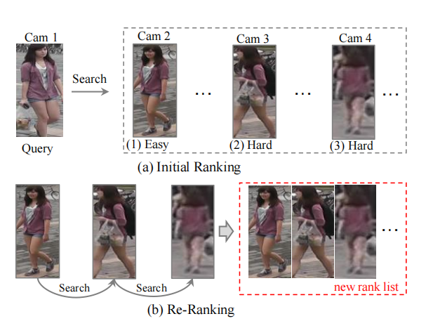

图4:  Re-ID中重排序的说明。给定一个query样本，检索一个初始排名列表，其中最差匹配项排在后面。利用正序positive 匹配项（1)作为query在gallery中查找，我们可以在gallery中获得具有 similarity propagation的 hard match (2) and (3) 。

#### 2.2.2 Training strategy

批采样策略在判别Re-ID模型学习中起着重要作用。每个ID的标注训练图像的数量有显著变化[5]导致非常有有挑战性。同时，严重不平衡的正样本对和负样本对增加了训练策略设计[40]的额外难度。

处理不平衡问题最常用的训练策略是 identity sampling[57]，[122]。对于每个训练批次，随机选择一定数量的identities，然后从每个选择的identities中抽取几张图像。这种批量采样策略保证了信息丰富的 positive and negative提取。

为了处理正负样本之间的不平衡问题，自适应采样是调整正负样本贡献度的流行方法，如样本率学习(SRL)[89], curriculum sampling[87]。另一种方法是样本重加权，使用样本分布[87]或相似度差[52]来调整样本权重。[155]中设计了一种有效的参考约束，将成对/三元组相似性转换为样本到参考的相似度，解决了不平衡问题，提高了可辨别性，对异常值也具有鲁棒性。

为了自适应地结合多个损失函数，一个多损失动态训练策略[156]自适应地重新加权identity loss和triplet loss，提取它们之间共享的相似部分。这种多损失训练策略可以导致一致的性能收益。

### 2.3 Ranking Optimization

排序优化在提高测试阶段的检索性能方面起着至关重要的作用。给定一个初始排序列表，它通过 gallery-to-gallery的相似度提取[58]，[157]或human interaction[158]，[159]进行自动优化排序。排序/度量融合[160]，[161]是另一种通过多个排序列表输入来提高排序性能的流行方法。

#### 2.3.1 Re-ranking

重新排序的基本思想是利用gallery-to-gallery的相似性来优化初始排序列表，如图4所示。在[157]中提出了 top-ranked的相似性促进和bottom-ranked的不同作用。广泛使用的*k*-reciprocal重排序[58]挖掘了上下文信息。在[25]中也应用了类似的上下文信息建模思想。[162]利用了底层流形的几何结构。通过整合交叉邻域距离，引入了一种扩展的跨邻域重排序方法[18]。局部模糊重排序[95]采用聚类结构来改进邻域相似度度量。

**Query Adaptive**

考虑到query的差异，一些方法设计了query自适应检索策略来替代统一的搜索引擎，以提高性能[163]，[164]。[163]提出了一种利用局域保留图像的query自适应重排序方法。[164]提出了一种有效的在线局部度量自适应方法，该方法利用每个probe的负样本学习严格的局部度量。

**Human Interaction**

它包括使用人类反馈来优化排序列表[158]。这在重排序的过程中提供了可靠的监督。在[159]中提出了一种混合人机增量学习模型，该模型从人类反馈中累积学习，提高了Re-ID的动态排序性能。

#### 2.3.2 Rank Fusion

融合排序利用不同方法获得的多个排序列表来提高检索性能[59]。[165]在“L” shaped observation的基础上，提出了一种query自适应的后期融合方法。在[59]中提出了一种利用相似性和不相似性的融合排序方法。行人Re-ID的排序融合过程是基于图论[166]的共识决策问题，将多种算法获得的相似度得分映射到具有路径搜索的图中。最近为度量融合设计了An Unifified Ensemble Diffusion(UED)[161]。UED保持了现有三种融合算法的优点，通过一个新的目标函数和推导进行了优化。在[160]中也学习了度量集成学习。

### 2.4 Datasets and Evaluation

#### 2.4.1 Datasets and Evaluation Metrics

**Datasets**

我们首先回顾了closed-world的数据集，包括11个图像数据集(VIPeR[31]，iLIDS[167]，GRID[168]，PRID2011[126]，CUHK01-03[43]，Market-1501[5]，DukeMTMC[42]，Airport[169]and MSMT17[44])and7video datasets(PRID-2011[126]，iLIDS-VID[7]，MARS[8]，Duke-Video[144]，Duke-Tracklet[170]，LPW[171]and LS-VID[136])。这些数据集的统计数据如表2所示。本调查只关注深度学习方法的一般大规模数据集。对Re-ID数据集的全面总结可以在[169]及其网站（ https://github.com/NEU-Gou/awesome-reid-dataset）中找到。对于近年来的数据集收集，可以进行一些观察：

​               表2：closed-world行人Re-ID的一些常用数据集的统计数据。“both”意味着它同时包含手工裁剪和自动检测到的边界框。“C&M”表示CMC和mAP都被评估。

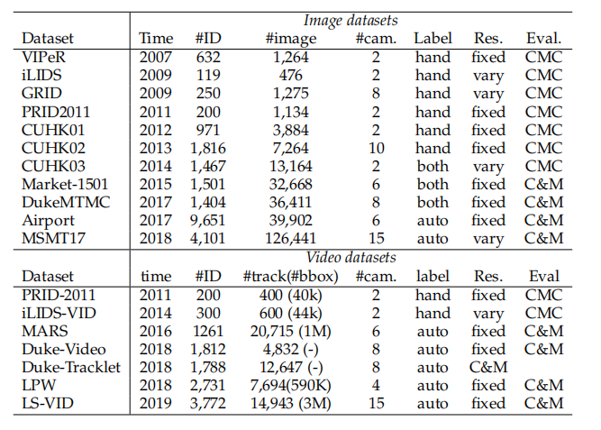

1)数据集的规模(包括图像和ID数量)正在迅速增加。一般来说，深度学习方法可以受益于更多的训练样本。这也增加了closed-world行人Re-ID所需的标注难度。2)在实际情况下，为达到大规模的相机网络，相机的数量也大大增加。这也为动态更新的网络中的模型泛化性带来了额外的挑战。3)边界框的生成通常是自动检测/跟踪的，而不是手动裁切。这模拟了具有跟踪/检测错误的真实场景。

**Evaluation Metrics**

为了评估一个Re-ID系统， Cumulative Matching Characteristics (CMC)[68]和 mean Average Precision (mAP) [5]是两种广泛使用的测量方法。

CMC-k(即Rank-k匹配精度)[68]表示在top-k ranked的检索结果中出现正确匹配的概率。当每个query只存在一个ground truth时，CMC是准确的，因为它只考虑评估过程中的第一个匹配。然而，gallery在一个大型摄像机网络中通常包含多个ground truths ，并且CMC不能完全反映一个模型在多个摄像机之间的可辨别性。

另一个度量标准，mean Average Precision(mAP)[5]，用多个ground truths来衡量平均检索性能。它最初被广泛应用于图像检索。对于Re-ID评估，它可以解决两个系统在搜索第一个ground truth时表现同样好的问题(如图4所示，可能很容易匹配。)，但对其他困难匹配具有不同的检索能力。

考虑到训练Re-ID模型的效率和复杂性，最近的一些工作[138]，[139]还报告了每秒浮点操作(FLOPs)和网络参数大小作为评估指标。当训练/测试设备的计算资源有限时，这两个指标是至关重要的。

#### 2.4.2 In-depth Analysis on State-of-The-Arts

我们从基于图像和基于视频的角度回顾了最先进的技术。我们总结了过去三年在顶级CV会议发表的方法。

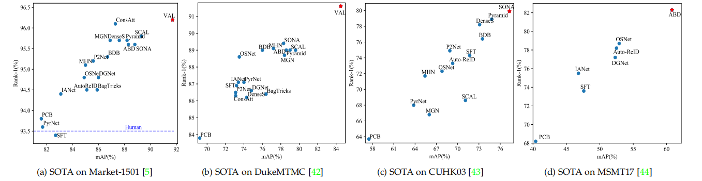

图5: State-of-the-arts（SOTA)在四个基于图像的行人ReID数据集。同时报告了 Rank-1的精度（%）和mAP值（%）。对于CUHK03[43]，报告了[58]设置下的检测数据。对于Market-1501，使用了单一的query设置。最好的结果是用一颗红星突出显示的。所有列出的结果都不使用重排序或额外的注释信息。

**Image-based Re-ID**

有大量基于图像的Re-ID的论文（2.https://paperswithcode.com/task/person-re-identification）。我们主要回顾了2019年出版的作品以及2018年出版的一些代表性作品。具体来说，包括 PCB[77]，MGN[172]，PyrNet[6]，Auto-ReID[139]，ABD-Net[173]，BagTricks[122]，OSNet[138]，DGNet[119]，SCAL[90]，MHN[174]，P2Net[104]，BDB[124]，SONA[107]，SFT[95]，ConsAtt[93]，DenseS[103]，Pyramid[156]，IANet[108]，VAL[114]。我们总结了四个数据集上的结果（如图5所示)。这个概述引发了以下五个主要的观点。

首先，随着深度学习的进步，大多数基于图像的Re-ID方法在广泛使用的Market-1501数据集上获得了比人类更高的rank-1的准确率（93.5%[175]）。特别是，VAL[114]在Market-1501数据集上获得的最佳mAP为91.6%，Rank-1的准确率为96.2%。VAL的主要优点是视角信息的使用。当使用重排序或度量融合时，性能可以进一步提高。在这些closed-world数据集上的深度学习的成功也促使人们将注意力转移到更具挑战性的场景中，即大数据规模的[136]或无监督学习[176]。

其次，局部特征学习有利于判别性 Re-ID模型学习。全局特征学习脱离部分约束[122]直接学习整个图像上的表示。当人的检测/跟踪能够准确定位人体时，它是有鉴别力的。当行人图像遭受较大的背景杂波或严重遮挡时，局部特征学习通常通过鉴别身体区域[67]来获得更好的性能。由于其在处理错位/遮挡方面的优势，我们观察到最近开发的大多数最先进的方法都采用了特征聚合方法，结合了局部特征和全局特征[139]，[156]。

第三，注意力机制有利于鉴别 Re-ID模型学习。我们观察到，所有的方法(ConsAtt[93]，SCAL[90]，SONA[107]，ABD-Net[173])在每个数据集上达到最好的性能都采用了一个注意力机制。注意力捕捉了不同的卷积通道、多个特征图、层次层、不同的身体部位/区域，甚至多个图像之间的关系。同时， discriminative [173], diverse[133], consistent [93] 和 high-order [107]属性被纳入以增强注意力特征学习。考虑到强大的注意力机制和Re-ID问题的特殊性，注意力深度学习系统很有可能继续主导Re-ID领域，具有更多特性。

第四，多重损失训练可以提高Re-ID模型的学习能力。不同的损失函数从多角度优化网络。结合多重损失函数可以提高性能，这可以通过最先进的ConsAtt[93]、ABD-Net[173]和SONA[107]等方法中的多重损失训练策略来证明。此外，在[156]中设计了一种动态多重损失训练策略自适应集成了两个损失函数。 identity loss和三元组损失与hard mining 相结合是主要选择。此外，由于不平衡的问题，样本加权策略通常通过挖掘信息三元组[52]，[89]来提高性能。

最后，由于数据集规模的增加、复杂的环境、训练样本的有限，仍有很大的改进空间。例如，新发布的MSMT17数据集[44]的 Rank-1准确率（82.3%）和mAP（60.8%）远低于Market-1501( Rank-1：96.2%和mAP91.7%)和DukeMTMC( Rank-1：91.6%和mAP84.5%)。在其他一些训练样本有限的具有挑战性的数据集(例如，GRID[168]和VIPeR[31])上，性能仍然非常低。此外，Re-ID模型在跨数据集评估[28]、[54]上通常会受到显著的影响，并且在adversarial attack[177]下的性能会显著下降。我们乐观地认为，随着可辨识性、鲁棒性和通用性的提高， person Re-ID将会有重要的突破。

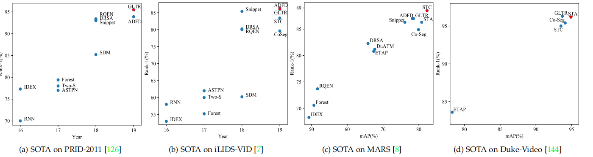

图6: State-of-the-arts (SOTA)在四个广泛使用的基于视频的行人Re-ID数据集。报告了 Rank-1精度（%）。报告了MARS[8]和Duke-Video[144]上的mAP值（%）。对于Duke-Video，我们参考了[144]中的设置。最好的结果用一颗红星突出显示。所有列出的结果都不使用重排序或额外的注释信息。

**Video-based Re-ID** 

与基于图像的Re-ID相比，基于视频的Re-ID吸引关注较少。我们回顾了深度学习的Re-ID模型，包括CoSeg[132]，GLTR[136]，STA[135]，ADFD[110]，STC[20]，DRSA[133]，Snippet[134]，ETAP[144]，DuATM[91]，SDM[178]，TwoS[128]，ASTPN[131]，RQEN[171]，Forest[130]，RNN[127]和IDEX[8]。我们还总结了四个视频Re-ID数据集的结果，如图6所示。从这些结果中，可以得出以下结论。

首先，随着这些年深度学习技术的发展，可以看到明显的性能增长趋势。具体来说，在PRID-2011数据集上，Rank-1的准确率从70%(2016年的RNN[127])提高到95.5%(2019年的GLTR[136])，在iLIDS-VID数据集上从58%(RNN[127])提高到86.3%(ADFD[110])。在大规模MARS数据集上，Rank-1精度/mAP从68.3%/49.3%(IDEX[8])增加到88.5%/82.3%(STC[20])。在Duke-Video数据集[144]上，STA[135]的准确率为96.2%，mAP为94.9%。

其次，时空建模对于判别性视频表征学习至关重要。我们观察到，所有的方法(STA[135]，STC[20]，GLTR[136])都设计了时空聚合策略来提高视频的Re-ID性能。与基于图像的ReID类似，跨多帧[110]、[135]的注意力机制也极大地提高了可辨别性。[20]中另一个有趣的观察结果表明，在视频序列中使用多帧可以填充遮挡区域，这为未来处理具有挑战性的遮挡问题提供了一个可能的解决方案。

最后，在这些数据上的性能提升已经达到了一个饱和状态，通常在这四个视频数据集上的精度增益小于1%。然而，在这些具有挑战性的案例中仍有很大的改进空间。例如，在新收集的视频数据集LS-VID[136]上，GLTR[136]的Rank-1精度/mAP只有63.1%/44.43%，而GLTR[136]可以在其他四个数据集上实现最先进的或至少可比的性能。LS-VID[136]中包含了明显更多的身份和视频序列。这为未来基于视频的Re-ID的突破提供了一个具有挑战性的参照。

## 3 OPEN-WORLD PERSON RE-IDENTIFICATION

本节回顾了1中所述的 open-world行人Re-ID，包括通过跨异构模态（3.1）匹配人员图像的异构Re-ID、从原始图像/视频（3.2）的端到端Re-ID（3.2）、标注有限/无标签（3.3）的半/无监督学习、带噪声标注的鲁棒Re-ID模型学习（3.4)，以及在gallery中未出现正确匹配的 open-set行人Re-ID（3.5）。

### 3.1 Heterogeneous Re-ID

本节总结了四种主要的异构Re-ID，包括深度和RGB图像Re-ID（3.1.1）、文本到图像Re-ID（3.1.2）、可见红外Re-ID（3.1.3）和跨分辨率Re-ID（3.1.4）。

#### 3.1.1 Depth-based Re-ID

深度图像捕捉体型和骨架信息。这为照明改变或者换衣服环境下的Re-ID提供了可能性，这对于个性化的人类交互应用也很重要。

在[179]中提出了一种基于循环注意力机制的模型来解决基于深度的行人识别问题。在强化学习框架中，他们结合了卷积和循环神经网络来识别人体小的、有区别的局部区域。

Karianakis 等人。在[180]利用大型RGB数据集设计了一种 split-rate RGB-to-Depth的转换方法，它弥合了深度图像和RGB图像之间的差距。他们的模型进一步结合了一个时间注意力机制，以增强对深度Re-ID的视频表示。

一些方法[62]，[181]也研究了RGB和深度信息的结合，以提高Re-ID的性能，解决了换衣挑战。

#### 3.1.2 Text-to-Image Re-ID

Text-to-image Re-ID实现了文本描述和RGB图像[63]之间的匹配。当无法获得query person的视觉图像时，只有文本描述可以替代，这是不可避免的。

带有RNN网络的门控神经注意力模型[63]学习文本描述和人图像之间的共享特征。这使得从文本到图像的行人检索的端到端训练成为可能。Cheng等人[182]提出了一种全局判别图像-语言关联学习方法，在重构过程中获取身份判别信息和局部重构图像-语言关联。cross projection learning method[183]还学习图像到文本匹配的共享空间。[184]设计了一种具有图联系的深度对抗图注意力卷积网络。然而，文本描述和视觉图像之间的巨大的语义差距仍然具有挑战性。同时，如何将文字与手绘草图结合起来也值得进一步研究。

#### 3.1.3 Visible-Infrared Re-ID

Visible-Infrared Re-ID处理白天可见图像和夜间红外图像之间的跨模态匹配。这对于低照度情况下由红外相机[21]，[60]，[185]拍摄的图像很重要。

Wu等人[21]开始第一次尝试解决这个问题，通过提出一个深度零填充框架[21]来自适应地学习模态变化特性。在[142]，[186]中引入了一个双流网络来给可共享模式和特定的信息建模，同时解决模态内和跨模态的变化。除了跨模态共享嵌入学习[187]外，还在[188]中研究了分类水平的差异。最近的方法[189]，[190]采用GAN技术生成跨模态的人物图像，以在图像和特征水平减少跨模态差异。在[191]中建立了分层跨模态解纠缠模型。在[192]中提出了一种提取多层次关系的双注意力聚合学习方法。

#### 3.1.4 Cross-Resolution Re-ID

Cross-Resolution Re-ID在低分辨率和高分辨率图像之间进行匹配，解决了分辨率变化大的问题[13]，[14]。一个级联的SR-GAN[193]以一种级联的方式生成高分辨率的行人图像，其中包含了身份信息。Li等人[194]采用对抗学习技术来获得固定分辨率的图像表示。

### 3.2 End-to-End Re-ID

端到端Re-ID减轻了对生成边界框的额外步骤的依赖。它包括从原始图像或视频中Re-ID，以及多摄像头跟踪。

**Re-ID in Raw Images/Videos**

该任务要求模型在一个单独框架[55]，[64]中实现人员检测和重识别。由于两个主要组成部分的重点不同，这是具有挑战性的。

Zheng等人[55]提出了一个two-stage框架，并系统地评估了行人检测对后期Re-ID的好处和局限性。Xiao等人[64]设计了一个使用单一卷积神经网络的端到端行人搜索系统，以联合行人检测和重新识别。开发了一种Neural Person Search Machine (NPSM)[195]，通过充分利用query和检测到的候选区域之间的上下文信息，递归地细化搜索区域并定位目标行人。类似地，在图学习框架中学习上下文实例扩展模块[196]，以改进端到端人员搜索。利用 Siamese squeeze-and-excitation网络开发了一种 query-guiided的端到端人员搜索系统[197]，通过 query-guided的 region proposal生成来获取全局上下文信息。在[198]中引入了一种有判别的Re-ID特征学习的局部细化方案，以生成更可靠的边界框。一种Identity DiscriminativE Attention reinforcement Learning (IDEAL)方法[199]为自动生成的边界框选择信息区域，提高了Re-ID的性能。

Yamaguchi等人[200]调查了一个更具挑战性的问题，即通过文本描述从原始视频中搜索这个人。提出了一种具有时空行人检测和多模态检索的multi-stage方法。这个方向的进一步探索值得预期。

**Multi-camera Tracking**

端到端行人Re-ID也与多人、多摄像头跟踪[52]密切相关。提出了一种用于multi-person tracking的graph-based formulation的人物连贯性的尝试性方案，即将整个人体和身体姿势布局的整体特征组合为每个人的表示。Ristani等人[52]通过手工标注提取和自适应加权三元组学习来学习多目标多摄像头跟踪与Re-ID之间的相关性。近年来，提出了一种具有相机内和相机间关系建模的 locality aware appearance metric (LAAM)[202]。

### 3.3 Semi-supervised and Unsupervised Re-ID

#### 3.3.1 Unsupervised Re-ID

早期的无监督Re-ID主要学习固定成分，即字典dictionary[203]、度量metric[204]或显著性saliency[66]，这导致了限制性的可辨别性或可测量性。

对于深度无监督的方法，跨相机标签预测是流行方法之一[176]，[205]。动态图匹配(DGM)[206]将标签预测定义为一个bipartite graph matching problem。为了进一步提高性能，我们利用全局摄像机网络约束[207]进行一致匹配。Liu等人使用逐步的度量提升[204]来逐步挖掘标签。一种鲁棒的 anchor嵌入方法[83]迭代地为未标记轨迹分配标签，以扩大anchor视频序列集。通过预测的的标签，深度学习可以应用于Re-ID模型学习。

对于端到端无监督的Re-ID，在[205]中提出了一种迭代聚类和Re-ID模型学习。同样，在分层聚类框架[208]中使用了样本之间的关系。Soft multi-label学习[209]从用于无监督学习的参考集中挖掘软标签信息。Tracklet Association Unsupervised Deep Learning(TAUDL)框架[170]联合进行摄像机内轨迹关联，并建立跨摄像机轨迹相关模型。同样，在一种 coarse-to-fifine的一致性学习方案中，也提出了一种无监督摄像机感知相似度一致性提取方法[210]。相机内提取和相机间关联应用于图关联框架[211]。在可转移的联合属性-身份深度学习(TJAIDL)框架[111]中也采用了语义属性。然而，使用新的未标注数据进行模型更新仍然具有挑战性。

此外，一些方法还尝试基于观察学习局部表达，在局部提取标签信息比在整个图像更容易。设计了一个PatchNet[153]，通过挖掘补丁级相似性来学习区分补丁特征。自相似分组(SSG)方法[212]迭代地以self-paced的方式进行分组（利用整体和身体局部相似性进行伪标记）和Re-ID模型训练。

**Semi-/Weakly supervised Re-ID.** 

在标签信息有限的情况下，在[213]中提出了一种one-shot度量学习方法，该方法包含了深度纹理表示和一个颜色度量。在[144]中提出了一种针对基于视频的Re-ID的逐步 one-shot学习方法(EUG)，即从未标记轨迹中逐步选择一些候选项来丰富标记轨迹集。一个多实例注意力学习框架[214]使用视频级标注进行表征学习，减轻了对完全注释的依赖。

#### 3.3.2 Unsupervised Domain Adaptation

无监督域自适应(UDA)将已标注的源数据集迁移学习到未标注的目标数据集[53]。由于源数据集的大量迁移学习和强大的监督，它是不带目标数据集标签的无监督Re-ID的另一种流行方法。

**Target Image Generation.**

使用GAN生成将源域映像转换到目标域样式是UDARe-ID的一种流行方法。通过生成的图像，这使得在无标注目标域中监督Re-ID模型学习成为可能。Wei等人[44]提出了一个Person Transfer Generative Adversarial Network(PTGAN)，将 knowledge从一个标记的源数据集转移到未标记的目标数据集。利用相似性保持的生成对抗网络(SPGAN)训练保持自相似性和域差异性[120]。异构学习(HHL)方法[215]同时考虑了具有齐次学习的相机不变性和异构学习的领域连通性。一个自适应迁移网络[216]将自适应过程分解为一些成像因素，包括照明、分辨率、相机视图等。该策略提高了跨数据集的性能。Huang等人[217]试图抑制背景变化，以最小化域移问题。Chen等人[218]设计了一个instance-guided的背景呈现方案，将个人ID从源域转移到目标域的不同背景中。此外，还添加了一种姿态解耦方案来改进图像生成[121]。在[219]中还提出了一种相互的mean-teacher学习方案。然而，在实际的大规模变化环境中，图像生成的可测量性和稳定性仍然具有挑战性。

Bak等人[125]生成一个具有不同照明条件的合成数据集来模拟真实的室内和室外照明。合成的数据集增加了学习模型的通用性，并且可以很容易地适应一个新的数据集，而不需要额外的监督[220]

**Target Domain Supervision Mining.**

一些方法利用从源数据集训练良好的模型直接提取对未标注目标数据集的监督。一个范例记忆学习方案[106]将三个固定线索作为监督，包括范例不变性、相机不变性和邻域不变性。Domain-Invariant Mapping Network(DIMN)[28]为域迁移任务制定了一个 meta-learning管道，并在每个训练集采样一个源域的子集来更新内存库，增强了可测量性和可辨别性。在[221]中摄像机视图信息也作为监督信号，以减小域间隙。一种具有渐进增强能力[222]的自训练方法联合捕获目标数据集上的局部结构和全局数据分布。近年来，一种基于混合内存[223]的 self-paced对比学习框架取得了巨大的成功，它可以动态地生成多层次的监督信号。

时空信息也在TFusion[224]中作为监督。TFusion利用贝叶斯融合模型将在源域学习到的时空模型转移到目标域。类似地，开发了 Query-Adaptive Convolution (QAConv)[225]来提高跨数据集的准确性。

TABLE 3: 在两个基于图像的数据集上对SOTA无监督的person Re-ID统计。“Source”表示它是否利用源标注的数据来训练目标Re-ID模型。“Gen.”表示它是否包含一个图像生成过程。报告了 Rank-1的精度（%）和mAP（%）。

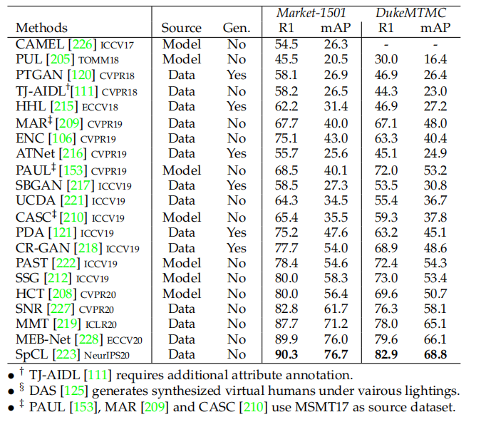

#### 3.3.3 State-of-The-Arts for Unsupervised Re-ID

近年来，发表在顶会上出版物数量增长证明无监督的 Re-ID 得到了越来越多的关注。我们回顾了在两个广泛使用的基于图像的Re-ID数据集上的无监督深度学习方法SOTA。结果汇总见表3。从这些结果中，可以得出以下观点 。

首先，无监督的Re-ID性能在这些年显著提高。在Market-1501数据集中， Rank-1的精度/mAP从54.5%/26.3%(camaml[226])增加到90.3%/76.7%(SpCL[223])。DukeMTMC数据集的性能从30.0%/16.4%增加到82.9%/68.8%。有监督的上限表现与无监督学习之间的差距明显缩小。这证明了深度学习下的无监督Re-ID的成功。

第二，目前的无监督Re-ID还发展不完全，可以在以下几个方面得到进一步的改进：1)监督ReID方法中的注意力机制很少应用于无监督ReID。2)目标域图像的生成在一些方法中已经被证明是有效的，但它们没有应用于两种最好的方法(PAST[222]，SSG[212])。3)在目标域的训练过程中使用已标注的源数据有利于跨数据集的学习，但也不包括在上述两种方法中。这些观察结果为进一步的改进提供了潜在的基础。

第三，在无监督和有监督的Re-ID之间仍然存在很大的差距。例如，监督ConsAtt[93]在Market-1501数据集上的rank-1准确率达到了96.1%，而无监督SpCL[223]的最高准确率约为90.3%。最近，何等人[229]已经证明，具有大规模无标记训练数据的无监督学习能够在各种任务[230]上优于监督学习。我们预计未来无监督的 Re-ID将取得一些突破。

### 3.4 Noise-Robust Re-ID

由于数据收集和标注困难，Re-ID通常会出现不可避免的噪声。我们从三个方面回顾了噪声鲁棒性Re-ID：严重遮挡的 Partial Re-ID、检测或跟踪误差引起的样本噪声的Re-ID和标注误差引起的标签噪声Re-ID。

**Partial Re-ID.** 

这解决了严重遮挡的Re-ID 问题，即只有部分人体可见[231]。采用完全卷积网络[232]为不完整的人图像生成固定大小的空间特征图。进一步结合了深度空间特征重构(DSR)，避免通过利用重构误差直接联合。[67]设计了一个可见性感知部分模型(VPM)来提取可共享的区域级特征，从而抑制了不完整图像中的空间错位。一个具有前景感知的金字塔重建方案[233]也试图从未被遮挡的区域学习。姿态引导特征对齐(PGFA)[234]利用姿态标志从遮挡噪声中挖掘识别部分信息。然而，由于严重的部分错位，不可预测的可见区域和分散未共享的身体区域，这仍然具有挑战性。同时，如何针对不同的query进行自适应地调整匹配模型仍有待进一步研究。

**Re-ID with Sample Noise.**

这是指人的图像或包含外围区域/边框的视频序列的问题，要么是由于检测较差/不准确的跟踪结果造成的。为了处理人物图像中的外围区域或背景杂波，我们利用了姿态估计[17]、[18]或注意力机制[22]、[66]、[199]。其基本思想是抑制噪声区域在最终的整体表示中的影响。对于视频序列，设置级特征学习[83]或帧级重加权[134]是减少有噪声帧影响的常用方法。Hou等人[20]还利用多个视频帧来自动填充遮挡区域。预计未来将有更多特定领域的样本噪声处理设计。

**Re-ID with Label Noise.** 

由于标注错误，标签噪声通常是不可避免的。郑等人采用标签平滑技术以避免标签过拟合的问题[42]。在[235]中提出了一种不确定性特征建模的Distribution Net(DNet)，用于针对标签噪声的鲁棒Re-ID模型学习，降低了高特征不确定性样本的影响。与一般的分类问题不同，鲁棒的Re-ID模型学习对每个ID[236]的训练样本有限。此外，未知的新ID增加了鲁棒Re-ID模型学习的额外难度。

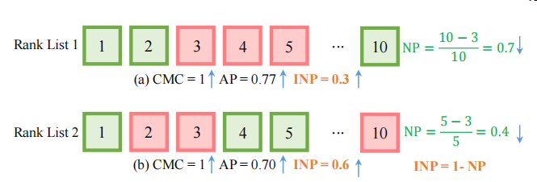

图7: 广泛使用的CMC、AP和负惩罚(NP)测量值之间的差异。真匹配和假匹配分别以绿色框和红色框为界。假设gallery中只有三个正确的匹配，排名1得到更好的AP，但NP比排名2差得多。主要原因是排名列表1在找到最难的真实匹配之前包含了太多的错误匹配。为了与CMC和mAP的一致性，我们计算了逆负惩罚(INP)，例如，INP=1-NP。更大的INP意味着更好的性能。

**3.5 Open-set Re-ID and Beyond**

开放集Re-ID通常被表述为一个行人验证问题，即区分两个人物图像是否属于同一ID[69]，[70]。验证通常需要一个学习条件τ，即sim（query，gallery）>τ。早期的研究设计了手工验证的系统[26]，[69]，[70]。对于深度学习方法，在[237]中提出了一种对抗性PersonNet(APN)，它联合学习一个GAN模块和Re-ID特征提取器。GAN的基本思想是生成现实的像目标的图像（骗子图像），对生成的图像强制执行特征提取是鲁棒性的。在[235]中也研究了建模特征的不确定性。然而，实现高真目标识别率和保持低假目标识别率[238]仍然相当具有挑战性。

**Group Re-ID.**它的目的是将人分组而不是划分为个人[167]。早期的研究主要集中在使用稀疏字典学习[239]或协方差描述聚类[240]的组表示提取上。将multi-grain信息集成到[241]中，以充分捕获群体特征。最近，图卷积网络应用于[242]中，将组表示为图。组相似性也应用于端到端行人搜索[196]和个体再识别[197]、[243]，以提高准确性。然而，群体Re-ID仍然具有挑战性，因为群体变化比个体更复杂。

**Dynamic Multi-Camera Network.** 动态更新的多摄像头网络是另一个具有挑战性的问题[23]，[24]，[27]，[29]，它需要对新的相机或探头进行模型适应。在[24]中引入了一种人工循环增量学习方法来更新Re-ID模型，以适应不同探针库的表示。早期的研究也将主动学习[27]应用于多摄像机网络中的连续Re-ID。在[23]中介绍了一种基于稀疏非冗余代表性选择的连续自适应方法。设计了一种基于 geodesic flow kernel的最佳源摄像机模型的传递推理算法[244]。在密集的人群中，多种环境约束（例如，相机拓扑结构）和社会关系被集成为一个开放世界的行人Re-ID系统[245]。模型适应性和摄像机的环境因素在实际动态多摄像头网络中至关重要。此外，如何将深度学习技术应用于动态多摄像机网络的研究仍较少。

## 4 AN OUTLOOK: RE-ID IN NEXT ERA

本节首先在4.1中提出了一个新的评估指标，这是行人Re-ID的有力基准（在4.2中）。为今后的Re-ID研究提供了重要的指导。最后，我们在4.3中讨论了一些研究不足的开放问题。

​                               表4：与最先进的基于单口图像的Re-ID的比较。在两个公共数据集上报告了Rank-1的精度（%）、mAP（%）和mINP（%）。

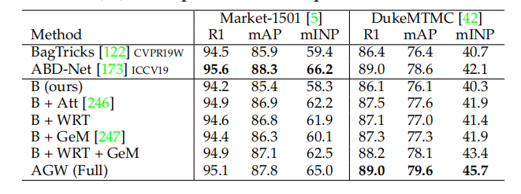

### 4.1 mINP: A New Evaluation Metric for Re-ID

对于一个好的Re-ID系统，应该尽可能准确地检索目标人，即所有正确的匹配都应该有较低的秩值。考虑到目标人在最优检索列表中不应被忽视，特别是对于多摄像头网络，以便准确地跟踪目标。当目标人出现在多个时间戳设置的gallery中时，最难正确匹配的排名位置决定了检测器进行进一步调查的工作量。然而，目前广泛使用的CMC和mAP指标不能评估这一特性，如图7所示，在相同的CMC下，排名1比排名2获得更好的AP，但需要更多的工作才能找到所有正确的匹配。为解决这个问题，我们设计了一个计算效率高的度量，即负惩罚机制(NP)，它为找到最难的正确匹配度量惩罚。
$$
NP_i = \frac{R_i^{hard}− |G_i|}{R_i^{hard}}\tag{6}
$$
其中，$R_i^{hard}$表示最难匹配的排名位置，$$|G_i|$$表示query i的正确匹配的总数。自然，一个较小的NP代表更好的性能。为了baochi 与CMC和mAP的一致性，我们更倾向于使用逆负惩罚(INP)，即NP的逆操作。总体而言，所有queries的平均INP都用下式表示
$$
mINP = \frac{1}{n}\sum_i({1-NP_i})=\frac{1}{n}\sum_i\frac{|G_i|}{R^{hard}_i}\tag{7}
$$
mINP的计算效率相当高，可以无缝地集成到CMC/mAP的计算过程中。mINP避免了在mAP/CMC评估中简单匹配的支配地位。一个限制是，与小 gallery相比，大 gallery的mINP差异值要小得多。但它仍然可以反映Re-ID模型的相对性能，为广泛使用的CMC和mAP度量提供了一个补充。

### 4.2 A New Baseline for Single-/Cross-Modality Re-ID

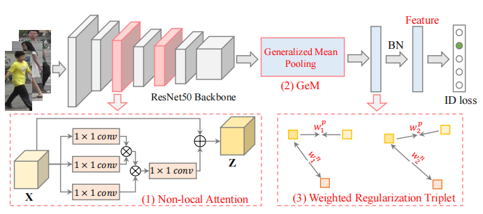

​                                                                     图8: 采用广泛使用的ResNet50[80]作为主干网络，提出的AGW基准框架。

根据2.4.2的讨论，我们设计了一个新的AGW (详见https://github.com/mangye16/ReID-Survey，综合比较见补充资料。)基准，在单模态（图像和视频）和跨模态Re-ID任务上都实现了有竞争力的表现。具体来说，我们的新基准是在BagTricks[122]之上设计的，AGW包含以下三个主要的改进部分：

(1) **Non-local Attention (Att) Block. ** 如2.4.2所述，注意力机制在判别Re-ID模型学习中起着至关重要的作用。我们采用强大的非局部注意力块[246]来获得所有位置的特征加权和，由下式所示：
$$
z_i = W_Z ∗ \phi(x_i) + x_i\tag{8}
$$
其中$ W_Z$是一个需要学习的权重矩阵，$\phi(\cdot)$表示一个非局部操作，$ + x_i$构造了一个残差学习策略。详细信息可以在[246]中找到。我们采用[246]的默认设置来插入非局部注意力块。

(2) **Generalized-mean (GeM) Pooling**. 作为一个细粒度的实例检索，广泛使用的最大池化或平均池化不能捕获特定领域的可鉴别特征。我们采用了一个可学习的池化层，称为广义均值(GeM)池化[247]，由
$$
f = [f_1 · · · f_k · · · f_K]^T, f_k = ( \frac{1}{|X_k|}\sum_{x_i∈X_k}  x^{Pk}_i )^{\frac{1}{Pk}}\tag{9}
$$
其中$f_k$表示特征图，K为最后一层特征图的数量。$X_k$是特征图$k\in \{1，2，····，K\}$的W×H激活的集合。Pk是一个池化超参，它是在反向传播过程[247]中学习到的。上述操作近似于Pk→∞时的最大池化，以及Pk=1时的平均池化。

(3) **Weighted Regularization Triplet (WRT) loss**. 除了具有softmax交叉熵的基准ID损失外，我们还集成了另一个加权正则化三元组损失，
$$
L_{wrt}(i) = log(1 + exp(\sum_j{ w^p_{ij}d^p_{ij}} −\sum_k{ w^n_{ik}d^n_{ik}})).\tag{10}
$$

$$
w^p_{ij}=\frac{exp(d^p_{ij})}{{\sum_{d^p_{ij}∈P_i}}exp(d^p_{ij})},w^n_{ik}=\frac{exp(-d^n_{ik})}{{\sum_{d^n_{ik}∈N_i}}exp(-d^n_{ik})}\tag{11}
$$

其中($i$,$j$,$k$)表示每个训练batch中的困难三元组。对于锚点$i$，$P_i$为相应的正集，$N_i$为负集。$d^p_{ij}/d^n_{ik}$表示正/负样本对的相对距离。上述加权正则化继承了正对和负对之间相对距离优化的优点，但避免了引入任何额外的边距参数。我们的加权策略类似于[248]，但我们的解决方案没有引入额外的超参。

AGW的整体框架如图8所示。其他部分与[122]完全相同。在测试阶段，采用BN层的输出作为Re-ID的特征表示。实施细节和更多的实验结果在补充材料中。

​                        表5：与CUHK03和MSMT17等两个图像Re-ID数据集上的先进技术比较。报告了rank1的精度（%）、mAP（%）和mINP（%）。

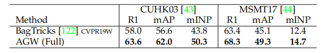

​               表6：与四个基于视频的Re-ID数据集上的最先进技术的比较，包括MARS[8]，DukeVideo[144]，PRID2011[126]和iLIDS-VID[7]。报告了rank1的精度（%）、mAP（%）和mINP（%）。

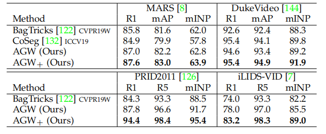

**Results on Single-modality Image Re-ID.** 我们首先在表4中的两个基于图像的数据集(Market-1501和DukeMTMC)上评估每个部分。我们还列出了两种最先进的方法，BagTricks[122]和ABD-Net[173]。我们在表5中报告了CUHK03和MSMT17数据集的结果。我们得到了以下两个观察结果：

1)所有组成部分都始终贡献精度增益，AGW在各种指标下比原始的bagtrick好得多。AGW为未来的改进提供了一个强有力的基线。我们也尝试合并局部特征学习[77]，但大量的实验表明，它并没有提高性能。如何与AGW整合部分级特征学习有待进一步研究。

2)与目前最先进的ABD-Net[173]相比，AGW在大多数情况下都表现良好。特别是，我们在DukeMTMC数据集上实现了更高的mINP，45.7%对比42.1%。这表明AGW需要更少的工作来找到所有正确的匹配，验证mINP的能力。

**Results on Single-modality Video Re-ID.** 我们还在四个广泛使用的基于单模态视频的数据集(MARS[8]、DukeVideo[144]、PRID2011[126]和iLIDS-VID[7]上评估了所提出的AGW，如表6所示。我们还比较了两种最先进的方法，BagTricks[122]和Co-Seg[132]。对于视频数据，我们开发了一个变体(AGW+)来捕获时间信息与框架平均池化的序列表示。同时，采用约束随机采样策略[133]进行训练。与Co-Seg[132]相比，我们的AGW+在大多数情况下获得了更好的rank-1、mAP和mINP。

​                             表7：与两个partial Re-ID数据集的比较，包括Partial-REID和PartialiLIDS。报告了rank1、rank3的精度（%）和mINP（%）。

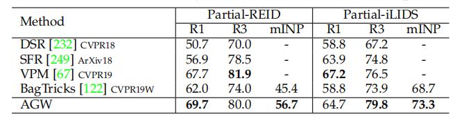

**Results on Partial Re-ID.** 我们还在两个 partial Re-ID数据集上测试了AGW的性能，如表7所示。实验设置来自DSR[232]。我们还实现了与最先进的VPM方法[67]相当的性能。本实验进一步证明了AGW在开放世界partial Re-ID任务中的优越性。同时，mINP也显示了这个开放世界 Re-ID问题的适用性。

​                           表8：与最先进的跨模型可见红外Re-ID技术的比较。在两个公共数据集上报告了rank1的精度（%）、mAP（%）和mINP（%）。

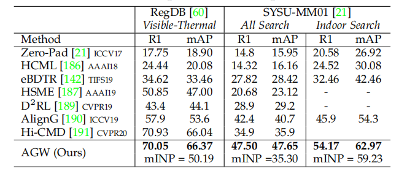

**Results on Cross-modality Re-ID.**我们还在跨模态可见红外Re-ID任务上使用双流体系结构测试了AGW的性能。两个数据集在当前技术上的对照数据如表8所示。我们遵循AlignG[190]中的设置来进行实验。结果表明，AGW比现有的跨模态Re-ID模型具有更高的精度，验证了开放世界Re-ID任务的有效性。

### 4.3 Under-Investigated Open Issues

根据1中的五个步骤，从五个不同的方面讨论开放问题，包括不可控的数据收集、人工标注最小化、特定/泛化领域的体系结构设计、动态模型更新和有效的模型部署。 

#### 4.3.1 Uncontrollable Data Collection

大多数现有的Re-ID工作都是在定义好的数据收集环境上评估它们的方法。然而，在真实的复杂环境中的数据收集是无法控制的。数据可能从不可预测的模态、模态混合，甚至换装数据[30]中取得。

**Multi-Heterogeneous Data.**  在实际应用中，ReID数据可以从多种异构模式中捕获，即人图像的分辨率变化很大，query 和gallery都可能包含不同的模式（可见图像、热成像[21]、深度图像[62]或文本描述[10]）。这导致了一个具有挑战性的多重异构的行人Re-ID。一个优秀的行人Re-ID系统将能够自动处理不断变化的分辨率、不同的模式、不同的环境和多个领域。未来的工作将具有广泛的普遍性，为不同的Re-ID任务评估他们的方法。

**Cloth-Changing Data.**  在实际监测系统中，很可能有大量换衣服的目标人物。 cloth-Clothing Change Aware Network (CCAN)[250]通过分别提取面部和身体的连接表示来解决这个问题，并在[251]中应用了类似的想法。杨等人在[30]提出了一种空间极性变换(SPT)来学习跨服装不变表示。然而，它们仍然严重依赖面部和身体外观，这可能导致真实场景中不稳定。进一步探索其他鉴别线索（如步态、形状）来解决换装问题的可能性将是很有趣的。

#### 4.3.2 Human Annotation Minimization

除了无监督学习、主动学习或人类交互之外，[24]、[27]、[154]、[159]还提供了另一种可能的解决方案来减轻对人工标注的依赖。

 **Active Learning.**  结合人工交互，很容易为新到达的数据提供标签，模型随后可以更新[24]，[27]。成对子集选择框架[252]首先构造一个边缘加权的完整k-partite图，然后将其求作为三角形自由子图最大化问题求解，从而最小化人工标注工作。沿着这个思路，一种深度强化主动学习方法[154]迭代地细化了学习策略，并训练了一个具有人工循环监督的Re-ID网络。对于视频数据，设计了一种具有顺序决策[178]的可解释强化学习方法。主动学习在实际的Re-ID系统设计中至关重要，但在研究界受到的关注较少。此外，新出现的ID也极具挑战性，即使对人工也是如此。未来有望实现高效的人类循环主动学习。

**Learning for Virtual Data.**   这为最小化人工标注提供了一种替代方案。在[220]中收集一个合成数据集进行训练，当在该合成数据集上进行训练时，它们在真实数据集上实现了有竞争力的性能。Bak等人在[125]生成了一个新的不同照明条件的合成数据集来模拟真实的室内和室外照明。在[105]中收集了一个大规模的合成PersonX数据集，系统地研究了视角对Re-ID系统的影响作用。最近，[253]也对三维人图像进行了研究，从二维图像中生成三维身体结构。然而，如何减小合成图像和真实数据集之间的差距仍然具有挑战性。

#### 4.3.3 Domain-Specifific/Generalizable Architecture Design

**Re-ID Specifific Architecture.** 现有的Re-ID方法通常采用为图像分类而设计的架构作为主干。一些方法修改了体系结构，以实现更好的Re-ID特性，[82]，[122]。最近，研究人员开始设计特定领域的架构，例如，具有全尺度特征学习[138]的OSNet。它在一定尺度上检测小规模的鉴别特征。OSNet非常轻量，具有有竞争力的表现。随着自动神经架构搜索(如Auto-ReID[139])的进步，更多特定域的强大架构预计将解决特定任务的Re-ID挑战。Re-ID中有限的训练样本也增加了体系结构设计的难度。

**Domain Generalizable Re-ID.**  众所周知，在不同的数据集[56]、[225]之间存在着很大的域差距。现有的方法大多采用领域自适应的方法进行跨数据集训练。一个更实际的解决方案是学习一个具有多个源数据集的域广义模型，这样学习到的模型就可以推广到新的用于鉴别ReID的不可见数据集，而不需要额外的训练[28]。胡等人[254]通过引入部分级CNN框架来研究跨数据集人的Re-ID。Domain-Invariant Mapping Network(DIMN)[28]为域可泛化的Re-ID设计了一个meta-learning通道，学习一个人物的图像与其身份分类器之间的映射。域的通用性对于在未知场景下部署学习到的Re-ID模型至关重要。

#### 4.3.4 Dynamic Model Updating

固定模型不适用于实际的动态更新监控系统。为了缓解这个问题，动态模型更新是必要的，无论是一个新的领域/相机或适应新收集的数据。

**Model Adaptation to New Domain/Camera**.  对新领域的模型适应性作为领域适应问题[125]，[216]在文献中得到了广泛的研究。在实际的动态摄像机网络中，可以将一个新的摄像机暂时接入到现有的监控体系中。模型自适应对于多相机网络[23]，[29]中的连续识别至关重要。为了将学习模型匹配至新相机，设计了一种传递推理算法[244]，来利用基于geodesic flflow核的最佳源相机模型。然而当新相机新收集的数据分布完全不同时，这仍然具有挑战性。此外，隐私和效率问题也需要进一步考虑。

**Model Updating with Newly Arriving Data.**  对于新收集的数据，从头开始训练先前学习的模型是不切实际的。在[24]中设计了一种增量学习方法和人际交互方法。对于深度学习模型，在整体学习函数中集成了一个使用协方差损失[256]的加法。然而，由于深度模型训练需要大量的训练数据，这个问题还没有得到很好的研究。此外，在新到达的数据中未知新ID很难被识别，难以进行模型更新。

#### 4.3.5 Effificient Model Deployment

设计高效和自适应的模型来解决实际模型部署的适应性问题是很重要的。

**Fast Re-ID.**  对于快速检索，哈希已被广泛研究，以提高搜索速度，近似于最近的邻近搜索[257]。 Cross-camera Semantic Binary Transformation (CSBT)[258]将原始的高维特征表示转换为紧凑的低维ID保持二进制码。在[259]中开发了一种 Coarse-to-Fine (CtF)哈希代码搜索策略，并使用短码和长码进行互补。然而，特定域的哈希算法仍有待进一步研究。

**Lightweight Model.**  解决可伸缩性问题的另一个方向是设计一个轻量级的Re-ID模型。在[86]、[138]、[139]中研究了修改网络体系结构以实现轻量级模型。模型distillation是另一种方法，例如，在[260]中提出了一个multi-teacher自适应相似度distillation框架，该框架从多个教师模型中学习用户指定的轻量级学生模型，而无需访问源领域数据。

**Resource Aware Re-ID.**   根据硬件配置自适应调整模型还提供了处理可伸缩性问题的解决方案。Deep Antime Re-ID(DaRe)[14]采用简单的基于距离的策略来自适应调整模型，适合具有不同计算资源的硬件设备。

## 5 CONCLUDING REMARKS

本文从封闭世界和开放世界的角度对其进行了全面的深入分析。我们首先从特征表示学习、深度度量学习和排名优化三个方面介绍了被广泛研究的 closed-world行人Re-ID。通过强大的深度学习，封闭世界的行人Re-ID已经在几个数据集上达到了性能饱和。相应地，开放世界的环境最近受到了越来越多的关注，并努力解决各种实际挑战。我们还设计了一个新的AGW基准，它在不同指标下的四个Re-ID任务上实现了有竞争力的表现。它为未来的改进提供了一个强有力的基线。该调查还引入了一个新的评估度量来衡量找到所有正确匹配的成本。我们相信，本调查将为未来的Re-ID研究提供重要的指导。

REFERENCES 【略】

## Supplemental Materials

这一补充材料伴随着我们有实施细节和更全面实验的主要手稿。我们首先介绍了两个单模态封闭世界Re-ID任务的实验，包括A节中四个数据集上基于图像的Re-ID和B节中四个数据集上基于视频的Re-ID。然后介绍了两个开放世界Re-ID任务的综合比较，包括C节中两个数据集上的可见红外跨模态Re-ID和D节中两个数据集上的部分Re-ID。此外，总结了对我们的调查的结构概述。                                                                                                                                                                                                           

**A. Experiments on Single-modality Image-based Re-ID**

**Architecture Design.** 我们提出的单模态Re-ID的AGW基准的总体结构（https://github.com/mangye16/ReID-Survey）如4中插图所示（图R1）。我们采用在ImageNet上预训练的ResNet50作为我们的主干网络，并改变全连接层的维数，使其与训练数据集中的ID数量相一致。主干网络中最后一次空间降采样操作的步幅从2改为1。因此，当输入分辨率为256×128的图像作为输入时，输出特征图的空间尺寸从8×4更改为16×8。在我们的方法中，我们将原始ResNet50中的全局平均池化替换为广义平均(GeM)池化。广义平均池化的池化超参$$p_k$$被初始化为3.0。一个名为BNNeck的BatchNorm层，被插在GeM池化层和全连接层之间。在训练阶段采用GeM池化层的输出来计算中心损失和三元组 损失，而在测试推理阶段采用BNNeck后的特征来计算行人图像之间的距离。

**Non-local Attention.** ResNet包含4个残差模块，即conv2_x、conv3_x、conv4_x和conv5_x，每个阶段都包含瓶颈剩余块。我们分别在conv3_3、conv3_4, conv4_4,conv4_5和conv4_6后插入5个非局部块。我们在实验中采用了具有512个通道瓶颈的非局部块的Dot Product版本。对于每个非局部块，在表示$$W_z$$的最后一个线性层之后就会添加一个BatchNorm层。这个BatchNorm层的仿射参数被初始化为零，以确保非局部块可以在保持其初始功能的同时插入到任何预训练网络中。

**Training Strategy.** 在训练阶段，我们随机抽取16个ID且每个ID4张图像，形成一个大小为64的小批次。每幅图像被调整为256×128像素，用0填充10个像素值，然后随机裁剪成256×128像素。分别采用0.5的概率进行随机水平翻转和随机擦除，来进行数据增强。具体来说，随机擦除增强[123]随机选择一个与整个图像面积比例为$r_e$的矩形区域，用图像的平均值擦去其像素。此外，该区域的长宽比在$$r_1$$和$$r_2$$之间随机初始化。在我们的方法中，我们将上述超参数设置为0.02<$$r_e$$<0.4、$$r_1$$=0.3和$$r_2$$=3.33。最后，我们对每个图像的RGB信道进行归一化，均值分别为0.485、0.456、0.406且保持偏差分别为0.229、0.224、0.225，与[122]的设置相同。

**Training Loss.** 在训练阶段，结合三种类型的损失进行优化，包括身份分类损失($L_ {id}$)、中心损失($L_ {ct}$)和我们提出的加权正则化三元组损失($L_ {wrt}$)。
$$
L_{total} = L_ {id}+ β_1L_{ct} + β_2L_{wrt}\tag{R1}
$$
中心损失的平衡权重（$$β_1$$)设置为0.0005，加权正则化三元组损失的平衡权重($$β_2$$）设置为1.0。采用标签平滑来改善原始标签分类损失，这鼓励了模型在训练过程中降低置信度，防止了分类任务的过拟合。具体地说，它改变了one-hot标签：
$$
q_i=\begin{cases}
 1 − \frac{N−1}{N}ε ,\quad if \ {i = y}\\
ε/N, \quad otherwise,
\end{cases} \tag{R2}
$$
其中N为ID总数，$$ε$$是一个小常数，以降低真实ID标签$$y$$的置信度，$$q_i$$被视为一个新的训练分类目标。在我们的方法中，我们将$$ε$$设置为0.1。

**Optimizer Setting.**  采用权重衰减为0.0005的Adam优化器来训练我们的模型。初始学习率设置为0.00035，在第40个epoch和第70个epoch分别降低为原来的0.1倍。该模型总共被训练了120个epoch。此外，还采用了 warm-up学习速率方案来提高训练过程的稳定性，并引导网络以获得更好的性能。具体来说，在前10个epoch，学习率是从$$3.5×10^{−5}$$到$$3.5×10^{−4}$$线性增长。epoch $t$时的学习速率$lr(t)$可计算为：
$$
q_i=\begin{cases}
3.5 × 10^{−5} × \frac{t}{10}, \quad if \ {t\leq10}\\
3.5 × 10^{−4},\quad\quad\quad if \ 10 < t \leq40 \\
3.5 × 10^{−5},\quad\quad\quad if \ 40 < t \leq 70 \\
3.5 × 10^{−6},\quad\quad\quad if \ 70 < t\leq120\\ 
\end{cases} \tag{R3}
$$
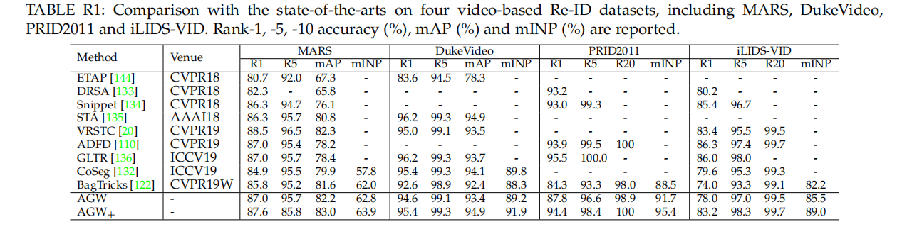

**B. Experiments on Video-based Re-ID**

**Implementation Details. ** 我们通过对基于单模态图像的Re-ID模型的主干结构和训练策略进行了一些微小的改变，将我们提出的AGW基准扩展到一个基于视频的Re-ID模型。基于视频的AGW基线以视频序列作为输入，提取帧级特征向量，然后在BNNeck层之前平均为视频级特征向量。此外，基于视频的AGW基准总共进行了400个epoch的训练，以更好地适应视频人的Re-ID数据集。学习率每100个epoch衰减10倍。为了形成一个输入的视频序列，我们采用约束随机采样策略[133]进行采样4帧，作为原始行人轨迹的概括。BagTricks[122]基线以与AGW基线相同的方式被扩展到基于视频的Re-ID模型，来进行公平比较。此外，我们还开发了一种AGW基线的变体，称为AGW+，以在行人轨迹中建模更丰富的时间信息。AGW+基线在测试阶段采用密集采样策略形成输入视频序列。密集采样策略将行人轨迹中的所有帧形成输入视频序列，得到更好的性能，但计算成本更高。为了进一步提高AGW+基线在视频Re-ID数据集上的性能，我们还删除了warm-up学习率策略，并在线性分类层之前添加了dropout操作。

**Detailed Comparison.**  在本节中，我们将对AGW基线和其他最先进的基于视频的Re-ID方法进行性能比较，包括ETAP[144]，DRSA[133]，STA[135]，Snippet [134]，VRSTC[20]，ADFD[110]，GLTR[136]和CoSeg[132]。表R1列出了四个视频人数据集Re-ID数据集(MARS、DukeVideo、PRID2011和iLIDS-VID)的比较结果。我们可以看到，通过简单地以视频序列作为输入并采用平均池化来聚合帧级特征，我们的AGW基线在两个大规模视频Re-ID数据集MARS和DukeVideo上取得了具有竞争力的结果，在多个评估指标下，AGW基线也明显优于BagTricks[122]基线。通过进一步建模更多的时间信息和调整训练策略，AGW+基线获得了巨大的进步，并在PRID2011和iLIDS-VID数据集上都取得了具有竞争力的结果。AGW+基线在MARS、DukeVideo和PRID2011数据集上优于大多数先进的方法。大多数基于视频的人Re-ID方法通过设计复杂的时间注意力机制来利用行人视频中的时间依赖性实现先进的性能。我们相信，我们的AGW基线可以通过适当设计的机制来进一步利用时空依赖性帮助视频Re-ID模型实现更高的性能。

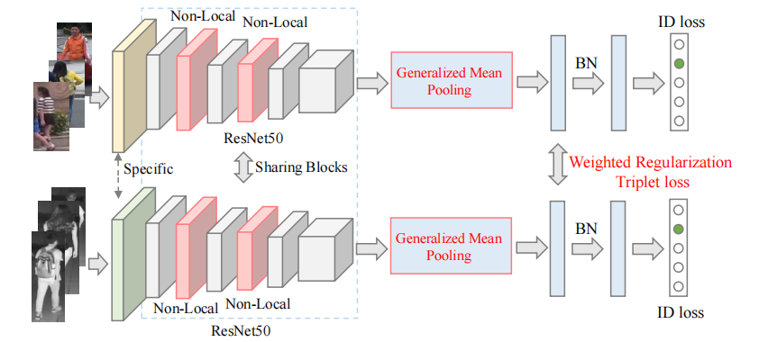

​                                                                                       图R2：跨模态可见红外Re-ID的AGW基线框架。

表R2：与SYSU-MM01数据集上最先进的比较。报告了$r$精度（%）、mAP（%）和mINP（%）的排名。（实验*Single-shot* query设置[21]）。“$*$”表示论文提交后发表的方法。

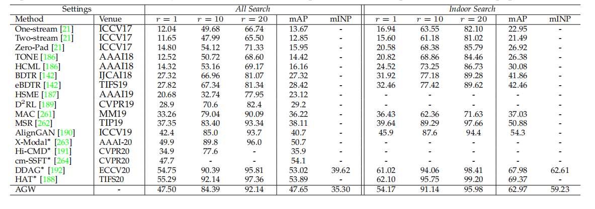

**C. Experiments on Cross-modality Re-ID**

**Architecture Design.**  我们采用双流网络结构作为跨模态可见红外ReID( https://github.com/mangye16/Cross-Modal-Re-ID-baseline)的主干。与单模态Re-ID的单流体系结构进行了比较（图8），主要的区别是，即第一个block特定于两种模态，以捕获特定模态的信息，而其余的block被共享以学习模态共享特征。与[142] [261]中广泛使用的双流结构只有一个共享的嵌入层相比，我们的设计捕获了更多共享成分。跨模态可见红外Re-ID的说明如图R2所示。

**Training Strategy.**  在每个训练步骤中，我们从整个数据集中随机采样8个ID。然后为每个ID随机选择4张可见图像和4张红外图像。每个训练批总共包含32张可见图像和32张红外图像。这保证了从两种模式中进行信息丰富的三元组损失提取，即我们直接从模型内和模型间选择最难正项和负项。这近似于双向中心约束的 top-ranking损失的想法，同时处理模态间和模态内部的变化。

为了进行公平的比较，我们精确地遵循[142]中的设置来进行图像处理和数据增强。对于红外图像，我们保留了原始的三个通道，就像可见的RGB图像一样。首先将两种模式的所有输入图像重新调整为288×144，并采用零填充和随机水平翻转进行数据增强。两种模式的裁剪图像大小都是256×128。图像归一化完全遵循单模态设置。

**Training Loss.**   在训练阶段，我们结合了ID分类损失($$L_{id}$$)和我们提出的加权正则化三元组损失($L_{wrt}$)。将ID损失和加权正则化三元组损失相结合的权重设置为1，与单模态设置相同。池化参数$p_k$设置为3。为稳定的训练，我们对两种异构模式采用相同的身份分类器，提取可共享的信息。

**Optimizer Setting.**  我们将两个数据集的初始学习率设置为0.1，在20个epoch和50个epoch时分别衰减为原来的0.1和0.01。训练期的epoch总数为60个。我们还采用了一个 warm-up学习率方案。我们采用随机梯度下降(SGD)优化器进行优化，并将动量参数设置为0.9。我们在跨模态Re-ID任务上尝试了相同的Adam优化器(与单模态Re-ID相同)，但因为使用较大的学习率，其性能远低于SGD优化器。这是关键的，因为红外图像采用了ImageNet初始化的方式。

​               表R3：与两种查询设置上RegDB数据集上先进方法的比较。报告了$r$精度（%）、mAP（%）和mINP（%）的排名。“$*$”表示论文提交后发表的方法。

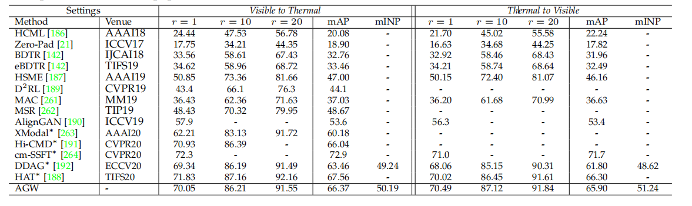

**Detailed Comparison**.  本节将与最先进的跨模态VI-ReID方法进行比较，包括eBDTR[142]、HSME[187]、$$D^2RL$$[189]、MAC[261]、MSR[262]和AlignGAN[190]。这些方法是在过去的两年中发表的。AlignGAN[190]发表在Iccnv2019上，通过将特征水平和像素水平上的跨模态表示与GAN生成的图像对齐，实现了最先进的性能。在两个数据集上的结果如表R2和R3所示。我们观察到，所提出的AGW始终优于当前最先进的方法，而没有耗时的图像生成过程。对于RegDB数据集上的不同查询设置，我们提出的基线通常保持相同的性能。我们提出的基线已经被广泛应用于许多最近开发的方法。我们相信，我们的新基线将提供一个良好的指导，以提高跨模式的 Re-ID。

​                           表R4：在Partial-REID和Partial-iLIDS数据集上与先进技术的比较，报告了rank-1、rank-3的精度（%）和mINP（%）。

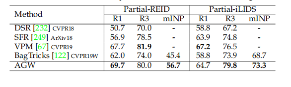

**D. Experiments on Partial Re-ID**

**Implementation Details.**  我们还评估了我们提出的AGW基线在两个常用的Partial-REID和 Partial-iLIDS数据集上的性能。部分Re-ID的AGW基线模型的总体主干结构和训练策略与基于单模态图像的Re-ID模型相同。Partial-REID和 Partial-iLIDS数据集都只提供query图像集和gallery图像集。因此，我们在Market-1501数据集的训练集上训练AGW基线模型，然后在两个部分Re-ID数据集的测试集上评估其性能。我们采用同样的方法来评估BagTricks[122]基线在这两个部分Re-ID数据集上的性能，以进行更好的比较和分析。

**Detailed Comparison.**  我们比较了AGW基线与其他最先进的部分Re-ID方法的性能，包括DSR[232]、SFR[249]和VPM[67]。所有这些方法都是近年来发表的。 Partial-REID 和 Partial-iLIDS数据集上的比较结果见表R4。VPM[67]通过自我监督和提取区域级特征来感知区域的可见性，获得了非常高的性能。仅考虑全局特征，我们提出的AGW基准在所有数据集上与目前先进技术相比仍然取得了有竞争力的结果。

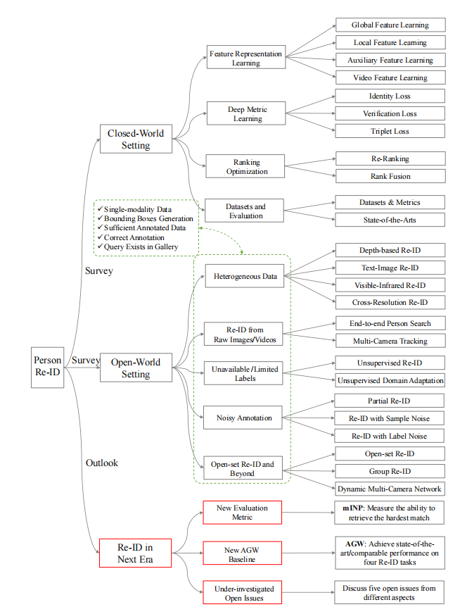

​                                  图R3：本次调查的概述。它包含三个主要组成部分，包括第2节的封闭世界设置，第3节的开放世界设置和第4节的下一时代展望。

**E. Overview of This Survey**

本次调查的总体图如图R3所示。根据开发行人Re-ID系统的五个步骤，我们在封闭世界和开放世界的环境中进行了调查。封闭世界的设置详细介绍了三个不同的方面：特征表示学习、深度度量学习和排名优化。然后，我们从基于图像和视频的角度总结了数据集和sota。对于开放世界的Re-ID，我们将其分为五个方面：包括异构数据、原始图像/视频的Re-ID、不可用/有限的标签、噪声标注和开放集的Re-ID。

在总结之后，我们提出了未来的行人Re-ID的展望。我们设计了一个新的评估度量(mINP)来评估找到所有正确匹配的难度。通过分析现有的Re-ID方法的优势，我们为未来的发展开发了一个强大的AGW基线，它在四个Re-ID任务上实现了具有竞争力的性能。最后，讨论了一些有待研究的开放问题。我们的调查提供了对不同子任务中现有的最先进技术的全面总结。同时，还对未来的发展方向进行了分析，以提供进一步的发展指导。

**Acknowledgement.**  作者要感谢匿名评论家提供了有价值的反馈，以提高本次调查的质量。作者还要感谢行人Re-ID和其他相关领域的先驱研究人员。本研究由CAAI-华为MindSpore开放基金赞助。

